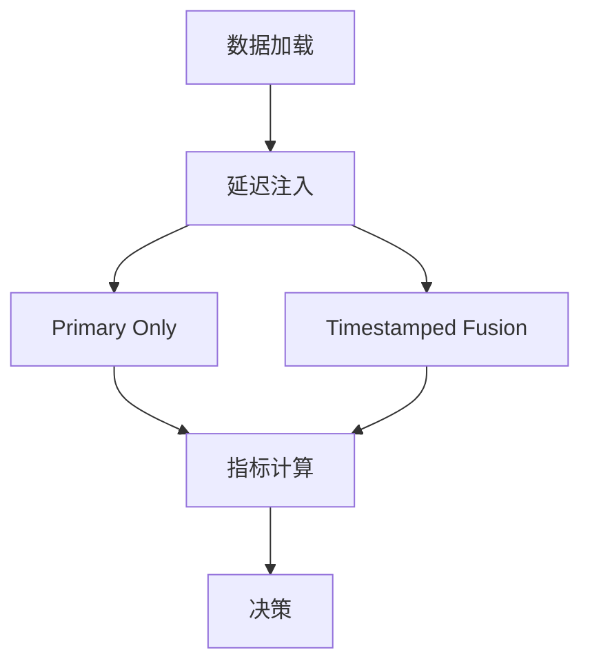

# Mermaid Flowcharts

本目录存放实验设计流程图，使用 [Mermaid](https://mermaid.js.org/) 语法编写。
`.mmd` 文件可通过 VS Code 的 Mermaid 预览插件直接渲染。

## 为什么需要流程图

实验设计涉及多条并行管线（primary-only / sync-oracle / backfill / arrival-fusion / exp-decay），
加上延迟注入、融合策略选择、指标计算、决策分支，纯文字描述容易遗漏关键路径。
一张流程图可以让实验设计思路一目了然，也便于 codex/claude code 理解并参与设计讨论。

## 目录结构

```text
mermaid/
├── README.md                              # 本文件
├── templates/                             # 可复用的模板
│   ├── experiment_pipeline.mmd            # 通用实验管线（数据->延迟->管线->指标->决策）
│   ├── hypothesis_chain.mmd               # 假设验证链路（A1->A2->...）
│   └── fusion_strategy_comparison.mmd     # 融合策略分支对比
└── exp_XXXX/                              # 每个正式实验的专属流程图
    └── *.mmd
```

## 文件格式约定

`.mmd` 文件存放**纯 Mermaid 语法**，第一行即图类型声明（如 `flowchart TD`），
不加 Markdown 代码块包裹。

## 语法注意事项

为避免兼容性问题，编写 `.mmd` 时遵循以下规则：

| 规则 | 正确写法 | 避免写法 |
|------|---------|---------|
| 换行 | `<br>` | `<br/>` |
| 颜色 | 六位 hex `#44aa99` | 三位简写 `#4a9` |
| 并行连接 | 每行一条边 `A --> B` | `A & B --> C & D` |
| 节点文本 | 纯文本或 `<br>` 换行 | emoji / 特殊 Unicode |
| subgraph 标题 | `subgraph ID["标题"]` | `subgraph ID[标题]`（无引号在含中文时可能解析异常） |

## 命名规范

- 模板文件：`snake_case.mmd`
- 实验流程图：放在 `mermaid/exp_YYYYMMDD_NNN/` 下，文件名描述内容，如 `async_pose_tracking_flow.mmd`
- 每个实验至少应有一张管线流程图；如果分析报告中有额外对比图，也放在同一目录

## 如何嵌入 Markdown

在 `.md` 文件中引用流程图时，将 `.mmd` 内容放入 ````mermaid` 代码块：

````markdown

````

## 常用图表类型

| 类型 | Mermaid 语法 | 适用场景 |
|------|-------------|---------|
| 流程图 | `flowchart TD/LR` | 实验管线、数据处理流程 |
| 时序图 | `sequenceDiagram` | 多无人机通信时序、延迟到达时序 |
| 状态图 | `stateDiagram-v2` | 跟踪状态机、融合策略状态切换 |
| 甘特图 | `gantt` | 实验时间线、帧处理调度 |

## Codex / Claude Code 使用指引

当用户要求"画一个实验流程图"或"可视化这个实验设计"时：

1. 先理解实验的输入->处理->输出链路
2. 从 `templates/` 中选择最匹配的模板
3. 根据实际实验参数填充节点
4. 将生成的 `.mmd` 文件保存在 `mermaid/exp_XXXX/` 下
5. 在回复中嵌入 Mermaid 代码块供用户直接预览
6. 同时在分析报告或实验卡片中添加引用链接
