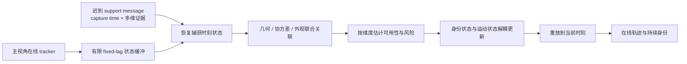

# Asynchronous Multi-UAV Tracking Research Radar Spec

> 用途：作为自建 Research Hub 的项目上下文和定时检索规范。Research
> Hub 应据此每天从 arXiv、会议/期刊官方页面和论文主页获取论文，判断哪些
> 组件能服务于当前实验，而不是只搜索题目中同时出现 “multi-UAV tracking”
> 和 “asynchronous communication” 的论文。
>
> 项目快照日期：2026-07-31。本文描述的是当前实验主线，不替代
> `summary_md/current_experiment_stage.md` 和正式 experiment card。

## 1. 一句话 Idea

在主无人机发生遮挡、辅助无人机观测经异步通信延迟到达时，研究一条带时间戳
的跨视角消息还剩多少身份跟踪价值，并用有限固定滞后历史、分维度风险判断和
身份—运动解耦更新，把仍有价值的迟到证据用于维持持续身份，同时限制陈旧或
不可靠证据造成的 ID switch。

更抽象地说，本项目研究的不是“多发消息是否更好”，而是：

```text
迟到的跨视角证据
    → 在捕获时刻是否仍可关联
    → 哪些信息维度仍可信
    → 允许更新哪部分轨迹状态
    → 是否改善遮挡期身份连续性
```

## 1.1 当前实验位置（2026-08-08）

MDMT MIA 的同步复现、主动消息接口同步等价和四类状态通道的正式异步审计均已完成。
最新决策为：

```text
coupled_state_cascade_identified
```

该结论需要分开解释：Local Track 的帧截止是上游流程阻断；ID state 对 IDSW/IDF1 最敏感；
Supplement 主要影响跨视角覆盖；5 帧延迟下 ID state 与 Supplement 出现稳定组合级级联。
下一步应保持 Local Track timely，研究 ID state 与 Supplement 的联合状态事务、版本冲突处理
和有限窗口更新。

## 2. 研究定位与边界

### 2.1 大 Topic

复杂遮挡与异步通信条件下的多无人机协同多目标跟踪，重点是跨视角持续身份
推理。

### 2.2 当前细化 Idea

**遮挡条件下异步支撑观测的时序价值机理与风险受控利用。**

系统维护主视角在线轨迹。支持无人机发送在捕获时刻 `t_capture` 产生、在到达
时刻 `t_arrival` 才被收到的消息。消息可以包含：

```text
timestamp
world position / pose-derived geometry
measurement covariance
bbox / visibility / view quality
velocity or motion cue
appearance / ReID embedding
```

融合端保存长度有限的历史状态，在消息仍落入缓冲窗口时回到捕获时刻做关联或
重锚，再传播到当前时刻。几何、运动和身份信息具有不同的陈旧速度和可靠性，
所以不应由单个距离阈值统一决定整条消息的去留与更新权威。

### 2.3 明确不做

- 不把通信带宽、功率、发送选择、调度或资源分配作为论文核心。
- 不把通信 selector optimization 当成当前贡献。
- 不回到旧的 split-YOLO 或 backend semantic fusion 叙述。
- 不因为某个新架构流行就直接替换主线；Mamba、Transformer、GNN 等首先是
  候选组件，必须对应当前已测得的机制缺口。
- 在固定滞后、多线索门控的最小假设尚未验证完之前，不启动宽泛的端到端方法
  sweep 或复杂 policy learning。

## 3. 当前系统抽象

一条支持消息可写成：

```text
z = {
  capture_time,
  arrival_time,
  source_view,
  world_xy,
  covariance,
  bbox,
  appearance_embedding,
  quality
}
delay = arrival_time - capture_time
```

当前目标算法的最小闭环为：



核心变量包括：

- 绝对时延：`delay_frames` / `delay_ms`；MATRIX 当前为 2 FPS，即每帧
  500 ms。
- 历史容量：`lag_frames`。
- 遮挡相对位置和有效支撑窗口：描述消息到达时还有多少机会改变在线结果。
- 空间可靠性：世界坐标误差、重投影误差、测量协方差。
- 身份可辨识性：同人/异人 appearance similarity、margin、误接受风险。
- 轨迹状态：位置、速度、协方差、身份原型、feature bank、轨迹年龄与缺失
  时长。

## 4. 已有证据、失败边界与开放问题

Research Hub 必须以本节约束论文解读，不能推荐已经被实验否定的简单变体。

### 4.1 已验证

1. 旧 M3OT ReID-only 全局 Backfill 主线已否定；全局回填和事件门控回填均未
   超过丢弃迟到观测。
2. MATRIX GT/world-coordinate 实验支持时间戳机制：把支持观测按捕获时刻
   处理明显优于按到达时刻处理。
3. 主视角遮挡时，短延迟支持证据具有强在线价值；价值在 500 ms 到
   1000–1500 ms 区间快速下降。
4. `delay <= lag` 只是 fixed-lag 更新的资格条件，不保证收益；有效支撑窗口
   仍控制收益。
5. bounded fixed-lag OOSM update 是当前最强的简单缓解机制；更复杂的
   state-aware 规则尚未超过最佳 fixed-lag。
6. fixed-lag 存在时间—空间联合边界：0.10 m 支持坐标噪声仍有正收益，
   0.25 m 时纯几何更新开始不可靠。
7. 纯几何门控只能控制伤害，不能稳定恢复净身份收益；协方差单独加入仍不够。
8. 模拟身份线索与几何、协方差结合后，在 0.25 m 噪声和 1000/1500 ms
   延迟下恢复了正 survival delta，并降低 IDSW。这支持“身份信息维度有用”，
   但不证明真实 ReID 已经可部署。
9. 当前 online proxy 在 frame level 有信号，但 episode action ranking 增益
   太小，暂不足以支撑完整策略学习。

### 4.2 已实现、待验证

`scripts/phase2_matrix_identity_cue_quality_boundary.py` 已实现 checkpoint /
resume 和模拟身份线索质量边界 sweep；截至本快照，其 experiment card 状态为
“implementation complete; smoke pending”。不得把该边界写成已验证结果。

### 4.3 当前最高优先级开放问题

1. 真实 aerial/cross-view ReID embedding 能否达到模拟身份线索所要求的
   same/different separation 和 false-accept 控制水平？
2. 外观证据应只参与身份确认，还是也允许触发历史位置重锚？如何防止错误
   embedding 污染长期 identity prototype？
3. 每种信息维度的 temporal availability 是否不同？陈旧的外观可能仍能确认
   身份，而陈旧坐标不应改写当前运动状态。
4. 固定窗口内怎样联合不确定性、候选歧义和轨迹状态，而不退化为更多标量阈值
   sweep？
5. 在 detector、投影、位姿和 ReID 同时含噪时，当前机制是否仍优于
   `drop_delayed` 安全基线？
6. 如何从局部 delayed observation 扩展到多 UAV local tracklet 的全局身份
   一致性、冲突撤销和长时重入？

## 5. 为什么采用“组件级文献雷达”

直接同时命中“多无人机 + 多目标跟踪 + 遮挡 + 异步通信 + OOSM”的论文可能
很少，但本项目由多个已有研究问题的交叉组成。每日检索应构造一个组件图：

```text
异步 / OOSM 状态估计 ─┐
fixed-lag smoothing ───┤
跨视角几何与 BEV ─────┤
ReID / appearance ─────┼→ 风险受控 delayed association
轨迹记忆与长遮挡 ─────┤
不确定性与校准 ───────┤
图匹配 / 全局身份 ─────┘
```

论文即使不研究无人机或异步通信，只要它解决了图中一个明确缺口，也可能具有
较高迁移价值。相反，只包含相同应用名词、却不能改变关联、状态更新、身份记忆
或实验设计的论文，应降低优先级。

## 6. 文献组件优先级

### P0：现在就可能改变下一轮实验

| 组件 | 要回答的问题 | 重点技术线索 | 对应最小实验 |
| --- | --- | --- | --- |
| 跨视角/无人机行人 ReID | 真实 embedding 是否满足身份质量边界？ | viewpoint-invariant ReID、aerial ReID、domain generalization、occluded ReID、metric learning、self-supervised ReID | 用真实 crop embedding 替换 simulated cue；比较 appearance-only、geometry-only、geometry+appearance、full |
| 轨迹级外观记忆 | 如何避免单个错误 crop 污染长期身份？ | feature bank、prototype update、quality-aware memory、short/long-term memory、tracklet representation | 临时 bank 与长期 prototype 消融；按 view quality 和 availability 更新 |
| 不确定性与置信度校准 | 相似度和坐标协方差怎样变成可比较风险？ | calibrated similarity、open-set recognition、selective prediction、evidential learning、conformal risk、heteroscedastic uncertainty | reliability diagram、FAR/FNR、ECE；按 false-accept cost 选 gate |
| OOSM / fixed-lag 状态估计 | 迟到消息如何在有限历史中一致更新？ | out-of-sequence measurement、fixed-lag smoother、rollback/replay、retrodiction、delayed Kalman update、factor graph | 与当前 fixed-lag 重放比较状态一致性、复杂度和在线延迟 |
| 多线索关联 | 几何、外观、协方差怎样联合而不相互污染？ | uncertainty-aware association、learned affinity、multi-cue matching、late/early fusion、product-of-experts | per-cue gate、联合 gate、身份—运动解耦更新 |

### P1：用于形成下一阶段方法

| 组件 | 项目用途 | 检索重点 |
| --- | --- | --- |
| 遮挡与长期身份持续性 | 处理长遮挡、重入、轨迹断裂和错误恢复 | occlusion-aware MOT、long-term association、re-entry、tracklet stitching、identity recovery |
| 图模型与全局关联 | 从 delayed observation 扩展到多 UAV local tracklet 的全局 ID | graph neural network、message passing、min-cost flow、graph matching、factor graph、global tracklet association |
| 时序表征学习 | 从历史轨迹和消息序列预测 availability 或 affinity | temporal Transformer、state space model、Mamba、selective SSM、temporal convolution、irregular time series |
| 连续时间/不规则采样模型 | 直接表达非均匀到达和时间间隔 | continuous-time state space、Neural ODE、latent ODE、time-aware attention、event stream modeling |
| BEV 与跨视角几何 | 从 bbox/pose 得到带不确定性的世界坐标证据 | multi-view BEV、homography、geometric reprojection、camera pose uncertainty、cross-view localization |
| 鲁棒多模态融合 | 在某一证据失效时不被坏模态拖垮 | missing-modality robustness、conflict-aware fusion、mixture/product of experts、modality dropout |

Mamba/SSM 的采用条件必须具体：只有当论文能处理长轨迹记忆、不规则时间间隔、
流式低延迟或分维度状态更新之一，并能与 fixed-lag/简单 MLP 或 Transformer
基线公平比较时，才标为可执行候选。仅因架构名热门不构成相关性。

### P2：部署与论文讨论背景

- 异步 cooperative perception、distributed tracking、multi-agent perception。
- 通信丢包、乱序、时钟偏差和网络 jitter 下的鲁棒融合。
- Jetson/edge 上的轻量 ReID、embedding 压缩、量化和流式推理。
- 隐私保护或联邦式 ReID/tracklet learning。
- 通信负载只作为部署代价报告，不转向资源优化问题。

## 7. 检索范围

### 7.1 来源

每日主来源：

- arXiv：`cs.CV`、`cs.RO`、`cs.AI`、`cs.LG`，必要时 `eess.SP`。
- CVF Open Access：CVPR、ICCV、WACV 的正式论文页面。
- AAAI Proceedings：AAAI 正式论文页面。

扩展来源：

- ECCV/ECVA、NeurIPS、ICLR、IJCAI。
- IEEE T-PAMI、T-IP、T-MM、T-ITS、T-RO、T-AES、RA-L。
- ICRA、IROS、ACM MM。
- Semantic Scholar/OpenAlex/Crossref 可用于去重和元数据补全，结论与
  venue 状态仍应回到论文原文或官方页面核验。

### 7.2 Venue 状态规则

“出现在 arXiv”不等于“被 CVPR/AAAI 接收”。输出必须分别记录：

```text
publication_status: preprint | accepted | published | unknown
claimed_venue: 作者或 arXiv comment 声称的 venue
verified_venue: 由会议/期刊官方页面核验的 venue
venue_evidence_url: 核验链接
```

无法由官方来源确认时，`verified_venue` 必须为 `unknown`，不得根据标题页、
搜索摘要或第三方列表推断。

## 8. Query Pack

Research Hub 应组合使用下列查询族；不要把所有词硬塞进一个查询。

### Q1：直接问题

```text
("multi-UAV" OR "multi-drone" OR "cooperative aerial")
AND ("multi-object tracking" OR "multi-target tracking")
AND (asynchronous OR delayed OR latency OR communication)

("multi-camera tracking" OR "multi-view tracking")
AND ("out-of-sequence" OR asynchronous OR delayed measurement)

("cooperative perception" OR "collaborative perception")
AND (asynchronous OR latency OR temporal misalignment)
AND (tracking OR association)
```

### Q2：OOSM 与 fixed-lag

```text
"out-of-sequence measurement" AND (tracking OR data association)
"fixed-lag smoothing" AND (multi-target OR tracking)
(retrodiction OR rollback OR replay) AND delayed measurement AND tracking
(factor graph OR Kalman) AND asynchronous multi-sensor tracking
```

### Q3：真实身份线索

```text
(aerial OR drone OR cross-view OR multi-camera) AND "person re-identification"
"occluded person re-identification" AND (memory OR prototype OR uncertainty)
ReID AND ("feature bank" OR "prototype update" OR "tracklet representation")
ReID AND (calibration OR uncertainty OR "false accept" OR open-set)
```

### Q4：多线索与不确定性

```text
"multi-object tracking" AND (geometry appearance) AND uncertainty
"data association" AND ("multi-cue" OR multimodal) AND calibration
"cross-camera association" AND (covariance OR uncertainty OR ambiguity)
"selective prediction" AND (tracking OR re-identification)
```

### Q5：遮挡、记忆和持续身份

```text
"multi-object tracking" AND (long occlusion OR re-entry OR identity recovery)
tracking AND ("long-term memory" OR "track memory" OR "feature memory")
"tracklet stitching" AND (cross-camera OR multi-view)
"persistent identity" AND tracking
```

### Q6：时序模型，包括 Mamba

```text
(Mamba OR "state space model" OR SSM) AND
("multi-object tracking" OR trajectory OR ReID OR association)

("temporal transformer" OR "time-aware attention") AND
(tracking OR cross-view association) AND (irregular OR asynchronous OR delayed)

("continuous-time" OR "irregular time series") AND
(multi-agent tracking OR sensor fusion OR data association)
```

### Q7：图匹配与全局身份

```text
(GNN OR "graph neural network" OR "message passing" OR "graph matching")
AND ("multi-camera tracking" OR "tracklet association")

("factor graph" OR "min-cost flow") AND
(multi-sensor OR multi-view) AND tracking
```

### Q8：BEV、位姿与跨视角几何

```text
("multi-view BEV" OR homography OR reprojection)
AND (tracking OR association)
AND (uncertainty OR calibration OR pose)

("camera pose uncertainty" OR "localization uncertainty")
AND ("multi-object tracking" OR cross-view association)
```

每个查询族还应运行一个“最近更新”版本和一个“近两年高引用/高影响补漏”版本。
首轮回溯建议 24 个月；日常窗口建议最近 3 天，并在每周任务中回看最近 14 天，
以容忍 arXiv 分类和索引延迟。

## 9. 每日检索流水线

### 9.1 收集

1. 执行 Q1–Q8。
2. 规范化标题，按 arXiv ID、DOI、OpenReview/官方论文 ID 和近似标题去重。
3. 合并同一论文的 arXiv、会议和项目主页，不把版本更新算成新论文。
4. 保留 `first_submitted`、`last_updated` 和本次发现原因。

### 9.2 两阶段筛选

第一阶段高召回：仅根据标题、摘要和关键词判断是否落入组件图。

第二阶段精读：打开 PDF/HTML 正文，至少核验 method、experiment、limitations
和关键表格。任何关于“优于某 baseline”“支持异步”“适合实时”的陈述必须能
定位到正文证据。

### 9.3 项目相关性评分

每项 0–3 分，总分 15：

| 维度 | 0 分 | 3 分 |
| --- | --- | --- |
| 问题贴合度 | 仅泛化视觉任务 | 直接处理 delayed cross-view identity tracking |
| 组件迁移性 | 无法映射到当前系统 | 可替换一个明确模块且输入输出清楚 |
| 证据强度 | 只有概念或无对照 | 有相关 benchmark、消融和强 baseline |
| 当前阶段价值 | 与开放问题无关 | 直接服务真实 appearance 或 fixed-lag multi-cue |
| 实现代价 | 依赖不可获得数据/算力 | 可在 MATRIX 与当前代码上做小实验 |

推荐动作：

```text
13–15: act_now       本周应精读并形成实验 proposal
10–12: watch         纳入周报，等待更多证据或实现
7–9:  context       用于 related work / 趋势背景
0–6:  reject        记录拒绝原因，避免重复筛选
```

Venue 声望不能替代项目相关性评分。CVPR/AAAI 论文也可能是 `context`，
非顶会论文若直接解决 OOSM 一致更新也可能是 `act_now`。

### 9.4 硬性排除或降权

- 核心是通信资源分配、功率控制或发送调度，且没有新的 tracking mechanism。
- 只做单目标跟踪，且没有可迁移的身份记忆、遮挡恢复或时序模块。
- 只在同步输入上验证，却宣称可解决异步问题。
- 仅使用未来帧的离线方法，却没有明确标注非因果。
- 只报告 MOTA，不报告身份指标或关联质量。
- 使用 oracle identity、未来遮挡长度或完整 episode coverage 作为在线输入。
- 论文无法访问正文，或 venue/指标只有二手来源。

## 10. 每篇论文的标准记录

```yaml
paper_id: arxiv_or_doi
title:
authors:
first_submitted:
last_updated:
publication_status:
claimed_venue:
verified_venue:
venue_evidence_url:
paper_url:
code_url:
query_family:

problem:
method_in_one_sentence:
causal_or_offline:
input_information:
output_information:
datasets:
metrics:
key_evidence:
limitations:

project_component:
project_gap_addressed:
code_touchpoint:
minimal_matrix_experiment:
required_data_or_weights:
estimated_effort: small | medium | large

scores:
  problem_fit: 0
  component_transfer: 0
  evidence: 0
  stage_value: 0
  implementation_cost: 0
total_score: 0
action: act_now | watch | context | reject
rejection_reason:
```

`code_touchpoint` 优先映射到：

```text
src/tracking/matrix_reanchoring.py
src/tracking/matrix_identity_cue.py
src/tracking/matrix_occlusion.py
src/tracking/delay_injection.py
src/detection/yolo_reid.py
src/detection/osnet_reid.py
```

## 11. 每日 Digest 输出

建议输出到：

```text
research_digest/YYYY-MM-DD.md
research_digest/index.jsonl
research_digest/weekly/YYYY-Www.md
```

每日 Markdown 模板：

```markdown
# Daily Research Radar — YYYY-MM-DD

## Executive Signal

- 今日新增去重论文：
- act_now / watch / context：
- 最强趋势信号：
- 对当前实验最可能有用的组件：
- 今日是否没有有效新信号：

## Top Papers

### 1. Paper title

- Status / venue:
- Source:
- Project score:
- Solves:
- Evidence:
- Why it matters here:
- Minimal MATRIX test:
- Caveat:
- Action:

## Component Map

| Component | New papers | 7-day count | Signal | Project implication |
| --- | ---: | ---: | --- | --- |

## Negative Evidence

- 哪些热门方法不适合当前问题，以及可核验原因。

## Proposed Next Action

- 最多 1 个本周可执行实验建议；若证据不足，明确写 `no experiment change`。
```

如果当天没有高质量论文，应输出“没有新信号”，不得用低相关论文填满日报。

## 12. Trend 与现状判断

Research Hub 不应根据单篇论文宣布趋势。每周聚合以下信号：

- 7/30/90 天内每个组件的论文数和去重作者组数量。
- 同一机制是否被至少 3 个独立团队采用。
- 是否出现新 benchmark、公开代码或强对照实验。
- 是否从同步假设转向 latency/jitter/missing-view stress。
- 是否从单一几何/外观 affinity 转向不确定性校准和分状态更新。
- Mamba/SSM 等架构是否带来与本项目有关的实证收益，而非仅替换 backbone。
- 是否有负结果：复杂模型是否未超过 fixed-lag、Kalman、Hungarian、简单
  feature bank 等强简单基线。

周报对每个趋势使用：

```text
emerging     至少 2 个独立新证据，尚不稳定
strengthening 至少 3 个独立团队且有重复实验信号
established  多来源、跨数据集、存在公开实现
weakening    新证据表明收益依赖 oracle、离线信息或不公平 baseline
unclear      样本或证据不足
```

“趋势”与“适合本项目”必须分开写。

## 13. 从论文到实验的采用门

任何 `act_now` 论文都必须经过以下检查：

1. **机制映射**：它解决的是 temporal availability、identity
   discriminability、uncertainty、global consistency 还是 persistence？
2. **因果性**：在线时是否使用未来帧或 episode 结束后变量？
3. **信息公平**：与当前 baseline 使用相同消息内容吗？
4. **最小替换**：能否只替换一个模块，保留 fixed-lag、delay/noise 和数据划分？
5. **可证伪规则**：预先定义 IDF1、IDSW、survival delta、false accept 和延迟
   成本的通过条件。
6. **简单基线**：至少与 `drop_delayed`、arrival-time、当前 fixed-lag 和一个
   简单 multi-cue gate 比较。

Research Hub 应先输出一页实验 proposal，不直接建议大规模重构。

## 14. 给 Research-Hub Codex 的提示词

### 14.1 定时任务主提示词

```text
你是本项目的 component-level literature radar。首先完整读取仓库根目录
spec.md，并把其中的研究定位、已验证边界、开放问题、Query Pack、评分规则和
输出 schema 视为硬约束。

今天是 {{DATE}}。检索最近 3 天新提交或更新的 arXiv 论文，并检查 CVPR、
ICCV、WACV、AAAI、ECCV、NeurIPS、ICLR、IJCAI、ICRA、IROS 及相关 IEEE
期刊的官方页面。每周运行时把窗口扩展到 14 天；首次运行回溯 24 个月。

任务：
1. 分别执行 spec.md 的 Q1–Q8，不要只做一个超长关键词查询。
2. 按 arXiv ID、DOI、官方论文 ID 和规范化标题去重，并合并预印本与正式版本。
3. 用论文正文或官方页面核验方法、实验和 venue。arXiv 出现不等于顶会接收；
   无官方证据时 verified_venue=unknown。
4. 先高召回筛选，再精读候选论文的 method、experiment、limitations 和关键
   表格。不要根据摘要臆测实时性、因果性或性能。
5. 按 5 个维度各 0–3 分评分，给出 act_now/watch/context/reject。
6. 对每篇保留论文明确回答：它解决当前系统的哪个缺口？可替换哪个代码模块？
   在 MATRIX 上最小可证伪实验是什么？是否依赖未来信息或额外 oracle？
7. Mamba/Transformer/GNN 只是候选组件。若不能说明其相对简单 fixed-lag、
   Kalman/Hungarian、feature bank 或 MLP 基线的具体增益，则降为 context。
8. 输出 research_digest/{{DATE}}.md，并将结构化记录追加到
   research_digest/index.jsonl。没有高质量新信号时明确写 no new signal，
   不要凑数。
9. 最多提出一个可执行实验建议。任何建议都必须保留 drop_delayed 安全基线、
   fixed_2/fixed_3、0.25m 空间噪声和身份指标，除非论文证据明确要求改变。

所有事实附论文或官方页面链接。区分作者声称、实验事实和你的推断。禁止虚构
论文、venue、指标、代码仓库或引用数。
```

### 14.2 单篇论文深读提示词

```text
读取 spec.md 和论文 {{PAPER_URL}}。不要先复述摘要。

请输出：
1. 论文实际解决的问题、输入、输出、是否在线因果；
2. 它使用的时间、几何、外观、协方差和未来信息；
3. 关键算法流程以及最强简单 baseline；
4. 能支持结论的表格/消融，和作者明确承认的限制；
5. 与本项目已验证边界是否一致、冲突或互补；
6. 可映射的项目文件和最小接口改动；
7. 一个 MATRIX 最小可证伪实验：固定变量、改动变量、指标、pass/fail；
8. 不采用它的最强理由。

把“论文事实”“作者主张”“你的迁移推断”分栏。无法从正文核验的内容写
unknown，不要补全。
```

### 14.3 每周趋势综合提示词

```text
读取 spec.md、过去 7 天 daily digest 和 index.jsonl。按组件而非论文标题组织
周报，并与前 30/90 天比较。

对每个组件给出 emerging/strengthening/established/weakening/unclear，
列出支持该判断的独立论文组、benchmark、代码和负证据。单篇论文不能定义趋势。
分别回答：
- 社区正在解决什么；
- 哪些问题仍依赖同步、oracle 或离线未来信息；
- 哪些组件与当前 identity-cue → real appearance 主线直接相关；
- Mamba/SSM 是否出现了针对不规则时间、流式状态或跟踪关联的真实优势；
- 本周是否值得改变实验队列。

最多给出 3 篇必读论文和 1 个实验 proposal；证据不足时维持当前路线。
```

### 14.4 从文献生成实验提案的提示词

```text
读取 spec.md、当前 experiment card 和候选论文 {{PAPER_URL}}。生成一页实验
proposal，不写实现代码。

必须包含：
- 被论文启发但可独立证伪的假设；
- 它填补的当前项目缺口；
- 新组件的最小输入/输出接口；
- 与 drop_delayed、arrival-time、fixed-lag、当前 multi-cue 的公平对照；
- 固定 fixed_2/fixed_3、0.25m noise 和 high useful-window 的首轮矩阵；
- IDF1、IDSW、survival delta、fragmentation、FAR/FNR、延迟与内存；
- oracle/未来信息泄漏检查；
- pass/fail 和停止规则；
- 若失败，结论仍能回答什么。

优先最小替换和小规模 smoke。不要因为论文使用某架构就默认该架构是贡献。
```

## 15. Research Hub 的长期记忆规则

需要持续维护四类账本：

```text
paper ledger       论文、版本、venue、代码和去重信息
claim ledger       论文主张、正文证据、适用条件和反证
component ledger   组件 → 项目缺口 → 可用接口 → 当前成熟度
experiment ledger  文献建议 → 本项目实验 → 结果 → 采用/拒绝
```

当实验否定某组件后，不应删除论文记录；应把组件状态标成 `rejected_under_current
conditions`，写清数据、噪声、延迟和 baseline 条件。后续只有新论文提供了能
改变失败机制的新信息时，才重新打开。

## 16. 本地依据与更新顺序

Research Hub 如能访问本仓库，应按以下优先级刷新项目事实：

1. `summary_md/current_experiment_stage.md`
2. `summary_md/experiments/INDEX.md`
3. 当前最新 experiment card 和 analysis
4. `summary_md/current_status.md`
5. `mermaid/overall_experiment_design_20260709.mmd`
6. `GLOSSARY.md`

若这些文件状态不一致，以日期最新的正式 experiment card 为准，但必须报告
不一致。例如当前 `2026-07-31` identity-cue boundary card 比主状态页更新，
且仍是 smoke pending。

本 `spec.md` 在下列情况发生时应更新：

- 一项开放问题被正式实验接受或否定；
- 当前主线从 simulated identity 转入真实 appearance；
- 新增信息维度或改变消息 schema；
- fixed-lag 被更强且公平的机制超过；
- 论文定位从 tracking mechanism 发生实质变化；
- 日报评分或输出 schema 无法区分高价值与热点噪声。
