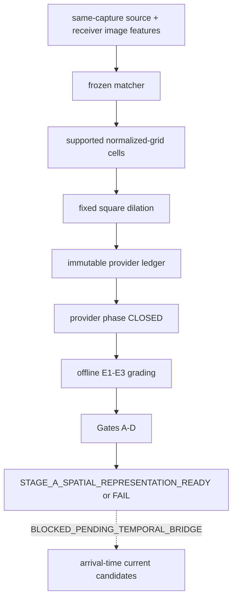

# ROUTE A SPATIAL FEASIBLE-REGION MVE PLAN

Status: `SCIENTIFIC_CONTRACT_FROZEN / READY_FOR_STAGE_A_IMPLEMENTATION`

This contract covers Stage-A candidate-independent spatial-representation
readiness only. It does not authorize implementation, held-out access, a
temporal bridge, arrival-time pruning, or opportunity measurement.

## 1. Identity and evidence

- Experiment ID: `exp_20260829_001_route_a_spatial_feasible_region_mve`
- Planned output root: `outputs/20260829_route_a_spatial_feasible_region_mve/`
- `REPOSITORY-PROVEN FACT` — Observation identity, receiver lineage,
  tombstones, and hypothesis history exist; their fixed Pair-26 OFF/ON check
  produced `CORE_OUTPUT_DIFF = 0`.
- `REPOSITORY-PROVEN FACT` — The current observer still creates zero spatial
  candidates and never invokes newness as a scientific result.
- `REPOSITORY-PROVEN FACT` — Candidate-independent single-H failed frozen
  held-out readiness (2/4 units); same-correspondence H-vs-F produced 0/10
  repeated-F-advantage units and did not authorize F.
- `HUMAN-FROZEN DECISION` — RD-S1, RD-S2, RD-S3, P1-P6, E1-E4, Gates A-D,
  and RD-SA-SEL are frozen below.
- `UNKNOWN` — Which development candidate grid/dilation and IoU threshold will
  be selected, and whether the resulting frozen provider will pass held-out.

## 2. Scientific question and hypotheses

Question: can legal same-capture-time source/receiver image evidence produce a
candidate-independent coarse correspondence-support region that is available,
conservative, nontrivial, and reproducible across independent pair-directions?

Primary hypothesis: after development-only selection and pre-held-out freeze,
the provider passes Gates A-D on untouched held-out units.

Alternative hypothesis: it is insufficiently available, causes at least one
confirmed GT exclusion in too many units, becomes spatially trivial, or lacks
cross-unit reproducibility.

## 3. Frozen Route-A and temporal boundary

### RD-S1-A — `FROZEN`

The capture-time region describes frame `t`. Without a separately frozen
candidate-independent hard temporal bridge, it cannot hard-prune a current
receiver bbox at `t+delay`.

```text
Stage A spatial representation readiness: ALLOWED
Stage B delayed opportunity: BLOCKED_PENDING_TEMPORAL_BRIDGE
```

Stage A cannot use current/historical receiver candidates, trajectory, Kalman,
identity, rollback, replay, nearest-frame substitution, or future information.

### RD-S2 offline firewall — `FROZEN`

Provider output and provenance must be finalized and hashed before the first
GT/annotation read. GT is grading-only and cannot affect features, matching,
grid, dilation, validity, provider selection on held-out, candidates, online
reasoning, or temporal bridge.

### RD-S3 family and P2 timing — `FROZEN`

The only family in this epoch is
`COARSE_CORRESPONDENCE_SUPPORT_SPATIAL_REGION`. Single-H, multi-H, F,
`f_last`, previous geometry, learned motion/BEV flow, and target-centre
geometry are forbidden fallbacks.

```text
capture t:
  source observation + bbox-local image features frozen
  receiver full-frame candidate-independent image features frozen
arrival t+5:
  source snapshot(t) + receiver snapshot(t)
  -> correspondences -> supported cells -> possible region
```

Source `t` must never be matched to receiver `t+5` imagery. These are image
snapshots, not historical tracker pairings.

## 4. Frozen provider construction P1-P6

### P1 source neighborhood — `FROZEN`

Clip the detector bbox to image bounds. A keypoint is source-local iff its
center lies inside or on the clipped bbox boundary. No margin, adaptive
expansion, background rescue, or “expand until enough.” Zero local keypoints:
`NO_SOURCE_LOCAL_FEATURES`.

### P2 minimum support — `FROZEN`

Minimum unique accepted correspondence is exactly `1`. Requirements are at
least one source-local feature, at least one unique frozen-matcher result, and
at least one valid receiver grid cell. No H-derived 3/5/8/11-point minimum.

- no unique accepted match -> `INSUFFICIENT_UNIQUE_CORRESPONDENCES`;
- accepted match but no legal cell -> `EMPTY_SUPPORTED_REGION`.

### P3 receiver grid — `DEVELOPMENT_SELECTION_PENDING`

Normalized square grid candidate set is exactly `{4x4, 8x8, 16x16}`. One grid
is selected on development only and then frozen for held-out. No pair/direction
specific grid and no added candidate value.

### P4 dilation — `DEVELOPMENT_SELECTION_PENDING`

Fixed 8-neighbor square dilation candidate radius is exactly `{0,1,2}` cells.
One radius is selected on development only and then frozen. No adaptive,
pair/direction/frame/match-count-conditioned expansion.

### P5 invalidity — `FROZEN`

Every construction failure is explicit unavailable/invalid. No previous or
nearest frame/region, H/F/`f_last`, whole-image, adaptive, or historical-
tracker fallback. `WHOLE_IMAGE_FEASIBLE` is a separate control only.

Required statuses include `NO_SOURCE_LOCAL_FEATURES`, `NO_RECEIVER_FEATURES`,
`CAPTURE_FRAME_MISMATCH`, `INSUFFICIENT_UNIQUE_CORRESPONDENCES`,
`EMPTY_SUPPORTED_REGION`, and provenance/config mismatch.

### P6 cache — `FROZEN`

With fixed delay 5, receiver snapshot(t) remains until its legal packet finishes
arrival processing at `t+5`, then may be released. Run reset clears all image
feature cache. Missing exact frame fails closed; no `t-1`, `t+1`, nearest, or
interpolated substitute.

## 5. Frozen matcher and feature snapshots

Matcher: SIFT, FLANN KNN, strict Lowe `<0.7`, and returned-order greedy
one-to-one query/train uniqueness. No Homography estimation.

Source record: immutable observation key, capture frame/view, clipped detector
bbox, allowed local keypoints/descriptors, and feature/matcher provenance.

Receiver record: capture frame/view, image size, full-frame candidate-
independent keypoints/descriptors, and provenance. Raw historical image is not
required.

## 6. Offline evaluator E1-E4

### E1 source observation to source GT — `FROZEN`

Use same-frame, same-legal-class, global one-to-one maximum-IoU assignment
(Hungarian is an implementation). Then apply one threshold selected only from
`{0.3,0.5,0.7}` using source detector-to-GT reliability/ambiguity evidence.

Threshold status: `DEVELOPMENT_SELECTION_PENDING`.

Below threshold -> `REFERENCE_UNMATCHED`. Conflict/ambiguity -> reference
unavailable/conflict. These do not enter Gate-B denominator but their counts
and rates remain mandatory. No greedy duplicate claim, cross-frame/class
repair, or manual correction.

### E2 source GT to receiver GT — `FROZEN`

At the same capture frame, require exactly one receiver object with the same GT
identity. Missing/invisible, duplicate identity, class conflict, missing ID, or
annotation inconsistency -> reference unavailable/conflict; no manual repair.

### E3 retention — `FROZEN`

Reference is the receiver GT bbox. Any nonempty intersection with the possible
region is `REFERENCE_RETAINED`; complete disjointness is
`CONFIRMED_GT_EXCLUSION`. Center, foot point, 50% overlap, and area thresholds
are forbidden.

### E4 execution firewall — `FROZEN`

Phase 1 provider may read only legal observation/image snapshots and frozen
config. It finalizes a complete immutable ledger with region, validity/reason,
grid/dilation/matcher/feature provenance, code commit, config hash, and record
digests. Only after provider close may Phase 2 first open GT and run E1-E3. GT
cannot mutate provider output/config or current held-out configuration.

## 7. Readiness Gates A-D

### Gate A availability — `FROZEN`

For each pair-direction:

```text
availability = successful legal nonempty regions
             / all provider-eligible source observations
PASS iff availability >= 0.75
```

All provider unavailable states remain in the full denominator.

### Gate B no confirmed exclusion — `FROZEN`

For every E1-E3 reference-eligible observation, each pair-direction requires
exactly zero `CONFIRMED_GT_EXCLUSION`. One exclusion fails the unit. Reference
unavailable is reported but is not an exclusion and is not in this denominator.

Report a zero-event confidence upper bound for evidence strength; it cannot
permit a nonzero exclusion.

### Gate C anti-triviality — `FROZEN`

For each pair-direction, valid regions must satisfy both:

```text
median(feasible_area / image_area) <= 0.90
fraction with area_ratio <= 0.75 >= 0.25
```

`WHOLE_IMAGE_FEASIBLE` is an independent control, never a fallback.

### Gate D reproducibility — `FROZEN`

A direction passes only if A, B, and C pass. Final readiness requires both:

```text
at least 8/10 held-out pair-directions pass
at least 4/5 held-out pairs pass in both directions
```

No pooled rescue.

## 8. Data and outcome firewall

Development: train pairs `23,27,28,30,32`. They alone may support grid,
dilation, and IoU-threshold selection and implementation debugging.

Proposed held-out: `39,42,44,50,53`, subject to a pre-outcome provenance audit.
Before spatial outcome inspection, an ineligible proposed pair may be replaced
only under a separately preregistered provenance rule. After any held-out
outcome is seen, no replacement is legal.

Pair 26, Pair 48, old G15c/test-like 25/29/45/51/69, test, and val are
forbidden for Stage-A development.

Current held-out status: `HELDOUT_NOT_RUN`.

## 9. Development selection procedure

Candidate sets are frozen:

- IoU threshold: `{0.3,0.5,0.7}`;
- grid: `{4x4,8x8,16x16}`;
- dilation radius: `{0,1,2}`.

### RD-SA-SEL — `FROZEN`

Selection order is immutable:

```text
Selector A on development E1 evidence
  -> freeze IoU threshold
  -> Selector B on development provider/reference evidence
```

Joint IoU x grid x dilation search is forbidden.

### Selector A — E1 IoU threshold

Unit is one pair-direction; exactly 10 development units are required. For unit
`u`, denominator `D_u` is every legal-evaluation-class source detector
observation. Difficult/unmatched/conflicted observations remain in bookkeeping.
`D_u=0` terminates as `E1_ZERO_DENOMINATOR_UNIT`.

After frozen same-frame/same-class global one-to-one maximum-IoU assignment,
an assigned edge is accepted at threshold `tau` iff `IoU>=tau`. It is ambiguous
iff either its detector row has another same-class GT edge with `IoU>=tau`, or
its GT column has another same-class detector edge with `IoU>=tau`. Only
accepted non-ambiguous edges are reliable references.

For each unit and threshold:

```text
N_reliable,u(tau) = accepted non-ambiguous reference count
C_ref,u(tau)      = N_reliable,u(tau) / D_u
N_accept,u(tau)   = accepted assigned-edge count
N_amb,u(tau)      = ambiguous accepted-edge count
A_amb,u(tau)      = N_amb,u / N_accept,u, or 1 when N_accept,u=0
M_iou,u(tau)      = median IoU over reliable references
```

A threshold is eligible iff every one of 10 units has `C_ref,u>=0.50`.
Cross-unit selector statistics are:

```text
A_amb_max(tau)    = max_u A_amb,u(tau)
M_iou_min(tau)    = min_u M_iou,u(tau)
C_ref_min(tau)    = min_u C_ref,u(tau)
C_ref_median(tau) = median_u C_ref,u(tau)
```

Eligible thresholds are sorted lexicographically by lower `A_amb_max`, higher
`M_iou_min`, higher `C_ref_min`, higher `C_ref_median`, then higher threshold
(`0.7 > 0.5 > 0.3`). Only E1 evidence is legal; spatial regions, Gates B/C,
researcher preference, and held-out feedback are forbidden.

No eligible threshold terminates as
`E1_REFERENCE_PROTOCOL_DEVELOPMENT_FAIL`; no candidate addition, relaxation,
manual repair, or default-to-0.3 is allowed.

### Selector B — grid x dilation

Selector B consumes the already frozen IoU threshold. For configuration `c`
and unit `u`:

```text
Avail_u(c)    = provider-valid / provider-eligible observations
RefAvail_u(c) = (reference-eligible AND provider-valid) / reference-eligible
X_u(c)        = confirmed GT exclusion count
MedArea_u(c)  = median area_ratio over valid regions
SmallFrac_u(c)= fraction of valid regions with area_ratio<=0.75

A_PASS_u = Avail_u>=0.75
B_PASS_u = X_u=0
C_PASS_u = MedArea_u<=0.90 AND SmallFrac_u>=0.25
UNIT_PASS_u = A_PASS_u AND B_PASS_u AND C_PASS_u
```

A configuration is development-admissible iff all 10 units have `X_u=0`, all
10 have `RefAvail_u>=0.75`, at least 8/10 units pass, and at least 4/5 pairs
pass in both directions. No pooled rescue is allowed.

For admissible configurations compute:

```text
N_bidir_pass, N_dir_pass,
RefAvail_min, Avail_min, Avail_median,
MedArea_worst=max_u MedArea_u,
MedArea_median=median_u MedArea_u,
SmallFrac_min=min_u SmallFrac_u
```

Sort lexicographically by higher `N_bidir_pass`, higher `N_dir_pass`, higher
`RefAvail_min`, higher `Avail_min`, higher `Avail_median`, lower
`MedArea_worst`, lower `MedArea_median`, higher `SmallFrac_min`, smaller
dilation, then coarser grid (`4x4`, `8x8`, `16x16`). The final complexity
tie-break applies only after all scientific metrics tie exactly.

No admissible configuration terminates as
`COARSE_SPATIAL_PROVIDER_DEVELOPMENT_FAIL` and
`STOP_CURRENT_STAGE_A_EPOCH`. No closest-to-pass choice or protocol rescue is
allowed.

## 10. Causal chain and Stage-A stop



Stage A stops at I.

## 11. Measurement and controls

Required provider rows cover every provider-eligible observation-direction and
record snapshot/match/support/region/config/code digests, availability status,
reason, area, and area ratio. Offline rows record E1/E2 eligibility/conflict,
E3 retained/excluded, and provenance.

Required per-direction report: denominator, valid count, availability,
unavailable histogram, reference eligible/unavailable counts, confirmed
exclusions and example keys, zero-event uncertainty, median area ratio,
fraction area ratio <=0.75, A/B/C, and final D summary.

Controls: `WHOLE_IMAGE_FEASIBLE` and existing infrastructure-only geometry-
fail-closed MVE-0. Neither changes tracker behavior or rescues provider failure.

## 12. Non-interference and stop rules

Provider/cache OFF versus ON must preserve detector outputs, ByteTrack rows,
runtime IDs, MIA association, NMS/Supplement-visible rows, feedback, final
tracking JSON, and tracker mutation count. Required `CORE_OUTPUT_DIFF = 0`.

Any core diff, GT firewall violation, incomplete/digest-mismatched ledger,
nondeterminism, forbidden pair/input/fallback, or outcome-conditioned change
stops before interpretation.

Bad development/held-out outcomes cannot add grid/dilation values, change Lowe
ratio/minimum match/bbox rule/gates, delete unavailable/exclusions, switch
family, add fallback, or replace an already-viewed held-out pair.

## 13. Decision and claim boundary

Success label: `STAGE_A_SPATIAL_REPRESENTATION_READY`.

Failure label: `STAGE_A_SPATIAL_REPRESENTATION_NOT_READY`.

Success means only that the frozen same-capture candidate-independent spatial
representation qualifies for a separate Temporal Bridge MVE review. It does
not validate Route A, delayed opportunity, identity recovery, or tracking gain.

## 14. Planning verdict

`READY_FOR_STAGE_A_IMPLEMENTATION`

All named research decisions and selector rules are frozen. Implementation
still requires explicit authorization and must pass provenance, unit/synthetic,
firewall, determinism, and non-interference gates. Development and held-out
were not run; held-out remains prohibited.
