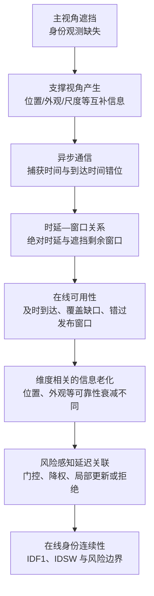
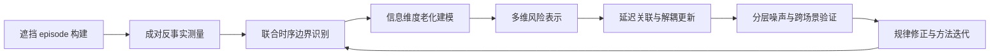

# 异步多无人机协同多目标跟踪博士研究框架（申请书初稿）

> 说明：本稿把单个异步 support idea 纵向展开，粒度更接近单篇论文，不能作为博士课题的总体结构。博士课题层级的修订版见 `20260717_doctoral_research_umbrella_framework_v2.md`。

## 一、建议题目

**异步通信条件下多无人机协同多目标跟踪的时序可用性建模与风险感知关联方法研究**

备选题目：

1. 面向主视角遮挡的异步多无人机协同多目标跟踪方法研究
2. 异步跨视角信息的时序价值建模与鲁棒多目标跟踪研究
3. 通信时延扰动下多无人机协同跟踪的信息老化机理与安全融合方法研究

## 二、研究对象与问题边界

本研究关注多无人机协同感知中由异步通信引起的跨视角观测错位问题，核心任务是多目标跟踪，而不是通信资源分配。通信时延作为外部扰动，改变支撑视角观测进入在线跟踪器的时刻；研究目标是在主视角遮挡、在线输出不可事后改写的约束下，解释延迟支撑信息何时有用、为何失效，以及如何安全利用。

总体科学问题可表述为：

> 在主视角遮挡导致观测缺失时，带有捕获时间戳但延迟到达的跨视角支撑信息，其在线身份增益如何由绝对时延、遮挡剩余窗口和信息维度共同决定，又如何在不可回写历史输出的约束下转化为稳定的关联收益？

## 三、统一机制链条

这里不宜把 `delay_ms`、`rho_episode / rho_remaining` 和 `coverage` 简单并列为三个独立“时间尺度”。更严谨的层级是：

- 外生扰动：绝对时延 `delay_ms`；
- 场景时间窗口：遮挡总时长、消息捕获时刻对应的剩余遮挡时间；
- 相对时间压力：`rho_episode`、`rho_remaining`；
- 中介结果：`online_support_coverage`；
- 最终结果：成对反事实 support gain、IDF1、IDSW。

## 四、核心假设

### H1：条件性信息增益假设

支撑视角不是恒定有益，其身份增益主要出现在主视角信息不足或遮挡期间；聚合 MOT 指标会混合当前遮挡片段收益与历史跟踪状态的继承效应。

### H2：联合时序支配假设

支撑信息的在线价值不是绝对时延或遮挡比例的单变量函数，而由绝对时延、相对剩余窗口和在线覆盖共同决定。在线覆盖是重要中介变量，但绝对时延还可能通过候选集合变化和轨迹状态演化产生独立影响。

### H3：异质信息老化假设

不同信息维度具有不同的时延敏感性：世界坐标和运动状态随时间快速失配，外观身份信息可能相对耐延迟，边界框受视角和投影误差影响，协方差反映观测可被赋予的权威程度。因此，单一时延衰减或单一几何门限不足以描述延迟消息风险。

### H4：受限更新优于无条件融合假设

依据测得的收益边界，对不同信息维度执行门控、降权、身份/位置解耦更新或拒绝，可以在保留有益支撑信息的同时限制错误状态传播，并优于到达时刻直接融合和统一标量衰减。

## 五、研究内容

### 研究内容一：异步支撑信息的因果测量与时序价值边界

构造以遮挡 episode 为单位的成对反事实协议。在相同 episode 前状态下，Run A 保留目标 episode 的支撑消息，Run B 仅屏蔽该 episode 的支撑消息，以二者差异定义支撑信息的局部因果增益。通过逐帧复现、消息屏蔽一致性和轨迹谱系稳定性检查，排除跨 episode 状态继承及轨迹编号变化造成的归因混淆。

在此基础上，建立“绝对时延—相对窗口—在线覆盖—支撑增益”模型，分析 `delay_ms`、`rho_episode`、`rho_remaining`、`online_support_coverage` 及其交互项，识别支撑信息从强收益、弱收益到无效或有害的经验边界。

该部分回答：**延迟支撑信息何时仍有用，价值如何被可靠测量。**

### 研究内容二：多维支撑信息的异质老化与风险表征

把跨视角消息分解为世界坐标、运动状态、边界框、外观/身份特征和不确定性等信息维度，分别建立捕获时间、到达时间、运动强度、观测噪声与跨视角一致性条件下的新鲜度和风险模型。

重点研究两类差异：一是同一消息内不同维度的时间衰减速度不同；二是同一维度在遮挡阶段、运动状态和场景歧义程度不同时风险不同。最终形成可供在线关联使用的多维风险向量，而不是单一 `delay` 标量。

该部分回答：**一条延迟消息中，哪些信息仍可信，哪些信息已经过期。**

### 研究内容三：风险感知的延迟关联与解耦状态更新

依据研究内容一得到的伤害边界和研究内容二得到的多维风险表示，设计风险感知延迟关联机制，包括：

1. 基于捕获时刻的历史状态恢复与因果回放；
2. 多维一致性门控与歧义检测；
3. 分维度时效衰减和权威上限；
4. 身份状态与位置状态的解耦更新；
5. 在高风险条件下拒绝支撑或退化到 `drop-delayed` 安全基线。

该部分不预设 Backfill 必然优越，也不把复杂门控作为起点；算法结构由前两部分测得的收益边界与失败模式推出。

该部分回答：**如何把仍有价值的延迟信息安全转化为在线跟踪收益。**

### 研究内容四：长时序错误传播机理与跨场景验证

研究局部错误关联如何通过轨迹状态、候选集合和后续遮挡片段形成长期传播，区分遮挡期间即时收益、遮挡后的 spillover gain 和全局 MOT 指标变化。进一步在不同遮挡长度、运动强度、视角组合、通信时延分布、时间戳误差和感知噪声下验证方法边界。

验证采用由简到繁的层次：GT 世界坐标机制隔离、加入位姿/投影噪声、加入外观与边界框信息、最终进入检测器输出。该部分用于证明方法的稳定性、适用范围及失效条件，而不是另起一个通信优化问题。

该部分回答：**局部延迟决策如何影响长期身份稳定性，规律能否跨条件成立。**

## 六、预期创新点

### 创新点一：面向遮挡 episode 的异步支撑因果测量协议

提出保持 episode 前状态一致的 paired episode counterfactual，分离当前支撑信息的局部贡献与前序跟踪状态的继承效应，使延迟消息价值可被重复、可审计地测量。

### 创新点二：遮挡相对的时序可用性与收益边界模型

突破“时延越大性能越差”的聚合描述，建立绝对时延、遮挡剩余窗口、在线覆盖和跟踪增益之间的联合关系，揭示消息虽能到达但已错过在线身份维持窗口的机制。

### 创新点三：面向异质信息老化的多维风险感知延迟关联

针对位置、运动、边界框、外观和不确定性具有不同时间敏感性的特点，设计分维度门控、衰减和解耦状态更新机制，并以测得的伤害边界约束支撑信息权威。

### 创新点四：从局部支撑价值到长期身份稳定性的机制化评估

联合报告遮挡期间收益、遮挡后溢出效应和全局身份指标，刻画一次延迟关联决策对后续轨迹状态的传播路径，形成从局部因果效应到系统跟踪性能的验证闭环。

## 七、已有基础与谨慎表述

当前可作为申请书前期基础的结果包括：

- 已完成 `0-199` 帧、76 个遮挡 episode、6 档时延的成对反事实测量校准；
- Run A 复现 mismatch 为 0，屏蔽 manifest mismatch 为 0，轨迹谱系 ambiguity 为 0；
- 遮挡期间平均支撑增益在 500 ms 为 0.910、1000 ms 为 0.271、1500 ms 为 0.049，表明短时延有强收益且随后快速衰减；
- 在 `rho_episode < 0.25` 的条件内，增益仍随绝对时延从 500 ms 的 0.926 降至 1000 ms 的 0.275 和 1500 ms 的 0.050，说明 ratio-only 解释不足；
- 几何信息在位姿噪声下可能产生负边际价值，已有 authority cap 与 ambiguity margin 只能限制伤害，尚不能证明 geometry-only 融合优于丢弃延迟消息。

因此，申请书中宜表述为：**初步实验验证了测量协议的可信性，并观察到绝对时延与遮挡相对可用性共同影响支撑收益的信号；其稳定边界及跨信息维度规律仍是拟解决问题。**

不宜表述为：已经发现普适的三时间尺度定律，或已经证明风险感知算法优于全部基线。

## 八、技术路线

主要基线应至少包含：`sync_oracle`、`primary_only`、`drop_delayed`、`arrival_time_fusion`、`fuse-at-current + exp decay`、`timestamped replay` 和拟议的风险感知方法。

## 九、风险与替代路线

1. 若联合边界在扩展数据上仍不稳定，则将贡献限定为可复用的因果测量协议和条件性经验规律，不宣称普适阈值。
2. 若复杂风险门控不能稳定超过 `drop-delayed`，则把结果解释为安全融合边界，并研究身份/位置解耦更新，而不是继续无界扩展门控参数。
3. 若外观信息对时延并不比位置更耐受，则保留“维度相关但非预设排序”的结论，以实验学习各维度老化规律。
4. 若 GT 世界坐标规律在检测器阶段减弱，则区分通信异步、感知误差和跨视角标定误差，报告机制适用域而非掩盖失败条件。

## 十、一句话贡献表述

本研究面向主视角遮挡下的异步多无人机协同跟踪，建立延迟支撑信息的因果测量与时序可用性模型，揭示不同信息维度的老化和风险差异，并据此构建具有伤害约束的延迟关联与解耦更新方法。
