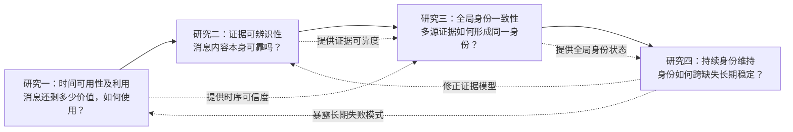

# 多无人机协同多目标跟踪博士课题总体框架（V2）

## 一、定位修正

当前已经成型的 idea 是：研究主视角遮挡时，异步 support 的身份增益如何受到绝对时延、遮挡相对窗口和在线覆盖共同影响，并通过成对反事实测量识别其有效边界。

这个 idea 应作为博士课题中的一个完整研究内容，而不是被继续拆成整个博士课题。它所处理的是多无人机协同跟踪中的**时间不一致性**。与它同层级的问题还包括跨视角观测不一致、分布式轨迹身份不一致，以及长时间运行中的状态与错误累积。

## 二、建议的总体研究主题

### 推荐题目

**不完备时空观测下多无人机协同多目标跟踪的持续身份推理方法研究**

### 偏工程表达

**复杂遮挡与异步通信条件下多无人机协同多目标跟踪关键方法研究**

### 偏理论表达

**多无人机协同跟踪中异构观测可用性与跨视角身份一致性研究**

推荐第一项。它既能容纳当前的异步通信研究，又不会把整个博士课题限制成通信时延或某一种关联算法。

## 三、总体问题不是“异步通信如何影响 MOT”

更高层问题应当是：

> 在主视角遮挡、跨视角差异、通信异步和局部轨迹状态不一致同时存在的条件下，如何判断分布式观测是否可用，将其转化为一致的身份证据，并长期维持多目标身份连续性？

这个总问题包含四类逐层扩大的不完备性：

| 层级 | 不完备性 | 核心对象 | 需要回答的问题 |
| --- | --- | --- | --- |
| 时间层 | 消息延迟、乱序、错过在线窗口 | support observation | 一条消息何时仍有价值？ |
| 观测层 | 遮挡、视角差异、模态与噪声差异 | cross-view evidence | 不同视角的信息是否可比较、是否互补？ |
| 轨迹层 | 各无人机局部轨迹编号和状态不一致 | local track / tracklet | 多源局部轨迹如何形成一致的全局身份？ |
| 长时层 | 长遮挡、离场重入、局部错误持续传播 | persistent identity | 系统如何维持、恢复和修正长期身份？ |

当前 idea 只完整覆盖第一层，并以遮挡作为价值显现条件。博士课题需要继续覆盖后三层。

## 四、四个同层级研究内容

## 研究内容一：异步支撑观测的时序价值机理与可用性驱动利用方法

### 研究矛盾

支撑视角在主视角遮挡时具有潜在身份信息，但捕获时间与到达时间错位，使“包含信息”不等于“在线可用”。

### 核心问题

异步支撑观测的身份增益如何由绝对时延、遮挡剩余窗口和在线可用覆盖共同决定？如何在线估计位置、运动、外观等信息维度的时序可用性，并据此决定消息是否参与关联、以多大权重参与以及允许更新哪些轨迹状态？

### 当前 idea 在这里的位置

- paired episode counterfactual 用于测量局部 support gain；
- `delay_ms` 描述绝对陈旧程度；
- `rho_episode`、`rho_remaining` 描述遮挡相对时间压力；
- `online_support_coverage` 描述实际在线可用程度；
- 测得的收益/伤害边界用于训练或构造在线 temporal availability estimator；
- 各信息维度的 temporal availability 用于驱动延迟消息的门控、加权、更新范围选择和捕获时刻修正。

### 方法闭环

本研究内容不能止于提出 temporal availability。它需要进一步形成一个 availability-aware delayed observation utilization 方法：

```text
消息及在线轨迹上下文
        ↓
分维度 temporal availability 估计
        ↓
延迟消息使用策略
  ├─ 是否使用：accept / reject
  ├─ 如何使用：当前弱融合 / 捕获时刻修正 / replay
  ├─ 使用多少：分维度权重与权威上限
  └─ 更新什么：身份、位置、速度或协方差
        ↓
候选关联与受限状态更新
        ↓
遮挡期间在线 IDF1 / IDSW 改善
```

设消息包含第 `k` 类信息 `z_k`，其在线时序可用性为：

```text
A_k = P(该维度在当前到达时刻仍能带来正增量跟踪收益 | 在线上下文)
```

`A_k` 不只是分析指标，而是进入关联和更新决策。例如，可以将候选轨迹 `i` 的关联代价写成概念形式：

```text
Score(i, m) = Σ_k A_k · Q_k · Evidence_k(i, m) - TemporalRisk(i, m)
```

其中：

- `A_k` 是研究内容一估计的时间可用性；
- `Q_k` 是该信息维度在当前视角和观测质量下的内容可靠性；
- `Evidence_k` 是该维度支持候选身份的证据；
- `TemporalRisk` 表示使用陈旧消息污染当前轨迹或造成后续错误传播的风险。

进一步可以把算法表述为受安全基线约束的动作选择：在 `discard`、`weak current fusion`、`capture-time correction/replay`、`identity-only update`、`position-only update` 等动作中，选择预期跟踪收益最高且相对 `drop-delayed` 风险不超过阈值的动作。

申请阶段不必预先确定最终采用固定加权、贝叶斯不确定性传播、mixture-of-experts 还是学习型策略；但必须明确 temporal availability 将实际控制关联证据和状态更新，而不是只用于画分析曲线。

### 预期形成

一套异步 support 因果测量方法、一组分维度时序可用性规律，以及一个由 temporal availability 驱动的延迟观测关联与受限状态更新方法。方法必须以遮挡期间在线 IDF1、IDSW、support gain 和相对 `drop-delayed` 的增量风险完成闭环验证。该内容可独立形成第一篇主论文。

---

## 研究内容二：跨视角异构观测的身份可辨识性与互补证据建模

### 研究矛盾

即使消息同步到达，不同无人机看到的目标仍存在尺度、姿态、方向、遮挡程度、定位误差和外观域差异。同一个目标的跨视角证据可能差异很大，不同目标在单一视角下又可能高度相似。

### 核心问题

如何判断一个支撑视角提供的是新的身份信息、重复信息还是误导信息？位置、运动、外观、边界框和可见性等证据，在什么条件下具有跨视角可辨识性和互补性？

### 与研究内容一的边界

研究内容一研究每类信息“在时间上还剩多少使用价值”，并利用这一价值控制单个在线 tracker 的延迟观测关联与状态更新；研究内容二研究“撇开时间老化后，信息本身在当前视角和观测质量下是否可靠、是否具有身份区分力”。它不以通信时延为主要自变量。

### 可能的研究载体

- 跨视角身份可辨识度与观测互补度量；
- 几何、运动、外观等多维证据的条件可靠性；
- 主视角不确定性与 support 边际信息增益之间的关系；
- 面向视角和遮挡条件的多维证据组合。

### 预期形成

跨视角观测可辨识性模型和互补证据表示，使系统能够区分“看到了目标”和“提供了有用的身份信息”。该内容可独立形成第二篇主论文。

---

## 研究内容三：分布式局部轨迹的全局身份一致性推理

### 研究矛盾

每架无人机独立跟踪时会形成自己的轨迹编号、生命周期和状态估计。即使单条观测可靠，不同无人机的局部轨迹也可能出现一对多、多对一、编号冲突和生命周期错位，观测级融合不能自动解决轨迹级身份一致性。

### 核心问题

在没有天然共享 track ID 的情况下，如何利用时间重叠、空间可达性、运动连续性和跨视角身份信息，将多个局部 tracklet 组织成一致的全局身份？当多源证据冲突时，如何进行可撤销、可审计的身份决策？

### 与前两项的边界

研究内容一已经会在主 tracker 内执行 observation-to-track 的关联与更新，研究内容二提供跨视角证据可靠性；本项不重复单条观测关联，而研究多个无人机已经形成的 local tracklet 如何进一步组成系统级 global identity。研究对象从 observation-to-track 上升为 tracklet-to-global-identity。

### 可能的研究载体

- 局部轨迹到全局身份的层次化关联；
- 轨迹冲突图或时空身份图推理；
- 不确定身份假设的延迟决策与回溯修正；
- 身份状态和运动状态的解耦维护；
- 多源冲突下的证据权威与一致性约束。

### 预期形成

面向分布式多无人机跟踪的全局身份推理机制，解决“各自跟得对”不等于“全局身份一致”的问题。该内容可独立形成第三篇主论文。

---

## 研究内容四：长时观测缺失下的持续身份维持与错误恢复

### 研究矛盾

在线 MOT 的错误具有状态继承性。一次错误关联不仅影响当前帧，还会改变后续预测、候选集合和其他视角的关联结果。长遮挡、通信中断、离场重入和无人机视角切换会放大这种误差传播。

### 核心问题

如何在长时间观测缺失和间歇协同条件下维护目标身份记忆？如何识别局部错误已经污染全局轨迹，并在不任意改写已发布在线结果的前提下恢复后续身份稳定性？

### 与研究内容三的边界

研究内容三关注同一阶段多源局部轨迹如何达成全局一致；本项关注这种身份状态如何跨长时间缺失、场景切换和错误传播继续存在或得到恢复。

### 可能的研究载体

- 长短期分层身份记忆；
- 遮挡后重捕获与离场重入身份恢复；
- 局部错误的传播检测和状态隔离；
- 在线输出与内部可修正状态的双层维护；
- 不同缺失时长下的身份可信度演化。

### 预期形成

面向长期运行的持续身份维护和错误恢复机制，使研究从短窗口关联扩展到持续协同跟踪。该内容可独立形成第四篇论文或作为博士课题的系统综合部分。

## 五、四项内容之间的主线关系



它们不是把同一算法拆成四步，而是在四个不同层级研究同一个总体目标：

> 从延迟观测的可用性判断，到跨视角证据理解，再到全局身份形成，最终实现长期身份连续性。

## 六、博士课题的统一概念框架

可以用“可用性—可辨识性—一致性—持续性”四个关键词统领全文：

1. **Availability / 可用性**：信息是否在正确时间进入在线决策；
2. **Discriminability / 可辨识性**：信息是否能区分目标身份；
3. **Consistency / 一致性**：分布式轨迹是否指向同一个全局身份；
4. **Persistence / 持续性**：身份能否跨越长期缺失和错误扰动保持稳定。

这四个性质分别对应一项研究内容，同时共同构成“持续身份推理”。

## 七、总体科学假设

博士课题不应只假设“延迟越大性能越差”，而可以提出更高层假设：

> 多无人机协同跟踪的收益并不由观测数量直接决定，而取决于协同证据在时间上可用、身份上可辨识、轨迹间可一致，以及长期状态中可持续。只有同时建模这四种条件，跨视角信息才能稳定转化为身份跟踪收益。

当前异步 support idea 是对其中“时间可用性”假设的第一次系统验证。

## 八、申请书中的创新点层级

申请书的总体创新不应写成四个具体算法模块，而应写成三个层级：

### 1. 认识层创新

从“增加视角或融合更多观测”转向“判断协同证据何时真正具有身份价值”，建立多无人机协同跟踪的条件性证据观。

### 2. 理论与模型层创新

建立覆盖时间可用性、跨视角可辨识性、轨迹身份一致性和长期身份持续性的统一建模框架，解释协同信息从局部观测到持续身份的作用链条。

### 3. 方法层创新

分别研究异步风险关联、跨视角互补证据建模、分布式身份一致性推理和长期错误恢复方法，并在统一持续身份状态下实现集成。

## 九、现有工作在申请书中的正确位置

现有实验不需要承担证明整个博士课题可行的任务，只需证明：

1. 总体问题中的“时间可用性”子问题真实存在；
2. 已经具备将现象转化为可测量科学问题的能力；
3. 已获得短延迟强收益、较长延迟快速衰减以及 ratio-only 不足等初步信号；
4. geometry-only support 在噪声下可能有害，反向说明还需要研究内容二和研究内容三中的证据可辨识性与身份一致性。

因此现有负结果不是总体课题的缺陷，而是连接后续研究内容的依据：

```text
异步消息并非无条件有益
        ↓
仅知道到达时间仍不足
        ↓
需要判断消息内容是否具有身份可辨识性
        ↓
可靠局部证据仍需形成全局身份一致性
        ↓
全局身份还需抵抗长期缺失和错误传播
```

## 十、范围控制

为了避免博士课题再次发散，需要明确以下内容不是主线：

- 不研究通信带宽、功率、信道或调度策略的最优化；
- 不把“选择哪条消息发送”作为主要贡献；
- 不以堆叠更多检测器或 ReID 网络作为独立研究点；
- 不把四项内容写成一个超大端到端系统的四个模块；
- 每个研究内容必须有独立科学问题、独立评价协议和可证伪假设。

通信、检测器、ReID 和位姿误差均作为持续身份推理的条件或扰动进入研究，而不是另起研究主线。

## 十一、最简总述

本课题研究不完备时空观测条件下的多无人机协同多目标跟踪问题，围绕协同证据的时间可用性、跨视角可辨识性、分布式身份一致性和长时身份持续性四个层级，揭示跨视角信息转化为持续身份收益的作用机理，并形成相应的风险关联、证据建模、身份推理和错误恢复方法。
