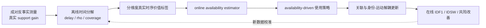

# 申请指南 Research Hub 讨论交接稿

更新日期：2026-07-18

## 1. 本轮讨论的目标与定位修正

当前已经成型的 idea 是：

> 在主视角遮挡条件下，研究异步 support 观测的身份跟踪价值如何受到绝对时延、遮挡相对窗口和在线覆盖共同影响；通过成对反事实测量获得真实支撑增益，进一步估计不同信息维度的在线 temporal availability，并据此控制延迟消息的关联和轨迹状态更新。

需要特别明确：这个 idea 是博士课题中的一个完整研究内容，而不是整个博士课题。最初把它继续拆分成测量、建模、算法和验证并将这些部分并列为博士研究内容，会使总体结构更像一篇小论文，而不是系统性的博士研究框架。

当前形成的总体认识是：

- 当前 idea 处理多无人机协同跟踪中的**时间不一致性**；
- 一个更大的博士课题还应考虑跨视角证据可辨识性、分布式轨迹身份一致性和长期身份持续性；
- 研究主线应始终是 tracking mechanism；
- 通信时延是需要处理的外部扰动，不是要优化的通信资源变量；
- 不把带宽、功率、发送选择或通信调度作为核心研究问题。

## 2. 候选总体研究主题

### 推荐题目

**不完备时空观测下多无人机协同多目标跟踪的持续身份推理方法研究**

### 工程化备选

**复杂遮挡与异步通信条件下多无人机协同多目标跟踪关键方法研究**

### 理论化备选

**多无人机协同跟踪中异构观测可用性与跨视角身份一致性研究**

推荐题目的优势是可以容纳当前的异步 support 研究，又不会把整个博士课题限制成时延建模或某一种 delayed association 算法。

### 候选总体科学问题

> 在主视角遮挡、跨视角差异、通信异步和局部轨迹状态不一致同时存在的条件下，如何判断分布式观测是否可用，将其转化为一致的身份证据，并长期维持多目标身份连续性？

### 候选总体科学假设

> 多无人机协同跟踪的收益并不由观测数量直接决定，而取决于协同证据在时间上可用、身份上可辨识、轨迹间可一致，以及长期状态中可持续。只有同时处理这些条件，跨视角信息才能稳定转化为身份跟踪收益。

## 3. 候选博士研究内容及其边界

下列四项是当前讨论形成的候选总体框架，除研究内容一外，其余内容仍需结合申请指南要求、博士阶段资源和文献空白进一步收敛。

| 研究内容 | 研究对象 | 核心问题 | 主要输出 |
| --- | --- | --- | --- |
| 1. 异步支撑观测的时序价值机理与可用性驱动利用 | 延迟 observation → 主 tracker | 消息还剩多少时间价值，应该如何使用？ | 分维度 online availability、延迟消息使用策略、受限状态更新 |
| 2. 异步协同条件下跨视角证据的条件可辨识性与证据关系建模 | cross-view observation/evidence | 在时间可用性已知或受控时，消息内容能否区分身份，多维证据之间是互补、冗余还是冲突？ | `Q_k`、证据交互关系 `I_kl`、跨视角身份约束 |
| 3. 分布式局部轨迹的全局身份一致性推理 | local tracklet → global identity | 多架无人机的局部轨迹如何组成统一身份？ | 全局 ID、轨迹冲突消解、可撤销身份假设 |
| 4. 长时观测缺失下的持续身份维持与错误恢复 | persistent identity | 身份如何跨越长遮挡、中断、重入和错误传播保持稳定？ | 长期身份记忆、污染隔离和身份恢复机制 |

如果申请指南只适合三个研究内容，可将研究内容四并入研究内容三，形成：

1. 异步信息的时间可用性及其利用；
2. 时间可用性约束下跨视角证据的身份可辨识性与证据关系；
3. 分布式轨迹的全局一致性与长期身份维持。

### 四项内容的统一概念

```text
Availability / 时间可用性
        ↓
Discriminability / 身份可辨识性
        ↓
Consistency / 全局一致性
        ↓
Persistence / 长期持续性
```

### 当前 idea 的位置

```text
当前异步 support 工作
= 研究内容一
≠ 整个博士课题
```

## 4. 研究内容一的完整定义

### 建议名称

**遮挡条件下异步支撑观测的时序价值机理与可用性驱动利用方法**

### 核心问题

> 异步支撑观测的身份增益如何由绝对时延、遮挡相对窗口和在线覆盖共同决定？如何在线估计位置、运动、外观等信息维度的 temporal availability，并据此决定消息是否参与关联、以多大权重参与、采用何种时间处理方式，以及允许更新哪些轨迹状态？

### 完整闭环



研究内容一不能停留在定义或分析 temporal availability。它必须最终形成：

```text
离线真实价值测量
→ 在线 temporal availability 估计
→ 信息使用方式和权威控制
→ 在线 tracking 性能提升
```

## 5. 离线 temporal availability 分析框架

### 已定义的时间分解变量

| 变量 | 含义 | 在框架中的角色 |
| --- | --- | --- |
| `delay_ms` | 消息从捕获到到达的绝对时延 | 外生时延变量、绝对陈旧程度 |
| `rho_episode` | `delay / 完整遮挡时长` | episode 级相对时延压力 |
| `rho_remaining` | `delay / 捕获时刻剩余遮挡时间` | 消息级剩余窗口压力 |
| `online_support_coverage` | 遮挡期被及时 support 覆盖的比例 | 在线可用性的 episode 级描述量 |
| `fraction_rho_remaining_ge_1` | 到达时已经错过遮挡结束窗口的消息比例 | 过期消息比例 |

### 严格术语区分

这些变量不能全部直接等同于 temporal availability。建议区分：

1. **Temporal context variables**：`delay_ms`、`rho_episode`、`rho_remaining`；
2. **Temporal availability descriptors**：coverage、过期消息比例、连续 support 缺口；
3. **Temporal utility target**：paired during gain、spillover gain、IDF1 增益、IDSW 减少量。

关系是：

```text
Temporal context
        ↓
实际在线覆盖与错过窗口情况
        ↓
Temporal availability descriptors
        ↓
Paired counterfactual tracking utility
```

真正判断 support 是否有价值的结果变量是 paired counterfactual gain。`delay`、`rho` 和 coverage 是解释变量或中介变量。

### 该分析框架在研究内容一中的位置

它属于研究内容一的第一阶段：

> 遮挡条件下异步支撑观测的离线因果测量与时序可用性分解。

它包括两个互补贡献：

- paired episode counterfactual 解决“收益是否能干净归因给当前 episode support”；
- temporal decomposition 解决“已经测得的 support gain 为什么在不同 episode 和消息中差异巨大”。

两者共同生成后续在线 estimator 所需的真实价值标签和规律依据。

## 6. 离线时序价值与在线 temporal availability 的关系

### 离线真实时序价值

对于第 `k` 类信息：

```text
V_k* = tracking gain(保留 z_k) - tracking gain(屏蔽 z_k)
```

它是使用未来真实结果得到的因果价值，只能离线测量。

### 在线 temporal availability

在线系统预测：

```text
A_hat_k = P(V_k* > δ | 当前可观测上下文)
```

或者预测预期增量收益：

```text
A_hat_k ≈ E[V_k* | 当前可观测上下文]
```

因此：

- `temporal value V*`：事后获得的真实因果收益；
- `temporal availability A_hat`：运行时对该收益的估计；
- utilization policy：把 `A_hat` 转化为关联与更新动作。

### 在线 estimator 可使用的变量

- 消息年龄 `arrival_time - capture_time`；
- 主视角当前已连续缺失时间；
- 轨迹预测协方差；
- 目标速度及 `velocity × delay`；
- 历史 buffer 是否仍覆盖捕获时刻；
- 截止当前实际收到的 support 密度；
- 当前候选轨迹歧义；
- 当前视角、检测框和特征质量。

### 不能直接作为在线输入的 oracle 变量

- 完整遮挡 episode 时长；
- 真实剩余遮挡时间；
- 完整 `rho_episode` / `rho_remaining`；
- episode 结束后才能计算的完整 coverage；
- paired counterfactual gain。

这些量用于离线发现规律、生成标签或评价 estimator，而不是直接泄漏给在线 gate。

## 7. 分信息维度的 temporal availability

一条 support 消息可能包含：

```text
world position
motion / velocity
bbox
appearance / ReID
covariance
visibility / view quality
```

研究内容一应输出分维度 online availability：

```text
A_position
A_motion
A_bbox
A_appearance
A_identity
```

不预设外观一定比位置耐延迟，而应通过分维度 counterfactual 测量获得真实标签。

## 8. 身份—运动解耦更新的准确含义

解耦更新不是在位姿和外观之间二选一，而是轨迹维护不同状态，并允许每条消息只更新其中仍然可信的部分。

### 运动状态

```text
X_motion = [world position, velocity, covariance]
```

### 身份状态

```text
X_identity = [ReID prototype, feature bank, identity confidence]
```

### Availability 驱动的动作

| `A_position` | `A_appearance` | 推荐动作 |
| --- | --- | --- |
| 高 | 高 | 联合关联，分别更新运动和身份状态 |
| 高 | 低 | 几何主导关联，只更新位置/速度 |
| 低 | 高 | 外观主导身份确认，不用陈旧坐标改写当前运动状态 |
| 中 | 高 | 外观主导，几何只作弱约束 |
| 高 | 中 | 几何主导，外观先进入临时特征库 |
| 低 | 低 | 丢弃或只记录，不影响在线轨迹 |

## 9. 可以引入的成熟持续跟踪算法

成熟算法可以作为信息利用和状态更新算子。研究创新集中在 temporal availability 如何选择、加权、调度和限制这些算子。

### 几何与运动分支

1. 从检测框底部中心或人体脚点产生图像观测；
2. 利用相机内参、外参和无人机位姿形成相机中心射线；
3. 射线与地平面相交，或在同步条件满足时进行多视角三角化；
4. 得到世界坐标测量及其协方差；
5. 使用重投影误差、世界坐标距离或 Mahalanobis distance 形成几何证据；
6. 在捕获时刻执行 Kalman/UKF/OOSM update；
7. rollback/replay 到当前时刻。

注意：

- 单条相机射线不能唯一确定三维位置，需要地平面、目标高度、深度或多视角约束；
- 异步捕获的多视角射线不能不加处理地直接三角化；
- 重投影误差是几何一致性或测量质量，不是完整的状态更新算法；
- 真正的状态更新由滤波、平滑或优化完成。

Temporal availability 可以通过有效测量协方差控制几何更新权威：

```text
R_eff = R_projection / (A_position · Q_geometry + ε)
```

### 外观与身份分支

1. 使用 CNN/ReID 网络提取目标 crop 的 appearance embedding；
2. 计算与轨迹身份原型或 feature bank 的余弦相似度；
3. 将相似度用于候选身份排序和关联；
4. 关联可靠后，按 availability 和图像质量更新身份记忆。

```text
beta = beta_0 · A_appearance · Q_appearance
```

为了防止单次误匹配污染长期身份，优先采用临时 feature bank，再由多次一致证据更新长期身份原型。

### 几何和外观不是替代关系

- 世界坐标回答“目标在哪里”；
- 外观 embedding 回答“目标更像谁”；
- temporal availability 回答“这类信息现在还剩多少使用权威”。

## 10. 推荐的第一版算法原型

第一版建议使用可解释的成熟组件，不直接训练复杂端到端网络：

```text
检测框 / 人体脚点
→ 相机射线与地平面求交
→ 世界坐标与投影协方差
→ capture-time 状态恢复
→ Kalman/OOSM 运动预测

目标 crop
→ CNN/ReID embedding
→ appearance similarity / feature bank

两条分支
→ 分维度 online temporal availability
→ availability-aware association
→ identity-motion decoupled update
→ replay 到当前时刻
```

候选轨迹 `i` 与消息 `m` 的最终联合证据可写为：

```text
log P(i | m)
= A_position · Q_geometry · log P_geometry
+ A_appearance · Q_appearance · log P_appearance
```

其中：

- `A_k`：时间上是否仍有价值，由研究内容一估计；
- `Q_k`：内容本身是否可靠，是研究内容二的主要对象；
- `P_k`：该维度对同一身份假设的支持程度。

该公式是研究内容一与研究内容二完成后的系统接口示意，不应整体归入研究内容一：

- 研究内容一提供 `A_k`，研究时间异步造成的使用权威变化；
- 研究内容二提供 `Q_k` 以及多维证据之间的交互关系；
- 在研究内容一的独立实验中，`Q_k` 和证据组合规则应固定、使用成熟基线或受控 oracle，使研究创新集中在 temporal availability 如何控制消息启用、时间处理和状态更新范围；
- 简单加权联合关联可以作为研究内容一验证 `A_k` 有效性的实验载体，但不作为“已解决多维证据互补与冲突”的结论。

初期可以采用：

- Kalman filter 或 fixed-lag smoother；
- capture-time rollback/replay；
- Mahalanobis geometry gating；
- CNN/ReID embedding + cosine similarity；
- availability-aware Hungarian matching；
- identity/motion separate update；
- 显式 `reject/drop-delayed` 安全动作。

后续再比较：

- 固定函数或查表型 availability；
- 监督学习 estimator；
- mixture-of-experts 动作路由；
- 贝叶斯不确定性传播；
- 学习型融合策略。

不建议一开始直接使用强化学习或完全端到端融合，否则难以区分收益来自 availability 规律、特征网络还是训练数据。

## 11. 研究内容一中的风险定义

风险应定义为使用延迟消息相对于丢弃消息所造成的增量伤害，而不是简单定义成“消息很旧”。

```text
Risk(a, m)
= E[Loss(执行动作 a 使用消息 m) - Loss(drop-delayed)]
```

风险可包括：

- 错过在线发布窗口；
- 陈旧位置污染当前运动状态；
- 错误外观污染长期身份原型；
- 一次错误关联改变后续候选集合并持续传播。

利用策略可以在以下动作中选择：

```text
discard
weak current fusion
capture-time correction / replay
identity-only update
position-only update
joint update
```

目标是在提升预期 tracking gain 的同时，将相对 `drop-delayed` 的增量风险限制在允许范围内。

## 12. 研究内容一、二、三的接口

此前三项内容存在重合风险。当前建议通过研究对象和输出接口区分，而不是规定研究内容一完全不能做关联。

### 研究内容一

```text
对象：延迟 observation → 主 tracker
输出：A_k，时间上是否仍有价值；以及如何在主 tracker 中使用
```

### 研究内容二

```text
对象：跨视角 observation / evidence
前提：A_k 已由研究内容一提供，或在实验中被固定和分层控制
输出：Q_k、证据交互关系 I_kl 和身份兼容性
问题：内容本身是否可辨识，多维证据是互补、冗余还是冲突
```

### 研究内容三

```text
对象：local tracklet → global identity
输出：系统级 global ID 和轨迹冲突消解
```

因此：

```text
研究一：消息现在还能不能用、如何用
研究二：在时间权威已知时，消息内容能否区分身份，多维证据如何共同形成身份约束
研究三：多个局部轨迹最终属于哪个全局身份
```

研究内容一会做 observation-to-track 关联，但研究内容三处理的是 tracklet-to-global-identity，不是重复单条观测匹配。

研究内容一和研究内容二的边界是：研究内容一允许同时调用位置、运动和外观等既定关联算子，但只研究 `A_k` 如何控制它们的启用、权重和更新范围；研究内容二不重复估计时延价值，而研究这些算子产生的内容证据是否具有身份区分力，以及证据之间能否被简单相加。

## 13. 研究内容二：跨视角证据的条件可辨识性与证据关系建模

### 13.1 建议名称

**异步协同条件下跨视角异构证据的条件可辨识性与证据关系建模**

名称中的“异步协同条件下”用于保持总体课题边界，但时间异步不是本项重复研究的主要自变量。研究内容一输出的 `A_k` 在本项中作为已知输入、控制变量或分层条件。

### 13.2 研究定位

研究内容一回答：

```text
位置、运动和外观信息在到达时还剩多少时间价值？
```

研究内容二回答：

```text
当这些信息具有给定的时间权威时，
其内容能否区分身份，彼此是互补、冗余还是冲突？
```

研究内容二不能退化为普通跨视角 ReID。其研究单元不是孤立的目标图像，而是：

```text
support observation
+ candidate tracks
+ cross-view condition
+ 由研究内容一提供或控制的 A_k
```

### 13.3 核心概念与接口

对于第 `k` 类信息，定义：

```text
A_k：时间可用性，由研究内容一负责
Q_k：在当前内容和视角条件下的身份可辨识性，由研究内容二负责
E_k(i,m)：该信息对“消息 m 与候选轨迹 i 同身份”的支持程度
I_kl：第 k、l 类证据之间的互补、冗余或冲突关系
```

其中：

- `A_k` 高，只说明信息在时间上仍有使用价值；
- `Q_k` 高，说明信息内容能够在当前候选集合中区分身份；
- 两个 `A_k` 都高，不代表两类证据内容一致；
- `I_kl` 用于刻画两类内容证据联合时是否产生新增区分力、重复计算或相互矛盾。

最终有效身份证据应表达为一般关系：

```text
EffectiveIdentityEvidence
= F({A_k}, {Q_k}, {E_k}, {I_kl})
```

不在申请阶段预设它必然是简单乘法或线性加权。

### 13.4 研究目标

揭示视角变化、遮挡程度、成像质量、目标相似性、空间定位误差和候选歧义等因素对跨视角异构证据身份可辨识性的影响规律；在时间可用性已知或受控的条件下，建立位置、运动、外观等证据的条件可辨识性表征，识别多维协同证据之间的互补、冗余与冲突关系，形成能够稳定约束跨视角身份关联的有效证据基础。

### 13.5 研究内容

针对异步协同跟踪中辅助观测虽具有一定时间可用性、但其内容受视角变化、目标遮挡、成像质量、目标相似性和空间定位误差影响而未必能够可靠区分身份的问题，研究位置、运动、外观及观测不确定性等异构信息在不同跨视角条件下的身份判别作用，分析单一信息维度的适用条件及失效边界；在研究内容一提供或控制 temporal availability 的基础上，研究多维内容证据联合时产生的互补、冗余和冲突关系，构建跨视角观测的条件可辨识性表征，阐明内容可靠性、证据一致性与身份关联置信度之间的作用关系，使时间上可用且内容上可信的辅助观测能够形成有效身份约束，避免及时但低可辨识或相互冲突的证据造成身份混淆。

### 13.6 拟解决的关键问题

在异步协同条件下，当不同信息维度的 temporal availability 已知或可估计时，如何准确刻画跨视角异构证据在特定视角、观测质量和候选歧义条件下的身份区分能力，辨别多维证据之间的互补、冗余与冲突关系，并将时间上可用、内容上可信且关系一致的协同证据转化为稳定的跨视角身份约束？

该问题重点解决：

1. “消息及时到达，但内容不能区分身份”；
2. “多种证据同时存在，但只是重复信息”；
3. “多种证据分别可信，但支持不同身份候选”；
4. “单一证据不足，但联合后能够形成新增身份区分力”。

### 13.7 分步骤研究思路

#### 步骤一：控制时间因素，定义内容可辨识性问题

使用研究内容一输出的 `A_k`，或在同步、capture-time aligned 及固定高/中/低 availability 条件下控制时间因素，避免把时延衰减重复归因给内容可辨识性。明确评价对象为 support observation 在当前候选轨迹集合中的身份区分能力。

#### 步骤二：建立跨视角内容条件空间

系统描述视角、可见区域、目标尺度、成像质量、空间定位误差、目标相似性和候选密度等条件，形成可用于比较不同证据身份判别能力的场景分层。

#### 步骤三：测量单维证据的身份边际价值

分别保留或屏蔽位置、运动、外观等信息，在相同 `A_k` 和相同轨迹前状态下，测量每类信息对排除错误候选、提升正确身份排序和维持轨迹身份连续性的边际贡献，获得离线真实可辨识性 `Q_k*`。

#### 步骤四：识别证据间的互补、冗余和冲突

比较单维证据和多维证据组合的身份增益：单维不足但联合有效时判定互补；增加证据不产生新增区分力时识别冗余；不同证据支持不同身份候选时识别冲突；所有证据均不足时保留身份歧义而非强制形成约束。

#### 步骤五：构建在线条件可辨识性表征

利用当前可观测的视角、可见性、观测质量、候选歧义和证据一致性等条件，估计 `Q_k` 和证据关系 `I_kl`。该步骤不重新预测 `delay` 带来的 temporal availability，而以 `A_k` 作为输入或条件。

#### 步骤六：与时间可用性联合形成身份约束

研究 `A_k`、`Q_k`、具体身份支持证据 `E_k` 和证据关系 `I_kl` 如何共同决定有效身份权威，验证只有时间上可用且内容上可辨识的证据才能稳定改善跨视角身份关联。

#### 步骤七：验证身份收益及失效边界

在不同 temporal availability、视角差异、遮挡质量、目标相似程度和候选歧义组合下，验证条件可辨识性及证据关系建模是否减少及时但低质量证据导致的身份混淆，并分析其对遮挡期间和遮挡后身份连续性的影响。

### 13.8 与研究内容一的实验分工

研究内容一优先固定或控制内容质量，主要改变：

```text
delay / occlusion window / online coverage / tracker-state evolution
```

研究：

```text
temporal context → A_k → availability-driven utilization → tracking gain
```

研究内容二固定或分层控制 `A_k`，主要改变：

```text
viewpoint / visibility / image quality / target similarity
/ geometry uncertainty / candidate ambiguity
```

研究：

```text
content context → Q_k and I_kl → effective identity constraint → identity gain
```

最终联合验证：

```text
{A_k} + {Q_k} + {I_kl} → effective identity evidence → tracking gain
```

### 13.9 可直接用于申请指南的整合表述

> **（2）异步协同条件下跨视角异构证据的条件可辨识性与证据关系建模。** 针对辅助观测虽具有一定时间可用性、但受视角变化、目标遮挡、成像质量、目标相似性和空间定位误差影响而未必能够形成可靠身份约束的问题，在研究内容一提供或控制不同信息维度 temporal availability 的基础上，研究位置、运动、外观及观测不确定性等异构信息在不同跨视角条件下的身份判别作用，揭示多维内容证据之间的互补、冗余与冲突关系，构建跨视角证据的条件可辨识性表征；进一步阐明时间可用性、内容可辨识性和证据一致性共同作用于跨视角身份关联的内在关系，使时间上可用且内容上可信的辅助观测形成有效身份约束，避免及时但低可辨识或相互冲突的证据造成身份混淆。

## 14. 当前前期实验可支持的内容

截至当前，可以在申请指南的前期基础中谨慎表述：

- 已在 MATRIX `0-199` 帧构建 76 个主视角 LoS 遮挡 episode；
- 已完成 6 档时延下的 paired counterfactual 测量校准；
- Run A reproduction mismatch 为 `0`；
- mask manifest mismatch 为 `0`；
- track lineage ambiguity 为 `0`；
- mean during gain：500 ms 为 `0.910`，1000 ms 为 `0.271`，1500 ms 为 `0.049`，2500 ms 为 `0.013`，5000 ms 为 `0.001`；
- 在 `rho_episode < 0.25` 内，gain 仍从 500 ms 的 `0.926` 降至 1000 ms 的 `0.275` 和 1500 ms 的 `0.050`，说明 ratio-only 不足；
- geometry-only support 在 pose/world-coordinate noise 下可能产生负边际价值；
- authority cap 和 ambiguity margin 能限制部分伤害，但尚未证明 geometry-only 方法优于 `drop-delayed`。

### 允许表述

> 初步实验验证了成对反事实测量协议的可信性，并观察到绝对时延、遮挡相对窗口与在线覆盖共同影响异步支撑收益的信号；同时，几何支撑在噪声下可能转为有害，说明需要进一步研究分维度在线可用性估计和受限状态更新。

### 暂不应表述

- 已经发现普适的“三时间尺度定律”；
- 已经得到稳定、可发表的 harm boundary；
- `rho_episode` 或 `rho_remaining` 可以直接作为在线 gate；
- 已经证明 risk-aware 方法优于全部基线；
- appearance 一定比 position 更耐延迟；
- Backfill 是默认最终方法。

当前正式结论仍是：measurement valid but boundary underdetermined。扩展到更大帧范围后，才适合拟合稳定的联合边界。

## 15. 申请指南可采用的创新层级

### 总体认识创新

从“更多视角和更多观测自然提高跟踪性能”转向“协同证据只有在时间上可用、内容上可辨识、轨迹间可一致时，才能稳定转化为身份收益”。

### 研究内容一的方法论创新

使用 paired episode counterfactual 分离当前遮挡 episode 的 support 增益与历史 tracker 状态继承效应。

### 研究内容一的分析框架创新

建立绝对时延、遮挡相对窗口、在线覆盖和 counterfactual tracking utility 的联合解释框架，而不是只报告 aggregate IDF1/IDSW 或单一 delay sweep。

### 研究内容一的算法创新

由离线因果价值测量学习分信息维度的 online temporal availability，并利用该估计动态控制成熟几何、运动和外观算子的启用条件、关联权重、更新权威和状态更新范围。

## 16. 可直接用于申请指南的研究内容一表述

> 面向主视角遮挡条件下异步跨视角观测的在线利用问题，研究绝对时延、遮挡相对窗口和在线覆盖对支撑身份增益的作用机理，构建基于成对 episode 反事实的离线因果测量与时序价值分解方法。在此基础上，研究位置、运动与外观等信息维度的在线 temporal availability 估计，进一步构建可用性驱动的延迟消息利用方法，动态控制世界坐标几何关联、捕获时刻运动状态修正、外观身份匹配及身份—运动解耦更新，在保留有效支撑信息的同时限制陈旧信息对在线轨迹的污染。

## 17. 仍待确定的问题

以下问题尚未在讨论中最终确定，撰写申请指南时应保留为设计空间：

1. 总体课题最终采用三个还是四个研究内容；
2. 研究内容二是否以“身份可辨识性”为核心，还是进一步聚焦视角条件下的证据互补；
3. 研究内容三采用图推理、层次化关联还是多假设轨迹管理；
4. temporal availability 是预测正收益概率、期望 gain，还是风险分位数；
5. estimator 采用可解释统计模型、监督网络还是 mixture-of-experts；
6. 每个信息维度如何构造干净的 counterfactual mask；
7. appearance temporal value 的真实衰减规律是否与世界坐标显著不同；
8. 在线输出不可回写时，内部 replay 与对外发布状态如何分层维护；
9. 最终方法是否需要 detector-level 输入，何时从 GT/world-coordinate 机制实验升级；
10. 如何在不同遮挡、速度、视角、噪声和 delay distribution 上验证泛化。

## 18. 建议的申请指南组织顺序

1. **研究背景**：多无人机协同跟踪并非观测越多越好；遮挡使 support 有价值，异步和视角差异又使其可能有害。
2. **问题提出**：现有 aggregate 指标和统一融合难以回答异步 support 何时真正产生身份收益。
3. **总体科学问题**：不完备时空观测如何转化为持续身份信息。
4. **总体研究框架**：可用性—可辨识性—一致性—持续性。
5. **研究内容一**：使用本稿第 4—12 节的闭环。
6. **研究内容二**：使用第 13 节，在 `A_k` 已知或受控的基础上研究 `Q_k` 和证据关系 `I_kl`。
7. **研究内容三、四**：作为与前两项同层级的问题，不再把研究内容一内部步骤并列成博士研究点。
8. **前期基础**：使用第 14 节，明确 preliminary signal 与未完成边界。
9. **创新点**：按认识、测量、分析框架和算法利用四个层级组织。
10. **技术路线**：成熟定位/ReID/滤波算子 + temporal availability controller，而不是重新设计全部底层网络。
11. **风险与替代路线**：边界不稳定时保留测量贡献；复杂方法不超过 `drop-delayed` 时报告安全边界并采用解耦更新。

## 19. 一句话总结

> 当前工作不是单纯研究“时延越大是否越差”，而是从离线因果测量出发，解释不同支撑信息在遮挡窗口中的真实时间价值，学习其在线 temporal availability，并用该估计调度成熟的世界坐标定位、运动滤波和外观身份关联方法，使异步跨视角信息能够被有选择、有权威限制地转化为在线身份跟踪收益；这一工作构成更大“持续身份推理”博士课题中的时间可用性研究内容。
