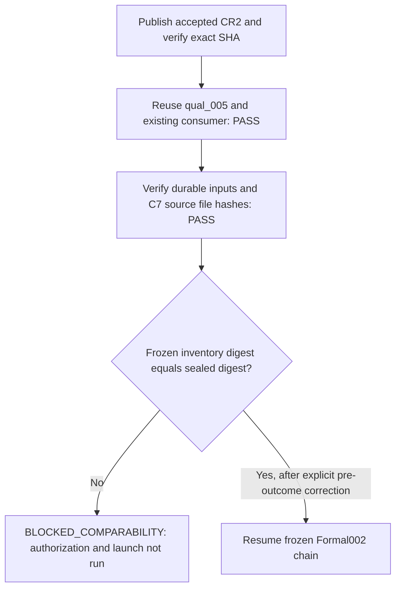

# H_R Formal002 final execution chain: control identity blocker

Date: 2026-10-07 Asia/Shanghai.
Status: `BLOCKED_COMPARABILITY` before authorization or attempt creation.
Scientific outcome read: `NO`; no baseline or treatment endpoint was computed.

## Completed gates

- Accepted CR2 `f07c4742039f6755671a5ebd13139724e759ec02` was published explicitly
  to `github`, branch `governance/20261007-hr-formal-authorization-v2-cr2-namespace`.
  Read-only remote readback returned that exact SHA. No force push, upstream
  change, persistent proxy change, or execution-source change occurred.
- Existing `v2_4_hr_qual_005` / `initial` was read-only verified. Its manifest
  and finalization match the frozen `dc23cb613f94acf42b4c36d88d8e7091b148aed7659a1499947b8d96abd9a4ec`
  and `8251aff069ec198719ccce1feb6c401ab52502a5765f39694d1e30b06727c5c0`.
- The existing fresh consumer at
  `formal_evidence/qualification/formal_support/v2_4_hr_qual_005__initial__formal_authorization_support.json`
  was reused with SHA `223f395abb637cb44fe4a93b4c616206451dda7e7c74974b8ca0277c2042dcdb`;
  the production consumer validator passed, including C1-C6 and V2-1 checks.
  Neither qualification nor support consumption was repeated.
- The frozen design prescribes `v2_4_hr_formal_002`, at
  `formal_evidence/v2_4_hr_formal_002/output`. Both namespaces remain unused.
- A new CR2-bound prospective provenance file was written without replacing
  its older preparation artifact. All 600 image hashes, XML, checkpoint,
  source/config/wrapper/preparer hashes and durable write/readback passed.
  `formal_evidence/preauthorization/v2_4_hr_formal_002_cr2_current_provenance.json`
  has SHA `93f0845f4f5eca6f901960da76a52b1a9059d0f5d4afae26e59e07e70e4990d3`.
  Legacy Torch 1.10.0+cu113 / MMCV 1.5.0 / MMDetection 2.25.1 CUDA preflight
  passed on RTX 3090; 299291693056 bytes were available on durable storage.
- The implementation of the frozen service-byte recipe is committed at
  `a9f7a7db1729b6c7f8fb1a4c71589e246314df98` in the separate analysis worktree.
  Its 14 accounting tests passed. Read-only schema compatibility with the
  existing three-frame non-scientific qualification passed; its endpoint is
  not displayed or used as the scientific control.

## Exact blocker and evidence

Frozen authority: scientific design commit
`8cec5529214b64d14528c04f6063ca28427c13cd`,
`FORMAL002_TREATMENT_ONLY_C7_CONTROL_SUPERSESSION.md`, lines 98 and 102.
The contract explicitly requires the recorded inventory digest to match the
C7 seal's `sealed_payload.inventory_sha256` before derivation.

| Identity | Frozen contract | Actual sealed/recomputed value |
| --- | --- | --- |
| Internal inventory SHA | `205aafad0d21237207cd46c6e07998d9459b436849e7660b1a6f14031a7cdb85ef4` | `205aafad0d21237207cd46c6e07998d9459b436849e7660b6ae138d03efd0f6c` |
| Inventory file SHA | `69c8e1c9543c3cdbaa9db70ecf8fc8735701d5889e996c6ee59573e7efac4f2b` | Exact match |
| Seal file SHA | `430a13969eee7a72d1b36179a0f143f6338d1edd34e99da4dbc0b1eea30c5f1b` | Exact match |
| Seal internal SHA | `596a0d7b61edfe379309c2d1635e03f5ad493ac7b3b05ebf0059deb7ae13bd5e` | Exact match |

The computed canonical inventory digest equals the digest actually embedded
in the C7 seal. The inventory/seal chain is internally consistent. The windows
and service-ledger raw hashes also exactly match the frozen contract. This is
a disagreement between the frozen recorded internal inventory identity and
the same frozen source-file bytes, not evidence that C7 files changed.

Command:

```bash
PYTHONDONTWRITEBYTECODE=1 PYTHONPATH=src python scripts/analyze_mdmt_mia_hr_formal002.py seal-baseline
```

Exact failure: `AccountingError: C7_INVENTORY_BINDING`, in `seal_baseline()`.
Failure occurs before writing an implementation-binding artifact, parsing the
window/classification records, computing an endpoint, or sealing a baseline.
No Formal002 authorization was issued; no attempt, output, live session or
finalized Formal002 evidence was created. Execution count is `0`.

## Scope and next action

Verdict: `BLOCK_EXPERIMENT` (P1 frozen control identity mismatch). This session
leaves the scientific design, CR2, qual_005, consumer, C7 and Formal001 intact.
Formal001 outcomes and tracking outcomes were not opened. No scientific claim
is evaluated.

The minimum next action is a prospective, pre-outcome correction/clarification
of this recorded internal inventory digest, preserving all four already-frozen
C7 source-file identities and the same hypothesis, metric, threshold, cell,
capacity and treatment. Then resume with existing qual_005/consumer and the
still-unused Formal002 namespace. Do not rerun C7 or qualification, change the
control, or ignore the failed identity check.

Exact next read-only verification command:

```bash
git -C /mnt/data/yzm/experiments/matrix_async_pose_comm_tracking/.worktrees/hr_formal_authorization_v2_cr2_namespace show 8cec5529214b64d14528c04f6063ca28427c13cd:summary_md/experiments/2026-10-6/exp_20261006_002_mdmt_mia_hr_formal002_paired_redistribution/FORMAL002_TREATMENT_ONLY_C7_CONTROL_SUPERSESSION.md
```

Flow source: `mermaid/exp_20261006_002/final_execution_identity_gate.mmd`.


