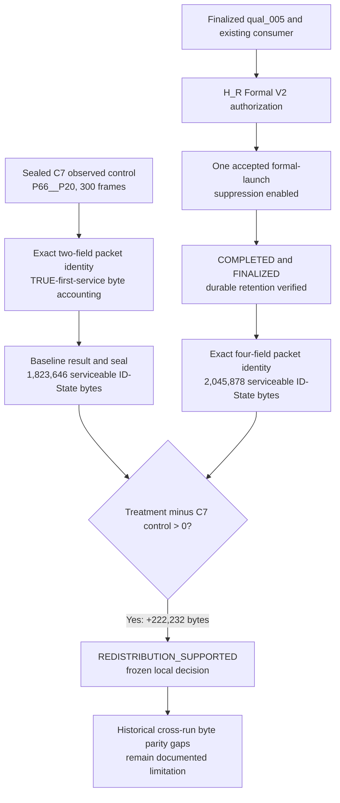

# exp_20261006_002 Formal002 treatment-only analysis

Date: 2026-10-07 Asia/Shanghai. Experiment ID retains its historical
`paired_redistribution` name; the frozen supersession at design commit
`8cec5529214b64d14528c04f6063ca28427c13cd` prescribes one Formal002
treatment and the sealed observed C7 historical control. Formal002 attempt
`v2_4_hr_formal_002` ran once, completed with no live processes, and finalized
as node `initial`. This report addresses the frozen communication-service
endpoint only. Tracking outcomes and Formal001 outcomes were not read.

## Frozen setup and evidence

| Field | Frozen value or observed identity |
| --- | --- |
| Pair, cell and horizon | P66, `P66__P20`, 16649 logical bytes/frame, frames `0..299` |
| Control | Sealed C7 observed finite-FIFO trajectory; suppression disabled; run `exp_20260925_001_c7_full_21_cell_census` |
| Treatment | Accepted H_R production source `f07c4742039f6755671a5ebd13139724e759ec02`; C6 TRUE-first-service whole-packet suppression enabled |
| Primary endpoint | Absolute integer `serviceable_id_state_serviced_bytes`; no denominator |
| Decision rule | Treatment minus control strictly `> 0` |
| Baseline analyzer | Accepted/published `b9daea8a581965718cea522a1cd5c05d876d74b7`; exact C7 two-field and treatment four-field packet-ID modes |
| Qualification | Existing `v2_4_hr_qual_005` / `initial`; manifest `dc23cb613f94acf42b4c36d88d8e7091b148aed7659a1499947b8d96abd9a4ec`; finalization `8251aff069ec198719ccce1feb6c401ab52502a5765f39694d1e30b06727c5c0` |
| Support consumer | Existing record SHA-256 `223f395abb637cb44fe4a93b4c616206451dda7e7c74974b8ca0277c2042dcdb`; validated read-only; no repeat consumption |
| Formal authorization | `formal_evidence/preauthorization/v2_4_hr_formal_002_authorization_v2.json`; SHA-256 `1e24ca6bcaf413963363dac62465a399fbdc23365e015c041e71cc35a49ddb71`; V2 loader PASS |
| Formal finalization | Manifest SHA-256 `3144f95872c5dd36d946b5bacc745a0673120698a742611db49d78474e11d370`; finalization SHA-256 `55921c86de77bc6739963f45368c8b34cebe7b9bc6523d4aeacb5de3eda18b05` |
| Sealed comparison | `formal_evidence/analysis/v2_4_hr_formal_002__packet_schema_v2/FORMAL002_COMPARISON.json`; SHA-256 `4a7833cbaa14cca6ba9eccc5c010852f912e6bc4b6411b5f242f33e06322af42`; seal file SHA-256 `c54084b6b0994519c3d5d3c128c3d89281f2f597b7da9a4bf32502aa615f2955` |

The C7 baseline was derived and sealed in
`formal_evidence/analysis/v2_4_hr_formal_002__packet_schema_v2/` **before**
treatment outcome access. Its baseline result SHA-256 is
`0b4236fb0d61dfc52124d02f648a42b521f7a185eda3e0a9a287ca187c8cf330`
and seal file SHA-256 is
`80f69f9691f7b27903875b37e2cef6a9af64cb969ffd15c98ee3a0bbe81162ae`.
The earlier failed, unsealed binding in
`formal_evidence/analysis/v2_4_hr_formal_002/` remains untouched. The
comparison's durable-retention and comparability receipt is SHA-256
`53975d029744a66b094d87be2ddcbb152927f274f49c6db8f77b400964b0c757`.
The comparison seal was independently read back against the result bytes.
Authorization and current provenance were copied byte-identically into the
completed attempt before finalization. No file was added to that finalized
attempt afterward.

| Source | Serviceable ID-State bytes |
| --- | ---: |
| Sealed observed C7 control | 1,823,646 |
| Formal002 treatment | 2,045,878 |
| Treatment minus control | **+222,232** |

Frozen decision: `H_R_FORMAL002_STATUS = REDISTRIBUTION_SUPPORTED` and
`H_R_SCIENTIFIC_CLAIM = SUPPORTED` for this registered cell and endpoint.
No primary p-value, confidence interval, percentage, or imputation applies.

## 1. Hypothesis comparison

The frozen question asks whether suppression-enabled Formal002 serves more
bytes to ID-State packets classified `SERVICEABLE` at their own TRUE first
service than the sealed C7 observed no-suppression control. The positive
222,232-byte delta satisfies the preregistered strict `> 0` threshold. This is
a supported **local redistribution result**. Exact byte-level identity of
several historical C7 input, checkpoint and tracker artifacts at execution
time was not retained, so the result does not establish that suppression was
the only differing causal variable. No stochastic uncertainty estimate exists
for this single treatment/control comparison.

## 2. Baseline comparison

At `P66__P20`, the treatment's measured serviceable ID-State byte total ranks
above the sealed observed C7 control by 222,232 bytes. The C7 conditional
accounting shadow and Formal001 were excluded from the control. No other
Formal002 cell, capacity, fresh control, oracle, or tracking pipeline was
measured for this frozen decision, so there is no broader ranking to assess.

## 3. Failure modes

The registered measurement did not fail mechanically: the H_R terminal state
was `COMPLETED` with `session_live_pids=[]` and `TERMINAL_VALID`, the accepted
V2-3 finalizer returned `FINALIZED`, and retention/comparability gates passed
before treatment outcome access. The principal interpretive limit is the
historical cross-run byte-parity gap. No delay, scene, or per-packet failure
curve was registered as a primary result, so this run cannot locate a
degradation threshold or classify tracking failures.

## 4. Upper-bound analysis

The contract contains no measured oracle ceiling for serviceable ID-State
bytes. The observed control is a historical trajectory, not a theoretical
upper bound. The 222,232-byte gain is therefore the registered comparison
effect, while remaining improvement headroom cannot be quantified from these
two sealed endpoint totals. No tracking-quality upper bound is inferred.

## 5. Generalization signal

The positive direction shows that this real production-path finite-FIFO cell
can redistribute service toward packets judged serviceable at TRUE first
service under the frozen rule. It is one pair, one capacity and one 300-frame
trajectory. Transfer to other pairs, loads, capacity points, seeds or tracking
metrics is unmeasured. The accepted historical provenance limitation further
restricts a claim that suppression alone caused the entire measured delta.

## 6. Historical comparison

The earlier C6 Formal Attempt4 reported no positive redistribution in its
four different cells under its own frozen baselines. Formal002 differs in the
selected `P66__P20` condition, control source and treatment-only supersession.
Its positive local delta does not overwrite the earlier negative decision or
make the two effect sizes directly comparable. Formal001 outcome bytes remain
unavailable and were not used. The C7 observed control and its sealed raw
file identities were reused without rerunning C7.

## 7. Priority-ranked next actions

1. **P0 — Independent read-only result audit.** Reproduce the comparison and
   baseline seal links, finalization identity, and retained source-file hashes
   from existing bytes. This tests whether the local result remains
   independently recoverable without changing the experiment.
2. **P1 — Prospectively register a replication question.** If broader
   applicability matters, freeze new pair/capacity or repeated-run choices and
   a contemporaneous control before execution. This would test whether the
   positive direction persists; failure would confine this result to its
   registered trajectory. It is a separate experiment, not a reinterpretation
   or rerun of Formal002.
3. **P2 — Keep communication and tracking claims separate.** Any tracking
   outcome analysis needs its own authorized endpoint and provenance review.
   This result alone does not measure identity tracking benefit.

## Flowchart

Source: `mermaid/exp_20261006_002/formal002_final_outcome_flow.mmd`.

