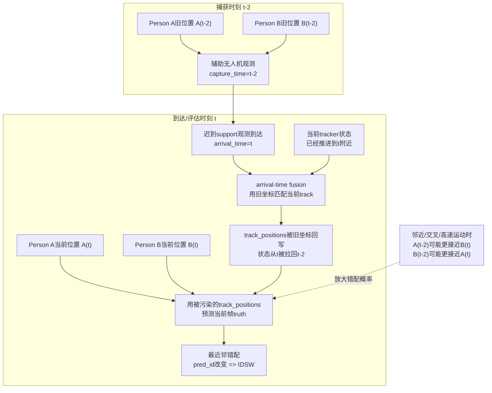
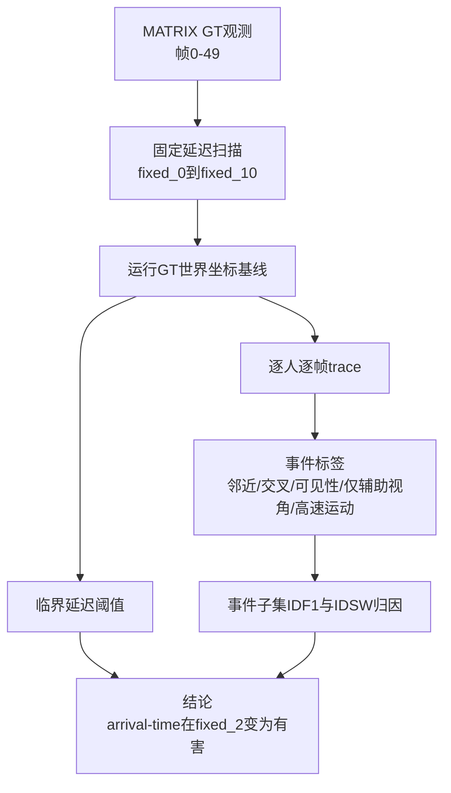

# exp_20260623_001_matrix_delay_event_diagnostics 分析报告

## 1. 假设对照

**结论：支持。** 本实验原假设是：arrival-time fusion 在极小延迟下仍可能有用，但当延迟超过某个临界点后，会比直接丢弃延迟辅助观测更有害。

实验结果给出了清晰阈值：

- `fixed_1`：arrival-time fusion 仍基本可用，IDF1 `0.994500`，IDSW `11`。
- `fixed_2`：arrival-time fusion 突然崩溃，IDF1 `0.115000`，IDSW `1143`。
- `fixed_2` 下，drop-delayed 反而明显更好，IDF1 `0.846000`，IDSW `251`。
- timestamped pose fusion 在所有固定延迟下仍达到 GT 上界，IDF1 `1.000000`，IDSW `0`。

效应量很大：在临界点 `fixed_2`，timestamped pose fusion 比 arrival-time fusion 高 `88.5` 个 IDF1 points，并消除了 `1143` 次 ID switch。

## 2. 基线比较

`fixed_2` 之后，稳定排序是：

```text
timestamped_pose_fusion = sync_oracle > drop_delayed > arrival_time_fusion
```

`fixed_1` 是唯一一个非零固定延迟中 arrival-time fusion 仍优于 drop-delayed 的情况。这说明本切片中 stale support 的有效窗口非常窄：**1 帧延迟仍可用，2 帧延迟已经越过有害阈值**。

关键不是“延迟观测一定有害”，而是“不按 capture time 对齐的延迟观测很快会有害”。这直接支持 timestamp-aware association 的必要性。

## 3. 失败模式

### 3.1 不是平滑退化，而是 cliff failure

这轮结果最重要的异常是：`fixed_2` 比 `fixed_3` 更差。

| Delay | Arrival IDF1 | Arrival IDSW |
| --- | ---: | ---: |
| fixed_1 | 0.994500 | 11 |
| fixed_2 | 0.115000 | 1143 |
| fixed_3 | 0.372500 | 480 |
| fixed_4 | 0.324000 | 630 |
| fixed_5 | 0.324500 | 495 |

因此失败不能只解释为“延迟越大，空间漂移越大”。更合理的解释是：**2 帧延迟刚好把旧 support 观测送到一批高风险关联时刻，使 tracker 当前状态被旧坐标污染，然后当前帧 truth 被错误 track 最近邻吸走，触发级联 IDSW。**

### 3.2 图解：为什么 `fixed_2` 会造成大量 IDSW

当前 GT prototype 中，arrival-time fusion 的机制是：

1. support 观测在 `t-2` 捕获，但在 `t` 到达。
2. arrival-time fusion 在 `t` 处理这条观测。
3. 这条观测的世界坐标仍是 `t-2` 的旧位置。
4. tracker 在当前循环中先用这批迟到观测调用 `assign()`，更新 `track_positions`。
5. 随后才用被更新后的 `track_positions` 去预测当前帧 `t` 的 truth。
6. 如果人在 `t-2` 到 `t` 之间发生邻近、交叉或高速移动，旧坐标可能更接近另一个人的当前位置，于是当前帧被分配到错误 `pred_id`，形成 IDSW。

对应流程如下：



这个图的关键点是：arrival-time fusion 并不是“简单地晚用了两帧观测”，而是**在当前时刻把 tracker 状态写回了旧位置**。一旦旧位置和当前人群几何结构错位，当前帧 identity prediction 就会被污染。

### 3.3 为什么 2 帧比 1 帧危险得多

`fixed_1` 的旧位置通常仍在同一身份的局部邻域内，nearest-neighbor assignment 大多还能保持正确，所以只产生 `11` 次 IDSW。

`fixed_2` 刚好足以跨过许多局部运动/交叉事件的安全窗口。此时旧 support 坐标不再只是轻微落后，而可能落到另一个人的当前邻域中。由于 tracker 使用最近邻 + Hungarian assignment，错位 support 会把 track state 推向错误身份，后续当前帧 truth 再基于这个被污染状态做预测，就会出现大量 `pred_id` 改变。

### 3.4 事件子集归因

`fixed_2` 下，arrival-time IDSW 主要集中在以下子集：

| 子集 | IDSW | 覆盖率 |
| --- | ---: | ---: |
| proximity | 785 | 0.705500 |
| crossing_like | 430 | 0.409000 |
| high_motion | 358 | 0.250000 |
| normal | 174 | 0.165500 |
| support_only | 163 | 0.123500 |

这些事件标签不是互斥分桶，而是重叠的风险集中区。因此这些 IDSW 不能相加为总 IDSW。它们表达的是：大量 IDSW 发生在“人离得近、可能交叉、移动较快”的场景中，这与上面的时序/空间错配机制一致。

`low_visibility` 在 `0-49` 帧中覆盖率为 `0`，说明本轮不能分析低可见度下的失败模式。

## 4. 上限分析

timestamped pose fusion 与 sync oracle 完全一致，说明在当前 GT world-coordinate 条件下，nearest-neighbor tracker 本身不是主要瓶颈。只要观测按 capture time 对齐，系统可以达到 IDF1 `1.000000`、IDSW `0`。

因此当前剩余研究空间不在“GT 世界坐标下还能不能做得更好”，而在非理想条件：

- pose timestamp jitter
- pose interpolation / extrapolation error
- geometric reprojection noise
- detector / ReID noise
- view dropout 与低可见度

换句话说，当前实验建立的是一个强上界和一个强反例：**理想 timestamped fusion 可以完美；错误 arrival-time fusion 会在 2 帧延迟处严重破坏 identity。**

## 5. 泛化信号

本轮结果可以提炼出两条原则：

1. 异步多无人机 MOT 不能只说“有 timestamp 就插回历史”。系统还必须有明确的 delay safety boundary：本切片中 1 帧仍安全，2 帧已经有害。
2. proximity / crossing-like / high-motion 是后续 timestamp uncertainty 和 pose noise 实验的首要压力子集，因为它们解释了最多 arrival-time IDSW。

这也说明当前研究问题的贡献点不应停留在“按 capture time 融合”，而应推进到：**在高风险事件中，如何让 timestamp-aware association 在存在延迟、pose/time uncertainty 和在线状态一致性约束时仍然稳定。**

## 6. 与历史对照

本结果与 `exp_20260622_001` 一致：timestamped fusion 始终完美，arrival-time fusion 在非零延迟下会变差，并且在较大延迟下差于 drop-delayed。

本轮的新贡献是把上一轮粗粒度结论细化了：

- 上一轮只明确看到 `fixed_3` 已经严重失败。
- 本轮扫描 `fixed_0` 到 `fixed_10` 后，发现第一个临界点是 `fixed_2`。

它也与早期 M3OT OOSM negative result 在大方向上相符：延迟观测不是天然有益，错误使用时甚至不如丢弃。区别在于，M3OT 失败更多涉及 ReID/回填机制，而 MATRIX 当前结果直接暴露了世界坐标/pose 时间错位造成的 identity state 污染。

## 7. 下一步建议

1. **优先扩展到 `0-199` 验证阈值稳定性。**  
   当前 `fixed_2` 阈值来自 `0-49` 切片，需要确认它不是前 50 帧的局部事件结构导致。

2. **加入 timestamp jitter / pose interpolation noise。**  
   timestamped fusion 当前在 GT 下完美，但真实系统中的 pose 与 image observation 不会严格同步。下一步应检查在时间戳误差和位姿插值误差下，timestamped fusion 是否仍能保持优势。

3. **围绕 proximity / crossing-like 子集做重点诊断。**  
   这些子集是 `fixed_2` 下 IDSW 最集中的区域，适合作为后续 stress test 的主读出。

4. **补充低可见度实验。**  
   当前 `0-49` 没有 low-visibility rows，所以不能对遮挡/低覆盖情况做结论。可以选择更低覆盖帧段，或加入 synthetic view-drop。

## 流程图

实验诊断流程图源文件：

```text
mermaid/exp_20260623_001_matrix_delay_event_diagnostics/threshold_event_flow.mmd
```



`fixed_2` arrival-time 失败机制图源文件：

```text
mermaid/exp_20260623_001_matrix_delay_event_diagnostics/arrival_time_fixed2_failure.mmd
```

## 补充说明

本轮 per-person trace 包含 `110000` 行：50 帧 x 40 个 person x 55 个 pipeline/profile run。后续分析应使用 targeted aggregation，不应直接 bulk 打印完整 trace。

当前报告中的 fixed_2 机制解释分为两层：

- **确定事实**：arrival-time fusion 在 `t` 处理 `t-2` 捕获的旧坐标，并在当前循环中更新 tracker state。
- **基于结果的推断**：proximity / crossing-like / high-motion 子集的 IDSW 集中，说明旧坐标与当前人群几何结构错位是大量 IDSW 的主要触发条件。
