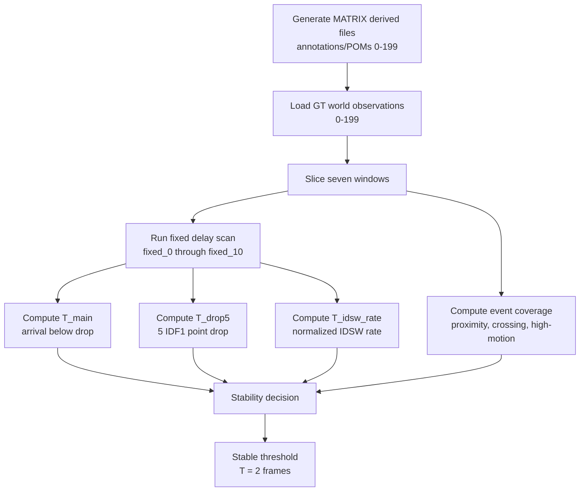

# exp_20260625_001_matrix_threshold_stability Analysis Report

## 1. 假设对照

**Hypothesis: supported.** All seven windows report `T_main=2`, `T_drop5=2`,
and `T_idsw_rate=2`. This supports the hypothesis that the harmful arrival-time
delay threshold is stable near `2-3` frames; in this run it is exactly 2 frames
for every tested window.

Timestamped pose fusion passes the sanity check in every window, so the
arrival-time degradation is not explained by a broken GT window or by sync
oracle instability.

## 2. 基线比较

The important aggregate `0-199` ordering is:

```text
timestamped_pose_fusion = sync_oracle > arrival_time_fusion fixed_1 > drop_delayed > arrival_time_fusion fixed_2+
```

At `fixed_1`, arrival-time fusion is still useful (`IDF1=0.998000`, IDSW rate
`2.625` per 1k GT), while drop-delayed is much lower (`IDF1=0.352500`). At
`fixed_2`, arrival-time fusion collapses below drop-delayed (`IDF1=0.052875`,
IDSW rate `617.625` per 1k GT).

## 3. 失败模式

The failure mode remains a cliff. The transition from `fixed_1` to `fixed_2`
is the dominant break point in every short and aggregate window.

Event-risk coverage varies moderately:

| Window | Event risk | Proximity | Crossing-like |
| --- | ---: | ---: | ---: |
| 0-49 | 0.454833 | 0.705500 | 0.409000 |
| 50-99 | 0.501000 | 0.782500 | 0.470500 |
| 100-149 | 0.482000 | 0.757000 | 0.439000 |
| 150-199 | 0.482500 | 0.780000 | 0.417500 |

However, `T_main` does not vary, so event-risk correlation with threshold is
`0.000000`. This does not prove event risk is irrelevant; it means the tested
windows are all above the risk level where a two-frame stale update becomes
harmful.

## 4. 上限分析

Timestamped pose fusion remains at the GT upper bound for all windows and
delays. Under ideal world coordinates, the method gap is therefore not in
nearest-neighbor association itself; the next meaningful gap must be introduced
by non-ideal timing and pose conditions:

- timestamp jitter
- pose interpolation / extrapolation error
- pose sampling delay
- detector/ReID noise after GT timing is understood

## 5. 泛化信号

This run strengthens the design principle from the previous experiment:

> Stale support observations are useful for one frame but become identity
> pollution at two frames when fused at arrival time.

The threshold is now supported on four shifted 50-frame windows and three
aggregate windows, not only the first `0-49` slice.

## 6. 与历史对照

This result refines `exp_20260623_001_matrix_delay_event_diagnostics`.
Previously, `fixed_2` was measured on one window; now it repeats across `0-199`.

It remains consistent with the earlier M3OT negative OOSM experiments in the
broader sense: delayed information is not automatically helpful. Timing-aware
use is necessary; otherwise dropping stale support can be safer than fusing it.

## 7. 下一步建议

1. **Add timestamp jitter / pose interpolation noise.** This is now the highest
   priority because the GT threshold is stable; the next question is whether
   capture-time correction survives imperfect timestamp/pose metadata.
2. **Keep proximity/crossing-like rows as primary readouts.** They remain the
   most relevant event subsets from the previous diagnostic.
3. **Delay adaptive fusion design.** Do not yet build a full gating framework;
   first test whether timestamped correction remains robust when pose/time are
   no longer exact.

## 流程图

Source file:

```text
mermaid/exp_20260625_001_matrix_threshold_stability/threshold_stability_flow.mmd
```



## 补充说明

The `high_motion` coverage is exactly `0.250000` by construction because the
current event tag uses the per-window 75th percentile speed threshold. It is
useful as a relative subset label inside a window, not as an independent
between-window event-density measure.
