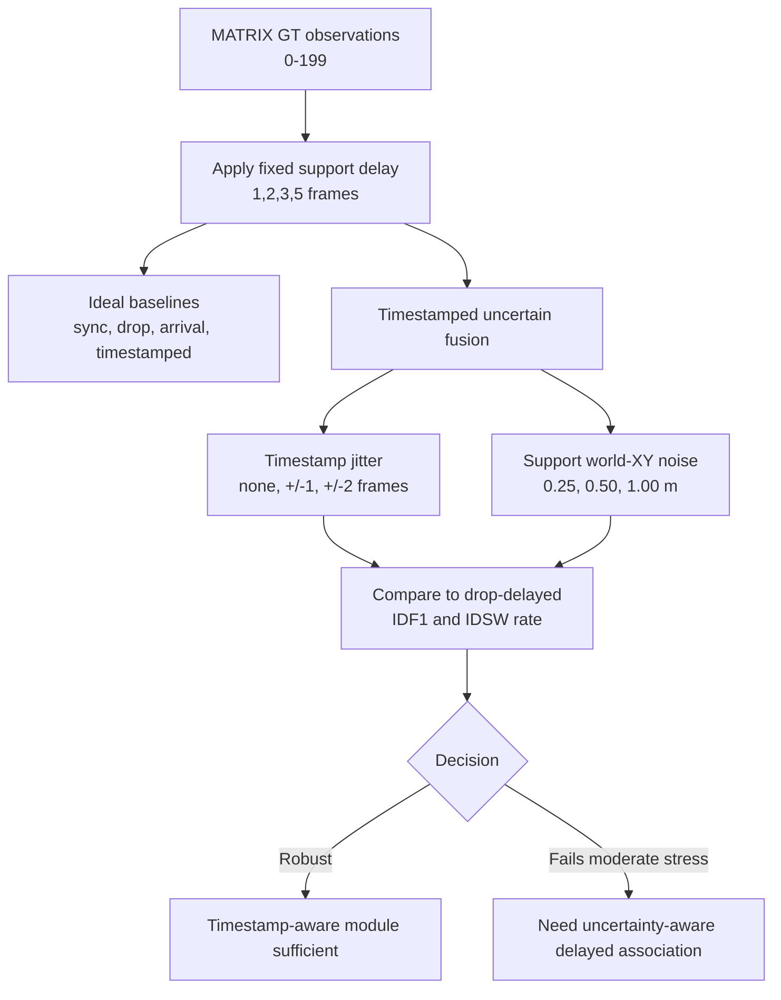

# exp_20260625_002_matrix_time_pose_uncertainty Analysis Report

## 1. 假设对照

**Hypothesis: partially rejected / redirected.** Zero uncertainty preserves
ideal timestamped fusion exactly (`IDF1=1.000000`, `IDSW=0`), but moderate
time/pose uncertainty fails the robustness rule. At `fixed_2`,
`jitter_pm1_noise_0.50m` reaches only `IDF1=0.066875` with IDSW rate
`408.875` per 1k GT, below drop-delayed (`IDF1=0.352500`, IDSW rate
`253.000`).

This supports the need for uncertainty-aware delayed association. Plain
timestamp-aware buffering is not enough under the tested uncertainty.

## 2. 基线比较

At `fixed_2`, the ordering changes from ideal:

```text
ideal timestamped = sync oracle > drop_delayed > timestamped_uncertain under moderate stress > arrival_time
```

The important point is not that uncertain timestamped is always worse than
arrival-time; it is that it falls below the safety baseline `drop_delayed`.
That means the fusion layer needs a rule for when not to trust a delayed
support observation.

## 3. 失败模式

Two failure channels are visible:

1. **Timing sensitivity:** `jitter_pm1_noise_0.00m` at `fixed_2` drops to
   `IDF1=0.131625`, even with no pose noise.
2. **Pose/world-coordinate sensitivity:** `jitter_none_noise_0.50m` drops to
   `IDF1=0.081250`, and 0.25m noise already reduces IDF1 to `0.316000`.

Event subsets show the same concentration pattern as earlier diagnostics. For
`fixed_2`, `jitter_pm1_noise_0.50m` has low IDF1 in proximity (`0.080000`),
crossing-like (`0.100681`), and high-motion (`0.075500`) rows.

## 4. 上限分析

The zero-uncertainty result confirms that the implementation still reaches the
GT upper bound. The gap is introduced by uncertainty, not by the tracker API or
by the added pipeline itself.

This creates a new method gap: the system needs to estimate whether a delayed
observation's timestamp/pose uncertainty is small enough for capture-time
association.

## 5. 泛化信号

The main design principle becomes:

> A timestamp is necessary but not sufficient. The fusion layer must also know
> how uncertain the timestamp and pose-derived world coordinate are.

A delayed support observation can be harmful in two ways:

- arrival-time use makes it stale;
- uncertain capture-time use can place it into the wrong time/space state.

## 6. 与历史对照

This result extends `exp_20260625_001_matrix_threshold_stability`. That run
showed a stable 2-frame harmful threshold for arrival-time fusion under ideal
world coordinates. This run shows that ideal timestamped fusion only remains
oracle when timestamp and pose/world-coordinate metadata are exact.

It also aligns with the old M3OT negative result: delayed observations are not
automatically useful. They need timing-aware and uncertainty-aware handling.

## 7. 下一步建议

1. **Implement uncertainty-aware gating.** A late support observation should be
   accepted only if its uncertainty-adjusted association cost is below a safe
   gate.
2. **Separate timing vs pose mechanisms.** Coarse frame-level jitter is severe;
   a follow-up can use sub-frame-equivalent spatial perturbations for more
   realistic timing errors.
3. **Keep drop-delayed as a safety baseline.** Any proposed uncertainty-aware
   method must beat drop-delayed under moderate uncertainty.

## 流程图

Source file:

```text
mermaid/exp_20260625_002_matrix_time_pose_uncertainty/time_pose_uncertainty_flow.mmd
```



## 补充说明

The timestamp jitter used here is frame-level (`-1/0/+1` or
`-2/-1/0/+1/+2`). It is intentionally a stress test, not a calibrated camera
clock model. The next experiment should either justify this as a worst-case
message-label error or replace it with a finer sub-frame-equivalent spatial
error model.
