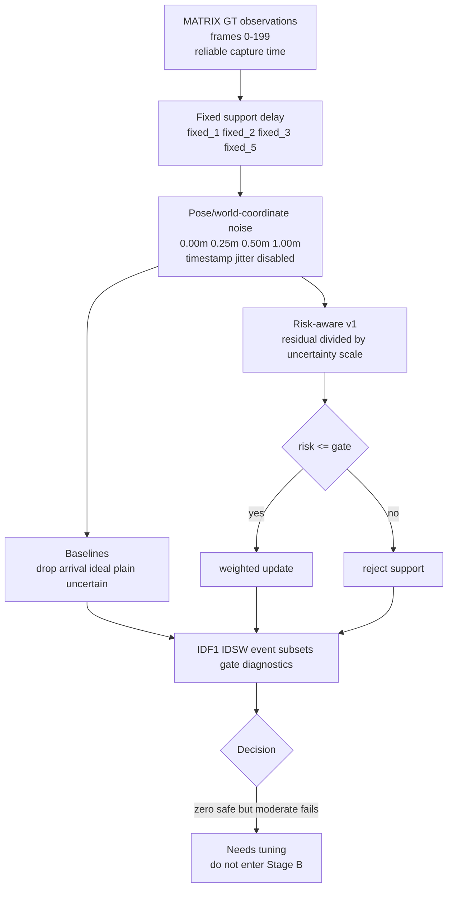

# exp_20260625_003_matrix_risk_aware_delayed_association Analysis Report

## 1. 假设对照

**Hypothesis: rejected for v1 / direction retained.** The zero-noise condition
passes exactly (`IDF1=1.000000`, `IDSW=0`), but the moderate stress condition
fails. At `fixed_2 + pose_noise_0.50m`, risk-aware delayed fusion reaches only
`IDF1=0.062125` and IDSW rate `431.875` per 1k GT. This is below both
drop-delayed (`IDF1=0.352500`) and plain timestamped uncertain fusion
(`IDF1=0.077125`, IDSW rate `354.875`).

The test rejects this specific residual/uncertainty-scale gate as a ready
method. It does not reject the broader need for uncertainty-aware association.

## 2. 基线比较

At `fixed_2 + pose_noise_0.50m`, the ordering is:

```text
ideal timestamped > drop_delayed > plain timestamped uncertain > risk-aware v1
```

This is worse than the intended ordering. Risk-aware v1 preserves the oracle
when noise is zero, but under noise it adds harmful updates rather than
filtering them.

## 3. 失败模式

The clearest failure is that higher declared uncertainty widens the gate. At
`fixed_2`, support accept rate increases from `0.885008` at `0.25m` noise to
`0.930780` at `0.50m` and `0.989899` at `1.00m`. This is mathematically
consistent with `risk = residual / uncertainty_scale`, but behaviorally unsafe:
more uncertain observations should not gain more authority.

Event subsets confirm the same failure. At `fixed_2 + 0.50m`, risk-aware v1 is
worse than plain uncertain fusion in proximity (`0.069752` vs `0.091405` IDF1),
crossing-like (`0.087067` vs `0.115428`), and support-only (`0.132372` vs
`0.197248`) rows.

## 4. 上限分析

The zero-noise result proves the pipeline can still reach the GT upper bound.
The performance gap is therefore introduced by the risk policy, not by broken
timestamp handling or output accounting.

The method gap is specific: uncertainty must be used to both explain residuals
and limit authority. A one-part normalized-distance gate is insufficient.

## 5. 泛化信号

The main design principle becomes:

> Uncertainty should not only make the gate wider; it must also make the
> observation less authoritative.

This matters for real deployment because pose/reprojection uncertainty will
not be rare. A method that accepts almost every observation at high uncertainty
will likely amplify identity pollution.

## 6. 与历史对照

This result is consistent with `exp_20260625_002_matrix_time_pose_uncertainty`:
plain timestamped fusion fails under pose/world noise. This run adds that a
naive risk gate also fails. It narrows the next method design: not just
timestamp-aware, and not just residual/scale gating.

It also matches the earlier M3OT negative lesson: delayed support observations
are not automatically useful. Fusion policy matters as much as timestamp
placement.

## 7. 下一步建议

1. **Redesign the risk policy as gate plus authority cap.** Keep candidate
   gating, but cap update weight as pose uncertainty grows.
2. **Add ambiguity margin.** A support observation should be trusted only when
   the best candidate is clearly better than the second-best candidate.
3. **Use event-aware conservatism.** Proximity, crossing-like, and high-motion
   subsets should trigger stricter authority limits.
4. **Do not enter Stage B yet.** The Stage A method has not passed the
   moderate-noise safety baseline.

## 流程图

Source file:

```text
mermaid/exp_20260625_003_matrix_risk_aware_delayed_association/risk_aware_delayed_association_flow.mmd
```



## 补充说明

The main run assumes reliable capture time. Timestamp jitter was intentionally
removed from the main stressor so that the failure can be attributed to
pose/reprojection uncertainty and the risk policy itself.
