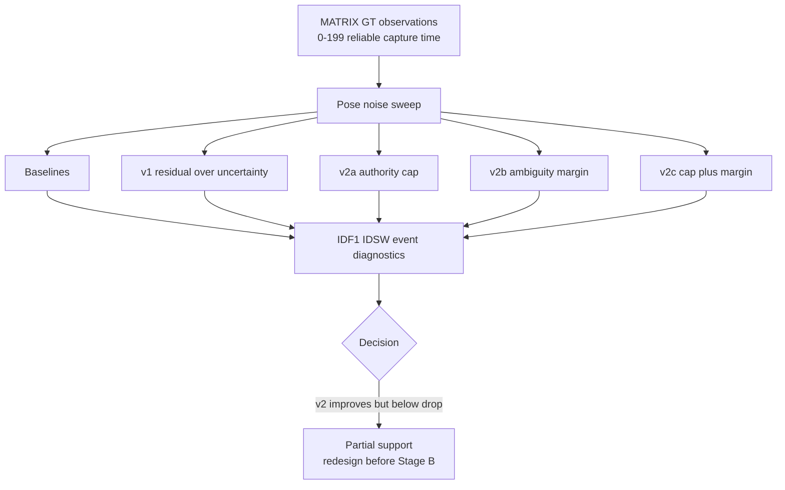

# exp_20260625_004_matrix_risk_aware_v2_ablation Analysis Report

## 1. 假设对照

**Hypothesis: partially supported / not accepted.** All v2 variants preserve
zero-noise oracle behavior. The authority-cap variants also improve clearly
over v1 under moderate pose noise. At `fixed_2 + pose_noise_0.50m`, v2c
reaches IDF1 `0.177625` and IDSW rate `204.375`, compared with v1 IDF1
`0.062125` and IDSW rate `431.875`.

The hypothesis is not fully accepted because v2c remains below drop-delayed
IDF1 `0.352500`. It improves the risk policy but does not yet pass the Stage A
safety baseline.

## 2. 基线比较

At the main decision point, the ranking is:

```text
ideal timestamped > drop_delayed > v2c > v2a > plain timestamped uncertain > v2b > v1
```

This ranking is informative. Authority cap is useful; ambiguity margin alone
is weak; cap plus margin is best. However, drop-delayed is still the stronger
IDF1 baseline.

## 3. 失败模式

The v2c gate rejects many more risky observations and lowers support authority:
accept rate drops from v1 `0.930780` to v2c `0.535385`, and mean final weight
drops from `0.610448` to `0.107077`. This reduces IDSW substantially.

The remaining failure is IDF1. Conservative gating protects identity but also
removes useful support evidence. In support-only rows, v2c IDF1 is `0.106815`,
below plain uncertain `0.197248`, although it reduces broader high-risk IDSW.

## 4. 上限分析

The zero-noise oracle remains intact for all variants, so the gap is not caused
by timestamp handling or metric accounting. The method gap is now narrower:
the system can reduce identity pollution, but cannot yet recover enough useful
identity/position evidence under noisy support observations.

## 5. 泛化信号

Two design principles are now supported:

1. **Authority cap is necessary.** Uncertainty must reduce support update
   strength; otherwise the gate admits too much pollution.
2. **Ambiguity control helps only when paired with authority control.** Margin
   alone does not solve the problem, but cap plus margin is the best variant.

## 6. 与历史对照

This extends `exp_20260625_003_matrix_risk_aware_delayed_association`. The
previous run showed v1 fails because uncertainty widens gates. This run shows
that correcting authority helps, but still does not beat drop-delayed IDF1.

It is also consistent with the broader M3OT/MATRIX lesson: delayed support is
useful only when fusion policy is selective and does not overrule identity
state too aggressively.

## 7. 下一步建议

1. **Analyze support-only failure.** v2c reduces IDSW but loses support-only
   IDF1; the next method must recover useful support evidence without strong
   identity rewrites.
2. **Separate identity update from position update.** Let noisy support improve
   recall or position softly while protecting identity assignment.
3. **Add candidate persistence.** Instead of immediate hard identity update,
   keep delayed support as provisional evidence until later primary or
   multi-view support confirms it.
4. **Do not enter Stage B yet.** Stage A still lacks a method that beats
   drop-delayed IDF1 under moderate pose noise.

## 流程图

Source file:

```text
mermaid/exp_20260625_004_matrix_risk_aware_v2_ablation/risk_v2_ablation_flow.mmd
```



## 补充说明

This experiment intentionally keeps reliable capture time and GT world
coordinates. It is still a Stage A method-design experiment, not a real
deployment validation.
