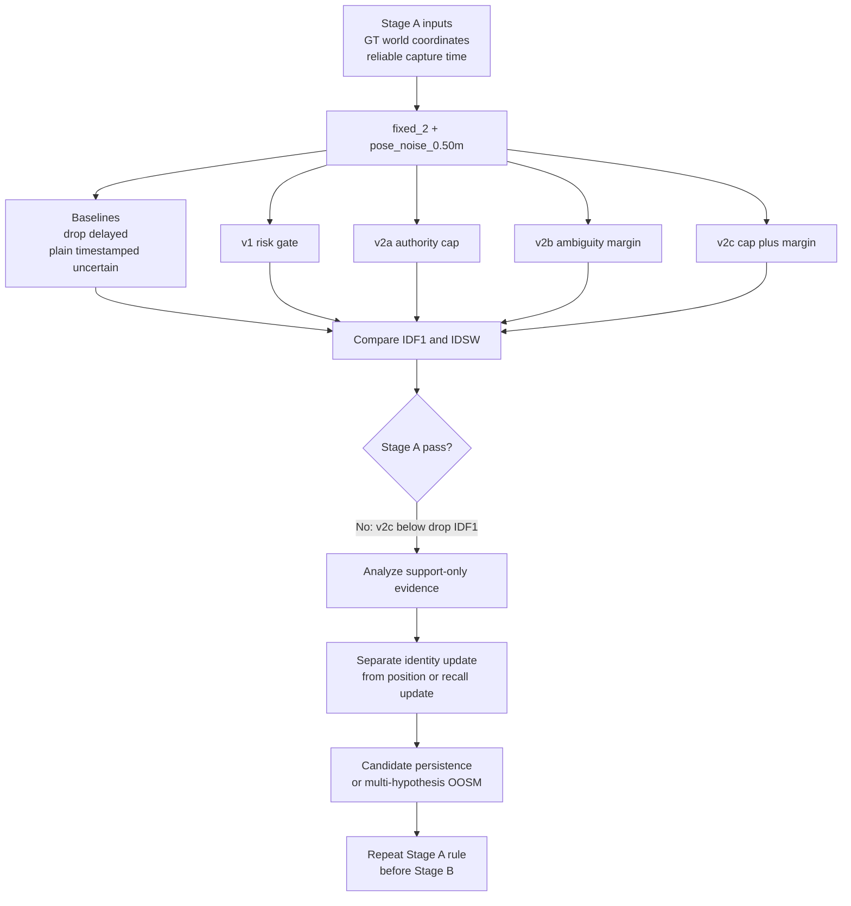

# exp_20260625_004_matrix_risk_aware_v2_ablation Enhanced Analysis

Analysis date: 2026-06-26

This report follows `summary_md/analysis_framework.md` and extends it with
three extra checks that are specific to this experiment:

- Gate behavior: candidate gate, ambiguity margin, authority cap.
- Event-subset behavior: proximity, crossing_like, high_motion, support_only,
  normal.
- Stage transition judgment: whether Stage A is strong enough to enter Stage B.

## 1. 假设对照

**Original hypothesis:** v1 failed because uncertainty widened the candidate
gate without reducing support authority. Adding authority cap and/or ambiguity
margin should preserve zero-noise oracle behavior and improve IDF1/IDSW under
moderate pose noise.

**Decision:** `partially supported`, but not accepted as a Stage A pass.

At the main decision point, `fixed_2 + pose_noise_0.50m`, all risk-aware
variants preserve zero-noise safety, but none passes the moderate-stress rule.

| Pipeline | IDF1 | IDSW/1k | vs drop IDF1 | vs plain IDF1 | Moderate pass |
| --- | ---: | ---: | ---: | ---: | ---: |
| risk_aware_delayed_fusion | 0.062125 | 431.875 | -0.290375 | -0.015000 | 0 |
| risk_aware_v2a_authority_cap | 0.139750 | 247.250 | -0.212750 | +0.062625 | 0 |
| risk_aware_v2b_ambiguity_margin | 0.071750 | 339.000 | -0.280750 | -0.005375 | 0 |
| risk_aware_v2c_cap_plus_margin | 0.177625 | 204.375 | -0.174875 | +0.100500 | 0 |

The effect direction is meaningful: v2a and v2c improve over v1 and plain
timestamped uncertain fusion, and v2c lowers IDSW below drop-delayed. The
effect is still not enough because v2c IDF1 remains `0.174875` below
drop-delayed IDF1 `0.352500`.

Confounders are controlled tightly for Stage A: reliable capture time, GT
world coordinates, no detector noise, no ReID noise, no local tracker ID
switches. The failure is therefore attributable to the current delayed
association/update policy, not to camera projection or detector behavior.

## 2. 基线比较

At `fixed_2 + pose_noise_0.50m`, the full ranking by IDF1 is:

```text
sync_oracle = timestamped_pose_fusion
> drop_delayed
> risk_aware_v2c_cap_plus_margin
> risk_aware_v2a_authority_cap
> timestamped_uncertain_fusion
> risk_aware_v2b_ambiguity_margin
> risk_aware_delayed_fusion
> arrival_time_fusion
```

| Pipeline | IDF1 | IDSW/1k | Notes |
| --- | ---: | ---: | --- |
| sync_oracle | 1.000000 | 0.000 | GT upper bound |
| timestamped_pose_fusion | 1.000000 | 0.000 | zero-uncertainty timestamped oracle |
| drop_delayed | 0.352500 | 253.000 | safety baseline |
| risk_aware_v2c_cap_plus_margin | 0.177625 | 204.375 | best v2, lower IDSW than drop |
| risk_aware_v2a_authority_cap | 0.139750 | 247.250 | authority cap alone is useful |
| timestamped_uncertain_fusion | 0.077125 | 354.875 | plain uncertain timestamped fusion |
| risk_aware_v2b_ambiguity_margin | 0.071750 | 339.000 | margin alone is weak |
| risk_aware_delayed_fusion | 0.062125 | 431.875 | v1 failure mode remains |
| arrival_time_fusion | 0.052875 | 617.625 | stale arrival-time failure baseline |

The notable non-obvious result is that v2c beats drop-delayed on IDSW rate but
not on IDF1. This means the method is suppressing some wrong identity rewrites,
yet it is still not preserving or recovering enough useful identity evidence.

## 3. 失败模式

The main failure is not "too many ID switches" anymore. V2c reduces IDSW from
plain timestamped uncertain `354.875` to `204.375` per 1k GT and also beats
drop-delayed IDSW `253.000`. The remaining failure is IDF1: useful support
evidence is either rejected, downweighted too strongly, or attached without
enough persistent identity benefit.

Gate behavior at `fixed_2 + pose_noise_0.50m`:

| Pipeline | Accept rate | Candidate rejects | Margin rejects | Mean final weight |
| --- | ---: | ---: | ---: | ---: |
| v1 | 0.930780 | 3262 | 0 | 0.610448 |
| v2a authority cap | 0.873570 | 5958 | 0 | 0.174714 |
| v2b ambiguity margin | 0.413687 | 5093 | 22537 | 0.304160 |
| v2c cap plus margin | 0.535385 | 6338 | 15557 | 0.107077 |

Interpretation:

- V1 admits too much noisy support and gives it too much update authority.
- V2a fixes authority and is the main positive component.
- V2b margin alone rejects many observations but does not recover IDF1.
- V2c has the best safety behavior, but its mean final weight `0.107077` is so
  low that support-only evidence remains weak.

Event subsets at `fixed_2 + pose_noise_0.50m`:

| Subset | Plain IDF1 / IDSW | V2c IDF1 / IDSW | Drop IDF1 / IDSW | Interpretation |
| --- | ---: | ---: | ---: | --- |
| proximity | 0.091405 / 2061 | 0.180661 / 1294 | 0.334215 / 1723 | v2c lowers IDSW, still low IDF1 |
| crossing_like | 0.115428 / 1105 | 0.197958 / 777 | 0.315655 / 1122 | same pattern, margin helps when paired with cap |
| high_motion | 0.082500 / 975 | 0.193500 / 558 | 0.370500 / 519 | v2c near drop IDSW, far below drop IDF1 |
| support_only | 0.197248 / 585 | 0.106815 / 764 | 0.036042 / 1431 | v2c loses useful support-only evidence |
| normal | 0.155769 / 363 | 0.325000 / 104 | 0.588462 / 58 | v2c improves but still below drop |

Failure classification:

- **ID pollution is reduced**: v2c consistently lowers IDSW versus plain
  uncertain fusion.
- **Identity evidence is underused**: support-only IDF1 is worse than plain
  uncertain fusion.
- **Behavior is not a threshold-only issue**: v2c already combines the strongest
  tested gate and downweighting mechanisms, but still misses the drop-delayed
  IDF1 target.

## 4. 上限分析

The theoretical Stage A upper bound is still intact:

```text
sync_oracle IDF1 = 1.000000
timestamped_pose_fusion IDF1 = 1.000000
```

V2c is far from this upper bound:

```text
oracle - v2c IDF1 = 0.822375
drop_delayed - v2c IDF1 = 0.174875
```

This is method headroom, not data headroom. The same observations produce an
oracle result when uncertainty is absent. Under noise, the current nearest-track
update policy can reduce damage but cannot recover identity continuity. The
next method must change how support evidence is represented and applied, not
just alter scalar thresholds.

The strongest positive upper-bound signal is IDSW:

```text
v2c IDSW/1k = 204.375
drop_delayed IDSW/1k = 253.000
plain uncertain IDSW/1k = 354.875
```

So the project should keep the authority cap and ambiguity margin ideas. The
missing piece is preserving useful delayed evidence without forcing an
immediate hard identity update.

## 5. 泛化信号

Three design principles survive this analysis:

1. **Capture time is necessary but not sufficient.** Zero uncertainty works, but
   noisy timestamped support can still underperform the drop-delayed safety
   baseline.
2. **Uncertainty must lower support authority.** V2a and v2c show that authority
   cap is the useful component. A gate that only widens with uncertainty is
   unsafe.
3. **Ambiguity control is useful only with authority control.** Margin alone
   rejects many observations and still has weak IDF1. Cap plus margin is the
   best tested combination.

These principles should transfer to later Stage B/C/D settings because camera
projection, detector boxes, and ReID tracklets will all add more uncertainty,
not less.

## 6. 与历史对照

This experiment extends the Stage A chain:

- `exp_20260625_001`: harmful delay threshold is stable at 2 frames.
- `exp_20260625_002`: plain timestamped fusion fails under timestamp/pose
  uncertainty.
- `exp_20260625_003`: v1 risk-aware gate preserves zero-noise oracle but fails
  because uncertainty widens acceptance without reducing authority.
- `exp_20260625_004`: v2 authority cap plus ambiguity margin improves IDF1 and
  IDSW, but still fails the drop-delayed IDF1 rule.

There is no contradiction with the earlier M3OT negative result. Both M3OT and
MATRIX show that delayed support is not automatically beneficial. The specific
failure mechanism differs:

- M3OT Backfill/ReID failure: delayed support can inject identity errors through
  feature or association ambiguity.
- MATRIX Stage A failure: noisy world-coordinate support can be made safer, but
  nearest-track updates still cannot recover enough identity continuity.

## 7. 下一步建议

1. **High priority: support-only failure audit.**
   Validate why v2c support-only IDF1 `0.106815` is below plain uncertain
   `0.197248`. Use trace rows and gate diagnostics to separate three cases:
   useful observation rejected, useful observation accepted but too weak, or
   support creates a new track without later primary confirmation.

2. **High priority: split identity update from position/recall update.**
   Let noisy support update position, visibility, or candidate existence without
   immediately rewriting the global identity state. Pass condition remains the
   same: beat drop-delayed IDF1 under `fixed_2 + pose_noise_0.50m` while keeping
   IDSW below plain uncertain fusion.

3. **Medium priority: candidate persistence or multi-hypothesis delayed state.**
   Store delayed support as provisional evidence across a short horizon instead
   of forcing one nearest-track decision at arrival/capture processing time.
   This should especially target support-only rows where immediate hard updates
   are underpowered or unsafe.

4. **Low priority until Stage A passes: Stage B camera projection.**
   Do not move to GT bbox plus camera projection yet. Stage B would add
   projection uncertainty before the Stage A association mechanism is good
   enough to use noisy support safely.

## 流程图

Existing source flowchart:

```text
mermaid/exp_20260625_004_matrix_risk_aware_v2_ablation/risk_v2_ablation_flow.mmd
```

Enhanced analysis flow:



## 补充说明

The existing quick analysis file remains useful as a short handoff:

```text
summary_md/experiments/2026-6-25/exp_20260625_004_matrix_risk_aware_v2_ablation_analysis.md
```

This enhanced report should be treated as the working analysis package for
designing the next Stage A method. It intentionally does not propose detector,
ReID, local tracker, or camera-projection work, because the Stage A pass rule is
still unmet.
