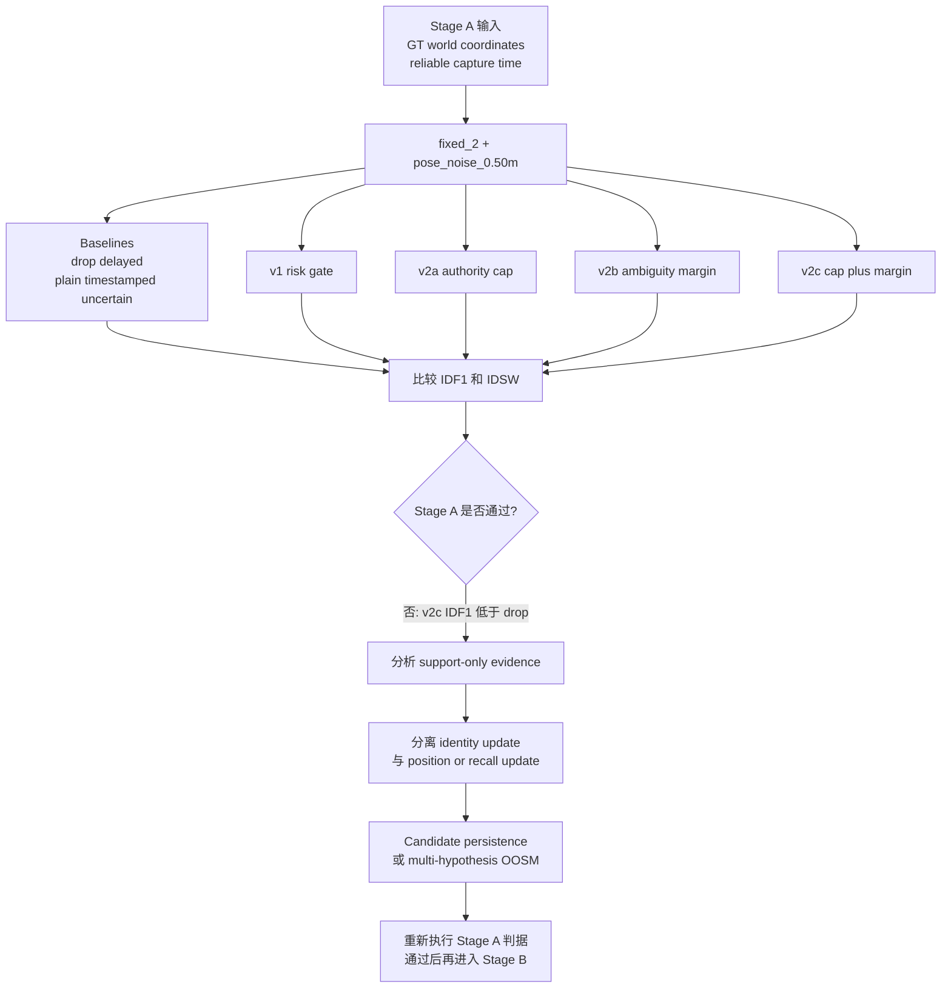

# exp_20260625_004_matrix_risk_aware_v2_ablation 增强版中文分析

分析日期：2026-06-26

本报告基于 `summary_md/analysis_framework.md` 的 7 维度实验分析框架，并针对本实验额外加入三类检查：

- 门控行为：candidate gate、ambiguity margin、authority cap。
- 事件子集行为：proximity、crossing_like、high_motion、support_only、normal。
- 阶段转向判断：当前 Stage A 是否足够支撑进入 Stage B。

## 1. 假设对照

**原始假设：** v1 失败的主要原因是 uncertainty 只放宽了 candidate gate，却没有降低 support observation 对状态更新的权威性。因此，加入 authority cap 和/或 ambiguity margin 后，应当在保住 zero-noise oracle 的同时，在中等 pose noise 下改善 IDF1/IDSW。

**判定：** `部分支持`，但不能接受为 Stage A 通过结果。

在主判据 `fixed_2 + pose_noise_0.50m` 下，所有 risk-aware 变体都保住了 zero-noise 安全性，但没有任何一个变体通过 moderate-stress 判据。

| Pipeline | IDF1 | IDSW/1k | 相对 drop IDF1 | 相对 plain IDF1 | Moderate pass |
| --- | ---: | ---: | ---: | ---: | ---: |
| risk_aware_delayed_fusion | 0.062125 | 431.875 | -0.290375 | -0.015000 | 0 |
| risk_aware_v2a_authority_cap | 0.139750 | 247.250 | -0.212750 | +0.062625 | 0 |
| risk_aware_v2b_ambiguity_margin | 0.071750 | 339.000 | -0.280750 | -0.005375 | 0 |
| risk_aware_v2c_cap_plus_margin | 0.177625 | 204.375 | -0.174875 | +0.100500 | 0 |

结果方向是有意义的：v2a 和 v2c 相比 v1、plain timestamped uncertain fusion 都有提升，并且 v2c 的 IDSW 已低于 drop-delayed。问题是效果量仍不够：v2c IDF1 仍比 drop-delayed IDF1 `0.352500` 低 `0.174875`。

本实验的混淆变量控制较紧：capture time 可靠、使用 GT world coordinate、无 detector noise、无 ReID noise、无 local tracker ID switch。因此失败主要应归因于当前 delayed association/update policy，而不是 camera projection 或 detector 行为。

## 2. 基线比较

在 `fixed_2 + pose_noise_0.50m` 下，按 IDF1 排序如下：

```text
sync_oracle = timestamped_pose_fusion
> drop_delayed
> risk_aware_v2c_cap_plus_margin
> risk_aware_v2a_authority_cap
> timestamped_uncertain_fusion
> risk_aware_v2b_ambiguity_margin
> risk_aware_delayed_fusion
> arrival_time_fusion
```

| Pipeline | IDF1 | IDSW/1k | 说明 |
| --- | ---: | ---: | --- |
| sync_oracle | 1.000000 | 0.000 | GT 上界 |
| timestamped_pose_fusion | 1.000000 | 0.000 | zero-uncertainty timestamped oracle |
| drop_delayed | 0.352500 | 253.000 | 安全基线 |
| risk_aware_v2c_cap_plus_margin | 0.177625 | 204.375 | 最好 v2，IDSW 低于 drop |
| risk_aware_v2a_authority_cap | 0.139750 | 247.250 | authority cap 单独有效 |
| timestamped_uncertain_fusion | 0.077125 | 354.875 | plain uncertain timestamped fusion |
| risk_aware_v2b_ambiguity_margin | 0.071750 | 339.000 | margin 单独较弱 |
| risk_aware_delayed_fusion | 0.062125 | 431.875 | v1 失败模式仍存在 |
| arrival_time_fusion | 0.052875 | 617.625 | stale arrival-time 失败基线 |

最值得注意的反直觉结果是：v2c 的 IDSW rate 已经优于 drop-delayed，但 IDF1 仍落后。这说明方法确实压住了一部分错误身份改写，但仍没有保留或恢复足够的有效身份信息。

## 3. 失败模式

当前主要失败不再是“ID switch 太多”。v2c 将 IDSW 从 plain timestamped uncertain 的 `354.875` 降到 `204.375` per 1k GT，并且也低于 drop-delayed 的 `253.000`。剩下的主要失败是 IDF1：有效 support evidence 被拒绝、被过度降权，或被接受后没有形成足够稳定的 identity benefit。

`fixed_2 + pose_noise_0.50m` 下的 gate 行为：

| Pipeline | Accept rate | Candidate rejects | Margin rejects | Mean final weight |
| --- | ---: | ---: | ---: | ---: |
| v1 | 0.930780 | 3262 | 0 | 0.610448 |
| v2a authority cap | 0.873570 | 5958 | 0 | 0.174714 |
| v2b ambiguity margin | 0.413687 | 5093 | 22537 | 0.304160 |
| v2c cap plus margin | 0.535385 | 6338 | 15557 | 0.107077 |

解释：

- v1 接受了过多 noisy support，并且给了它们过高的 update authority。
- v2a 修正了 support authority，是本轮最关键的正向组件。
- v2b 单独使用 margin 会拒绝大量观测，但不能有效恢复 IDF1。
- v2c 的安全性最好，但 mean final weight 只有 `0.107077`，support-only evidence 仍然偏弱。

`fixed_2 + pose_noise_0.50m` 下的事件子集：

| Subset | Plain IDF1 / IDSW | V2c IDF1 / IDSW | Drop IDF1 / IDSW | 解释 |
| --- | ---: | ---: | ---: | --- |
| proximity | 0.091405 / 2061 | 0.180661 / 1294 | 0.334215 / 1723 | v2c 降低 IDSW，但 IDF1 仍低 |
| crossing_like | 0.115428 / 1105 | 0.197958 / 777 | 0.315655 / 1122 | 同样模式；margin 与 cap 配合后有效 |
| high_motion | 0.082500 / 975 | 0.193500 / 558 | 0.370500 / 519 | v2c IDSW 接近 drop，但 IDF1 差距大 |
| support_only | 0.197248 / 585 | 0.106815 / 764 | 0.036042 / 1431 | v2c 损失了有用的 support-only evidence |
| normal | 0.155769 / 363 | 0.325000 / 104 | 0.588462 / 58 | v2c 有改善，但仍低于 drop |

失败模式分类：

- **ID pollution 已被减少**：v2c 相比 plain uncertain fusion 稳定降低 IDSW。
- **Identity evidence 使用不足**：support-only IDF1 反而低于 plain uncertain fusion。
- **这不是单纯调阈值问题**：v2c 已经组合了本轮最强的 gate 与 downweighting 机制，但仍未达到 drop-delayed IDF1。

## 4. 上限分析

Stage A 的理论上界仍然完整：

```text
sync_oracle IDF1 = 1.000000
timestamped_pose_fusion IDF1 = 1.000000
```

v2c 距离上界仍很远：

```text
oracle - v2c IDF1 = 0.822375
drop_delayed - v2c IDF1 = 0.174875
```

这属于方法空间的 headroom，而不是数据空间的 headroom。同一批观测在无 uncertainty 时可以达到 oracle；加入 pose noise 后，当前 nearest-track update policy 能减少伤害，但不能恢复足够的 identity continuity。下一步需要改变 support evidence 的表达和应用方式，而不是继续只调 scalar threshold。

最强的正向上限信号来自 IDSW：

```text
v2c IDSW/1k = 204.375
drop_delayed IDSW/1k = 253.000
plain uncertain IDSW/1k = 354.875
```

因此，authority cap 和 ambiguity margin 应该保留。缺失的是：如何在不立即执行 hard identity update 的情况下，保存并利用有价值的 delayed evidence。

## 5. 泛化信号

本轮分析保留下来三条设计原则：

1. **Capture time 是必要条件，但不是充分条件。** Zero uncertainty 下有效，但 noisy timestamped support 仍可能低于 drop-delayed safety baseline。
2. **Uncertainty 必须降低 support authority。** v2a 和 v2c 说明 authority cap 是有效组件。只随 uncertainty 放宽 gate 的策略是不安全的。
3. **Ambiguity control 只有与 authority control 配合时才明显有效。** Margin 单独使用会拒绝很多观测，但 IDF1 仍弱；cap plus margin 是当前测试过的最好组合。

这些原则应当能迁移到后续 Stage B/C/D，因为 camera projection、detector bbox、ReID tracklet 都只会引入更多 uncertainty，而不是更少。

## 6. 与历史对照

本实验延续了 Stage A 的实验链：

- `exp_20260625_001`：有害延迟阈值稳定在 2 帧。
- `exp_20260625_002`：plain timestamped fusion 在 timestamp/pose uncertainty 下失败。
- `exp_20260625_003`：v1 risk-aware gate 保住 zero-noise oracle，但因 uncertainty 扩大接受范围且不降低 authority 而失败。
- `exp_20260625_004`：v2 authority cap plus ambiguity margin 改善 IDF1 和 IDSW，但仍未通过 drop-delayed IDF1 规则。

这与早期 M3OT negative result 不矛盾。M3OT 和 MATRIX 都说明 delayed support 不是天然有益。区别在于失败机制不同：

- M3OT Backfill/ReID 失败：delayed support 会通过 feature 或 association ambiguity 注入身份错误。
- MATRIX Stage A 失败：noisy world-coordinate support 可以变得更安全，但 nearest-track update 仍不能恢复足够的 identity continuity。

## 7. 下一步建议

1. **高优先级：support-only failure audit。**
   解释为什么 v2c support-only IDF1 `0.106815` 低于 plain uncertain `0.197248`。用 trace rows 和 gate diagnostics 区分三类情况：有用观测被拒绝、有用观测被接受但权重过低、support 创建了新 track 但后续没有 primary confirmation。

2. **高优先级：分离 identity update 与 position/recall update。**
   允许 noisy support 软更新位置、可见性或 candidate existence，但不要立即改写 global identity state。通过条件保持不变：在 `fixed_2 + pose_noise_0.50m` 下 IDF1 超过 drop-delayed，同时 IDSW 低于 plain uncertain fusion。

3. **中优先级：candidate persistence 或 multi-hypothesis delayed state。**
   将 delayed support 暂存为短时间窗口内的 provisional evidence，而不是在 arrival/capture processing time 立刻做一次 nearest-track hard decision。这个方向尤其应针对 support-only rows。

4. **低优先级，Stage A 通过前不要做：Stage B camera projection。**
   暂不进入 GT bbox plus camera projection。Stage B 会额外加入 projection uncertainty，而当前 Stage A association mechanism 还没有证明能安全利用 noisy support。

## 流程图

已有源流程图：

```text
mermaid/exp_20260625_004_matrix_risk_aware_v2_ablation/risk_v2_ablation_flow.mmd
```

增强分析流程：



## 补充说明

已有英文增强分析位于：

```text
summary_md/experiments/2026-6-25/exp_20260625_004_matrix_risk_aware_v2_ablation_analysis_results/enhanced_analysis.md
```

本中文版本与英文版结论一致，但表达上更适合作为后续实验设计的中文 handoff。它有意不提出 detector、ReID、local tracker 或 camera-projection 工作，因为 Stage A 的通过条件仍未满足。
