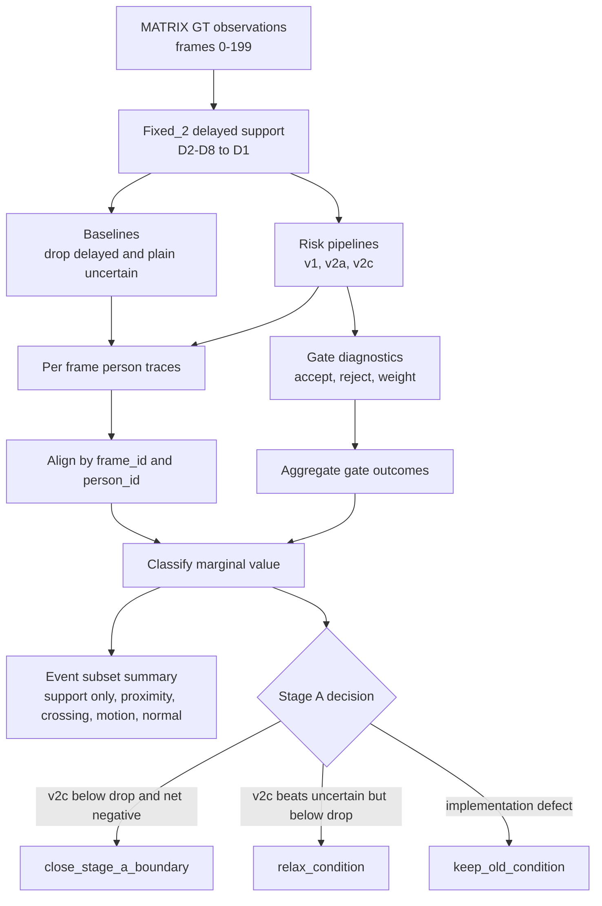

# exp_20260626_001_matrix_support_marginal_value_audit Analysis Report

## 1. 假设对照

**结论：supported。** 本轮假设不是证明 v2c 能超过
`drop_delayed`，而是验证在“两阶段 + GT identity + noisy
world-coordinate support”框架内，support observation 的边际收益是否足以抵消坐标噪声。
结果支持“净收益不足”的判断。

关键证据：

- v2c 在全部噪声下都低于 `drop_delayed` IDF1：`0.25m` 为
  `0.153250` vs `0.352500`，`0.50m` 为 `0.177625` vs `0.352500`，
  `1.00m` 为 `0.286125` vs `0.352500`。
- v2c 在 `0.50m` 和 `1.00m` 下优于 plain uncertain，说明 gate 不是完全无效；
  但它只能减少污染，不能把 support 的净 IDF1 提升到安全基线以上。
- 三档噪声合计，v2c 的局部归因净值为 `helpful - harmful - weak/reject = -5615`。

混淆变量较少：本轮没有 camera projection、detector、ReID 或 local tracker 噪声；
capture time 可靠；主变量是 support world-coordinate 噪声和 gate 机制。

## 2. 基线比较

主判据 `fixed_2 + pose_noise_0.50m` 的排序是：

```text
drop_delayed > v2c > v2a > plain timestamped uncertain > v1
```

对应指标：

| Pipeline | IDF1 | IDSW/1k |
| --- | ---: | ---: |
| drop_delayed | 0.352500 | 253.000000 |
| risk_aware_v2c_cap_plus_margin | 0.177625 | 204.375000 |
| risk_aware_v2a_authority_cap | 0.139750 | 247.250000 |
| timestamped_uncertain_fusion | 0.077125 | 354.875000 |
| risk_aware_delayed_fusion | 0.062125 | 431.875000 |

排序含义：

- `drop_delayed` 仍是 IDF1 最强的安全基线。
- v2c 的 IDSW/1k `204.375` 低于 `drop_delayed` 的 `253.000`，说明 cap+margin 能降低身份污染。
- v2c 的 IDF1 仍低，说明降低污染和恢复身份连续性是两个不同问题。

## 3. 失败模式

主要失败模式是 **support 边际信息不足 + 噪声成本过高**。

分场景看，v2c 在 `support_only` 中确实有 useful evidence，但不足以抵消其他成本：

| Pose noise | Event subset | Helpful | Harmful | Weak/reject | Net |
| ---: | --- | ---: | ---: | ---: | ---: |
| 0.25 | support_only | 647 | 208 | 666 | -227 |
| 0.50 | support_only | 708 | 274 | 537 | -103 |
| 1.00 | support_only | 145 | 210 | 1171 | -1236 |

高风险场景下，v2c 更常表现为“拒绝或弱化污染”，而不是恢复 IDF1：

- `0.50m proximity`: helpful `1989`，harmful `648`，weak/reject `3178`，net `-1837`。
- `0.50m crossing_like`: helpful `1125`，harmful `380`，weak/reject `1902`，net `-1157`。
- `0.50m high_motion`: helpful `759`，harmful `317`，weak/reject `799`，net `-357`。

因此失败不是 v2c 完全不会识别风险，而是 geometry-only support 在 GT identity
框架里没有足够新增信息。gate 越保守，越能降低 IDSW，但也越容易放弃本来可能有用的
support-only 证据。

## 4. 上限分析

当前最好结果仍离理想 GT 上界很远。历史实验中 zero-noise timestamped fusion 可达
IDF1 `1.000000` / IDSW `0`；本轮噪声下 v2c 最高 IDF1 为 `0.286125`，
仍低于 `drop_delayed` 的 `0.352500`。

这个差距不应继续归因于简单 gate 参数：

- v1 说明“只用 residual/uncertainty gate”会因为不确定性变大而扩大候选污染。
- v2a/v2c 说明 authority cap 和 ambiguity margin 能修复一部分污染。
- 本轮审计说明，即使修复污染，support 的新增 identity 信息仍不足。

可改进空间更可能来自机制变化，而不是阈值微调：appearance cue、identity/position
separation、multi-hypothesis association 或历史重放。

## 5. 泛化信号

本轮产生三个可迁移原则：

1. **drop-delayed 是安全基线，不是 geometry-only support 必须超过的理论下界。**
   当主视角已有稳定 GT identity 时，support 的边际身份信息可能接近零。
2. **降低 IDSW 不等于恢复 IDF1。** v2c 能压低 plain uncertain 的 IDSW，但仍无法恢复
   足够 identity continuity。
3. **support-only 是下一阶段的关键分歧点。** 如果下一轮加入 appearance 或身份/位置解耦，
   首先应检查它是否提升 support-only 的 helpful 比例，而不是只看 aggregate IDF1。

## 6. 与历史对照

本轮与 `exp_20260625_004_matrix_risk_aware_v2_ablation` 一致：

- v2c 仍是当前最佳 risk-aware 变体。
- v2c 在 `fixed_2 + pose_noise_0.50m` 下继续优于 plain uncertain，
  IDF1 从 `0.077125` 提到 `0.177625`，IDSW/1k 从 `354.875` 降到 `204.375`。
- v2c 仍低于 `drop_delayed` IDF1 `0.352500`。

本轮新增的是归因证据：v2c 失败不只是某个阈值没调好，而是 helpful support 的净值没有
覆盖 harmful accept 与 over-reject/underweight 成本。

这也与 2026-06-26 文献调研一致：两阶段方法中的 support view 往往是辅助角色，
如果单视角/GT identity 已经给出身份主线，geometry-only support 很难单独成为主要增益源。

## 7. 下一步建议

1. **P0：修改 Stage A 转向条件。**
   具体操作：把“risk-aware IDF1 必须超过 drop-delayed”改为
   “在保持 zero-noise oracle safety 前提下，量化 noisy support 的 harm boundary；
   若方法优于 plain uncertain 但低于 drop-delayed，则作为边界结果通过 Stage A”。
   成功标准：`current_experiment_stage.md` 和路线图说明 drop-delayed 是 safety baseline，
   不再是 geometry-only gate 的必达 IDF1 下界。

2. **P0：停止 v2 标量阈值 sweep。**
   具体操作：保留 v2c 作为 geometry-only 最强 baseline，后续只在机制变化时复用它。
   预期结果：避免把研究资源投入到理论信息增益不足的方向。
   失败标准：如果后续只调 `sigma_ref`、`margin_threshold` 或 `absolute_gate_cap`
   而没有新增信息源，则不应作为主线实验。

3. **P1：设计 appearance-augmented support risk gate。**
   具体操作：在 Stage A 保持 GT world-coordinate 主线的同时，为 support observation
   增加 appearance/reID 或 GT identity-simulated cue，验证它是否提升
   `support_only` helpful rate。
   成功标准：在 `fixed_2 + pose_noise_0.50m` 下，support-only net 转正，并且 aggregate
   IDF1 不低于 v2c，同时 IDSW/1k 不高于 plain uncertain。

4. **P1：做 identity/position update separation。**
   具体操作：让 noisy support 只提供位置/存在性弱证据，不直接强改 identity state；
   identity 需要 primary 或多线索确认。
   成功标准：v2c 的 weak/reject 成本下降，normal 场景 IDF1 不明显下降，
   proximity/crossing_like IDSW 保持低于 plain uncertain。

5. **P2：Stage B/C 改为 harm-boundary measurement。**
   具体操作：引入 projection error 和 detector noise 时，不再预设 geometry-only gate 会超过
   drop-delayed，而是测量噪声源如何移动 harm threshold。
   成功标准：输出每类噪声对应的安全/伤害边界，并判断是否必须进入 multi-cue fusion。

## 流程图

Source file:

```text
mermaid/exp_20260626_001_matrix_support_marginal_value_audit/support_marginal_value_flow.mmd
```



## 补充说明

本轮 per-row marginal category 是局部 identity-continuity attribution proxy，
不是严格因果反事实证明。它足以回答当前决策问题：在现有框架里，support 净收益没有稳定覆盖
噪声成本，因此 Stage A 不应继续以 geometry-only gate 超过 `drop_delayed` 为核心目标。
