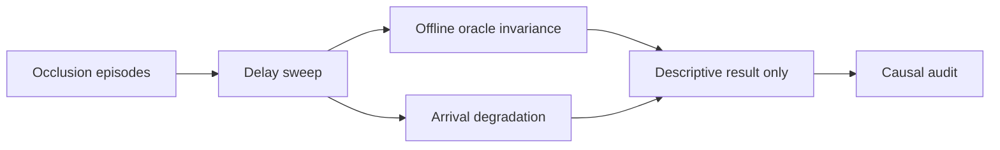

# exp_20260630_002 分析报告

## 1. 假设对照

**结论：supported，但仅限描述性假设。** Offline timestamped 在六档 delay 的遮挡 IDF1 均为 1.0；arrival 在 500 ms 为 0.990，1000 ms 断崖降至 0.197。不能从非因果 oracle 推导在线阈值。

## 2. 基线比较

排序为 `sync = offline timestamped > arrival > primary-only`。Primary-only 遮挡 IDF1 为 0.036。500 ms arrival 基本达到上界，1000 ms 后不再稳定。

## 3. 失败模式

消息按时到达比例从 1.000 降到 0.531，但 arrival IDF1 并非单调，说明结果同时受历史状态和错误关联影响。primary-visible 输出是遮挡后 spillover，不是一般 non-occlusion staleness。

## 4. 上限分析

Offline timestamped 始终达到 1.0，证明 support 最终信息充分；在线缺口来自可用时间，而不是 zero-noise 坐标质量。

## 5. 泛化信号

延迟必须同时用毫秒和相对遮挡进度描述。`rho_remaining` 只能用于事后机制分析，不能直接作为实时 gate 输入。

## 6. 与历史对照

结果复现 exp_001 的 1000 ms arrival 退化，同时修复 person 6/frame 0 单帧事件遗漏。`7999` prediction 偏差不再由 observation filter 引入。

## 7. 下一步建议

- P0：运行 causal rollback/replay，冻结已经发布的在线输出。
- P1：扩展数据后用 joint model 分离 `rho` 和 `delay_ms`。
- P2：在因果边界稳定后加入 pose noise 与 `v*delay/gate_radius`。

## 流程图

来源：`mermaid/exp_20260630_002_matrix_occlusion_delay_ratio_audit/delay_ratio_flow.mmd`

