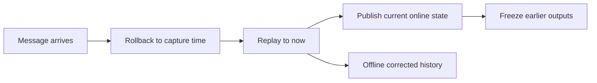

# exp_20260630_003 分析报告

## 1. 假设对照

**结论：部分支持。** Causal online 遮挡 IDF1 从 500 ms 的 0.990 降至 5000 ms 的 0.184，方向符合预期；但现有结果不支持 ratio-only boundary。即使同处 `rho<0.25`，500 ms 的 episode continuity 为 0.996，1000 ms 仅为 0.388，绝对延迟或 tracker 的离散状态转移仍有强独立作用。

## 2. 基线比较

所有非零 delay 下均为 `offline corrected > causal online > primary-only`。Offline corrected 六档均为 1.0，因果实现没有污染离线上界。1000 ms 时 causal replay 遮挡 IDF1 `0.393`，高于 arrival-time 的 `0.197` 和 primary-only 的 `0.036`，说明 capture-time replay 在主视角遮挡场景中有实质在线价值。

## 3. 失败模式

主要 cliff 位于 500 ms 到 1000 ms：遮挡 IDF1 下降 0.597，IDSW 从 20 增至 796。59 个 continuity-eligible episodes 中，post-ID survival 从 500 ms 的 1.000 降至 1000 ms 的 0.153，1500 ms 后约为 0.03-0.05。与此同时，长遮挡中 1000 ms 仍有约 91% 的消息在遮挡结束前到达，因此“是否在 episode 结束前到达”不足以解释 cliff。

一个重要替代解释是 rollback 后的 track-ID 稳定性：当前原型恢复 capture-time snapshot 后重新执行关联，新 support 可能改变 track 创建与编号顺序。此时测到的部分 IDSW 是 OOSM replay 的身份命名变化，不一定完全是通信延迟本身造成的不可恢复伤害。

## 4. 上限分析

5000 ms 时 causal online 与 offline corrected 相差 0.816，说明大部分信息仍可事后修复，但已错过在线输出时机。Causal online 在 5000 ms 下仍高于 primary-only `0.148` IDF1，因而现有数据不支持“rho>=1 后 support 完全无在线价值”的硬边界。

## 5. 泛化信号

在线指标和 offline-corrected 指标必须分开报告。单一“timestamped fusion”会掩盖消息尚未到达时的在线损失。边界至少需要 `(delay_ms, rho_remaining)` 二维表达；`rho_episode` 过于粗糙，因为同一个长 episode 的尾部消息仍可能错过结束时刻。

## 6. 与历史对照

Exp 002 的 arrival 1000 ms 遮挡 IDF1 为 0.197，causal replay 提高到 0.393，证明 capture-time replay 有效，但仍远低于 offline 1.0。它支持 A2 在“D1 遮挡、support 可见”限定场景中的局部机制，不恢复旧的全局 Backfill 结论。

当前 boundary table 仍是对一个全局有状态 run 的事后切片。某个 rho bucket 的状态可能受到其他 episode 的 support 消息影响，且稀疏 `rho>=1` 桶在 aggregate IDF1 上显示正收益、在 continuity-eligible episode 上却只剩单个样本且增益为 0。这说明 H4 的现有统计量不具备稳定归因能力。

## 7. 下一步建议

- P0：增加 replay track-ID reconciliation，保证 rollback 前后的持久轨迹 ID 不因重放顺序被重新编号；与当前 naive replay 做消融。
- P0：实现 paired episode counterfactual：完整 causal run 对比仅移除目标 episode support 的 run，避免全局状态切片冒充 episode 因果增益。
- P1：完成上述修正后生成 MATRIX `200-999` derived files，并拟合 episode/capture-frame 加权的 `gain ~ rho_remaining + delay_ms + interaction`。
- P2：边界稳定后再加入 pose noise 和 `v*delay/gate_radius`，暂不提前进入 detector/ReID。

## 流程图

来源：`mermaid/exp_20260630_003_matrix_causal_oosm_delay_ratio_audit/causal_replay_flow.mmd`

