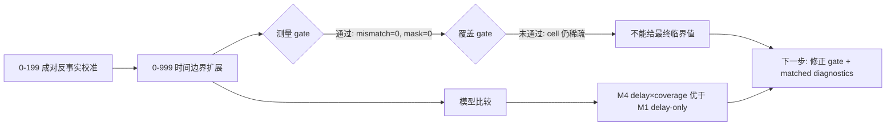

# exp_20260722_001 Analysis Report

## 1. 假设对照

**判决**: `partially_supported`

原假设是：`rho_episode` 太粗，遮挡期间 support 的在线收益至少受 `delay_ms` 和 publish-time coverage/freshness 共同影响。Formal `0-999` 支持这个方向，但还不足以给出最终 boundary 数值。

关键证据：

- 测量 gate 通过：Run A reproduction mismatch `0`，mask mismatch rows `0`，no-effective-support nonzero gain rows `0`。
- delay-only 模型 `M1` 的 group-CV RMSE 为 `0.416513`，R2 为 `0.458015`。
- delay×coverage interaction 模型 `M4` 的 group-CV RMSE 降至 `0.277068`，R2 升至 `0.758755`。
- 但 coverage gate 未通过：delay-rho cells with `n>=5` 只有 `8`，delay-rho-coverage cells with `n>=5` 只有 `10`，低于预设 `15`。

结论：`delay_ms` 不是唯一解释变量，coverage/freshness 有明确增量信号；但当前 cell 覆盖仍不足以宣布稳定临界边界。

### 术语说明：M1、M4、cell 和 n

这里的 `M1`、`M4` 不是 tracking pipeline，也不是要部署的算法，而是对 episode-level `during_gain` 做事后解释的统计模型。

| 名称 | 形式 | 它在问什么 |
| --- | --- | --- |
| `M1_delay_only` | `gain ~ delay_s` | 只知道绝对延迟，能不能解释 support 收益？ |
| `M4_delay_coverage_interaction` | `gain ~ delay_s + coverage + delay_s * coverage` | 绝对延迟和在线覆盖是否相互影响？同样的 coverage，在不同 delay 下价值是否不同？ |

`delay-only` 假设所有 episode 只沿着一条延迟退化曲线下降。`delay×coverage interaction` 允许出现更真实的情况：同样是高 coverage，500ms 的 support 仍然有用，但 1000ms 或 2500ms 的 support 可能已经错过了关键早期发布帧，或者虽然覆盖了很多帧但内容太旧。

`cell` 指按变量分桶后的统计格子。例如 `delay-rho cell` 是一个 `(delay_ms, rho_bucket)` 组合，`delay-rho-coverage cell` 是一个 `(delay_ms, rho_bucket, coverage_bucket)` 组合。

`n>=5` 中的 `n` 是这个 cell 里有多少条 episode 样本。因为每个 delay 下每个 occlusion episode 产生一条 episode row，所以 `n=369` 表示该 delay/rho 桶里有 369 个 episode 样本。`n>=5` 只是最低可靠性门槛：少于 5 个 episode 的 cell 只能做描述，不能拿来拟合或宣称边界。

## 2. 基线比较

**排序基本一致，但 online causal 与 offline upper bound 的差距很大。**

遮挡子集上：

| Delay | primary_only IDF1 | arrival IDF1 | causal online IDF1 | offline corrected IDF1 |
| --- | ---: | ---: | ---: | ---: |
| 0ms | 0.013451 | 0.872278 | 0.872278 | 0.872278 |
| 500ms | 0.013451 | 0.418396 | 0.865872 | 0.872278 |
| 1000ms | 0.013451 | 0.058673 | 0.225852 | 0.872278 |
| 1500ms | 0.013451 | 0.067128 | 0.198821 | 0.872278 |
| 2500ms | 0.013451 | 0.058417 | 0.164105 | 0.872278 |
| 5000ms | 0.013451 | 0.050858 | 0.128107 | 0.872278 |

解释：

- `offline_timestamped_corrected` 是当前 GT/遮挡切片上的 delay-invariant upper bound。
- `arrival_time_fusion` 在 500ms 已明显掉队，1000ms 后接近 primary-only 的低值区间。
- `causal_timestamped_online` 在 500ms 仍接近 upper bound，但 1000ms 后大幅下降。

## 3. 失败模式

失败模式不是简单的 `rho_episode` 过大，也不是“消息是否在遮挡结束前到达”这个二值问题。更精确的说法是：support 到达时，遮挡窗口还剩多久、此前已经有多少遮挡帧被在线发布、到达的 support 相对当前发布帧是否仍然新鲜。

也就是说，`support 到得晚` 只是表层现象；真正的机制是 `arrival_time` 相对 `remaining_occlusion` 和 publish timeline 的位置。一个 support 消息即使在遮挡结束前到达，也可能已经错过了前几帧的在线输出，而这些早期帧往往正是 identity continuity 断开的地方。

同在 `rho<0.25` 桶内，mean during gain 随绝对延迟快速下降：

| Delay | rho bucket | n | mean during gain | positive fraction |
| --- | --- | ---: | ---: | ---: |
| 0ms | `[0,0.25)` | 369 | 0.918768 | 0.994580 |
| 500ms | `[0,0.25)` | 366 | 0.915576 | 0.997268 |
| 1000ms | `[0,0.25)` | 366 | 0.146273 | 0.642077 |
| 1500ms | `[0,0.25)` | 366 | 0.023258 | 0.207650 |
| 2500ms | `[0,0.25)` | 149 | 0.008351 | 0.073826 |

这说明 `rho_episode < 0.25` 只能说明“episode 总体上 delay 小于遮挡总长四分之一”，不能说明每个在线发布帧都有及时、足够新鲜的 support。

与 `remaining` 的关系可以这样理解：

```text
support capture at frame t
arrival frame = t + delay
occlusion end = e

remaining_at_capture = e - t
arrival_remaining = e - (t + delay)
```

如果 `arrival_remaining` 很小，消息虽然还在遮挡结束前到达，但已经没有多少在线发布帧可以被它帮助；如果 `arrival_remaining <= 0`，这条消息对遮挡期间在线输出基本没有帮助，只能用于事后修正或未来状态。

## 4. 上限分析

当前最好 online 结果和 offline upper bound 的差距主要来自在线可用性，而不是 GT 数据上界。

- 500ms: causal occlusion IDF1 `0.865872`，offline `0.872278`，差距很小。
- 1000ms: causal occlusion IDF1 `0.225852`，offline `0.872278`，差距巨大。
- 5000ms: causal occlusion IDF1 `0.128107`，offline `0.872278`，support 几乎只剩少量在线残余价值。

因此下一步不是继续证明 offline correction 可行，而是要刻画 online support 在发布时刻的可用性边界。

## 5. 泛化信号

本轮可提炼出三个通用原则：

1. `rho_episode` 是有用的事后描述量，但不够细，不能单独作为在线 tracking harm boundary。
2. 对在线系统而言，“消息是否在遮挡结束前到达”还不够；更关键的是它是否覆盖了遮挡期间足够多的发布帧。
3. 绝对延迟和在线覆盖存在交互：长延迟会压缩 early-frame continuity，即使最终仍落在同一个 `rho` 桶内。

论文写作中，`rho_episode` 更适合放在 **measurement / diagnostic protocol**，而不是 algorithm section。它的作用是把不同遮挡长度归一化，帮助我们比较“相对遮挡时长的延迟压力”。但它不能作为实时 gate 输入，因为完整的 occlusion duration 通常要到 episode 结束后才知道。

建议论文叙事顺序：

1. 在 Problem / Measurement 里定义 `rho_episode`：用于跨 episode 比较的事后归一化变量。
2. 在 Result 里证明 `rho_episode` 不足：同一 `rho<0.25` 桶内，gain 仍随 `delay_ms` 从 `0.915576` 降到 `0.146273`、`0.023258`、`0.008351`。
3. 在 Method Motivation 里引出实时可观测替代量：`latest_support_age_ms`、`online_support_coverage_fraction`、`time_since_last_primary_seen`、`primary_occlusion_run_length`。

这里的“覆盖足够多的发布帧”指：遮挡期间 tracker 每一帧都要在线发布一个结果；只有在某一帧发布前已经到达的 support，才能帮助这一帧及之后的在线状态。若多条延迟消息在同一时刻批量到达，它们不能改写此前已经发布的在线输出，因此对早期遮挡帧的 coverage 仍然是 0。

形式化地说：

```text
online_support_coverage_fraction
= 遮挡期间已有可用 support 的发布帧数 / 遮挡总发布帧数
```

这个量不是说“消息总数够不够”，而是说“遮挡期间有多少个在线决策时刻真的拿到了 support”。

## 6. 与历史对照

与 `exp_20260705_001` 一致：

- 短延迟 support 有强正收益。
- 1000ms 后收益明显压缩。
- ratio-only 解释不足。

新增之处：

- 从 `0-199` 扩展到 `0-999`，episode rows 从 `456` 量级增加到 `2310`。
- 新增 per-frame freshness 表，共 `46836` 条数据行。
- 明确比较了 delay-only、coverage-only、delay+coverage interaction、expired-support、publish-time freshness 模型。
- 发现 `M4_delay_coverage_interaction` 明显优于 `M1_delay_only`，但 coverage gate 仍未通过。

## 7. 下一步建议

**P0: 修正 boundary gate 和报告逻辑。**

当前 coverage gate 过于依赖 delay-rho cell 数，但 `0-999` 已经有 `2214` 个有效 episode rows。下一步应把判据从“cell 数够不够”改成“关键模型是否有稳定 group-CV 优势 + bootstrap CI 是否稳定”，同时保留 cell 覆盖作为外推风险。

**P0: 加入 matched-delay diagnostics。**

固定 `rho_bucket` 内比较不同 `delay_ms`，固定 `delay_ms` 内比较不同 coverage bucket。目标是回答：同一 rho 下性能差异到底来自 early-frame 缺口、late support spillover，还是 identity 已经在前几帧断掉。

**P1: 引入 pose noise 后重跑 temporal boundary。**

本轮 zero-noise 主要测在线可用性。下一轮应加入 pose/world-coordinate noise，观察 `v * delay / gate_radius` 是否成为第三个边界维度。

**P1: 设计 message-content ablation。**

在遮挡场景中比较只传 world-coordinate、只传 bbox、bbox+pose、pose+identity cue、full message，验证通信内容作为信息维度的作用。

### 下一步术语补充

`group-CV` 指 group cross-validation。这里的 group 是 `(delay_ms, rho_bucket)` 这样的时间条件格子。做法是：每次拿掉一个 delay/rho 组合，用其他组合训练模型，再预测被拿掉的组合。它比普通 RMSE 更严格，因为普通 RMSE 可能只是记住了高样本 cell 的趋势，而 group-CV 在问：这个模型能不能推广到没见过的时间条件。

所以“关键模型是否有稳定 group-CV 优势”指：`M4_delay_coverage_interaction` 不只是训练集误差低，而是在留出某个 delay/rho 组合时，仍然比 `M1_delay_only` 预测得更准。本轮 `M4` group-CV RMSE `0.277068` 明显低于 `M1` 的 `0.416513`，说明 joint boundary 有信号；但还需要 bootstrap 和 matched diagnostics 判断这个优势是不是稳定机制，而不是数据分布偶然造成的。

`late support spillover` 指遮挡期间捕获的 support 消息没有及时帮助遮挡期间的在线输出，而是在遮挡结束后才影响 tracker 状态。它可能有两种结果：帮助 reacquisition，也可能污染后续 identity continuity。因此它和 `during_gain` 要分开看：

```text
during_gain:    episode.start ... episode.end
spillover_gain: episode.end+1 ... episode.end+max_delay
```

这能区分两类问题：support 是“来晚了但还能帮恢复”，还是“来晚了并且干扰了恢复”。

`v * delay / gate_radius` 是一个空间陈旧度比例：

```text
v:              目标运动速度
delay:          通信延迟
v * delay:      延迟期间目标大约移动了多远
gate_radius:    tracker 允许匹配的空间门限
```

如果这个比值远小于 `1`，延迟 support 的位置即使旧一点，也大概率还在关联门内；如果接近或超过 `1`，延迟 support 的坐标可能已经偏出 gate，或者更容易贴近错误 track。它回答的是：通信延迟造成的空间位移，相对 tracker 的容忍半径有多大。

本轮 zero-noise 主要测在线可用性，所以 `v * delay / gate_radius` 还不是主变量。下一轮加入 pose/world-coordinate noise 后，它可能成为第三个边界维度：时间上是否及时、在线帧是否覆盖、空间上是否仍可关联。

## 流程图



Reference diagram:

```text
mermaid/exp_20260722_001_matrix_occlusion_temporal_boundary_expansion/temporal_boundary_flow.mmd
```

## 补充说明

`counterfactual_decision.md` 中的最后一行仍保留旧模板措辞，写着“0-199 range is still too sparse / expand to 0-999”。本轮 formal 已经是 `0-999`；该行应理解为旧文案未更新，不影响 CSV 和 `temporal_boundary_decision.md` 的实际统计结果。
