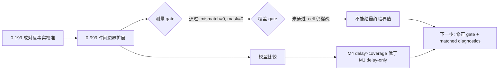

# exp_20260722_001 Analysis Report

## 1. 假设对照

**判决**: `partially_supported`

原假设是：`rho_episode` 太粗，遮挡期间 support 的在线收益至少受 `delay_ms` 和 publish-time coverage/freshness 共同影响。Formal `0-999` 支持这个方向，但还不足以给出最终 boundary 数值。

关键证据：

- 测量 gate 通过：Run A reproduction mismatch `0`，mask mismatch rows `0`，no-effective-support nonzero gain rows `0`。
- delay-only 模型 `M1` 的 group-CV RMSE 为 `0.416513`，R2 为 `0.458015`。
- delay×coverage interaction 模型 `M4` 的 group-CV RMSE 降至 `0.277068`，R2 升至 `0.758755`。
- 但 coverage gate 未通过：delay-rho cells with `n>=5` 只有 `8`，delay-rho-coverage cells with `n>=5` 只有 `10`，低于预设 `15`。

结论：`delay_ms` 不是唯一解释变量，coverage/freshness 有明确增量信号；但当前 cell 覆盖仍不足以宣布稳定临界边界。

## 2. 基线比较

**排序基本一致，但 online causal 与 offline upper bound 的差距很大。**

遮挡子集上：

| Delay | primary_only IDF1 | arrival IDF1 | causal online IDF1 | offline corrected IDF1 |
| --- | ---: | ---: | ---: | ---: |
| 0ms | 0.013451 | 0.872278 | 0.872278 | 0.872278 |
| 500ms | 0.013451 | 0.418396 | 0.865872 | 0.872278 |
| 1000ms | 0.013451 | 0.058673 | 0.225852 | 0.872278 |
| 1500ms | 0.013451 | 0.067128 | 0.198821 | 0.872278 |
| 2500ms | 0.013451 | 0.058417 | 0.164105 | 0.872278 |
| 5000ms | 0.013451 | 0.050858 | 0.128107 | 0.872278 |

解释：

- `offline_timestamped_corrected` 是当前 GT/遮挡切片上的 delay-invariant upper bound。
- `arrival_time_fusion` 在 500ms 已明显掉队，1000ms 后接近 primary-only 的低值区间。
- `causal_timestamped_online` 在 500ms 仍接近 upper bound，但 1000ms 后大幅下降。

## 3. 失败模式

失败模式不是简单的 `rho_episode` 过大，而是“support 到达太晚，虽然还在遮挡窗口内，但已经错过了多数可产生 identity continuity gain 的发布帧”。

同在 `rho<0.25` 桶内，mean during gain 随绝对延迟快速下降：

| Delay | rho bucket | n | mean during gain | positive fraction |
| --- | --- | ---: | ---: | ---: |
| 0ms | `[0,0.25)` | 369 | 0.918768 | 0.994580 |
| 500ms | `[0,0.25)` | 366 | 0.915576 | 0.997268 |
| 1000ms | `[0,0.25)` | 366 | 0.146273 | 0.642077 |
| 1500ms | `[0,0.25)` | 366 | 0.023258 | 0.207650 |
| 2500ms | `[0,0.25)` | 149 | 0.008351 | 0.073826 |

这说明 `rho_episode < 0.25` 只能说明“episode 总体上 delay 小于遮挡总长四分之一”，不能说明每个在线发布帧都有及时、足够新鲜的 support。

## 4. 上限分析

当前最好 online 结果和 offline upper bound 的差距主要来自在线可用性，而不是 GT 数据上界。

- 500ms: causal occlusion IDF1 `0.865872`，offline `0.872278`，差距很小。
- 1000ms: causal occlusion IDF1 `0.225852`，offline `0.872278`，差距巨大。
- 5000ms: causal occlusion IDF1 `0.128107`，offline `0.872278`，support 几乎只剩少量在线残余价值。

因此下一步不是继续证明 offline correction 可行，而是要刻画 online support 在发布时刻的可用性边界。

## 5. 泛化信号

本轮可提炼出三个通用原则：

1. `rho_episode` 是有用的事后描述量，但不够细，不能单独作为在线 tracking harm boundary。
2. 对在线系统而言，“消息是否在遮挡结束前到达”还不够；更关键的是它是否覆盖了遮挡期间足够多的发布帧。
3. 绝对延迟和在线覆盖存在交互：长延迟会压缩 early-frame continuity，即使最终仍落在同一个 `rho` 桶内。

## 6. 与历史对照

与 `exp_20260705_001` 一致：

- 短延迟 support 有强正收益。
- 1000ms 后收益明显压缩。
- ratio-only 解释不足。

新增之处：

- 从 `0-199` 扩展到 `0-999`，episode rows 从 `456` 量级增加到 `2310`。
- 新增 per-frame freshness 表，共 `46836` 条数据行。
- 明确比较了 delay-only、coverage-only、delay+coverage interaction、expired-support、publish-time freshness 模型。
- 发现 `M4_delay_coverage_interaction` 明显优于 `M1_delay_only`，但 coverage gate 仍未通过。

## 7. 下一步建议

**P0: 修正 boundary gate 和报告逻辑。**

当前 coverage gate 过于依赖 delay-rho cell 数，但 `0-999` 已经有 `2214` 个有效 episode rows。下一步应把判据从“cell 数够不够”改成“关键模型是否有稳定 group-CV 优势 + bootstrap CI 是否稳定”，同时保留 cell 覆盖作为外推风险。

**P0: 加入 matched-delay diagnostics。**

固定 `rho_bucket` 内比较不同 `delay_ms`，固定 `delay_ms` 内比较不同 coverage bucket。目标是回答：同一 rho 下性能差异到底来自 early-frame 缺口、late support spillover，还是 identity 已经在前几帧断掉。

**P1: 引入 pose noise 后重跑 temporal boundary。**

本轮 zero-noise 主要测在线可用性。下一轮应加入 pose/world-coordinate noise，观察 `v * delay / gate_radius` 是否成为第三个边界维度。

**P1: 设计 message-content ablation。**

在遮挡场景中比较只传 world-coordinate、只传 bbox、bbox+pose、pose+identity cue、full message，验证通信内容作为信息维度的作用。

## 流程图



Reference diagram:

```text
mermaid/exp_20260722_001_matrix_occlusion_temporal_boundary_expansion/temporal_boundary_flow.mmd
```

## 补充说明

`counterfactual_decision.md` 中的最后一行仍保留旧模板措辞，写着“0-199 range is still too sparse / expand to 0-999”。本轮 formal 已经是 `0-999`；该行应理解为旧文案未更新，不影响 CSV 和 `temporal_boundary_decision.md` 的实际统计结果。
