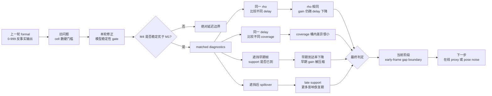

# exp_20260722_002 Analysis Report

## 1. 假设对照

**判决**: `supported`

原假设是：上一轮 strict cell-count gate 过硬，应改为模型稳定性加 matched diagnostics。结果支持这个判断。

关键证据：

- 测量有效性继续通过：Run A reproduction mismatches `0`，mask mismatch rows `0`，no-effective-support nonzero gain rows `0`。
- `M4_delay_coverage_interaction` 稳定优于 `M1_delay_only`：group-CV RMSE `0.277068` vs `0.416513`，相对提升 `0.334791`；R2 `0.758755` vs `0.458015`，提升 `0.300740`。
- `delay_x_coverage` bootstrap CI 为 `[-0.959284, -0.846348]`，不跨 0。
- matched diagnostics 不支持把结论简单写成 coverage modulation：same-delay coverage spread 最大只有 `0.005815`。

结论：模型层面 joint temporal boundary 有稳定信号，但机制层面最清楚的解释是 `early_frame_gap_boundary`。

## 2. 基线比较

本轮不重新跑 tracker baseline，而是继承 `exp_20260722_001` 的四条 aggregate baseline：`primary_only`、`arrival_time_fusion`、`causal_timestamped_online`、`offline_timestamped_corrected`。

本轮新增比较对象不是 tracking pipeline，而是 boundary 解释模型和诊断切片：

| Item | Meaning | Result |
| --- | --- | ---: |
| `M1_delay_only` | 只用绝对延迟解释 gain | group-CV RMSE `0.416513` |
| `M4_delay_coverage_interaction` | 延迟、coverage 和交互项解释 gain | group-CV RMSE `0.277068` |
| same-rho delay diagnostic | 固定 rho 比较 delay | `[0,0.25)` 内单调下降 |
| same-delay coverage diagnostic | 固定 delay 比较 coverage | 最大 spread `0.005815` |
| early-frame profile | 看遮挡早期 support 是否到达 | 500ms 到 1000ms early gain drop `0.704866` |

排序没有反直觉：更细的时间可用性模型优于单变量 delay 模型，但 matched 切片说明同一 delay 内 coverage 分桶当前没有强区分力。

## 3. 失败模式

**主失败模式**：早期遮挡在线发布帧没有及时拿到可用 support，identity continuity 在前几帧已经断掉，后到的 support 难以恢复 `during_gain`。

同在 `rho_bucket=[0,0.25)` 内：

| Delay | n | Mean during gain | Mean coverage | Mean spillover gain |
| --- | ---: | ---: | ---: | ---: |
| 500ms | 366 | 0.915576 | 0.950909 | 0.996995 |
| 1000ms | 366 | 0.146273 | 0.901818 | 0.688866 |
| 1500ms | 366 | 0.023258 | 0.852727 | 0.486885 |
| 2500ms | 149 | 0.008351 | 0.784349 | 0.278523 |

这说明 `rho_episode < 0.25` 只说明整段遮挡相对很长，不说明每个在线发布帧都有及时 support。1000ms 后，support 仍可能在遮挡结束前到达，但它已经错过了足够多的早期发布帧。

spillover 诊断还显示：1500ms 和 2500ms 的 `during_gain` 接近 0，但 `spillover_gain` 仍不为 0。这表示 late support 更像是在遮挡后恢复期产生影响，而不是帮助遮挡期间在线身份连续性。

## 4. 上限分析

当前 measurement framework 已经可信；上限差距不再主要来自测量 bug。

- Run A 可逐帧复现 baseline causal timeline，mismatch 为 `0`。
- Run B mask 与目标 support manifest 一致，mask mismatch rows 为 `0`。
- 无有效 support 的 episode 没有产生非零 gain。

因此，1000ms 以后 `during_gain` 被压缩，不能再归因于反事实分叉或重放污染。真正的上限问题是在线可用性：已经发布的早期帧不能被后来到达的 support 改写。

## 5. 泛化信号

本轮把 `rho_episode` 的论文位置进一步厘清：

1. `rho_episode` 适合放在 measurement / diagnostics，用于事后归一化遮挡时长。
2. 在线 gate 不能直接使用完整 `rho_episode`，因为遮挡结束时间在实时系统中未知。
3. 更有用的在线 proxy 应围绕“发布时刻手里有什么”构造，例如 `latest_support_age_ms`、`has_arrived_support_rate`、`time_since_last_primary_seen` 和 early-frame support availability。

一个反问可以帮助保持研究问题不跑偏：如果一个 support 消息在遮挡结束前 100ms 到达，它“按 episode rho 看是及时的”，但它还能改变多少已经发布的 online prediction？

## 6. 与历史对照

与 `exp_20260705_001` 和 `exp_20260722_001` 趋势一致：

- 500ms support 的因果收益强。
- 1000ms 以后收益断崖式下降。
- ratio-only 不足以解释同一 `rho` 桶内的表现差异。

本轮新增的可信点：

- 旧的 sparse gate 被降级为 extrapolation risk，而不是硬失败。
- `M4` 的优势同时通过 group-CV、R2 和交互项 CI。
- matched diagnostics 指向 early-frame gap，而不是泛泛地说 coverage 有效。

## 7. 下一步建议

**P0: 设计 online proxy readiness 实验。**

目的：把离线解释变量转成实时可观察变量。候选 proxy 包括 `latest_support_age_ms`、`time_since_last_primary_seen`、`frames_since_support_arrived`、`early_occlusion_run_length`。成功标准是这些 proxy 能预测 `during_gain > 0.05`，并在 group-CV 下优于 delay-only。

**P1: 引入 pose/world-coordinate noise 后重跑 temporal boundary。**

目的：验证时间可用性边界和空间陈旧边界是否正交。自变量加入 pose noise 和 `v * delay / gate_radius`。成功标准是该空间比例对 gain 或 IDSW 有独立解释力。

**P1: message-content ablation。**

目的：验证通信内容不是“带宽选项”，而是 risk gate 的信息维度。比较 world-coordinate、bbox、bbox+pose、pose+identity cue、full message。成功标准是某些内容维度能在遮挡早期或恢复期显著提高 causal gain。

**P2: policy learning 预备，而不是立即上 RL。**

目的：把 `discard`、`arrival_time_fusion`、`causal_fusion` 看成 action，但先做 supervised value prediction / contextual bandit readiness。成功标准是离线 value model 稳定，再讨论在线策略。

## 流程图



Reference diagram:

```text
mermaid/exp_20260722_002_matrix_temporal_boundary_matched_diagnostics/matched_diagnostics_flow.mmd
```

## 补充说明

本轮不是推翻 `delay×coverage` 模型。更准确的说法是：模型稳定性支持 delay 与 coverage 的联合边界，但 matched diagnostics 显示当前最可解释、最可行动的失败机制是 early-frame support gap。下一轮要把这个机制转成在线可观测 proxy，而不是直接跳到完整 policy learning。

Verification:

```text
PYTHONPATH=src /usr/bin/python3 -m py_compile scripts/analyze_occlusion_temporal_boundary_matched.py  # passed
PYTHONPATH=src python -m pytest tests/test_temporal_boundary_matched.py -q  # 7 passed
PYTHONPATH=src python -m pytest tests/ -q  # 88 passed
```
