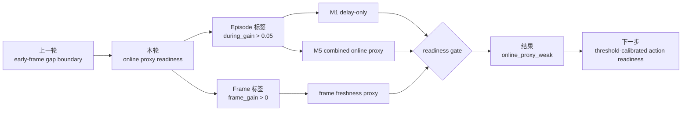

# exp_20260724_001 Analysis Report

## 1. 假设对照

**判决**: `partially_supported`

原假设是：在线可获得 proxy 能显著优于 delay-only，足以支撑下一步 value-based action selection。结果只支持一半。

支持的部分：

- `M5_combined_online_proxy` 的 episode-level F1 从 `0.813600` 提升到 `0.889655`，提升 `0.076055`。
- M5 recall 达到 `0.879260`，超过 `0.70`。
- 关键系数方向合理：`mean_latest_support_age_s`、`early_mean_latest_support_age_s` 和 `no_support_available_frame_fraction` 均为负。
- frame-level 上在线 freshness 很强：`M5` group-CV AUC `0.969113`，明显高于 delay-only `0.830986`。

不支持的部分：

- episode-level AUC 只从 `0.964606` 提升到 `0.967811`，提升 `0.003205`，远低于 `0.05`。
- 这说明 delay-only 已经能很好地排序 episode，online proxy 主要改善阈值附近的误报/漏报，而不是提供新的跨条件排序能力。

因此本轮 decision 是 `online_proxy_weak`，不是 `policy_readiness_supported`。

## 2. 基线比较

Episode-level 排序：

| Model | group-CV AUC | group-CV F1 | group-CV recall |
| --- | ---: | ---: | ---: |
| `M5_combined_online_proxy` | 0.967811 | 0.889655 | 0.879260 |
| `M1_delay_only` | 0.964606 | 0.813600 | 0.990263 |
| `M4_early_occlusion_proxy` | 0.963873 | 0.848253 | 0.756573 |
| `M3_online_freshness` | 0.921871 | 0.830403 | 0.712756 |
| `M2_episode_rho_oracle` | 0.858679 | 0.814726 | 0.991237 |

关键不是谁“赢”，而是赢在哪里：

- `M1_delay_only` 排序能力已经很强，AUC `0.964606`。
- `M5` 的主要价值是减少 delay-only 在中间 delay 桶的过度接受，F1 和 RMSE 更好。
- `rho_episode` 作为事后变量没有超过 delay-only，进一步证明 ratio-only 不适合作为主在线边界。

## 3. 失败模式

主要失败模式是：online proxy 没有提供足够新的 episode-level ranking signal。

从 error diagnostics 看：

- 在 `1000ms, rho=[0,0.25)`，M1 delay-only 对所有 episode 倾向预测为正，recall 高但 false positive 多；M5 把平均预测概率压到 `0.487220`，F1 更平衡。
- 在 `2500ms, rho=[0,0.25)`，M5 仍漏掉少量正样本，false negative rate 为 `1.000000`。这说明长延迟少数有用 support 的识别仍困难。

换句话说，online proxy 能改进“要不要过阈值”的判断，但还不能可靠识别长延迟中的少数有益 episode。

## 4. 上限分析

本轮上限来自两个方面：

1. **Delay-only 已经太强**：当 delay 是固定档位、zero-noise 且场景来自同一 MATRIX slice，绝对 delay 本身几乎已经编码了大部分 episode-level gain。
2. **Episode-level 标签较粗**：`positive_episode_gain = during_gain > 0.05` 把一个遮挡片段压成二分类，可能掩盖了 frame-level proxy 的强信号。

这也解释了为什么 frame-level M5 很强，但 episode-level AUC 增量很小。

## 5. 泛化信号

本轮给论文叙事提供了一个重要修正：

在线 proxy 的价值不一定体现为“比 delay-only 排序更准”，也可能体现为：

- 在固定 delay 附近做更好的 accept/reject 阈值校准；
- 区分遮挡期间在线 fusion 和遮挡后 recovery；
- 为 action selection 提供不同动作的触发条件，而不是直接训练一个全局 policy。

这让下一步不应叫完整 RL，而应叫 action-readiness 或 threshold-calibration。

## 6. 与历史对照

与 `exp_20260722_002` 一致：

- early-frame gap 是真实机制；
- frame-level freshness 对 frame gain 有强解释力；
- episode-level `rho` 不足。

新增发现：

- episode-level delay-only 已经是强基线。
- online proxy 的增量集中在 F1、RMSE 和 frame-level，而不是 episode AUC。
- 直接进入 policy learning 仍然过早。

## 7. 下一步建议

**P0: Threshold-calibrated action-readiness audit.**

目的：不再要求 M5 在 AUC 上大幅超过 delay-only，而是评估它是否能在固定 action threshold 下减少 harmful accept 和 missed helpful support。

具体操作：

- 使用 M1 和 M5 的 out-of-fold probability。
- 扫描 action threshold：`0.1, 0.2, ..., 0.9`。
- 输出每个 threshold 下的 expected utility：
  - true helpful accept
  - harmful accept
  - missed helpful support
  - recovery-only candidate
- 判断 M5 是否在同等 harmful accept 下保留更多 helpful support。

成功标准：

```text
M5 在 matched delay/rho group 内达到更好的 utility frontier；
特别是在 1000ms 和 1500ms 桶内减少 false positive，同时不大幅牺牲 recall。
```

**P1: Pose/world-coordinate noise temporal boundary.**

目的：验证 `v*delay/gate_radius` 是否成为第三维边界。

**P1: Message-content ablation.**

目的：把通信内容作为信息维度，而不是带宽优化变量。

## 流程图



Reference diagram:

```text
mermaid/exp_20260724_001_matrix_early_frame_online_proxy_readiness/online_proxy_readiness_flow.mmd
```

## 补充说明

本轮的“弱”不是失败，而是一个收紧：online proxy 还不够支撑完整 policy learning，但足够支撑下一轮更具体的 action threshold 实验。这里正好是一个苏格拉底式分叉：

> 如果 delay-only 已经能排序大多数 episode，我们真的需要学一个复杂 policy，还是先需要一个更好的动作阈值和 recovery/fusion 分流规则？

Verification:

```text
PYTHONPATH=src /usr/bin/python3 -m py_compile scripts/analyze_occlusion_online_proxy_readiness.py tests/test_online_proxy_readiness.py  # passed
PYTHONPATH=src python -m pytest tests/test_online_proxy_readiness.py -q  # 6 passed
PYTHONPATH=src python -m pytest tests/ -q  # 94 passed
```
