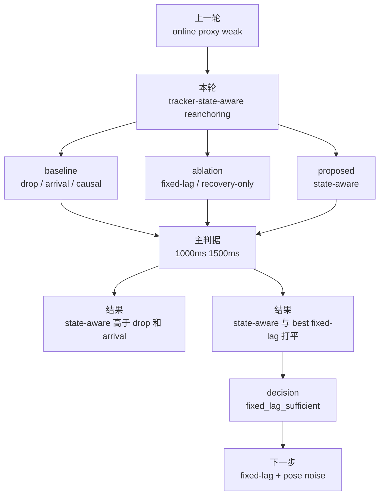

# exp_20260724_002 Analysis Report

## 1. 假设对照

**判决**: `partially_supported`

原假设是：tracker-state-aware delayed re-anchoring 在 D1 遮挡和 support 异步到达时，比 drop、arrival-time、fixed-lag、recovery-only 更能维持身份连续性。

支持的部分：

- 在 1000ms，`state_aware_reanchoring` occlusion IDF1 `0.870100`，明显高于 `drop_delayed_sort` 的 `0.052011`，IDSW 从 `5084` 降到 `829`。
- 在 1500ms，`state_aware_reanchoring` occlusion IDF1 `0.724058`，也明显高于 `drop_delayed_sort` 的 `0.052011`，IDSW 从 `5084` 降到 `2101`。
- 相对 `arrival_time_sort`，state-aware 在 1000ms 和 1500ms 都显著降低 IDSW。

不支持的部分：

- `state_aware_reanchoring` 没有超过 fixed-lag ablation。
- 1000ms 时它与 `fixed_lag_oosm_lag2/3/5` 完全同分。
- 1500ms 时它与 `fixed_lag_oosm_lag3/5` 完全同分。

因此本轮 decision 是 `fixed_lag_sufficient`，不是 `state_aware_reanchoring_supported`。

## 2. 基线比较

主判据区间排序：

| delay | 排序 |
| ---: | --- |
| 1000ms | `fixed_lag_lag2/3/5 = state_aware` > `causal_timestamped_online` > `arrival_time` > `drop/recovery/lag1` |
| 1500ms | `fixed_lag_lag3/5 = state_aware` > `arrival_time` > `causal_timestamped_online` > `drop/recovery/lag1/lag2` |

反直觉点：

- `causal_timestamped_online` 在本轮不再是最强 pipeline。它冻结已发布 online outputs，且 full replay 的历史修正不能改变已经发布的遮挡早期帧；相比之下，fixed-lag tracker 在当前实现中通过短窗口状态修正，能更直接改善后续 online identity。
- `arrival_time_sort` 比 drop 好一些，但 IDSW 仍高，说明到达时刻融合确实保留部分支撑信息，也仍引入明显污染。

## 3. 失败模式

主要失败模式有三个：

1. **State-aware 没有真正“选择”出超过固定窗口的行为。**
   在 1000ms 和 1500ms，state-aware 的有效行为等价于选择 `lag2` 或 `lag3` fixed-lag update。

2. **Recovery-only 当前太弱。**
   1000ms 下 recovery-only occlusion IDF1 `0.051755`，1500ms 下 `0.051627`，几乎等于 drop。这说明只做遮挡后重连接不足以维持遮挡期间 identity continuity。

3. **长延迟下窗口选择很敏感。**
   2500ms 下 `fixed_lag_oosm_lag5` occlusion IDF1 `0.516013`，但 state-aware 默认 lag3 只有 `0.078017`。这说明窗口大小本身是关键变量，不能被简单状态规则替代。

## 4. 上限分析

当前最好结果已经接近 fixed-lag world-coordinate 机制上限：

- 1000ms 最好 occlusion IDF1 `0.870100`，相对 drop 提升 `0.818089`。
- 1500ms 最好 occlusion IDF1 `0.724058`，相对 drop 提升 `0.672047`。

但这不是最终部署上限，因为本轮仍是 GT world-coordinate zero-noise。加入 pose/world-coordinate noise 后，fixed-lag replay 可能会重新暴露 Stage A 中的坐标噪声问题。

## 5. 泛化信号

本轮给出一个比 online proxy 更贴近持续跟踪的设计原则：

```text
异步 support 的第一层缓解机制不是复杂 policy，而是 bounded fixed-lag delayed update。
```

它的直觉很简单：迟到 support 只要还在短窗口内，就应该修正 tracker state；超过窗口后，不应随意改写遮挡期 online 输出。

这把论文方向从“预测 gain 后选择动作”拉回到持续跟踪基础机制：状态预测、短窗口 OOSM、轨迹生命周期和遮挡恢复。

## 6. 与历史对照

与 `exp_20260722_002` 一致：

- early-frame gap 是核心伤害机制。
- 1000ms 和 1500ms 是关键 transition zone。
- 只依赖 arrival-time 会产生大量 IDSW。

与 `exp_20260724_001` 的关系：

- online proxy readiness 判为 `online_proxy_weak`，说明不宜直接进入策略学习。
- 本轮 fixed-lag 的强结果说明：下一步更应该研究 tracker 机制，而不是先训练 action policy。

与 Stage A 的关系：

- Stage A 在 noisy world-coordinate support 下关闭 geometry-only gate。
- 本轮 zero-noise fixed-lag 很强，说明“有用机制”存在，但还未证明它能承受坐标噪声。

## 7. 下一步建议

**P0: Fixed-lag temporal-spatial robustness audit.**

目的：验证 fixed-lag 的强结果在 pose/world-coordinate noise 下是否保持。

具体操作：

- 保留 `fixed_lag_oosm_lag1/2/3/5`、`drop_delayed_sort`、`arrival_time_sort`。
- 加入 support world-coordinate noise：`0.00, 0.10, 0.25, 0.50m`。
- 增加 `v * delay / gate_radius` 诊断。

成功标准：

```text
fixed_lag 在 1000/1500ms 下仍高于 drop；
IDSW 不因 noise 大幅超过 arrival_time；
能识别 lag/window 与 spatial staleness 的联合边界。
```

**P1: State-aware rule redesign.**

目的：让 state-aware 真正区别于 fixed lag。

方向：

- 不再默认固定 `lag3`。
- 根据 covariance、miss_count、association margin 自适应选择 `lag1/2/3/5/recovery/reject`。
- 成功标准必须是超过 best fixed-lag，而不是和某个 lag 打平。

**P1: Message-content ablation.**

目的：如果 noisy fixed-lag 失败，测试 bbox/pose/identity cue 是否能让 delayed update 在噪声下保持身份收益。

**P2: Runner performance optimization.**

Formal 0-999 运行很慢，长延迟 full replay 和 fixed-lag replay 是主要成本。下一轮正式扩展前应考虑缓存 visibility、按 delay 分文件输出、减少重复 replay 诊断。

## 流程图



Reference diagram:

```text
mermaid/exp_20260724_002_matrix_tracker_state_aware_reanchoring/reanchoring_flow.mmd
```

## 补充说明

这轮结果对论文是好消息，但不是一顶可以直接戴上的桂冠。苏格拉底式地问一句：

> 如果一个固定窗口已经解释了全部收益，那么“状态感知”到底感知到了什么？

当前答案是：还不够。下一轮必须让状态规则在不同 lag 之间做出真实选择，否则方法贡献应收敛为 fixed-lag OOSM tracking，而不是 state-aware policy。
