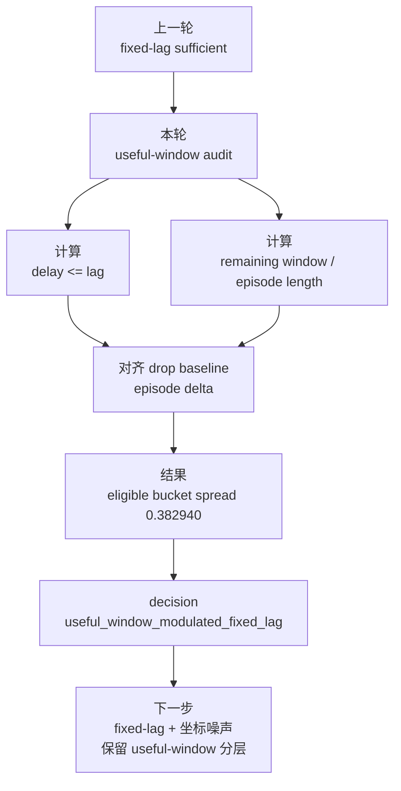

# exp_20260726_001 Analysis Report

## 1. 假设对照

**判决**: `supported`

本轮假设是：fixed-lag 的收益不是只由 `delay <= lag` 决定，还会被遮挡长度和 support 到达后剩余的有效支撑窗口调节。

Formal 结果支持该假设：

- Eligible useful-window bucket 数为 `3`。
- Eligible bucket 内 survival delta spread 为 `0.382940`。
- `[0,0.25)` bucket 的 mean survival delta 为 `0.000000`。
- `[0.5,0.75)` bucket 的 mean survival delta 为 `0.203212`。
- `[0.75,1]` bucket 的 mean survival delta 为 `0.382940`。

因此本轮 decision 是：

```text
useful_window_modulated_fixed_lag
```

## 2. 基线比较

本轮不重新比较 tracker pipeline，而是把 `fixed_lag_oosm_lag1/2/3/5` 的 episode 结果与同一 episode 的 `drop_delayed_sort` 对齐。

主指标：

```text
survival_delta_vs_drop
fragmentation_delta_vs_drop
window_idsw_delta_vs_drop
```

这个设计把问题从“fixed-lag 是否强于 drop”收紧为：

```text
fixed-lag 强在哪里？
什么条件下 delay <= lag 仍然没有收益？
```

## 3. 失败模式

本轮明确了三个误读风险：

1. **`delay <= lag` 不是充分条件。**
   它只是允许 support 进入 fixed-lag update 的资格条件。

2. **遮挡短或到达太晚时，during gain 会被压缩。**
   即使消息仍满足 lag eligibility，如果到达时遮挡期 online 输出已经基本发布完，support 对遮挡期间 identity continuity 的影响会很小。

3. **state-aware lag3 的 2500ms 失败主要是窗口不足。**
   2500ms 下 `state_aware_reanchoring` occlusion IDF1 为 `0.078017`，而 `fixed_lag_oosm_lag5` 为 `0.516013`，差距 `0.437996`。

## 4. 上限分析

Zero-noise 下没有检测到 larger-lag penalty：

```text
larger_lag_penalty_detected = 0
```

这说明当前数据里更大的 lag 没有明显增加 IDSW 或 fragmentation 代价。但这不能推广到 noisy world-coordinate 条件；一旦 support 坐标带噪，更长窗口可能把更旧、更不准的观测带入回放，重新触发 Stage A 的几何污染问题。

## 5. 泛化信号

本轮把 fixed-lag 机制的论文表述从一句粗规则收紧为两个层次：

```text
Eligibility:
  delay <= lag

Effectiveness:
  delay <= lag
  + useful support window 足够大
  + identity 线尚未不可逆断开
  + association 不歧义
```

这对后续实验很重要：pose/world-coordinate noise 不能只按 delay 和 lag 报告，还必须按 useful-window 分层，否则会混淆时间窗口效应和空间噪声效应。

## 6. 与历史对照

与 `exp_20260722_002` 一致：

- 早期在线发布帧缺 support 是关键伤害机制。
- `rho_episode` 作为整段遮挡比值太粗。
- support 是否“及时”应按它还能影响多少在线遮挡帧来解释。

与 `exp_20260724_002` 的关系：

- 上一轮证明 fixed-lag 是强缓解机制。
- 本轮证明 fixed-lag 的收益边界受 useful support window 调节。
- 因此下一轮 noisy fixed-lag 必须报告窗口分层。

## 7. 下一步建议

**P0: Fixed-lag temporal-spatial robustness audit with useful-window stratification.**

目的：验证 fixed-lag 在 support world-coordinate noise 下是否仍强于 drop，并分清时间窗口和空间误差的作用。

设置：

```text
delay: fixed_1 fixed_2 fixed_3 fixed_5
lag: 1 2 3 5
pose/world-coordinate noise: 0.00 0.10 0.25 0.50m
strata: useful_window_bucket, lag_eligible, length_bucket
```

成功标准：

```text
在 1000/1500ms 且 useful_window_fraction 高的 bucket 中，
fixed-lag 仍高于 drop；
IDSW 不因 noise 大幅超过 arrival_time；
能报告 temporal useful-window 与 spatial noise 的联合边界。
```

**P1: Adaptive lag redesign only after noisy boundary is known.**

当前 zero-noise 下 larger-lag penalty 为 `0`，所以还没有足够理由立刻学习 adaptive lag。需要等加入坐标噪声后观察更大 lag 是否带来污染代价。

## 流程图



Reference diagram:

```text
mermaid/exp_20260726_001_matrix_fixed_lag_useful_window_audit/useful_window_flow.mmd
```

## 补充说明

这轮不是在削弱 fixed-lag 的贡献，而是在帮它把边界讲清楚。一个可以放进论文讨论里的问法是：

> fixed-lag 不是“迟到 K 帧以内就一定有用”，而是“在 K 帧可修正窗口内，support 仍需覆盖足够多尚未失去身份连续性的遮挡状态”。
