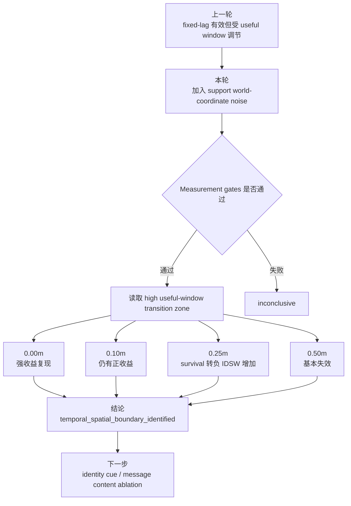

# exp_20260726_002 Analysis Report

## 1. 假设对照

**判决：supported。**

原假设是：fixed-lag 在 useful support window 足够大时低噪声下仍有收益，但随 support world-coordinate noise 增大会出现时间-空间联合边界。结果符合预测：

- `fixed_2=1000ms` high useful-window：0.00m 时 occlusion IDF1 delta `0.818089`，0.10m 仍为 `0.107354`，0.25m 降到 `0.017423` 且 survival delta 转负 `-0.077936`。
- `fixed_3=1500ms` high useful-window：0.00m delta `0.672047`，0.10m `0.094543`，0.25m `0.008199` 且 survival delta `-0.078924`。
- Measurement gates 全通过：primary clean、drop invariant、truth clean、pose0 prior reproduction mismatch 都为 `0`。

因此，本轮不是简单说 fixed-lag 失败，而是定位出边界：**0.10m 仍可用，0.25m 开始不可靠，0.50m 基本失效**。

## 2. 基线比较

主排序在 transition zone 中非常稳定：

- zero-noise：eligible fixed-lag 远高于 drop。
- 0.10m：eligible fixed-lag 仍高于 drop，并降低 window IDSW。
- 0.25m：全局 occlusion IDF1 仍略高于 drop，但 high useful-window survival 已低于 drop，IDSW 也更高。
- 0.50m：fixed-lag 不再形成有效收益，部分指标低于 drop。

关键 pipeline 例子：

| Noise | Delay | Drop occ IDF1 / IDSW | Best fixed-lag occ IDF1 / IDSW |
| ---: | ---: | ---: | ---: |
| 0.00m | 1000ms | 0.052011 / 5084 | 0.870100 / 829 |
| 0.10m | 1000ms | 0.052011 / 5084 | 0.159365 / 3682 |
| 0.25m | 1000ms | 0.052011 / 5084 | 0.069434 / 5868 |
| 0.00m | 1500ms | 0.052011 / 5084 | 0.724058 / 2101 |
| 0.10m | 1500ms | 0.052011 / 5084 | 0.146554 / 4285 |
| 0.25m | 1500ms | 0.052011 / 5084 | 0.060210 / 6060 |

## 3. 失败模式

失败模式是 **坐标噪声污染窗口内回放**，不是 useful window 不足。

- 本轮主表只看 high useful-window bucket `[0.75,1]`，也就是说时间机会是足够的。
- 但 0.25m 下 fixed2/fixed3 的 survival delta 都约为 `-0.078`，window IDSW delta 变为正数。
- `temporal_spatial_risk_bucket` 分层显示，0.25m 后 `[1,1.5)` 和 `[1.5,inf)` 风险段的 survival delta 均为负。

一句话：support 来得足够早，但落点已经不够准；fixed-lag 把错误 support 放回历史窗口，反而污染了身份线。

## 4. 上限分析

zero-noise 上限仍然很高：

- 1000ms best fixed-lag occ IDF1 `0.870100`。
- 1500ms best fixed-lag occ IDF1 `0.724058`。

这说明 fixed-lag 机制本身能解决遮挡早期缺 support 的问题。但在 0.25m 噪声后性能接近或低于 drop，说明当前瓶颈不再是“是否允许回放”，而是“回放观测是否可信”。方法空间还包括：

- support 更新权威上限；
- identity cue / ReID；
- bbox + pose consistency；
- covariance-aware measurement update；
- noisy support 下的 candidate ambiguity gate。

## 5. 泛化信号

可以提炼三条通用原则：

1. `delay <= lag` 只是入场资格，不是收益保证。
2. useful window 足够时仍可能失败，因为 fixed-lag 会放大坐标噪声对历史状态的影响。
3. fixed-lag 的效果边界应写成时间-空间联合边界：`useful_window_fraction × pose_noise/gate_radius × motion*delay/gate_radius`，而不是只写 delay 或 lag。

## 6. 与历史对照

本轮与前三个关键历史结果一致：

- `exp_20260724_002`：zero-noise fixed-lag 是强缓解机制，本轮复现。
- `exp_20260726_001`：fixed-lag gain 受 useful window 调节，本轮保留 high useful-window 后继续验证空间噪声边界。
- `exp_20260625_004` / `exp_20260626_001`：geometry-only noisy support 会污染身份，本轮在 fixed-lag 机制下再次出现，说明噪声问题不是 v2 gate 的局部 bug，而是 world-coordinate support 的通用风险。

新增差别是：本轮证明 fixed-lag 可以把 zero-noise 的遮挡支撑收益做出来，但一旦 support 坐标误差到 0.25m，收益会被噪声侵蚀。

## 7. 下一步建议

**P0：Message-content / identity-cue ablation。**

验证只传 world-coordinate 是否不足，比较 `world_xy`、`world_xy+covariance`、`bbox consistency`、`simulated identity cue`、`full cue`。成功标准：在 fixed2/fixed3、0.25m noise 下，相对 current fixed-lag 提高 high-window survival delta 至 `>= 0.05` 且 IDSW delta 不高于 drop。

**P1：Noise-aware fixed-lag update。**

把 v2 的 authority cap / ambiguity margin 思想接到 fixed-lag 更新里。成功标准：0.25m 下不再出现 high-window survival delta 为负。

**P1：Formal runner checkpoint/resume。**

fixed5 noisy combinations 很慢，后续 formal 应按 delay/noise 增量落盘，支持断点续跑。成功标准：中断后不用重跑已完成组合。

**P2：Adaptive lag 重新设计。**

只有在 fixed-lag + cue/noise-aware update 可靠后，再让 lag 动态变化。否则 adaptive lag 只会学会“更大窗口接收更多噪声”。

## 流程图

见 `mermaid/exp_20260726_002_matrix_fixed_lag_temporal_spatial_robustness/temporal_spatial_flow.mmd`。

## 补充说明

Formal run 默认跳过 noisy `arrival_time_sort` 和 noisy `fixed_0` sanity。原因是这两类组合会在 noisy support 下产生大量 stale support track，计算成本高且不进入主判据。主判据 `fixed_2/fixed_3 × noise × high useful-window` 完整保留。
