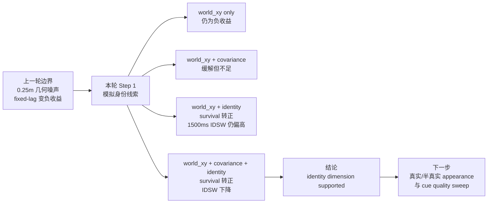

# exp_20260726_003 Analysis Report

## 1. 假设对照

结论：`supported`。

原假设是：在 high useful-window 条件下，0.25m support world-coordinate noise 使 geometry-only fixed-lag 变成负收益；如果加入身份维度，应该能帮助 tracker 选对轨迹，并减少 noisy coordinate 写回历史状态造成的 ID 污染。

结果符合预测。`fixed_lag_world_xy` 在 1000ms / 1500ms 的 survival delta 分别为 `-0.077936` / `-0.078924`，window IDSW delta 为 `2.259563` / `2.915301`。加入 `covariance + simulated identity` 后，medium cue 在 1000ms / 1500ms 的 survival delta 提升到 `0.289408` / `0.167618`，window IDSW delta 降到 `-4.327869` / `-1.333333`。

## 2. 基线比较

排序稳定：

```text
covariance + identity > identity only > covariance only > world_xy only
```

1000ms high useful-window:

```text
cov+id medium survival delta 0.289408
id medium     survival delta 0.144970
cov only      survival delta -0.011726
world_xy      survival delta -0.077936
```

1500ms high useful-window:

```text
cov+id medium survival delta 0.167618
id medium     survival delta 0.076321
cov only      survival delta -0.034936
world_xy      survival delta -0.078924
```

一个重要细节：identity-only 在 1500ms 虽然 survival delta 为正，但 window IDSW delta 仍为 `1.393443`，高于 drop-delayed；`covariance + identity` 才同时改善 survival 和 IDSW。

## 3. 失败模式

geometry-only 的失败不是 useful window 不够，而是 noisy coordinate 的错误权威过高。`fixed_lag_world_xy` 在 0.25m 噪声下把 support 位置写回历史状态，导致 survival 下降、IDSW 上升。

covariance-only 可以缓解但不足以解决：1000ms survival delta 从 `-0.077936` 提升到 `-0.011726`，1500ms 从 `-0.078924` 提升到 `-0.034936`，仍未稳定超过 drop。

identity-only 可以帮 tracker 选对身份，但如果缺少 covariance 对位置更新权威的约束，1500ms 下仍会保留较高 IDSW。失败机制因此是二元的：候选身份需要身份 cue，位置写回需要 covariance/authority control。

## 4. 上限分析

当前最好变体仍没有回到 zero-noise fixed-lag 的水平。上一轮 zero-noise fixed-lag 在 1000ms 的 occlusion IDF1 为 `0.870100`，而本轮 `covariance + identity medium` 在 1000ms 为 `0.279529`；1500ms 为 `0.235204`。

这说明 simulated identity cue 证明了“身份维度有效”，但没有证明“0.25m 噪声已经被完全解决”。剩余差距可能来自：

- simulated cue 与 geometry gate 的阈值没有系统校准；
- noisy world-coordinate 仍参与 position update；
- 当前 identity-only update 只是保守补丁，不是完整的 tracklet-level appearance association；
- 没有真实 bbox/ray/reprojection constraint 参与几何约束。

## 5. 泛化信号

可提炼出三条设计原则：

1. message content 不是通信装饰变量，而是 delayed update 的信息维度。
2. identity cue 与 covariance 控制是互补关系：一个负责“像不像同一个人”，一个负责“这个位置能信多少”。
3. 对异步支撑信息，不能只问“是否在 lag 内到达”；还要问“到达后哪个维度仍然新鲜、可靠、可用于改写 tracker state”。

## 6. 与历史对照

本轮与 `exp_20260726_002` 一致：0.25m 是 fixed-lag geometry-only 的明确边界。区别是本轮证明这个边界不是不可补的。`world_xy only` 仍复现负 survival delta；`covariance + identity` 把该负收益转为正收益。

本轮也呼应 Stage A v2c 的结论：单纯几何风险 gate 有盲区，因为它不能区分“位置偏了但身份仍对”和“位置相近但身份错了”。模拟 identity cue 正是在补这个盲区。

## 7. 下一步建议

P0：加入 checkpoint/resume。
理由：本轮 full run 耗时明显，后续 message-content × delay × noise × cue quality 会更重。成功标准是每个 delay/noise/cue 组合完成后增量落盘，并能从已完成组合恢复。

P0：做 identity cue quality sweep。
改变 `identity_accept_threshold`、embedding margin、noise_sigma，估计真实 ReID 至少需要多大的 same/different separation 才能保留 `0.25m` gain。成功标准是给出 cue quality boundary，而不是只给 strong/medium/weak 三点。

P1：进入真实 message-content ablation。
比较 `world_xy only`、`world_xy + covariance`、`appearance embedding only`、`geometry + appearance`、`geometry + appearance + covariance`。成功标准是真实或半真实 appearance 在 fixed_2/fixed_3 + 0.25m 下复现 simulated identity 的方向。

P1：把 identity-only update 升级为 tracklet-level recovery。
当前 identity-only update 不移动位置，只更新 appearance/last support state。下一轮可把 late support 连接到 pre/post tracklet，观察 fragmentation 与 reacquisition delay 是否进一步下降。

## 流程图



Standalone diagram: `mermaid/exp_20260726_003_matrix_fixed_lag_simulated_identity_cue_ablation/sim_identity_flow.mmd`

## 补充说明

本轮 simulated identity cue 是机制验证，不是最终部署方案。它使用 GT identity 生成隐藏原型，但 tracker 运行时不读取 `person_id` 做关联；embedding lookup key 是 `(capture_time, drone_id, position_id, bbox)`。因此结论应写成：“身份维度可以补 geometry-only 0.25m 边界”，而不是“真实 ReID 已经解决问题”。
