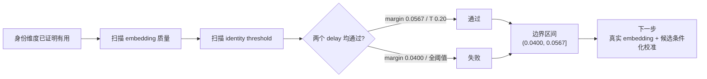

# exp_20260731_001 Analysis Report

## 1. 假设对照

原假设得到支持，判决为 `quality_boundary_identified`，置信度高。

- Measurement gate 全部通过：30/30 condition checkpoints 完成，primary perturbation mismatch 为 `0`，runtime association 不读取 GT `person_id`，上一轮 medium reference reproduction mismatch 为 `0`。
- 在 high useful-window episodes 中，`mean_similarity_margin=0.056747`、`threshold=0.20` 同时通过 1000ms 和 1500ms：最差 delay survival delta 为 `+0.081453`，IDSW delta 为 `-0.489071`。
- 下一档更弱质量 `margin=0.040019` 在五个 threshold 中均不能同时通过两个 delay。最佳 survival 点 `threshold=0.20` 在 1500ms 只有 `+0.025905`，且 IDSW delta 为 `+0.024590`。
- 因此当前离散质量边界为：

```text
(0.040019, 0.056747]
```

这里的边界是当前 simulated embedding generator、MATRIX `0-999`、`fixed_2/fixed_3 + 0.25m` 和 high useful-window 条件下的 empirical target，不是通用 ReID 常数。

## 2. 基线比较

安全基线 `drop_delayed_sort` 在两个 delay 的 occlusion IDF1 都是 `0.052011`。

| Margin | Threshold | 1000ms occ IDF1 | 1500ms occ IDF1 | 两 delay 判定 |
| ---: | ---: | ---: | ---: | --- |
| 0.090886 | 0.20 | 0.222649 | 0.177556 | pass |
| 0.056747 | 0.20 | 0.176403 | 0.146298 | pass |
| 0.040019 | 0.20 | 0.127210 | 0.089675 | fail |
| drop | - | 0.052011 | 0.052011 | safety baseline |

排序在两个 delay 上一致：较高质量 identity cue 优于边界质量，边界质量优于 drop。1500ms 始终是更严格的一侧。

上一轮 medium reference 被精确复现：`margin=0.271948, threshold=0.25` 的 survival delta 分别为 `+0.289408` 和 `+0.167618`，IDSW delta 为 `-4.327869` 和 `-1.333333`。

## 3. 失败模式

失败不是只由 mean margin 决定，而是由 cue quality 与 threshold operating point 联合决定。

- `margin=0.056747` 时，threshold `0.05/0.10` 过宽，1500ms survival 为负且 IDSW 增加；threshold `0.25/0.30` 又过严，support 收益低于 `+0.05`。只有 `0.20` 同时满足 survival 和 IDSW。
- `margin=0.040019` 时，threshold `0.20` 在 1000ms 仍有 survival `+0.096871`，但 1500ms 降到 `+0.025905`，说明较长 delayed replay 是最先失效的压力点。
- 退化呈现边界式变化，但不是单调的“margin 越高越好”标量曲线。身份门控必须在误接受和过度拒绝之间找到窄 operating region。

值得注意的是，全局 pair calibration 在 `margin=0.056747` 选择了 threshold `0.10`，但真正通过 tracking gate 的是 `0.20`。原因是全局 same/different pair 分布和 geometry shortlist 内候选分布不同。

## 4. 上限分析

边界质量方法已经明显高于 drop，但仍低于 medium reference：

- 1000ms：边界 occ IDF1 `0.176403`，medium reference `0.279529`。
- 1500ms：边界 occ IDF1 `0.146298`，medium reference `0.235204`。

这部分差距主要属于方法和 cue quality 空间，而不是数据上限：更可靠 appearance、候选条件化阈值、track-level appearance memory 都可能继续缩小差距。

本轮没有 detector/ReID 图像模型，因此不能把 simulated boundary 直接解释为某个真实模型已经达标。

## 5. 泛化信号

第一，真实 ReID 不应只报告全局 mean same/different margin。至少还要报告 threshold 下的同人接受率、异人误接受率，以及 geometry shortlist 内的 candidate-conditioned 分布。

第二，少量高置信 identity support 就可能有用。边界通过点 `margin=0.056747, threshold=0.20` 的全局 same accept rate 只有 `0.041935`，different accept rate 为 `0.012821`，但在几何和 covariance 共同约束下仍产生正 tracking gain。

第三，identity cue 的作用不是替代 geometry，而是筛选哪些 delayed geometry update 有资格写回历史状态。论文方法应保留 `geometry + covariance + appearance` 的联合结构。

## 6. 与历史对照

结果与 `exp_20260726_003` 一致且更精确：

- 上一轮 simulated weak cue 的 margin 约 `0.069954`，高于本轮最低通过档 `0.056747`，其正收益与新边界一致。
- 上一轮 medium cue 在本轮精确复现，排除了 runner 或指标口径变化。
- 本轮修正了上一轮 strong/medium/weak 三点无法回答“最低质量是多少”的缺口，也证明 threshold 不能固定为 `0.25` 后直接外推。

没有发现与 temporal-spatial boundary 的矛盾：geometry-only 在 0.25m 失败，而质量足够且阈值合适的 identity cue 能恢复收益。

## 7. 下一步建议

P0：真实或半真实 appearance embedding readiness audit。

从 MATRIX 图像 bbox 提取真实 ReID/CNN pooled embedding，先测跨 UAV、跨时间和遮挡前后 similarity；成功标准是在 geometry shortlist 内获得可校准 operating point，并与当前 `(0.040019, 0.056747]` simulated target 对照。风险是 MATRIX 视角差异使通用 ReID margin 不足，此时结果仍能说明需要跨视角适配。

P0：candidate-conditioned threshold calibration。

只在 world-coordinate/covariance gate 产生的候选集合内计算 same/different similarity 分布，再选择 identity threshold。成功标准是离线校准选择能命中 tracking 通过区，而不是像本轮全局校准那样把 `0.056747` 错选为 threshold `0.10`。失败则说明静态阈值不足，需要 track-state 或 uncertainty-conditioned threshold。

P1：真实 message-content ablation。

比较 appearance-only、geometry-only、geometry+appearance、geometry+appearance+covariance。成功标准是最后一种在 `fixed_2/fixed_3 + 0.25m` 保持 survival delta `>=0.05` 且 IDSW delta `<=0`；否则模拟身份收益不能迁移到真实视觉证据。

P2：外部有效性。

在第二数据源或更高 FPS 设置验证 margin/threshold 方向是否保持。数值边界允许变化，但“geometry shortlist + calibrated appearance gate”应保持相同收益方向。

## 流程图



Standalone diagram: `mermaid/exp_20260731_001_matrix_identity_cue_quality_boundary/identity_quality_boundary_flow.mmd`

## 补充说明

本轮 runner 首先对全部 threshold 计算离线 operating points，再运行校准 threshold；随后对边界下侧 `noise=0.40/0.50` 补齐完整 threshold grid。这个两阶段过程避免全局 tracking test-set 调参，同时确保最终失败侧不是单一阈值选择造成的。
