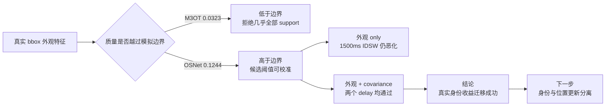

# exp_20260731_002 Analysis Report

## 1. 假设对照

结论：`supported`，正式判决为 `tracking_transfer_supported`，置信度高。

原假设包含两层：真实 embedding 的质量应能预测其跟踪迁移方向；质量足够的真实 appearance 与 covariance 联合后，应在 `fixed_2/fixed_3 + 0.25m` 下同时超过 drop 和 covariance-only。

- 两个 backend 均覆盖全部 `84,834` 条 LoS observation，embedding coverage 为 `1.0`，归一化异常为 `0`。
- 身份两折无 person overlap，primary perturbation、baseline reproduction mismatch 和 runtime-key GT identity leakage 均为 `0`，50/50 checkpoints 完成。
- M3OT-GeM 全局同人/异人 margin 为 `0.032300`，低于模拟失败侧 `0.040019`；它没有通过跟踪迁移。
- OSNet margin 为 `0.124401`，高于模拟通过侧 `0.056747`；`geometry + covariance + appearance` 在 1000ms 和 1500ms 均通过全部条件。

因此，模拟质量边界在本轮正确预测了两个真实 backend 的收益方向。但该数值仍是 MATRIX 当前设置下的经验参照，不是通用 ReID 常数。

## 2. 基线比较

主判据使用 held-out person fold、candidate-conditioned selected threshold 的 episode delta：

| Backend / pipeline | Delay | Survival delta vs drop | IDSW delta vs drop | Survival delta vs covariance | Bootstrap CI low |
| --- | ---: | ---: | ---: | ---: | ---: |
| M3OT cov+app | 1000ms | -0.000946 | +0.030055 | +0.010780 | -0.008749 |
| M3OT cov+app | 1500ms | -0.001366 | +0.040984 | +0.033570 | +0.016878 |
| OSNet app | 1000ms | +0.079506 | -0.300546 | +0.091231 | +0.062279 |
| OSNet app | 1500ms | +0.020715 | +1.486339 | +0.055651 | +0.035431 |
| OSNet cov+app | 1000ms | **+0.185434** | **-2.931694** | **+0.197160** | **+0.169098** |
| OSNet cov+app | 1500ms | **+0.090150** | **-0.338798** | **+0.125086** | **+0.105921** |

排序与模拟消融一致：

```text
OSNet + covariance > OSNet appearance-only > covariance-only > noisy world_xy
```

但 1500ms 下 appearance-only 的 IDSW 比 drop 高 `1.486339`，所以它不能单独通过。只有 covariance 控制 noisy position update 权威后，survival 和 IDSW 才同时改善。

OSNet cov+app 的平均 occlusion IDF1 为 `0.205419`（1000ms）和 `0.150653`（1500ms）；drop 为 `0.052011`。这是明显增益，但绝对性能仍然较低。

## 3. 失败模式

第一类失败是 embedding 分离度不足。M3OT-GeM 的 margin 只有 `0.032300`；候选条件化校准在两个 fold 选择约 `0.936/0.938` 的阈值，同人和异人接受率都为 `0`。该策略实质上退化为拒绝 support，因此相对 drop 几乎无收益。

第二类失败是“身份正确但位置权威过高”。OSNet appearance-only 在 1000ms 有正收益，但 1500ms 的 survival 只有 `+0.020715`，且 IDSW 恶化。加入 covariance 后两个指标同时通过，说明 appearance 负责选轨迹，covariance 负责限制位置写回，两者不可互换。

第三类失败是 threshold operating point 敏感。OSNet 的 selected threshold 约 `0.844` 表现最好；下调约 `0.05` 后，1500ms cov+app survival 仅 `+0.003864` 且 IDSW `+0.371585`。静态阈值过宽会让错误候选重新进入历史状态。

退化随 delay 增大：OSNet cov+app survival 从 1000ms 的 `+0.185434` 降到 1500ms 的 `+0.090150`。真实 appearance 没有消除 temporal boundary，只是把 0.25m geometry-only 的负收益恢复为正收益。

## 4. 上限分析

OSNet 已通过迁移门槛，但仍低于 simulated medium cue：

| Delay | OSNet cov+app | Simulated medium cov+id | 差距 |
| --- | ---: | ---: | ---: |
| 1000ms | +0.185434 | +0.289408 | 0.103974 |
| 1500ms | +0.090150 | +0.167618 | 0.077468 |

与 zero-noise fixed-lag 上界的差距更大：此前 occlusion IDF1 为 `0.870100/0.724058`，本轮 OSNet 只有约 `0.205/0.151`。主要改进空间仍在 noisy geometry 的位置更新、真实几何约束、外观记忆和关联机制，而不是仅更换 embedding backbone。

运行时指标也不能直接解释为端到端实时性能。OSNet cov+app tracker 平均约 `298ms/frame`（1000ms）和 `351ms/frame`（1500ms），但 embedding 已预提取并缓存，未计入 CNN 特征提取成本。

## 5. 泛化信号

1. 模拟 identity quality boundary 可以作为真实模型筛选工具：低于失败侧的 M3OT 失败，高于通过侧的 OSNet 通过。
2. 全局 margin 只能预测方向，真正可用的 threshold 必须在 geometry-shortlisted candidate 分布上校准，并用 held-out identity 评价。
3. Identity cue 不是 geometry 的替代品。有效结构是“geometry 生成候选、appearance 选择身份、covariance 控制位置权威”。
4. 多维消息不能整体接受或整体丢弃。下一步应显式分离 identity-state update 和 position-state update，而不是继续增加统一 gate 阈值。

## 6. 与历史对照

结果与三轮历史证据一致：

- `exp_20260726_002`：0.25m 使 geometry-only fixed-lag survival 转负。
- `exp_20260726_003`：simulated identity + covariance 将负收益恢复为正收益。
- `exp_20260731_001`：最低通过模拟 margin 为 `0.056747`，`0.040019` 完整失败。
- 本轮：M3OT `0.032300` 失败，OSNet `0.124401` 通过，并再次证明 covariance + identity 的互补关系。

本轮最初输出过 `measurement_invalid`，原因是 gate 用源码字符串搜索 `person_id`，误命中了“不使用 person_id”的 docstring。现已改为行为审计：仅改变 observation 的 GT personID，确认 runtime key 不变。修正后 measurement valid=`1`；正式 tracker checkpoint 未重跑或改写，判决由已有 50/50 输出重新汇总得到。

## 7. 下一步建议

**P0：身份状态与位置状态更新分离消融。**

比较 position-only、identity-only、joint accept/reject 和 separated update。目标是证明 OSNet 的增益来自正确的状态更新结构，而不只是“多加一个 cue”。成功标准：separated update 在两个 delay 上相对当前 cov+app survival 再提高或持平，同时降低 harmful position updates 和 IDSW。

**P0：真实几何观测替换。**

将 noisy GT world XY 逐步替换为 `bbox + camera pose/ray` 或 reprojection constraint；保持同一冻结 OSNet。成功标准：`geometry + covariance + appearance` 相对各自 geometry-only baseline 的收益方向保持一致。失败则说明当前 world-XY proxy 不能迁移到真实投影误差。

**P1：分维度时间有效性。**

比较统一 hard lag、统一 decay 和 geometry/appearance 独立 authority。目标是验证旧消息中 geometry 已失效时，appearance 是否仍可用于 identity-only update，而不移动位置。

**P2：外部有效性与统计稳健性。**

增加多个 support-noise seed、第二数据源或更高 FPS 设置。数值 margin 可以变化，但“低分离度失败、高分离度 + covariance 通过”的方向应保持。

## 流程图



Standalone diagram: `mermaid/exp_20260731_002_matrix_real_embedding_quality_transfer/real_embedding_transfer_flow.mmd`。

## 补充说明

本轮使用 GT projected bbox 和预提取 frozen embedding，不包含 detector error、端到端 CNN latency 或真实 ray/reprojection uncertainty。因此结论是“真实 appearance evidence 能迁移模拟身份维度收益”，不是“真实多 UAV 部署链路已经完成”。
