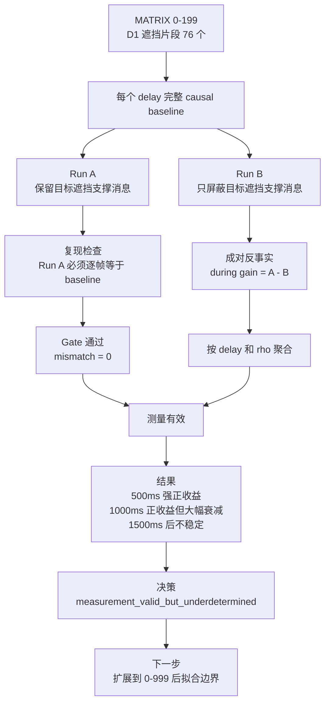

# exp_20260705_001 分析报告

## 1. 假设对照

**结论：supported for measurement, ambiguous for boundary.**

原假设有两层：第一，成对反事实可以消除上一轮全局切片中的回放重编号和跨遮挡片段状态污染；第二，修正测量后可以识别延迟与遮挡比值的伤害边界。

第一层得到支持。`replay_reproduction_audit.csv` 中 456 行 Run A 检查全部通过，mismatch 总数为 0；`lineage_stability_audit.csv` 中 ambiguous、unmatched、pre-ID mismatch 均为 0；屏蔽 manifest mismatch 为 0。说明 A/B 分支差异主要来自目标遮挡片段的支撑消息是否存在。

第二层仍不充分。`counterfactual_decision.md` 给出 `measurement_valid_but_underdetermined`：有效 delay-rho cell 只有 8 个，低于预设的 15 个，不能拟合稳定边界。

## 2. 基线比较

整体排序稳定为 `offline_timestamped_corrected > causal_timestamped_online > arrival_time_fusion > primary_only`，但 500 ms 时 arrival 与 causal 的遮挡 IDF1 相同，均为 0.990。

关键遮挡 IDF1：

| Delay | Primary | Arrival | Causal | Offline |
| --- | ---: | ---: | ---: | ---: |
| 500 ms | 0.036 | 0.990 | 0.990 | 1.000 |
| 1000 ms | 0.036 | 0.197 | 0.393 | 1.000 |
| 1500 ms | 0.036 | 0.229 | 0.301 | 1.000 |
| 2500 ms | 0.036 | 0.190 | 0.220 | 1.000 |
| 5000 ms | 0.036 | 0.149 | 0.184 | 1.000 |

Causal replay 在 1000 ms 后仍高于 arrival 和 primary-only，说明捕获时刻回放有在线价值；但它与 offline 上界距离很大，说明迟到消息即使事后可修正，在线发布时仍错过关键窗口。

## 3. 失败模式

主要退化是 delay cliff，而不是单纯的遮挡比例 cliff。

在 `rho<0.25` 的长遮挡桶内，during gain 随绝对延迟快速衰减：

| Delay | n | Mean during gain | Direction |
| --- | ---: | ---: | --- |
| 500 ms | 58 | 0.926 | positive_stable |
| 1000 ms | 58 | 0.275 | positive_stable |
| 1500 ms | 58 | 0.050 | inconclusive |
| 2500 ms | 34 | 0.023 | inconclusive |

这直接反驳“只要 `delay / occlusion_duration` 小就安全”的解释。即使 rho 仍小于 0.25，1000 ms 后 support 对遮挡期间身份延续的贡献已经从强收益变成弱收益。

消息及时率也不足以解释全部现象：1000 ms 下 eligible episode 的平均及时消息比例仍约 0.901、在线覆盖约 0.894，但 Run A 的 during same fraction 只有 0.398。这说明“是否在遮挡结束前到达”不是充分条件，tracker 的离散状态、回放时刻和轨迹候选状态仍会造成在线身份损失。

## 4. 上限分析

Offline corrected 在所有 delay 下遮挡 IDF1 都是 1.000，是当前 GT 世界坐标设置的理论上界。Causal online 与上界的差距：

- 1000 ms：0.607
- 1500 ms：0.699
- 2500 ms：0.780
- 5000 ms：0.816

这个差距不是数据上界造成的，而是在线可用性和回放机制造成的。成对反事实进一步说明：1000 ms 仍有稳定正因果增益 0.271，但 1500 ms 后 during gain 已接近不可用。因此方法空间的下一步不是继续证明“support 有无价值”，而是界定“何时仍值得在线融合”。

## 5. 泛化信号

第一，在线结果和离线修正必须分开报告。Offline 1.000 不代表在线系统可用，因为历史输出不能被改写。

第二，支撑观测价值有明确的新鲜度衰减。短延迟时支撑观测几乎完全接住遮挡身份，1000 ms 仍有收益但显著变弱，1500 ms 后收益不稳定。

第三，边界至少需要绝对延迟和遮挡相对位置的联合描述。`rho_episode` 可用于事后分析，但不能作为唯一边界变量，更不能直接作为实时 gate 输入。

## 6. 与历史对照

本轮修正了 `exp_20260630_003` 的两个主要混淆：全局切片归因不干净，以及回放可能改变轨迹编号。修正后，Run A 逐帧复现 baseline，lineage ambiguity 为 0，说明上一轮“需要反事实校准”的判断是正确的。

趋势与上一轮一致：causal online 在 500 ms 接近 oracle，在 1000 ms 明显退化，在 5000 ms 仍高于 primary-only 但远低于 offline。新增结论是：这个退化在成对反事实 gain 中也成立，不只是 aggregate IDF1 的表象。

与 Stage A 几何门控结果也一致：纯几何支撑不是无条件有益。只有在主视角遮挡且延迟足够短时，support 才有强正边际价值。

## 7. 下一步建议

- **P0：扩展到 MATRIX 0-999。** 当前只有 8 个 `n>=5` 的 delay-rho cell，未达到边界拟合门槛。扩展目标是获得至少 15 个有效 cell，并覆盖更多短遮挡和高 rho 桶。
- **P0：保留成对反事实测量，不退回全局切片。** 本轮证明全局切片可被成对 A/B 替代；后续所有边界拟合都应以 `during_gain` 和 `spillover_gain` 为主指标。
- **P1：拟合联合边界。** 主模型建议使用 `during_gain ~ delay_ms + online_support_coverage_fraction + interaction`，`rho_episode` 作为诊断变量，不作为唯一解释变量。
- **P1：补工程优化。** 当前 formal 需要并行 worker，Run A cache 是主要瓶颈；0-999 前应考虑按 frame snapshot 分支恢复或至少保留进度日志。
- **P2：边界稳定后再加入 pose noise。** 不应在边界未识别前引入 `v*delay/gate_radius` 或多信息维度门控，否则会混淆时序边界和空间噪声。

## 流程图

来源：`mermaid/exp_20260705_001_matrix_occlusion_counterfactual_measurement_calibration/counterfactual_calibration_flow.mmd`

## 补充说明

本轮不应被解读为“已经得到 harm boundary”。更准确的表述是：0-199 上的成对反事实测量可信，且发现绝对延迟对支撑因果增益有强影响；但边界形式仍需更多遮挡片段支持。
