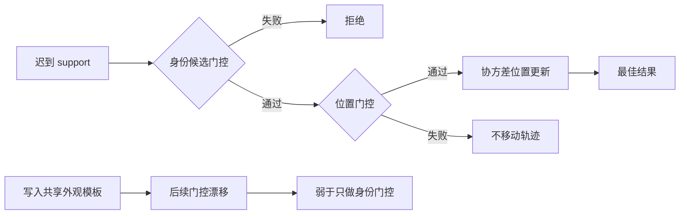

# exp_20260801_001 Analysis Report

## 总体结论

Formal 决策为 `identity_gate_only_supported`，measurement gate 全部通过。最强机制不是“把 support 外观写入轨迹模板”，而是“用身份相似度筛选候选轨迹，再执行协方差感知的位置更新”。OSNet 和 simulated-medium 在 `fixed_2/fixed_3` 上均显著优于 covariance-only；但更新 support appearance template 的 current-joint 和 separated-update 都明显弱于不写 support 模板的 identity-gated-position-only。

本轮不支持 `separated_update_supported`，不支持 `lifecycle_effect_dominant`，也未触发预定义的 `tracker_architecture_bottleneck`。这里的准确解释是：当前主要可用收益来自身份门控，而不是身份状态单独更新；simulated-medium 已恢复 68%--72% 的 zero-noise headroom，因此不能把剩余差距全部归因于 KF/Hungarian，但仍有约 28%--32% 性能空间未恢复。

## 1. 假设对照

### 1.1 身份候选选择

**结论：strongly supported。** 在 useful-window 主子集上，`identity_gated_position_only` 相对 `covariance_position_only` 的 survival 增益如下，所有 person-cluster bootstrap 95% CI 均不跨 0：

| Identity | Delay | Survival difference | 95% CI | Window IDSW difference |
| --- | --- | ---: | --- | ---: |
| OSNet fold 0 | fixed_2 | +0.392449 | [0.339953, 0.434715] | -5.993631 |
| OSNet fold 1 | fixed_2 | +0.321436 | [0.285471, 0.355563] | -5.574163 |
| OSNet fold 0 | fixed_3 | +0.228339 | [0.200501, 0.252502] | -2.917197 |
| OSNet fold 1 | fixed_3 | +0.216741 | [0.186710, 0.248713] | -3.129187 |
| simulated-medium | fixed_2 | +0.433624 | [0.398438, 0.463176] | -7.049180 |
| simulated-medium | fixed_3 | +0.285901 | [0.263649, 0.305764] | -3.866120 |

身份信息已经形成可靠运行时价值，但价值形式是**选择/排除候选轨迹**，而不是独立生成在线轨迹。

### 1.2 身份与位置分离更新

**结论：rejected under current implementation。** `separated_update` 相对 `current_joint_reference` 的 survival 差仅为约 `0.003--0.011`，OSNet 两折的 CI 均跨 0；simulated-medium 差异为 0。IDSW 也没有稳定的 10% 改善。

### 1.3 生命周期效应

**结论：rejected。** `identity_only_with_lifecycle` 与 `identity_only_strict` 在全部条件下差异精确为 0。单纯重置 miss/延长存活不能建立身份连续性。

### 1.4 跟踪器架构瓶颈

**结论：未触发预定义判据。** simulated-medium 的最佳变体恢复率在两个 delay 都超过 60%，所以不能将当前失败主要归因于简单 KF/Hungarian。不过该结论不代表架构已充分，只代表它不是本轮规则下的首要阻塞项。

## 2. 基线比较

### Occlusion IDF1

| Pipeline | fixed_2 | fixed_3 |
| --- | ---: | ---: |
| drop-delayed | 0.052011 | 0.052011 |
| covariance position-only | 0.092749 | 0.072636 |
| OSNet current joint | 0.205419 | 0.150653 |
| OSNet separated | 0.207084 | 0.149244 |
| **OSNet identity-gated position-only** | **0.386625** | **0.305918** |
| simulated-medium current joint | 0.279529 | 0.235204 |
| **simulated-medium identity-gated position-only** | **0.638227** | **0.509608** |
| zero-noise fixed-lag reference | 0.870100 | 0.724058 |

### Occlusion IDSW

| Pipeline | fixed_2 | fixed_3 |
| --- | ---: | ---: |
| drop-delayed | 5084 | 5084 |
| covariance position-only | 5220 | 5623 |
| OSNet current joint | 3996 | 4905 |
| OSNet identity-gated position-only | **3132.5** | **4490.5** |
| simulated-medium identity-gated position-only | **2651** | **4163** |

排序在两个 delay 上一致：

```text
simulated identity gate > OSNet identity gate
> current joint ~= separated
> covariance-only > drop-delayed  (IDF1)
```

但 covariance-only 的 IDSW 比 drop 更差，说明“略升 IDF1”不能证明带噪位置更新是安全的。

## 3. 失败模式

1. **support 模板写回退化。** 相对 identity-gated-position-only，current-joint 的 survival 在 OSNet 上下降 `0.097--0.177`，在 simulated-medium 上下降 `0.083--0.132`，全部 CI 均低于 0。当前共享/递推模板会改变后续候选门控，是主要负效应来源。
2. **身份状态没有输出通路。** strict identity-only 与 drop 完全相同，因为主视角仍使用纯几何 Hungarian，appearance template 不参与 primary reacquisition。
3. **更长 delay 继续压缩收益。** 最佳 OSNet IDF1 从 `0.386625` 降至 `0.305918`，simulated-medium 从 `0.638227` 降至 `0.509608`。身份门控没有消除 useful-window 和时间边界。
4. **真实外观与模拟身份仍有明显差距。** OSNet 相对 simulated-medium 的最佳 IDF1 分别低 `0.251602` 和 `0.203690`，说明跨视角外观质量仍然重要，但不是“support 完全无信息”。
5. **局部位置误差指标不能等同于身份伤害。** identity-gated-position-only 的 harmful-position fraction 仍约为 34%--40%，但 IDF1/IDSW 显著改善。单次位置更新使 clean-position error 变大，不一定意味着它造成了错误身份关联。

## 4. 上限分析

| Identity | Delay | Best IDF1 | Zero-noise upper | Headroom recovery |
| --- | --- | ---: | ---: | ---: |
| OSNet | fixed_2 | 0.386625 | 0.870100 | 40.90% |
| OSNet | fixed_3 | 0.305918 | 0.724058 | 37.78% |
| simulated-medium | fixed_2 | 0.638227 | 0.870100 | 71.66% |
| simulated-medium | fixed_3 | 0.509608 | 0.724058 | 68.09% |

OSNet 仍只恢复约 38%--41% 性能空间，主要改进空间包括跨视角外观表征和模板管理。simulated-medium 已超过 60% 规则，但仍丢失约 28%--32%，这部分可能来自 0.25m 位置噪声、固定几何门限和 primary-only geometry association，不能由本轮单独分解。

## 5. 泛化信号

1. **身份线索最安全的第一作用是授权，而不是改写。** 它先回答“这条位置消息属于哪条轨迹”，再由几何/协方差决定位置权威。
2. **跨视角 appearance memory 不应默认共用一个递推模板。** support embedding 可以用于匹配，但写入主视角模板可能形成跨视角漂移。
3. **生命周期不是身份。** 让轨迹活得更久不会自动保持正确 ID，必须存在关联或重连接通路。
4. **按信息维度拆分仍然必要，但分离动作本身不保证收益。** 身份状态只有进入后续决策，才可能改变输出。

## 6. 与历史对照

- 与 simulated identity ablation 一致：身份维度能补偿 0.25m 几何噪声边界。
- 与 real embedding transfer 一致：OSNet 有真实收益，但弱于 simulated-medium；M3OT-GeM 失败不能外推为跨视角外观整体无效。
- 本轮修正了上一轮的归因：之前 `covariance + appearance` 的收益主要不是 support appearance template 更新，而是 appearance gate 帮助选择位置更新目标。
- 与 zero-noise fixed-lag 对照一致：时间对齐和 useful window 仍是上限条件，身份门控只解决候选混淆，不能消除延迟本身。

## 7. 下一步建议

### P0：跨视角外观模板权威消融

比较 `primary-anchored template`、共享 EMA、主/support 双模板和置信度加权 support template。保持位置 gate、delay、noise 和 OSNet 完全不变。

成功标准：双模板或置信度更新不低于当前 identity-gated-position-only，且相对 shared current-joint survival 提升的 CI 下界大于 0。失败则固定采用 primary-anchored gate，不再写 support 外观模板。

### P1：appearance-assisted primary reacquisition

让冻结的身份状态只参与主视角重现后的候选关联，不改变遮挡期已发布轨迹，也不写 noisy support position。该实验回答 strict identity-only 当前没有输出通路的问题。

成功标准：相对 drop 和 identity-only-strict 降低 reacquisition IDSW/fragmentation，同时 during-occlusion predictions 保持不变。

### P1：真实几何观测迁移

将 GT world-XY + Gaussian noise 替换为 `bbox + camera pose/ray` 或 reprojection constraint，保留本轮胜出的 identity-gated authority 结构。

成功标准：候选门控相对 covariance-only 的方向在真实几何误差下保持；若反转，应将贡献限定为 controlled world-coordinate 机制。

### P2：更强运动/轨迹骨干

在上述机制固定后，再以 Mamba motion predictor 或更强 track memory 替换 KF。必须比较同一 backbone 下 delayed method 相对 drop 的净增益，避免把普通 tracker 提升误写成异步融合贡献。

## 流程图

见：`mermaid/exp_20260801_001_matrix_identity_position_update_separation_audit/update_separation_flow.mmd`



## 补充说明

- Measurement gate：34/34 condition checkpoints 完成；primary perturbation、embedding norm、GT runtime key、真实/模拟 reference reproduction mismatch 均为 0。
- `identity_gated_position_only` 仍会由主视角观测维护 appearance state；“position-only”指 support 不写外观模板，不代表 tracker 没有 appearance template。
- current-joint 与 identity-gated-position-only 的差异包含 support 模板递推形成的后续候选变化。下一轮应通过双模板/冻结模板消融进一步确认模板污染机制。
