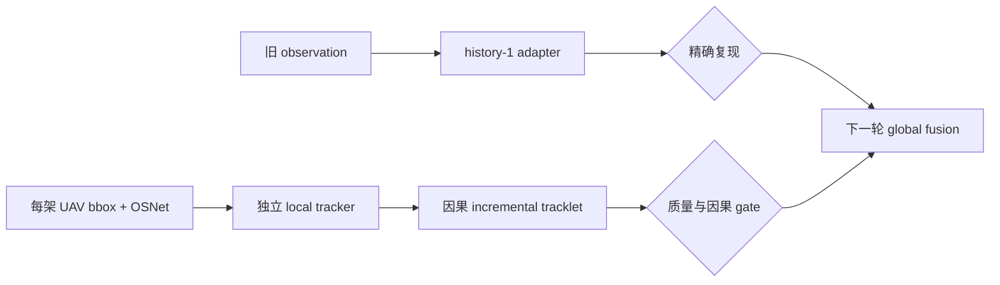

# exp_20260801_002 MATRIX Incremental Tracklet Update Foundation

## Summary

本轮只建立真正两阶段 MVMOT 所需的本地轨迹层和增量消息层，不立即宣称
global asynchronous tracklet fusion 有效。

核心问题：

> 每架 UAV 能否在不读取 GT identity 的前提下，独立形成质量足够的 local
> tracklet，并以严格因果的方式逐帧输出增量状态？

本轮通过后，下一轮才比较 observation packet 与 incremental tracklet packet
在 fixed-lag global association 下的性能。

输出目录：

```text
outputs/20260801_matrix_incremental_tracklet_update_foundation/
```

## Why Two Gates

接口等价和 local tracking 是两个不同问题，必须分开：

```text
Gate A: observation -> history-1 tracklet adapter
        不运行 local association
        必须精确复现旧管线

Gate B: per-UAV independent local tracker
        真正生成 local_track_id 和累计状态
        评价 purity / IDF1 / fragmentation
```

如果让新 local tracker 承担 history-1 复现，接口变化和关联变化会混杂。

## P0-A: History-1 Message Equivalence

新增 `IncrementalTrackletUpdate` 消息结构，但先将每条原 observation 包装成
退化 tracklet update：

```text
history_length = 1
tracklet_start_frame = capture_time
latest_bbox = observation.bbox
latest_world_xy = observation.world_xy
single_embedding = observation.embedding
pooled_embedding = single_embedding
has_measurement = true
```

适配回旧 runner 后必须满足：

```text
prediction row mismatch = 0
track_id mismatch = 0
pipeline metric mismatch < 1e-12
support action mismatch = 0
```

该 gate 只验证消息接口，不把退化 local ID 当作 global ID。

锁定的旧 reference 是 `exp_20260801_001` 的 OSNet
`identity_gated_position_only`：`fixed_2/lag2`、`fixed_3/lag3`、support
world-XY noise `0.25m`，并分别复现两个 held-out threshold fold。

## P0-B: Independent Local Tracklets

### Input

```text
MATRIX frames 0-999
GT projected bbox + LoS
frozen OSNet cache from exp_20260731_002
no detector error
no support world-XY in local association
personID evaluation only
```

### Local tracker variants

`local_bbox_sort`：

- state: `[cx, cy, aspect, height, vx, vy, va, vh]`
- constant-velocity Kalman prediction
- IoU/center-motion gate
- Hungarian association

`local_bbox_osnet`：

- same motion state
- Kalman Mahalanobis gate before appearance comparison
- OSNet cosine distance inside the valid motion candidates
- person-disjoint threshold calibration
- Hungarian association

默认每个 UAV 使用独立 tracker 和 ID namespace：

```text
D1 local_id=7 != D3 local_id=7
```

本轮 `min_hits=1`，避免把 track confirmation waiting 混入通信延迟；
`max_age=5`，并在输出中报告敏感性风险，不做大规模阈值扫描。

## Incremental Message Semantics

每个 active local tracklet 在每个 capture frame 产生一个严格因果状态：

```text
view_id
local_track_id
capture_time
tracklet_start_frame
history_length
latest_bbox
bbox_velocity
filtered_world_xy
world_covariance
latest_embedding
pooled_embedding
appearance_count
hit_count
miss_count
has_measurement
```

规则：

- 所有字段只允许读取 `frame <= capture_time` 的历史。
- `has_measurement=false` 表示当前是预测状态，不伪装成新观测。
- support world-XY noise 只进入 tracklet 的受控 world-state accumulator，
  不用于 local bbox association。
- local track ID 不直接复用为 global track ID。
- pooled appearance 只聚合同一 UAV、同一 local tracklet 的已关联观测。

## Component Readiness Audit

本轮只评价信息是否被可靠构造，不做正式 global fusion 决策：

```text
single-frame state
accumulated motion/covariance
single-frame appearance
causal pooled appearance
full incremental tracklet state
```

重点回答：

1. local tracklet 是否足够纯，允许后续跨视角关联？
2. pooled appearance 的 same/different margin 是否高于 single crop？
3. filtered world state 是否降低随机误差，而不掩盖系统偏差？
4. tracklet history 增长时，消息是否仍严格因果？

## Settings

```text
frame range: 0-999
views: D1-D8, independent local trackers
fps: 2.0
local input: GT projected bbox + frozen OSNet
support world-XY noise for message audit: 0.25m
seed: 7
local variants: bbox_sort, bbox_osnet
min_hits: 1
max_age: 5
```

OSNet threshold calibration/evaluation identities must remain disjoint. The
runtime local tracker receives no fold or person identity.

交叉评价方式与上一轮一致：用一个 person fold 校准 local appearance
threshold，只评价另一个 fold，然后交换。完整 observation stream 可以进入
tracker，但 fold/person 标签不得成为运行时输入。

## Outputs

```text
local_tracklet_predictions.csv
local_tracklet_manifest.csv
local_tracklet_quality_by_view.csv
local_tracklet_failure_cases.csv
incremental_tracklet_message_manifest.csv
incremental_tracklet_causality_audit.csv
history1_equivalence_audit.csv
tracklet_appearance_quality.csv
tracklet_world_state_quality.csv
cross_view_tracklet_overlap.csv
incremental_tracklet_foundation_decision.md
checkpoints/
```

## Decision Rules

### Gate 1: Message Equivalence

`history1_equivalence_pass` requires all four mismatch counts to be zero and
metric error `<1e-12`.

### Gate 2: No-GT Leakage and Causality

Requires:

```text
runtime personID reads = 0
future-frame reads = 0
cross-view local-ID reuse as global ID = 0
determinism mismatches at seed 7 = 0
```

### Gate 3: Local Tracklet Readiness

For views with at least 100 evaluated detections:

```text
macro local IDF1 >= 0.80
weighted tracklet purity >= 0.95
per-view local IDF1 >= 0.70
strict D1-occlusion frames with an active correct support tracklet >= 90%
```

The threshold is a readiness gate, not a paper performance claim.

### Gate 4: Aggregation Signal

At least one must hold:

```text
pooled appearance margin - single-crop margin >= 0.02
or
filtered world-XY RMSE improves over latest noisy observation by >= 10%
```

Report correlated/systematic world-coordinate error separately; averaging is
not allowed to claim removal of camera-pose bias.

### Final Decisions

`ready_for_async_tracklet_fusion`:

- Gates 1-3 pass;
- cross-view overlap is sufficient;
- proceed to fixed-lag tracklet association even if Gate 4 has no signal.

`ready_with_aggregation_signal`:

- Gates 1-4 pass;
- next experiment must ablate motion and appearance aggregation separately.

`local_tracklet_quality_blocked`:

- Gate 1/2 pass but Gate 3 fails;
- improve local tracker before global asynchronous fusion.

`measurement_invalid`:

- Gate 1 or Gate 2 fails;
- stop before interpreting local/global metrics.

## Implementation Plan

新增：

```text
src/tracking/matrix_local_tracklet.py
scripts/phase3_matrix_incremental_tracklet_foundation.py
tests/test_matrix_incremental_tracklet.py
```

复用：

```text
src/tracking/matrix_gt.py
src/tracking/matrix_identity_cue.py
src/tracking/matrix_real_appearance.py
outputs/20260731_matrix_real_embedding_quality_transfer/embedding_cache/
```

脚本必须支持：

```text
--progress-every
--resume
每个 view x local-variant 独立 checkpoint
```

实施审计发现上一轮 OSNet 缓存只覆盖 observation-level 的遮挡支撑流，不能
直接覆盖所有 UAV 的完整 local detection 流。因此新增：

```text
scripts/prepare_matrix_local_tracklet_osnet_cache.py
```

它使用同一冻结 OSNet，只提取缺失 crop，不重新训练或校准网络。实验入口在
local tracking 前执行 `embedding coverage >= 95%` 硬门，且 checkpoint 与缓存
指纹绑定，禁止复用不完整缓存产生的结果。

## Test Plan

单元测试：

```text
history-1 adapter preserves all observation fields
history-1 round trip reproduces reference predictions
different UAVs use independent local ID namespaces
shuffling personID does not change local association
pooled embedding uses no future observations
predicted-only update sets has_measurement=false
local tracklet snapshot/restore is deterministic
world-state accumulator separates random noise from clean truth
checkpoint/resume does not duplicate messages
```

Smoke：

```bash
PYTHONPATH=src /usr/bin/python3 scripts/phase3_matrix_incremental_tracklet_foundation.py \
  --matrix-root MATRIX/MATRIX_30x30 \
  --frame-start 0 --frame-end 49 \
  --drone-ids 0 1 2 3 4 5 6 7 \
  --local-trackers bbox_sort bbox_osnet \
  --real-embedding-dir outputs/20260731_matrix_real_embedding_quality_transfer \
  --pose-noise-m 0.25 \
  --min-hits 1 --max-age 5 \
  --seed 7 --progress-every 25 --resume \
  --output-dir outputs/20260801_matrix_incremental_tracklet_update_foundation_smoke
```

Formal：将 `--frame-end` 改为 `999`，输出目录改为正式目录。

Verification：

```bash
PYTHONPATH=src python -m pytest tests/test_matrix_incremental_tracklet.py -q
PYTHONPATH=src python -m pytest tests/ -q
PYTHONPATH=src /usr/bin/python3 -m py_compile \
  src/tracking/matrix_local_tracklet.py \
  scripts/phase3_matrix_incremental_tracklet_foundation.py
```

## Explicitly Deferred

- global fixed-lag tracklet association formal
- detector false positive / miss / bbox noise
- real camera ray or reprojection geometry
- completed-tracklet batching and communication-rate optimization
- Mamba/end-to-end tracker

## Status

Implemented; smoke completed; formal blocked by Gate 3.

Smoke `0-49`：

```text
embedding coverage: 25.59% -> 100% after missing-crop cache preparation
history-1 prediction/action mismatch: 0 in all 4 conditions
no-GT/causality/determinism gate: passed
bbox_osnet macro local IDF1: 0.073641
bbox_osnet weighted purity: 0.959313
bbox_osnet minimum-view IDF1: 0.054650
bbox_sort macro local IDF1: 0.248077
bbox_sort weighted purity: 0.329275
decision: local_tracklet_quality_blocked
```

`bbox_sort` 的主要问题是跨身份合并；`bbox_osnet` 的主要问题是轨迹过度碎片化。
Gate 3 已有每视角数百至上千条评价检测，不应直接用 `0-999` 扩展替代机制修复。
下一步先加入适用于移动相机的局部跟踪基线和运动补偿，再重新执行 readiness gate。

Flowchart:
`mermaid/exp_20260801_002_matrix_incremental_tracklet_update_foundation/incremental_tracklet_flow.mmd`.


