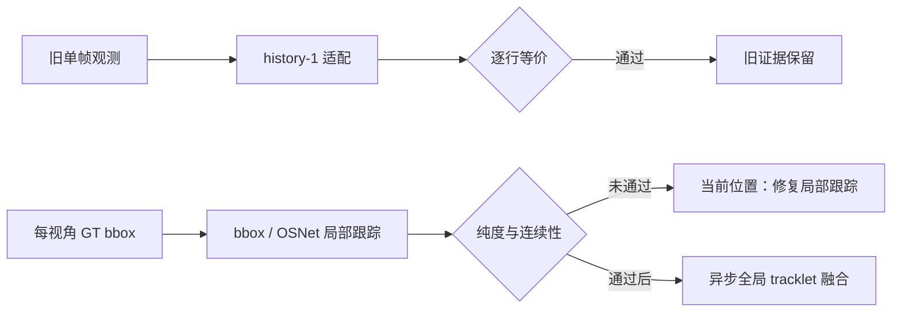

# exp_20260801_002 Analysis Report

Status: smoke complete; formal blocked by the predefined local-quality gate.

## 1. 假设对照

- **接口假设：通过。** `fixed_2/fixed_3 x fold 0/1` 四个 history-1 条件中，
  prediction、track ID、support action mismatch 均为 `0`，metric error 为 `0`。
- **局部轨迹就绪假设：拒绝。** `bbox_osnet` 的 macro local IDF1 仅
  `0.073641`，远低于 `0.80`；`bbox_sort` 也只有 `0.248077`。
- **因果与无泄漏假设：通过。** 消息结构无 `person_id`，runtime person-ID
  read、future read、local-to-global ID reuse 和 determinism mismatch 均为 `0`。

## 2. 基线比较

| 方法 | Macro local IDF1 | 加权纯度 | 最差视角 IDF1 | 遮挡支撑覆盖 |
| --- | ---: | ---: | ---: | ---: |
| `bbox_sort` | 0.248077 | 0.329275 | 0.174558 | 0.930894 |
| `bbox_osnet` | 0.073641 | 0.959313 | 0.054650 | 1.000000 |

排序揭示两种相反失败：bbox-only 轨迹较长但串人；OSNet 轨迹较纯但被切成大量
短片段。后者不能因 purity 高而被视为可用于跨视角关联。

## 3. 失败模式

- D1 在 50 帧内，`bbox_sort` 产生 126 条轨迹，单条轨迹最多混入 15 个身份。
- D1 的 `bbox_osnet` fold 0 产生 469 条轨迹，最长仅 5 个检测，表现为门控过严。
- 当前常速度图像平面模型没有相机运动补偿；2 FPS 下无人机自运动会让 bbox
  innovation 偏大，严格 Mahalanobis gate 将正确同人候选拒绝。
- OSNet 的离线同人接受率约 `0.92`，仍会放大碎片问题，但不是唯一根因。

## 4. 上限分析

当前差距首先属于局部跟踪方法空间，而非异步全局融合空间。GT bbox 已排除 detector
误差，仍无法形成稳定局部轨迹，因此现在接入 global fixed-lag fusion 只会把局部碎片
误当作通信或跨视角关联问题。formal 扩展不能修复这一结构缺陷。

## 5. 泛化信号

1. 两阶段 MVMOT 的通信单位升级以可靠 local tracklet 为前提；单看纯度不够，必须同时
   检查连续性和碎片数。
2. 移动相机下直接套用静态相机 SORT 的图像平面常速度假设风险很高。
3. 外观门控存在 purity-fragmentation trade-off；阈值不能脱离运动补偿和轨迹生命周期
   单独确定。

## 6. 与历史对照

- 旧 observation-level 结论没有失效：history-1 精确复现证明接口迁移没有改变旧证据。
- 上一轮 OSNet 能改善 support-to-global-track 候选授权，不意味着它能单独维持高质量
  per-view local tracklet；两个任务的候选集合和时间连续性要求不同。
- 原计划假设旧 OSNet cache 覆盖全视角，实际 smoke 仅覆盖 `25.59%`。补提取缺失 crop
  后达到 `100%`，该前提问题已经转成硬测量门。

## 7. 下一步建议

1. **P0：局部跟踪器机制修复。** 加入相机运动补偿，并比较 SORT、OC-SORT、
   BoT-SORT/ByteTrack 风格的局部关联；仍使用 GT bbox，隔离局部关联能力。
2. **P0：门控归因。** 分别扫描 motion gate 与 appearance gate，报告同人拒绝率、异人
   接受率、fragmentation 和 merge rate，目标是同时满足 purity 与 IDF1 gate。
3. **P1：通过 Gate 3 后再跑 0-999。** formal 的成功标准保持不变；如果移动相机基线
   仍低于 IDF1 `0.70`，应更换成熟 local MOT tracker，而不是继续手调 KF。
4. **P2：只有 readiness 通过后**，进入 observation packet 与 incremental tracklet
   packet 的 fixed-lag global fusion 对照。

## 流程图

外部图：
`mermaid/exp_20260801_002_matrix_incremental_tracklet_update_foundation/incremental_tracklet_flow.mmd`。

## 补充说明

Smoke 结果目录：
`outputs/20260801_matrix_incremental_tracklet_update_foundation_smoke/`。
本报告是 Gate 阻塞分析，不是 0-999 formal 性能结论。
