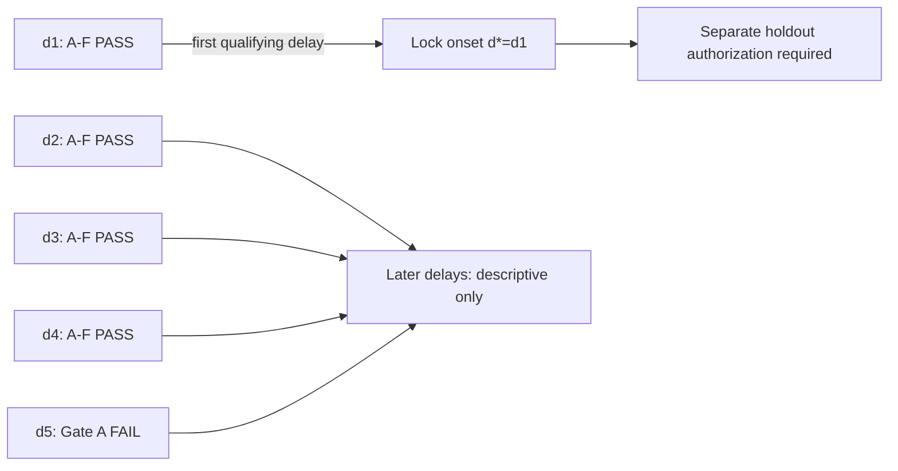

# Frozen 15-Pair Development Scientific Analysis

## A. Executive scientific verdict

The frozen 15-pair development cohort supports
`DEVELOPMENT_FULL_REPLICATION` under the separately defined deterministic
`MDMT_SOURCE_ANNOTATION_MDA_V1` protocol.  ID-state delay harm replicates at
all five registered delays: every `D_ID` pair-bootstrap confidence interval is
strictly positive, with 13/15 to 15/15 pairs in the registered direction.
Candidate compensation is statistically supported at d1--d4; d5 retains a
12/15 negative `R_edge` majority and positive `C_comp`, but fails Gate A because
the `R_edge` CI upper bound is slightly above zero.  The complete delayed-ID ->
delay-only candidate -> timely Supplement -> actual High-score bbox write-in
path occurs at every delay and in all 15 pairs.  Applying the preregistered
ascending rule, d1 is the first delay passing Gate A--F, so:

```text
EARLIEST_RELIABLE_CANDIDATE_COMPENSATION_ONSET = d1
DEVELOPMENT_FULL_REPLICATION
```

This is not a monotonic-delay claim.  The d1 performance contrasts are small
and heterogeneous: its median `R_edge` is `-0.000245`, its median `C_comp` is
`+0.000395`, and the registered `C_comp` direction count is exactly 10/15.
The result therefore locks d1 for separately authorized holdout confirmation;
it does not authorize or execute that confirmation.

## Frozen definitions and authority

The Contract and analysis implementation use exactly:

```text
D_ID(d)   = Y00 - Y10_d
R_edge(d) = Yec_d - Y10_d
C_comp(d) = (Y10_d - Y11_d) - (Y00 - Y01)
```

`Y01` is the parity-proven singleton physical `Y01_d1` reused for every
positive delay.  The statistical unit is the sequence pair.  Confidence
intervals use the inherited E023 pair bootstrap: 10,000 resamples, NumPy
`default_rng(7)`, and the 0.025/0.975 quantiles of bootstrap means.

```text
D_ID_DEFINITION_MATCH = YES
R_EDGE_DEFINITION_MATCH = YES
C_COMP_DEFINITION_MATCH = YES
BOOTSTRAP_DEFINITION_MATCH = YES
```

The deterministic implementation is
`scripts/analyze_mdmt_mia_onset_development.py`; generated evidence is isolated
under `outputs/20260906_mdmt_mia_frozen_15_pair_development_analysis_v1/`.

```text
analysis script SHA-256 = a7df4addca630799a5a29c7227b89f6432bfa6d8440cc93e8788b49551e6b2d2
analysis manifest SHA-256 = 22b3cd7449314603662b39df0a10cac250244180322e549e32a41b1d15f9b891
contrast summary SHA-256 = 300ed8b0b9268782ca00163cb38c17b2828d1b3c516edf3cfd8aaf25ea8b6005
mechanism summary SHA-256 = b434059b3ae5e9c15f5e13b1c90f7499d805d8f71bd8757ed0407ddea5d8fa34
Gate A--F SHA-256 = 05a18aae12d67500a233cda35d507409ff4d5c563940eacc996f2c93badee5e3
```

## B. D_ID — ID-state delay harm

| Delay | Mean D_ID | Median | Pair-bootstrap 95% CI | Positive / negative / zero pairs |
| --- | ---: | ---: | --- | ---: |
| d1 | 0.038865 | 0.016797 | [0.013510, 0.068979] | 13 / 2 / 0 |
| d2 | 0.043049 | 0.012121 | [0.014019, 0.077351] | 13 / 2 / 0 |
| d3 | 0.115834 | 0.080419 | [0.073748, 0.161281] | 15 / 0 / 0 |
| d4 | 0.072246 | 0.056713 | [0.041204, 0.108280] | 14 / 1 / 0 |
| d5 | 0.064563 | 0.051821 | [0.036649, 0.095340] | 14 / 1 / 0 |

Pair-level values:

| Pair | d1 | d2 | d3 | d4 | d5 |
| ---: | ---: | ---: | ---: | ---: | ---: |
| 53 | -0.042561 | -0.033634 | 0.193815 | 0.027389 | 0.069816 |
| 66 | 0.011502 | 0.012121 | 0.080419 | 0.061579 | 0.051821 |
| 30 | 0.016797 | 0.004863 | 0.144608 | 0.125874 | 0.103521 |
| 74 | 0.052741 | 0.041112 | 0.271960 | 0.104513 | 0.127593 |
| 76 | 0.008602 | 0.004548 | 0.019977 | 0.020314 | 0.017056 |
| 63 | 0.170777 | 0.168351 | 0.175565 | 0.117834 | 0.117004 |
| 39 | 0.051472 | 0.070740 | 0.070972 | 0.092322 | 0.074228 |
| 78 | -0.000596 | 0.001104 | 0.016091 | 0.010404 | 0.003958 |
| 44 | 0.005952 | 0.013704 | 0.066005 | 0.051778 | 0.036960 |
| 32 | 0.000494 | 0.000948 | 0.014247 | 0.008748 | 0.013987 |
| 58 | 0.003324 | 0.005081 | 0.035292 | 0.006199 | 0.007822 |
| 23 | 0.089858 | 0.148900 | 0.246777 | 0.184456 | 0.178563 |
| 65 | 0.021723 | -0.005695 | 0.048263 | -0.003744 | -0.021188 |
| 42 | 0.141266 | 0.150750 | 0.225942 | 0.219313 | 0.151739 |
| 54 | 0.051626 | 0.062847 | 0.127576 | 0.056713 | 0.035559 |

ID delay harm therefore replicates across the full registered range, but its
magnitude is non-monotonic: d3 is descriptively strongest, while d1 is the
earliest compensation onset for a different, preregistered question.

## C. R_edge — candidate-set edge contrast

| Delay | Mean R_edge | Median | Pair-bootstrap 95% CI | Negative / positive / zero pairs |
| --- | ---: | ---: | --- | ---: |
| d1 | -0.002876 | -0.000245 | [-0.007376, -0.000351] | 12 / 0 / 3 |
| d2 | -0.007222 | -0.000939 | [-0.017674, -0.000056] | 12 / 2 / 1 |
| d3 | -0.014530 | -0.000984 | [-0.034537, -0.001371] | 13 / 1 / 1 |
| d4 | -0.021710 | -0.009260 | [-0.041631, -0.005933] | 12 / 2 / 1 |
| d5 | -0.011313 | -0.002798 | [-0.024810, 0.000285] | 12 / 2 / 1 |

Pair-level values:

| Pair | d1 | d2 | d3 | d4 | d5 |
| ---: | ---: | ---: | ---: | ---: | ---: |
| 53 | -0.000128 | -0.000244 | -0.000640 | 0.009890 | 0.026563 |
| 66 | -0.000147 | -0.000768 | -0.000199 | -0.009373 | -0.000426 |
| 30 | -0.002367 | 0.002141 | -0.009643 | -0.002205 | -0.000518 |
| 74 | -0.032749 | -0.030451 | 0.013480 | -0.127480 | -0.063830 |
| 76 | -0.000077 | -0.000077 | -0.000077 | -0.000077 | -0.000077 |
| 63 | -0.000351 | -0.012266 | -0.130162 | -0.029425 | -0.013724 |
| 39 | 0.000000 | -0.001399 | -0.001667 | -0.000260 | -0.003469 |
| 78 | 0.000000 | 0.000000 | 0.000000 | 0.000000 | 0.000000 |
| 44 | 0.000000 | -0.000159 | -0.000228 | 0.001475 | 0.010270 |
| 32 | -0.000693 | -0.000939 | -0.013498 | -0.014352 | -0.009037 |
| 58 | -0.000649 | -0.001015 | -0.000984 | -0.002090 | -0.002798 |
| 23 | -0.003741 | -0.066838 | -0.046744 | -0.071909 | -0.032541 |
| 65 | -0.000049 | -0.001567 | -0.000228 | -0.009260 | -0.000158 |
| 42 | -0.000245 | -0.001281 | -0.001580 | -0.012097 | -0.008838 |
| 54 | -0.001938 | 0.006530 | -0.025783 | -0.058484 | -0.071111 |

Gate A and C pass at d1--d4.  At d5, the 12/15 registered-direction majority
survives, but the CI crosses zero, so Gate A fails.  At d1, Pair74 supplies
about 75.9% of total absolute `R_edge` magnitude; nevertheless 12 pairs are
negative and none positive.  The concentration is a material heterogeneity
warning, not grounds for removing Pair74 or changing the gate.

## D. C_comp — extra timely-Supplement compensation

| Delay | Mean C_comp | Median | Pair-bootstrap 95% CI | Positive / negative / zero pairs |
| --- | ---: | ---: | --- | ---: |
| d1 | 0.025731 | 0.000395 | [0.001577, 0.057355] | 10 / 4 / 1 |
| d2 | 0.033549 | 0.001015 | [0.008272, 0.066311] | 12 / 2 / 1 |
| d3 | 0.061353 | 0.039293 | [0.029050, 0.098691] | 14 / 1 / 0 |
| d4 | 0.050662 | 0.016693 | [0.021138, 0.086038] | 13 / 2 / 0 |
| d5 | 0.041479 | 0.013990 | [0.017755, 0.067870] | 14 / 1 / 0 |

Pair-level values:

| Pair | d1 | d2 | d3 | d4 | d5 |
| ---: | ---: | ---: | ---: | ---: | ---: |
| 53 | 0.000395 | 0.000593 | 0.001518 | -0.009422 | -0.026092 |
| 66 | 0.000147 | 0.000765 | 0.000180 | 0.009354 | 0.000412 |
| 30 | -0.009478 | -0.004693 | 0.039293 | 0.043074 | 0.013990 |
| 74 | 0.011141 | 0.034961 | 0.083068 | 0.197814 | 0.096736 |
| 76 | 0.000077 | 0.000077 | 0.026635 | 0.016693 | 0.003466 |
| 63 | 0.111453 | 0.131016 | 0.145664 | 0.102680 | 0.143943 |
| 39 | 0.195602 | 0.201559 | 0.244226 | 0.003980 | 0.007235 |
| 78 | 0.000000 | 0.000000 | 0.005938 | 0.005846 | 0.007578 |
| 44 | -0.000656 | -0.000407 | -0.000168 | -0.000574 | 0.027609 |
| 32 | 0.006649 | 0.007533 | 0.078566 | 0.066427 | 0.063404 |
| 58 | 0.000649 | 0.001015 | 0.000984 | 0.002090 | 0.002798 |
| 23 | -0.004242 | 0.057214 | 0.128039 | 0.192231 | 0.088346 |
| 65 | 0.002032 | 0.001201 | 0.004847 | 0.012944 | 0.004334 |
| 42 | 0.072929 | 0.071789 | 0.117854 | 0.067871 | 0.111287 |
| 54 | -0.000740 | 0.000609 | 0.043650 | 0.048916 | 0.077138 |

Gate B passes at every delay.  Gate D passes at every delay, with d1 exactly
on the registered 10/15 boundary.  Pair39 supplies about 47.0% of d1 absolute
`C_comp` magnitude; again, this is retained heterogeneity rather than a
post-hoc exclusion.

## E. Mechanism path and S_delay/S_cf diagnostics

The authoritative mechanism table uses the actual `Y10_d` branch.  High-score
trigger/write-in counts are restricted to candidate-set disagreements, and a
complete path requires a delay-only candidate, an actual bbox write-in, and a
same-frame `supplement/timely` packet-consumption record.

| Delay | Disagreement | Delay-only | CF-only | High triggers | High write-ins | Low-score events | Low-score write-ins | Complete path | Positive pairs |
| --- | ---: | ---: | ---: | ---: | ---: | ---: | ---: | ---: | ---: |
| d1 | 1,153 | 1,123 | 30 | 1,123 | 471 | 5,681 | 67 | 471 | 15/15 |
| d2 | 3,173 | 3,104 | 69 | 3,104 | 1,675 | 5,681 | 64 | 1,675 | 15/15 |
| d3 | 6,945 | 6,894 | 51 | 6,894 | 4,545 | 5,681 | 62 | 4,545 | 15/15 |
| d4 | 4,626 | 4,607 | 19 | 4,607 | 2,440 | 5,681 | 66 | 2,440 | 15/15 |
| d5 | 4,088 | 4,057 | 31 | 4,057 | 1,911 | 5,681 | 62 | 1,911 | 15/15 |

Per-pair complete-path counts:

| Pair | d1 | d2 | d3 | d4 | d5 |
| ---: | ---: | ---: | ---: | ---: | ---: |
| 53 | 1 | 18 | 1,234 | 63 | 105 |
| 66 | 5 | 10 | 28 | 35 | 49 |
| 30 | 107 | 347 | 1,959 | 1,350 | 804 |
| 74 | 52 | 68 | 180 | 169 | 225 |
| 76 | 49 | 1 | 7 | 10 | 5 |
| 63 | 14 | 78 | 49 | 74 | 92 |
| 39 | 2 | 8 | 30 | 28 | 33 |
| 78 | 1 | 2 | 9 | 12 | 7 |
| 44 | 1 | 5 | 8 | 14 | 11 |
| 32 | 12 | 12 | 23 | 25 | 34 |
| 58 | 3 | 5 | 6 | 7 | 8 |
| 23 | 132 | 756 | 723 | 186 | 233 |
| 65 | 17 | 253 | 199 | 376 | 201 |
| 42 | 10 | 30 | 49 | 57 | 68 |
| 54 | 65 | 82 | 41 | 34 | 36 |

The `S_delay=1,S_cf=0` / `S_delay=0,S_cf=1` diagnostic is strongly asymmetric
but contains both categories at every delay:

| Delay | Y10 delay-only | Y10 CF-only | Yec delay-only | Yec CF-only |
| --- | ---: | ---: | ---: | ---: |
| d1 | 1,123 | 30 | 1,117 | 29 |
| d2 | 3,104 | 69 | 3,294 | 62 |
| d3 | 6,894 | 51 | 7,520 | 40 |
| d4 | 4,607 | 19 | 5,803 | 22 |
| d5 | 4,057 | 31 | 4,304 | 32 |

The tracked E023 report did not quantify CF-only membership as its own
category.  Development therefore exposes it explicitly as previously
unreported structure; this does not justify treating it as absent in E023.

## F. Gate A--F

| Delay | A: R_edge CI upper < 0 | B: C_comp CI lower > 0 | C: R_edge negative >=10/15 | D: C_comp positive >=10/15 | E: path observed | F: path >=10/15 | Overall |
| --- | --- | --- | --- | --- | --- | --- | --- |
| d1 | PASS | PASS | PASS (12/15) | PASS (10/15) | PASS | PASS (15/15) | **PASS** |
| d2 | PASS | PASS | PASS (12/15) | PASS (12/15) | PASS | PASS (15/15) | **PASS** |
| d3 | PASS | PASS | PASS (13/15) | PASS (14/15) | PASS | PASS (15/15) | **PASS** |
| d4 | PASS | PASS | PASS (12/15) | PASS (13/15) | PASS | PASS (15/15) | **PASS** |
| d5 | **FAIL** (upper `+0.000285`) | PASS | PASS (12/15) | PASS (14/15) | PASS | PASS (15/15) | **FAIL** |



## G. Earliest onset verdict

```text
EARLIEST_ONSET = d1
EARLIEST_RELIABLE_CANDIDATE_COMPENSATION_ONSET = d1
```

d1 passes both causal performance CIs, both 10/15 direction gates, and both
mechanism occurrence gates.  There is no earlier registered positive delay.
d2--d4 also pass but cannot replace the earlier d1.  d5 fails Gate A and is
retained as evidence of a non-monotonic, heterogeneous delay response.

## H. Descriptive E023 comparison

| Evidence | E023 official test | 15-pair train Source-MDA-v1 development | Comparison |
| --- | --- | --- | --- |
| ID-delay harm | d1/d5 positive with 13/14 pairs | d1--d5 positive CIs; 13/15 to 15/15 pairs | replicated across a wider registered grid |
| d1 R_edge | `+0.000355`, CI crosses zero | `-0.002876`, CI strictly below zero | development support is earlier/stronger in direction |
| d1 C_comp | `+0.021017`, CI crosses zero; 8/14 positive | `+0.025731`, CI strictly above zero; 10/15 positive | development passes the registered criterion |
| d5 R_edge | `-0.018329`, CI below zero; 10/14 negative | `-0.011313`, CI crosses zero; 12/15 negative | majority replicates, CI criterion does not |
| d5 C_comp | `+0.049913`, CI above zero; 10/14 positive | `+0.041479`, CI above zero; 14/15 positive | replicated |
| Mechanism | d5 candidate/write-in path supported; d1 unresolved statistically | complete path in 15/15 pairs at every development delay | mechanism occurrence replicates and is broader |
| Onset pattern | only d1/d5 sampled; d5 Pattern B | d1 is first A--F pass; d2--d4 pass, d5 fails A | not numerically or monotonically identical |

The protocols are not interchangeable:

```text
E023 official-test evaluation protocol
!=
MDMT_SOURCE_ANNOTATION_MDA_V1 train evaluation protocol
```

Accordingly, these comparisons are descriptive.  They do not establish
official train GT, official exporter equivalence, or numerical replication.

## I. Scientific implication

The evidence supports the limited idea that asynchronous ID-state delay changes
candidate availability and creates real opportunities that timely Supplement
can exploit.  Temporal semantic harm is highly reproducible, and the complete
candidate-to-write-in path is not confined to a few sequences.  However, the
small d1 medians, concentrated d1 effect magnitudes, and d5 CI reversal show
that delay alone is not a monotonic measure of compensation strength.  This
supports continuing to a locked confirmation of the observed onset; it does
not yet validate a deployable semantic-freshness policy or a non-oracle
recovery algorithm.

## J. Next-step decision and no-shopping audit

```text
LOCK d1 AND PREPARE HOLDOUT CONFIRMATION

PAIR_REMOVED_AFTER_UNBLINDING = 0
DELAY_ADDED_AFTER_UNBLINDING = 0
THRESHOLD_CHANGED_AFTER_UNBLINDING = 0
BOOTSTRAP_CHANGED_AFTER_UNBLINDING = 0
GATE_CHANGED_AFTER_UNBLINDING = 0
SOURCE_MDA_CHANGED_AFTER_UNBLINDING = 0

HOLDOUT_EXECUTED = NO
VAL_OUTCOME_READ = NO
```

The next action is a separate authorization for the frozen holdout
confirmation at d1 and `max(1,d1-1)=d1`.  This report does not execute it.
