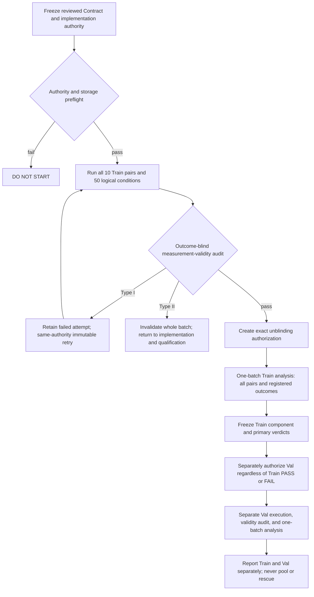

# Locked d1 Holdout Experiment Contract

## 0. Status, scope, and authority

```text
DOCUMENT_STATUS = DRAFT_FOR_INDEPENDENT_CONTRACT_REVIEW
EXPERIMENT_ID = exp_20260817_001_mdmt_mia_candidate_compensation_onset_validation
STAGE = EXPERIMENT_CONTRACT_DRAFTING
SCIENTIFIC_EXECUTION_AUTHORIZED = NO
QUALIFICATION_AUTHORIZED = NO
TRAIN_HOLDOUT_AUTHORIZED = NO
VAL_AUTHORIZED = NO
```

This document translates already frozen Research Decisions R1--R9 into an
executable and auditable specification. It does not amend those decisions,
implement an executor, qualify an implementation, or authorize a run.

The following labels are used throughout:

- **FACT**: observed repository or frozen-artifact fact.
- **FROZEN CONTRACT REQUIREMENT**: mandatory behavior inherited from R1--R9.
- **PROHIBITION**: behavior that invalidates or falls outside this Contract.
- **DEFERRED IMPLEMENTATION DETAIL**: exact engineering identity that must be
  supplied and independently audited before execution.

### Governing authority

```text
REPOSITORY = https://github.com/Judecoodingspace/matrix_async_comm_tracking
RESEARCH_DECISION_BRANCH = exp/20260903-001-mdmt-mia-p39-homography-fallback-successor-census
RESEARCH_DECISION_COMMIT = 42c1306ea4f454db5e01503b3ea58052046abfa8
RESEARCH_DECISION_FILE = summary_md/experiments/2026-8-17/exp_20260817_001_mdmt_mia_candidate_compensation_onset_validation/LOCKED_D1_HOLDOUT_RESEARCH_DECISIONS.md
RESEARCH_DECISION_FILE_GIT_BLOB = 4a5b16edea10dff9497c7ebe8f72ff1212fc262f
RESEARCH_DECISION_FILE_SHA256 = 2fcac26b5f86eb94c491ac4df8a49f042f69a33f1fa4fd7f4f6d0c0923738f9e

DEVELOPMENT_EXECUTION_AUTHORITY = 47ce0fd35f1d9e7c10465297f5dcaf6b69117fab
DEVELOPMENT_ANALYSIS_AUTHORITY = 6c57e15fcf00f2a4c939ad98bcb203e1f958a5a3
RECOMMENDED_HOLDOUT_BASE = 47ce0fd35f1d9e7c10465297f5dcaf6b69117fab
```

**FACT.** The decision file above was read from GitHub at the exact 40-character
commit before this revision was written. The GitHub blob ID and local SHA-256
are recorded to prevent a branch-tip substitution from being treated as the
decision authority.

**PROHIBITION.** A later documentation commit, including the commit containing
this Contract, must not be written into historical scientific execution
provenance as if it were the development execution commit.

## 1. Research question and evidence classification

### Research question

Does the development-selected earliest reliably identifiable onset, `d1`,
reproduce the preregistered causal-mechanism evidence package in the exact ten
frozen MDMT Train holdout pairs under the frozen Source-MDA-v1 protocol?

### Primary hypothesis

At `d1`, all registered Train components pass: ID-state delay harm (`D_ID`),
the oracle-diagnostic candidate-availability edge (`R_edge`), conditional
Supplement compensation (`C_comp`), and the complete-path mechanism gates.

### Plausible alternative hypothesis

At least one registered component does not pass in the ten frozen Train pairs,
so full primary confirmation is not supported even if another component is
supported.

### Evidence classification

**FACT**

- Frozen development completed `255/255` accepted logical conditions.
- The frozen ascending rule selected `d1` as the development-selected earliest
  reliably identifiable onset.
- The ten Train and five Val pairs were frozen before holdout outcome access.
- The recommended holdout base is the exact development execution authority.
- No Train holdout or Val scientific outcome is an input to this Contract.

**INFERENCE**

- The development result may reproduce in Train and later across the MDMT
  Train/Val split.

**ASSUMPTION**

- The frozen pairs provide enough eligible candidate opportunities for the
  registered mechanism gates to distinguish the hypotheses. Pairs with no
  opportunity remain in the denominator.

**UNKNOWN**

- The Train scientific result.
- The Val scientific result.
- Whether the evidence package generalizes beyond the frozen MDMT populations.

## 2. Frozen inputs and populations

### 2.1 Train primary population

**FROZEN CONTRACT REQUIREMENT.** The ordered primary Train population is
exactly:

```text
[70, 50, 28, 64, 27, 25, 69, 51, 29, 45]
```

Its scientific denominator is always `10`. Pair addition, deletion,
replacement, reordering for selection, resampling into a different cohort, or
replacement due to runtime difficulty is prohibited.

### 2.2 Val external population

**FACT.** At the decision-authority commit, the tracked predecessor
`EXPERIMENT_CONTRACT.md` records all five MDMT Val pairs as:

```text
[22, 36, 46, 49, 72]
```

**FROZEN CONTRACT REQUIREMENT.** Val is a separate cross-split external
confirmation population. It is not pooled with Train, cannot rescue Train, and
cannot overturn a frozen Train verdict.

### 2.3 Data and Source-MDA inputs

```text
MDMT_DATASET_ROOT = /mnt/data/yzm/datasets/Multi-Drone-Multi-Object-Detection-and-Tracking
TRAIN_IMAGE_PATTERN = train/<view>/<pair>-<view>/
VAL_IMAGE_PATTERN = val/<view>/<pair>-<view>/

SOURCE_MDA_PROTOCOL = MDMT_SOURCE_ANNOTATION_MDA_V1
SOURCE_MDA_AUTHORITY_ROOT = outputs/20260904_mdmt_source_annotation_mda_v1_preflight_retry3
SOURCE_MDA_ARTIFACT_MANIFEST = source_mda_v1_artifact_manifest.csv
SOURCE_MDA_ARTIFACT_MANIFEST_SHA256 = f73a736f57bd8045b7da01463d69ee2aaa55eead7ddb72c3a7a0c50212bb8d6d
SOURCE_MDA_COHORT_MANIFEST = cohort_manifest.csv
SOURCE_MDA_COHORT_MANIFEST_SHA256 = 3e82deee04260c88ba637a00112f11b6604f2e1033c4b13174168b2180c14f03
SOURCE_MDA_PREFLIGHT_SUMMARY_SHA256 = 48efbec49792598ddd9a61f3dde9c26b7afe9bd8d997c2b9ee091160fdb47e88
SOURCE_MDA_DETERMINISM_REPORT_SHA256 = 8545b1f3ace6001027f41af3d924856ad68e430bf332e6f899a3f69b54dd6472
SOURCE_MDA_RUN_A_DIGEST = b9c09025ab775e8e4d2f343bd7634f7f3273b007f712d58bffe9adc5523b3a0e
SOURCE_MDA_RUN_B_DIGEST = b9c09025ab775e8e4d2f343bd7634f7f3273b007f712d58bffe9adc5523b3a0e
```

Train evaluation inputs must resolve to
`run_b/generated_gt/train/<pair>-{1,2}.txt`; Val inputs must resolve to
`run_b/generated_gt/val/<pair>-{1,2}.txt`. Each file's SHA-256 must match the
corresponding row in the authority artifact manifest.

**PROHIBITION.** Source-MDA-v1 is not official Train GT and must not be
described as official-export equivalent. Source annotations, generated GT, and
the authority root must not be silently regenerated or repaired.

## 3. Frozen delay and condition architecture

### 3.1 Delay

```text
PRIMARY_DELAY = d1
PRIMARY_DELAY_FRAMES = 1
TRAIN_D2_D5_EXECUTION = PROHIBITED
```

`d1` means the development-selected earliest reliably identifiable onset under
the frozen ascending rule. It is not a physical true threshold, globally
optimal delay, strongest delay, or universal onset.

### 3.2 Conditions

Each Train pair has exactly five logical scientific conditions:

| Logical condition | Role | Local | Homography | ID state | Supplement | Edge cut | Shadow |
| --- | --- | ---: | ---: | ---: | ---: | ---: | ---: |
| `Y00` | physical parity anchor | 0 | 0 | 0 | 0 | 0 | 0 |
| `Y01` | physical timely-ID / unavailable-Supplement control | 0 | 0 | 0 | 1 | 0 | 0 |
| `Y10_d1` | physical delayed-ID condition | 0 | 0 | 1 | 0 | 0 | 1 |
| `Y11_d1` | physical delayed-ID / delayed-Supplement condition | 0 | 0 | 1 | 1 | 0 | 0 |
| `Yec_d1` | oracle diagnostic only | 0 | 0 | 1 | 0 | 1 | 1 |

All numeric entries are delay frames except `Edge cut` and `Shadow`, which are
binary controls. `Y01` is physically `Y01_d1`; no delay-indexed Y01 duplicate
is created in this d1-only Contract.

```text
TRAIN_PAIRS = 10
LOGICAL_CONDITIONS_PER_TRAIN_PAIR = 5
TRAIN_SCIENTIFIC_LOGICAL_EXECUTIONS = 50
TRAIN_Y00_REFERENCE_EXECUTIONS = 10
VAL_PAIRS = 5
LOGICAL_CONDITIONS_PER_VAL_PAIR = 5
VAL_SCIENTIFIC_LOGICAL_EXECUTIONS = 25
VAL_Y00_REFERENCE_EXECUTIONS = 5
```

Reference executions are parity evidence, not scientific conditions and not
members of any contrast denominator. `Yec_d1` is always oracle,
diagnostic-only, non-deployable, and not a method condition.

## 4. Development compatibility and frozen execution provenance

The implementation must preserve the scientific semantics of this development
package without modifying or cleaning it:

```text
DEVELOPMENT_PACKAGE = outputs/20260905_mdmt_mia_frozen_15_pair_development_v5
DEVELOPMENT_PACKAGE_MANIFEST_SHA256 = 649a73d36d8b0f1a49627d7b69585e91280e3232260ee401a390b44c373ef05d
DEVELOPMENT_PLAN_MANIFEST_SHA256 = c5b1aa40bbe1c2d2caf84f5f0e368ca7b9e5559abef887d0be1819c98fce0e08
DEVELOPMENT_CONDITION_MANIFEST_SHA256 = 7f26902773abf26d1a061b33768877238d7c1f1d93eca8ce8c9bea8c8e76fb0e
DEVELOPMENT_CACHE_MANIFEST_SHA256 = 583c3ec5f7f2dd1f8374d3c81a61a5bdb9d56b2187182144ceaf83b7d7b15ec1
DEVELOPMENT_ANALYSIS_MANIFEST_SHA256 = 22b3cd7449314603662b39df0a10cac250244180322e549e32a41b1d15f9b891
```

### 4.1 External composed variants

```text
PACKETIZED_VARIANT = /mnt/data/yzm/experiments/mdmt_mia_official/variants/packetized_candidate_compensation_onset_mve_v1
PACKETIZED_VARIANT_TREE_DIGEST = 9f9c0b20551f7785e5d2233d1a076ac9671443378041cdf75b71f8f4eeadd03a

REFERENCE_VARIANT = /mnt/data/yzm/experiments/mdmt_mia_official/variants/paper_aligned_mia_hfallback_onset_mve_v1
REFERENCE_VARIANT_TREE_DIGEST = bf660775d2fbc78edafe6e22937ca7d86e333710d6db394bb1947b4c142b5bc2

AUTHOR_ENTRYPOINT = demo/supplement_MIA.py
```

The tree-digest predicate is the inherited one: sort every file by relative
path, exclude `onset_mve_composition_manifest.json`, form the canonical JSON
list of `(relative_path, SHA-256)` pairs, and SHA-256 the canonical bytes.

### 4.2 Repository runtime/evaluator fingerprints at the recommended base

```text
src/tracking/mdmt_mia_onset_executor.py = 09bc84b98ca0ec2fecd9c778003f3985b562533dd77b75214d0d0422e1df63e0
src/tracking/mdmt_mia_cascade_runtime.py = b5fd31173e32b7c9c317391d06211dd49f628fec1e960addf0d5a899b732bcf2
src/tracking/mdmt_mia_async_deadline_runtime.py = 58dc55c15bacae8f63ca1ca05432736a1499356e76e32e58399249d9ce6d2300
scripts/run_mdmt_mia_onset_development.py = 71f71e5e5cda342f679180f9408d997b58a805fca26f5511dd0badaf47f35b64
scripts/run_mdmt_mia_author_sync.sh = 3370ef9ed671eeea404fec662cbfb1a97eff4978dcc715115350c1a5b159c26c
src/evaluation/mdmt_mia_paper.py = ea9805ad770e6278a2271b5c1d9d5c981eb44a3fe21f53472b82c4bd672bdfdb
EVALUATOR = evaluation.mdmt_mia_paper.cross_view_mda
```

**FROZEN CONTRACT REQUIREMENT.** Holdout-only orchestration may be added later,
but it must be based on `47ce0fd...`, preserve all outcome-affecting hashes and
external variant digests above, receive a new audited implementation commit,
and pass qualification before launch. Documentation-only descendants are not
runtime authority.

## 5. Detector and cache authority

The detector identity inherited from development is:

```text
DEVICE = cuda:0
CHECKPOINT = /mnt/data/yzm/datasets/Multi-Drone-Multi-Object-Detection-and-Tracking/checkpoints/work_dirsfaster_rcnn_r50_fpn_carafe_1x_full_mdmt/epoch_12.pth
CHECKPOINT_SHA256 = f50882a6814b08d8f9ee2db278825258b52d16463fff6fb45ff45484df7d9e96
DETECTOR_CONFIG = /mnt/data/yzm/experiments/mdmt_mia_official/run_configs/one_carafe_bytetrack_full_mdmt_reproduction.py
DETECTOR_CONFIG_SHA256 = 6f472813987fdfecd4751d0ff5729c264c4595430745a43f75b32f891e7f288a
CACHE_HOOK_SHA256 = 14536aaf1e60f5be03fadf3ad6e8da8b4620294e2973ad54c34d588900d6b165
CACHE_MODE_FOR_PACKETIZED = read
CACHE_KEY = sha256(str(resolved_image_path))
```

The Train package must have one shared canonical physical cache root, with
image-path hashes providing the namespace. Its immutable cache manifest must
bind:

- exact population and split;
- exact ordered image paths and image-content SHA-256 values;
- cache filename and cache-file SHA-256 for every image;
- detector checkpoint, config, base-config, hook, device, seed, and package
  identities;
- `state = COMPLETE`, exact expected/actual key-set equality, zero missing and
  zero unexpected entries, and read-only post-seal permissions.

The legacy `REFERENCE` role must use live detector inference and must not receive
a detector-cache environment key. No cache miss may fall back to live detector
in a packetized condition.

**DEFERRED IMPLEMENTATION DETAIL.** A Train holdout cache does not yet exist;
its root, manifest SHA-256, and package binding must be generated and frozen by
separately authorized implementation/qualification. Val must use a separate
Val-bound cache and manifest. The development cache cannot be treated as a
holdout cache because its image population is different.

## 6. Package and manifest contract

The outer Train and Val package-root names are deferred, but their internal
layout is fixed:

```text
<POPULATION_PACKAGE_ROOT>/
  AUTHORITY_MANIFEST.json
  EXECUTION_PACKAGE_MANIFEST.json
  EXECUTION_PLAN_MANIFEST.json
  condition_manifest.json
  cache_seed/
    status.json
    attempt_NNN/
  detector_cache/
    cache_manifest.json
    <image-key>.npz
  reference/<pair>/Y00/attempts/attempt_NNN/
    attempt_manifest.json
    attempt_state.json
    failure_manifest.json                 # only if terminal failure
    ... raw reference output ...
  packetized/<pair>/<logical_condition>/attempts/attempt_NNN/
    attempt_manifest.json
    attempt_state.json
    failure_manifest.json                 # only if terminal failure
    ... raw prediction and trace output ...
  validity/
    MEASUREMENT_VALIDITY_MANIFEST.json
    MEASUREMENT_VALIDITY_REPORT.md
  embargo/
    UNBLINDING_AUTHORIZATION.json
  analysis/                                # must not exist before authorization
    condition_mda_by_pair.csv
    contrasts_by_pair.csv
    contrast_summary.csv
    mechanism_by_pair.csv
    component_verdicts.json
    primary_or_external_verdict.json
    ANALYSIS_MANIFEST.json
```

Train and Val use different package roots, authority manifests, condition
manifests, validity reports, unblinding authorization records, and analysis
outputs.

### 6.1 Authority manifest required fields

```text
schema_version
population_name
batch_id
repository
contract_commit
decision_commit
base_commit
implementation_commit
packetized_variant_path
packetized_variant_tree_digest
reference_variant_path
reference_variant_tree_digest
evaluator_path
evaluator_sha256
source_mda_protocol
source_mda_artifact_manifest_path
source_mda_artifact_manifest_sha256
cohort_manifest_path
cohort_manifest_sha256
detector_checkpoint_path
detector_checkpoint_sha256
detector_config_path
detector_config_sha256
cache_hook_sha256
cache_manifest_path
cache_manifest_sha256
condition_manifest_sha256
pythonhashseed
bootstrap_seed
authority_bundle_sha256
```

`authority_bundle_sha256` is SHA-256 of UTF-8 JSON containing all preceding
authority fields, with sorted keys and compact separators, excluding only the
bundle field itself.

### 6.2 Condition manifest required fields

Every record must contain exactly:

```text
batch_id, population_name, split, pair, logical_condition,
physical_condition, delay_frames, local_delay, homography_delay,
id_state_delay, supplement_delay, edge_cut, shadow, role,
reference_required, source_mda_gt, prediction_artifacts, trace_artifacts,
variant_tree_digest, evaluator_sha256, cache_manifest_sha256,
authority_bundle_sha256, attempt_root_template
```

The Train manifest passes only when its set of `(pair, logical_condition)` is
the exact Cartesian product of the ten ordered Train pairs and five conditions,
with no duplicate, missing, or unexpected row. It must contain exactly 50
packetized records plus a separately classified 10-record reference plan.

## 7. Attempt identity, state, immutability, and selection

An attempt identity is:

```text
<batch_id>:<population>:<pair>:<logical_condition>:attempt_NNN:<authority_bundle_sha256>
```

`NNN` is monotonically increasing for that pair-condition. Attempt roots are
created exclusively and never reused.

Each `attempt_manifest.json` contains:

```text
attempt_id, retry_of, batch_id, population_name, split, pair,
logical_condition, physical_condition, delay_frames, attempt_index,
authority_bundle_sha256, condition_record_sha256, started_at_utc,
finished_at_utc, process_exit_code, state, artifact_inventory_sha256,
failure_class, failure_reason_code, scientific_outcome_accessed
```

Allowed success progression is:

```text
PLANNED -> RUNNING -> PROCESS_COMPLETE -> ARTIFACT_VALIDATED
-> RUNTIME_GATES_CHECKED
-> Y00_REFERENCE_PARITY_CHECKED              # Y00 only
-> ACCEPTED_VALIDITY
```

The evaluator must not compute MDA in this pre-unblinding state machine.
Terminal failures are `FAILED_TYPE_I` or `INVALID_TYPE_II`.

**FROZEN CONTRACT REQUIREMENT.** The authoritative attempt is the first attempt
by increasing attempt index that reaches `ACCEPTED_VALIDITY`. A new attempt may
start only after the preceding attempt is terminal and documented Type I. This
selection rule is outcome-independent. Failed attempts remain immutable.

**PROHIBITION.** Do not overwrite, delete, truncate, move, silently replace, or
select among attempts using MDA, contrast direction, effect size, mechanism
state, or scientific verdict.

## 8. Fail-closed launch preflight

Scientific execution must not start unless all predicates below pass:

1. repository and base identities equal Section 0;
2. the future audited implementation commit is a descendant of the recommended
   base and has no unaudited outcome-affecting difference;
3. both external variant tree digests equal Section 4.1;
4. evaluator and runtime fingerprints equal Section 4.2 except for separately
   audited holdout-only orchestration;
5. Source-MDA protocol, artifact manifest, cohort manifest, individual GT-file
   hashes, split, and pair paths equal Section 2;
6. detector/config/checkpoint/hook identity equals Section 5;
7. the population-specific cache is `COMPLETE`, sealed, and exact-key-set
   verified;
8. the condition and reference manifests have their exact required sets;
9. the package root does not pre-exist as another batch and every attempt root
   is exclusive;
10. `PYTHONHASHSEED=7`, the condition delay map, pair identity, and `d1` identity
    match this Contract;
11. the qualification authority required by the implementation review is
    present and passes;
12. the outcome embargo is active and no analysis output root exists;
13. the launch-time storage predicate in Section 16 passes.

Any mismatch yields `DO_NOT_START_RUN`. There is no automatic fallback, silent
authority regeneration, pair substitution, or permissive warning mode.

## 9. Y00 strict parity contract

`Y00` is the frozen synchronous reference parity anchor.

For each pair:

- reference source: same-pair legacy synchronous `REFERENCE_VARIANT`, live
  detector, no PacketRuntime, all state timely;
- comparison source: packetized `Y00`, all delays zero, shared sealed detector
  cache in read mode;
- comparison artifacts: the two author prediction JSON files
  `<pair>-1.json` and `<pair>-2.json`;
- predicate: SHA-256 equality for view 1 in the same order and view 2 in the
  same order, which is exact byte identity;
- normalization/tolerance: none; no JSON parsing, key sorting, numeric
  tolerance, whitespace normalization, or row reordering is allowed.

The Y00 attempt state must record reference attempt identity, both ordered
reference hashes, both packetized hashes, `y00_reference_parity_checked=true`,
and `y00_reference_parity_pass=true` before `ACCEPTED_VALIDITY`.

A missing reference is preflight/incompleteness, not a parity result. An actual
byte mismatch is Type II `Y00_PARITY_MISMATCH`, invalidates the entire current
population batch, and keeps the embargo active.

## 10. Outcome embargo and access policy

### 10.1 Forbidden scientific fields before authorization

```text
FORBIDDEN_SCIENTIFIC_FIELDS =
  per_pair_mda
  condition_mda
  D_ID
  R_edge
  C_comp
  contrast_sign_or_direction
  positive_pair_count
  negative_pair_count
  zero_pair_count
  bootstrap_draw_or_ci
  complete_path_event_count
  mechanism_pair_state
  mechanism_positive_count
  opportunity_conditioned_completion_rate
  any_scientific_gate_result
  component_verdict
  overall_primary_or_external_verdict
```

Before authorization, these fields must not be read, computed, displayed,
logged, serialized, or used to trigger a retry. The Source-MDA evaluator must
not be invoked on holdout predictions before one-batch unblinding.

### 10.2 Permitted outcome-blind validity access

```text
PERMITTED_VALIDITY_ACCESS =
  AUTHORITY_MANIFEST.json and its declared source files
  EXECUTION_PACKAGE_MANIFEST.json
  EXECUTION_PLAN_MANIFEST.json
  condition_manifest.json
  cache_seed/status.json
  detector_cache/cache_manifest.json and cache-file hashes
  attempt_manifest.json and attempt_state.json
  raw prediction JSON bytes, only for existence/schema/hash/Y00 parity
  async_packet_manifest_*.json
  cascade_edge_manifest_*.json
  async_packet_trace_*.jsonl, only for schema/type/domain validation
  cascade_edge_trace_*.jsonl, only for schema/type/domain validation
  cascade_edge_candidates_*.jsonl, only for schema/type/domain validation
  Source-MDA files and evaluator source, only for identity/hash/schema checks
```

Raw trace access must be through an outcome-blind validator that may report
only required fields present, types valid, frame domains valid, provenance
valid, and hard-guard booleans. It may not aggregate the predicates in Section
12 or expose a mechanism state. Raw predictions may be hashed and schema
checked but not passed to `cross_view_mda`.

## 11. Outcome-blind acceptance and measurement validity

### 11.1 Per-attempt acceptance predicates

Every packetized attempt must have both prediction files and exactly one of
each required manifest/trace family. The inherited hard gates must satisfy:

```text
future_read_violations = 0
source_bypass_read_count = 0
wire_roundtrip_digest_mismatches = 0
feedback_chain_mismatches = 0
published_history_rewrites = 0
numpy_alias_violations = 0

prebranch_missing_count = 0
prebranch_double_capture_count = 0
prebranch_stale_count = 0
prebranch_wrong_frame_count = 0
snapshot_alias_violations = 0
actual_input_mutation_violations = 0
shadow_quarantine_violations = 0
runtime_gt_read_count = 0
logger_read_only = 1
shadow_export_fields = ["membership"]
prebranch_capture_count = prebranch_consume_count

packet_emission_count = packet_consumption_count + pending_at_end_count
```

The manifest delay map, edge-cut state, shadow state, frame domain, pair,
sequence, prediction schema, trace schema, and artifact hashes must match the
condition record. Y00 additionally must pass Section 9.

### 11.2 Population validity audit

Before Train unblinding, the auditor must prove:

- exactly `50/50` Train logical attempts are `ACCEPTED_VALIDITY`;
- exactly `10/10` Train references are complete and all `10/10` Y00 comparisons
  pass exact dual-view byte parity;
- all five conditions are present once for every frozen pair;
- no foreign, duplicate, missing, nonterminal, or mixed-authority attempt is
  selected;
- every artifact declared in manifests exists and matches its hash;
- all schemas and hard gates in this Contract pass;
- evaluator identity and all Source-MDA identities match without invoking the
  scientific evaluator;
- cache completeness, authority, and exact key set pass;
- every failure/retry, if any, has a complete Type I or Type II record;
- no forbidden scientific field was accessed or created.

`MEASUREMENT_VALIDITY_MANIFEST.json` must record each predicate as boolean,
the selected attempt IDs, all authority digests, counts, audit implementation
commit, auditor timestamp, and:

```text
state = MEASUREMENT_VALIDITY_PASS
scientific_outcome_accessed = false
```

Only an exact all-pass manifest permits creation of
`UNBLINDING_AUTHORIZATION.json`.

Before Val unblinding, the independent Val audit applies the same
outcome-blind predicates to exactly `25/25` Val logical attempts and `5/5`
same-pair references/Y00 dual-view parity comparisons. Its manifest binds only
the five frozen Val pairs and their authority bundle; it must not pool, reuse,
or repair Train evidence.

## 12. Mechanism trace schema and deterministic pair states

### 12.1 Required files and fields

The primary mechanism classification uses `Y10_d1` only, matching the frozen
development analysis. `Yec_d1` retains the same traces as a diagnostic oracle
surface but cannot determine or rescue the primary mechanism gates.

Required candidate file:
`cascade_edge_candidates_<pair>-1.jsonl`, with each row containing:

```text
capture_frame: integer
view_id: integer in {1,2}
pre_branch_row_index: nonnegative integer
delay_membership: integer in {0,1}
cf_membership: integer in {0,1}
high_score_triggered: integer in {0,1}
high_score_bbox_written: integer in {0,1}
```

Required packet file: `async_packet_trace_<pair>-1.jsonl`, with at least:

```text
kind: string
packet_action: string
capture_frame: integer
```

Required frame file: `cascade_edge_trace_<pair>-1.jsonl`, with the frozen frame,
view, membership, high-score, and low-score schema. It is retained for audit
and secondary diagnostics; it does not alter the primary predicate below.

### 12.2 Deterministic predicates

For one candidate row `c`:

```text
delay_only(c) :=
  c.delay_membership == 1 AND c.cf_membership == 0

timely_supplement_frame(f) :=
  EXISTS packet p:
    p.kind == "supplement" AND
    p.packet_action == "timely" AND
    p.capture_frame == f

complete_event(c) :=
  delay_only(c) AND
  c.high_score_bbox_written == 1 AND
  timely_supplement_frame(c.capture_frame)
```

`high_score_triggered` is an audit field. Every `complete_event` row must also
have `high_score_triggered == 1`; violation is a semantic acceptance failure.
This consistency check does not add a new scientific stage to the development
predicate, where successful high-score write-in already identifies a completed
trigger path.

For each frozen pair, after unblinding only:

```text
opportunity_count := number of Y10_d1 candidate rows satisfying delay_only
complete_count := number of Y10_d1 candidate rows satisfying complete_event

no_opportunity := opportunity_count == 0
opportunity_no_completion := opportunity_count > 0 AND complete_count == 0
complete_path := complete_count > 0
```

Exactly one state must be assigned. A mechanism-positive pair is exactly
`state == complete_path`. `no_opportunity` and
`opportunity_no_completion` remain in the fixed denominator of ten.

Opportunity-conditioned completion rate may be reported only as
`SECONDARY_DIAGNOSTIC`; it is never a primary gate or denominator.

## 13. Registered statistical analysis contract

### 13.1 Metrics and contrasts

For each accepted Train pair, the one-batch analysis computes Source-MDA-v1
MDA for all five conditions, then:

```text
D_ID   = Y00 - Y10_d1
R_edge = Yec_d1 - Y10_d1
C_comp = (Y10_d1 - Y11_d1) - (Y00 - Y01)
```

No other primary contrast is permitted. Signs, terms, aggregation, and
denominators cannot change.

### 13.2 Pair aggregation and bootstrap

For each contrast independently:

1. build the ordered length-ten vector of per-pair contrasts;
2. compute its arithmetic mean;
3. initialize `numpy.random.default_rng(7)` for that contrast;
4. draw a `(10000, 10)` integer index matrix uniformly with replacement;
5. compute the arithmetic mean of each resampled length-ten vector;
6. report `numpy.quantile(means, 0.025)` and
   `numpy.quantile(means, 0.975)` as the percentile CI.

The pair is the statistical unit. Frames, candidates, events, views, and rows
are not bootstrap units. Exact numeric zero is recorded as `zero` and counts
as neither positive nor negative nor registered direction.

### 13.3 Frozen Train component gates

```text
D_ID_COMPONENT_PASS :=
  D_ID 95% CI lower > 0 AND positive_pairs >= 7

R_EDGE_COMPONENT_PASS :=
  R_edge 95% CI upper < 0 AND negative_pairs >= 7

C_COMP_COMPONENT_PASS :=
  C_comp 95% CI lower > 0 AND positive_pairs >= 7

GATE_E_PASS := sum(complete_count over all 10 pairs) > 0
GATE_F_PASS := number of complete_path pairs >= 7

MECHANISM_COMPONENT_PASS := GATE_E_PASS AND GATE_F_PASS
```

All direction denominators are exactly 10.

### 13.4 Frozen Val external component gates

Val uses the same registered contrasts, condition architecture, pair-level
statistical unit, bootstrap implementation, percentile CI, and exact-zero tie
semantics as Train. For each contrast independently, form the ordered
length-five Val vector, compute its arithmetic mean, initialize a fresh
`numpy.random.default_rng(7)`, draw `(10000, 5)` replacement indices, and
report the 2.5%/97.5% percentile interval.

```text
VAL_REGISTERED_DIRECTION_THRESHOLD = 4/5

D_ID_EXTERNAL_PASS :=
  D_ID 95% CI lower > 0 AND positive Val pairs >= 4/5

R_EDGE_EXTERNAL_PASS :=
  R_edge 95% CI upper < 0 AND negative Val pairs >= 4/5

C_COMP_EXTERNAL_PASS :=
  C_comp 95% CI lower > 0 AND positive Val pairs >= 4/5

VAL_GATE_E_PASS := sum(complete_count over all 5 Val pairs) > 0
VAL_GATE_F_PASS := number of complete_path Val pairs >= 4/5
```

All external direction and mechanism denominators are exactly five. Every Val
pair is assigned exactly one of `no_opportunity`,
`opportunity_no_completion`, or `complete_path`; a mechanism-positive pair is
exactly `complete_path`. No opportunity state may be removed from the fixed
five-pair denominator. Opportunity-conditioned completion is
`SECONDARY_DIAGNOSTIC` only and never an external gate.

### 13.5 Analysis outputs

The first analysis invocation for each population must produce all of the
following in one transaction or leave that population's analysis root
terminally incomplete and ineligible:

```text
condition_mda_by_pair.csv
contrasts_by_pair.csv
contrast_summary.csv
mechanism_by_pair.csv
component_verdicts.json
primary_verdict.json                         # Train only
external_verdict.json                        # Val only
ANALYSIS_MANIFEST.json
```

The analysis manifest binds the population's frozen pairs (ten Train or five
Val), all five conditions, all selected attempts, all authority hashes, the
analysis implementation commit, bootstrap parameters, output hashes, and the
unblinding authorization identity.

## 14. One-batch unblinding and verdict semantics

### 14.1 Authorization gate

`UNBLINDING_AUTHORIZATION.json` may be created only after the exact Train
measurement-validity manifest passes. It contains:

```text
batch_id
population_name = TRAIN_PRIMARY
measurement_validity_manifest_sha256
authority_bundle_sha256
all_10_pairs_complete = true
all_50_conditions_accepted_validity = true
embargo_breach_detected = false
authorized_by
authorized_at_utc
state = ONE_BATCH_UNBLINDING_AUTHORIZED
```

The analysis entry point must fail closed unless this file exists, matches the
current batch/authority, and names the exact validity manifest.

### 14.2 One-batch rule

The first scientific inspection must include all ten Train pairs, all five
conditions, all three contrasts, all direction counts, all bootstrap CIs, all
mechanism states, all primary gates, and the overall verdict in the same batch.

Per-pair peeking, pair-by-pair analysis, partial contrast analysis, incremental
unblinding, outcome-informed repair, and outcome-driven rerun are prohibited.

### 14.3 Train result labels

```text
FULL_PRIMARY_CONFIRMATION :=
  D_ID_COMPONENT_PASS AND
  R_EDGE_COMPONENT_PASS AND
  C_COMP_COMPONENT_PASS AND
  MECHANISM_COMPONENT_PASS

FULL_PRIMARY_CONFIRMATION_NOT_SUPPORTED :=
  measurement validity passed AND at least one component did not pass
```

Component verdicts are always reported and cannot rescue the strict overall
verdict. A failed overall verdict does not erase a supported component.

`FULL_PRIMARY_CONFIRMATION` means full confirmation of the preregistered
causal-mechanism evidence package under frozen d1. It does not mean Yec is
deployable, oracle performance is achievable in deployment, a Supplement
recovery method is deployment-validated, or delay is beneficial. `R_edge` is
an oracle-diagnostic performance edge associated with delay-induced
candidate-set/candidate-availability change.

### 14.4 Val one-batch unblinding and external verdict

Val has a separate `UNBLINDING_AUTHORIZATION.json`, created only after its
independent measurement-validity manifest passes. It must bind
`population_name = VAL_EXTERNAL`, `all_5_pairs_complete = true`,
`all_25_conditions_accepted_validity = true`, the exact authority bundle, and
the exact validity-manifest SHA-256. The first Val scientific inspection is
one batch containing all five pairs, all five conditions, all three contrasts,
all direction counts, all bootstrap CIs, all three-state mechanism
classifications, Val Gates E/F, component-level external verdicts, and the
overall external verdict.

```text
EXTERNAL_CONFIRMATION_SUPPORTED :=
  D_ID_EXTERNAL_PASS AND
  R_EDGE_EXTERNAL_PASS AND
  C_COMP_EXTERNAL_PASS AND
  VAL_GATE_E_PASS AND
  VAL_GATE_F_PASS

EXTERNAL_CONFIRMATION_NOT_SUPPORTED :=
  NOT EXTERNAL_CONFIRMATION_SUPPORTED
```

`EXTERNAL CONFIRMATION SUPPORTED` and `EXTERNAL CONFIRMATION NOT SUPPORTED`
are the only overall Val labels. Val does not use `FULL PRIMARY
CONFIRMATION`. Component-level external support must be reported but cannot
rescue an overall external failure; an overall external failure does not erase
supported component evidence. Val cannot rescue or overturn the separately
frozen Train verdict.

## 15. Type I and Type II failure contract

### 15.1 Common failure record

Every terminal failure writes immutable `failure_manifest.json` with:

```text
schema_version, batch_id, attempt_id, retry_of, population_name, split,
pair, logical_condition, attempt_index, authority_bundle_sha256,
started_at_utc, failed_at_utc, process_exit_code, last_completed_state,
artifact_inventory_sha256, failure_class, failure_reason_code,
authority_match_before_failure, scientific_outcome_accessed,
operator_record, reviewer_record
```

### 15.2 Type I: non-scientific execution interruption

Allowed reason codes are:

```text
TYPE_I_PROCESS_CRASH
TYPE_I_HOST_INTERRUPTION
TYPE_I_CONFIRMED_INFRASTRUCTURE_INTERRUPTION
TYPE_I_INTERRUPTED_INCOMPLETE_WRITE
TYPE_I_INTERRUPTED_MISSING_OUTPUT
TYPE_I_INTERRUPTION_CAUSED_FILE_INTEGRITY_FAILURE
```

Type I is permitted only when the record shows
`scientific_outcome_accessed=false`, the expected authority bundle still
matches, and there is no evidence that condition semantics, code/variant,
evaluator, Source-MDA, detector cache/seed, or scientific parity semantics were
violated.

A Type I attempt may receive a fresh immutable retry with the same pair, d1,
conditions, code, variants, evaluator, Source-MDA, detector cache, and seed.
The failed attempt remains unchanged. Retry may not be triggered by an MDA,
contrast, direction, mechanism state, or effect size.

No numeric retry cap is frozen by this Contract. A hard cap remains an
engineering-governance review item and may not alter the Type I/II science
boundary.

### 15.3 Type II: scientific or measurement-validity failure

Type II reason codes are:

```text
TYPE_II_Y00_PARITY_MISMATCH
TYPE_II_WRONG_LOGICAL_CONDITION
TYPE_II_RUNTIME_CODE_AUTHORITY_MISMATCH
TYPE_II_VARIANT_AUTHORITY_MISMATCH
TYPE_II_EVALUATOR_AUTHORITY_MISMATCH
TYPE_II_SOURCE_MDA_AUTHORITY_MISMATCH
TYPE_II_DETECTOR_CACHE_AUTHORITY_MISMATCH
TYPE_II_AUTHORITY_DIGEST_MISMATCH
TYPE_II_RUNTIME_CAUSAL_GUARD_FAILURE
TYPE_II_SEMANTIC_ACCEPTANCE_FAILURE
TYPE_II_UNCLASSIFIED_VALIDITY_FAILURE
```

Any Type II failure makes the current whole population batch `INVALID`, keeps
the embargo active, prohibits pair-local repair, and requires return to
implementation and qualification. A corrected authority must launch a new
complete ten-pair Train batch.

```text
MIXED_AUTHORITY_CONFIRMATORY_BATCH = PROHIBITED
```

No accepted attempt from the invalid batch may be combined with a corrected
authority.

## 16. Storage preflight and artifact footprint discipline

### 16.1 Launch-time engineering safety gate

At each population launch, query the filesystem containing the planned package
root with byte precision. Historical free-space observations are not accepted
as launch evidence.

```text
TRAIN_MINIMUM_AVAILABLE_BYTES = 200000000000
VAL_MINIMUM_AVAILABLE_BYTES = 150000000000

STORAGE_PREFLIGHT_PASS :=
  filesystem_source is recorded AND
  mount_point is recorded AND
  total_bytes, used_bytes, available_bytes, use_percent are recorded AND
  available_bytes >= applicable minimum
```

This is an engineering safety gate, not a scientific gate. If it fails, the
run remains blocked until separate storage governance resolves it.

**PROHIBITION.** Do not start below reserve, delete old attempts while running,
delete development/MVE authority, delete Type I evidence, or remove raw
evidence to keep a run alive.

### 16.2 Artifact role and retention table

| Artifact class | Role | Retention level | Immutable | Validity | Reproducibility | Scientific analysis |
| --- | --- | --- | --- | --- | --- | --- |
| authority/package/condition manifests | authority | `ACTIVE_AUTHORITY` | yes | yes | yes | yes |
| accepted prediction JSON | scientific raw evidence | `IMMUTABLE_EVIDENCE` | yes | yes | yes | yes |
| mechanism packet/candidate/frame traces | mechanism raw evidence | `IMMUTABLE_EVIDENCE` | yes | yes | yes | yes |
| Y00 reference JSON and parity records | parity evidence | `IMMUTABLE_EVIDENCE` | yes | yes | yes | no direct contrast input |
| failed attempt roots/manifests | audit evidence | `IMMUTABLE_EVIDENCE` | yes | yes | yes | no |
| Source-MDA files/manifests | measurement authority | `ACTIVE_AUTHORITY` | yes | yes | yes | yes |
| detector cache plus sealed manifest | detector reuse | `REGENERABLE_CACHE` while unreferenced; `ACTIVE_AUTHORITY` once bound | yes once bound | yes | yes | indirect |
| copied per-condition image/run-input trees | author-runtime staging | `TEMPORARY_STAGING` | preserve during batch | possibly | no if source-bound | no |
| author logs/time files | operational audit | `IMMUTABLE_EVIDENCE` for selected/failed attempts | yes | yes | limited | no |
| unblinded analysis tables/manifests | derived scientific evidence | `IMMUTABLE_EVIDENCE` | yes | yes | yes | yes |

The future implementation should avoid per-condition image duplication when a
read-only source reference or non-duplicating staging mechanism preserves the
author runtime semantics. This Contract authorizes no deletion. Any cleanup,
deduplication, migration, compression, or cache regeneration requires separate
storage-retention authorization and hash/readback verification.

## 17. Formal Artifact Minimization & Storage Budget

This is an **ENGINEERING / AUDITABILITY CONTRACT**. It does not create a new
scientific hypothesis, contrast, statistical gate, mechanism definition, or
evidence-deletion authority.

### 17.1 Formal artifact admission rule

Every persistent formal Train or Val artifact must have at least one recorded
purpose:

```text
REGISTERED_SCIENTIFIC_ANALYSIS
MEASUREMENT_VALIDITY_AUDIT
EXACT_REPRODUCIBILITY
AUTHORITY_OR_PROVENANCE_VERIFICATION
TYPE_I_OR_TYPE_II_FAILURE_AUDIT
```

If all five are `NO`, the artifact must not automatically enter the formal
immutable evidence package merely because it could help future interactive
debugging. A future package or storage manifest must record the affirmative
purpose(s) for every persistent root.

### 17.2 Formal artifact classes

| Class | Permitted examples | Persistent role | Retention rule |
| --- | --- | --- | --- |
| `ACTIVE_AUTHORITY` | authority/condition/package manifests, Source-MDA authority, sealed cache manifest, variant digest | binds execution to frozen inputs | immutable once bound |
| `IMMUTABLE_SCIENTIFIC_EVIDENCE` | accepted predictions, minimal mechanism evidence, Y00 parity evidence, accepted manifests, unblinded analysis | supports analysis and reproducibility | immutable |
| `IMMUTABLE_AUDIT_EVIDENCE` | Type I manifests, Type II invalidation records, failure evidence/classification logs | proves retry eligibility or fail-close action | immutable |
| `TEMPORARY_STAGING` | copied runtime inputs, author-runtime directories, transient conversions, assembly scratch | execution support, not evidence by itself | retained during active batch; cleanup separately governed |
| `DEBUG_ONLY` | object dumps, tracker snapshots, visualizations, exploratory logs, redundant matrices/payloads, profiling, tensors | optional qualification troubleshooting | not persistent formal evidence by default |

```text
FORMAL_DEBUG_ONLY_PERSISTENCE = DISABLED_BY_DEFAULT
FORMAL_VERBOSE_DEBUG_TRACE = DISABLED
```

Qualification may enable extra debug artifacts, but qualification-debug output
must not automatically become Train or Val immutable evidence. A future
exception needs `ARTIFACT_ROLE`, `WHY_REQUIRED`, `VALIDITY_DEPENDENCY`,
`REPRODUCIBILITY_DEPENDENCY`, and `SCIENTIFIC_ANALYSIS_DEPENDENCY`, followed
by Contract review.

### 17.3 Minimal formal mechanism trace schema

Formal traces must implement `MINIMAL_FORMAL_MECHANISM_TRACE_SCHEMA`: enough
immutable evidence to deterministically verify the frozen path

```text
ID-state delay
-> candidate availability change
-> delay-only/disagreement candidate
-> timely Supplement
-> trigger opportunity
-> successful write-in
```

and assign exactly one state per pair: `no_opportunity`,
`opportunity_no_completion`, or `complete_path`. This does not change the
Section 12 predicates or add a mechanism semantic.

| Minimal requirement | Inherited field or immutable reference | Formal purpose |
| --- | --- | --- |
| pair, logical condition, authority identity | condition-manifest record and `authority_bundle_sha256` | provenance and binding |
| time and direction/view identity | candidate `capture_frame`, `view_id`; packet `capture_frame` | candidate-to-Supplement linkage |
| stable candidate reference | `pre_branch_row_index` with pair/view/frame/condition | deterministic identity within attempt |
| candidate availability / delay-only state | `delay_membership`, `cf_membership` | `delay_only(c)` |
| timely Supplement availability | packet `kind`, `packet_action`, `capture_frame` | `timely_supplement_frame(f)` |
| trigger and write-in | `high_score_triggered`, `high_score_bbox_written` | consistency audit and `complete_event(c)` |
| integrity and provenance | attempt/condition manifest references and file hashes | validity and reproducibility |

The inherited `cascade_edge_trace` is retained only to the extent its
field-level schema, frame domain, and hard-guard checks are required by Section
11. It is not a default full-state dump. A development trace field is mandatory
formal persistence only when one or more of these is true:

```text
IS_REQUIRED_FOR_GATE_E_OR_F
IS_REQUIRED_FOR_THREE_STATE_CLASSIFICATION
IS_REQUIRED_FOR_VALIDITY
IS_REQUIRED_FOR_REPRODUCIBILITY
IS_REQUIRED_FOR_PROVENANCE
```

If all are `NO`, it is `DEBUG_ONLY` unless an independently reviewed exception
is recorded. No field required by Section 12, runtime hard guards, or accepted
attempt reproducibility may be removed.

### 17.4 Detector and static-input deduplication

```text
ONE_CANONICAL_DETECTOR_RESULT_PER_PHYSICAL_IMAGE_OR_CACHE_KEY = REQUIRED
```

Where frozen semantics permit, `Y00`, `Y01`, `Y10_d1`, `Y11_d1`, and `Yec_d1`
must reference one canonical detector result per physical image/cache key via
cache key, detector-artifact hash, and cache-manifest row. They must not copy
identical detector payloads merely for packaging convenience. Packetized cache
misses remain fail-closed; legacy `REFERENCE` live-inference and Y00 parity
semantics do not change.

Identical Source-MDA files, checkpoints, detector/config files, static run
configuration, frozen variants, detector-cache entries, and common image data
must be referenced by immutable path, SHA-256, and manifest row where this
preserves frozen author-runtime semantics. Per-condition predictions may remain
unique immutable scientific evidence.

One complete physical image tree per logical condition is prohibited unless a
future qualified implementation proves that the frozen author runtime requires
it, no non-copying shared-source/reference staging preserves identical
semantics, and the copies are `TEMPORARY_STAGING`, not scientific evidence.
The exact staging mechanism remains deferred and qualification-tested.

### 17.5 Temporary-staging lifecycle

`TEMPORARY_STAGING` is not scientific evidence, but the executor must not
delete it automatically merely to recover disk space during scientific
execution. A staging root is `TEMPORARY_STAGING_CLEANUP_ELIGIBLE` only when:

```text
attempt is terminal
required immutable evidence is sealed
all manifests are complete
all required hashes verify
no unique scientific information exists only in staging
authoritative source remains available
all references remain valid
separate storage-retention authorization exists
```

This Contract does not authorize `rm`, `mv`, compression, archive migration,
automatic purge, cleanup, or deletion of staging or evidence artifacts.

### 17.6 Outcome-blind storage manifest and planning envelope

Every formal Train and Val package must contain an outcome-blind
`STORAGE_MANIFEST` containing at least:

```text
relative_path_or_root
artifact_class
byte_size
file_count
retention_class
attempt_identity
condition_identity_when_applicable
shared_or_unique_status
scientific_analysis_dependency
validity_dependency
reproducibility_dependency
authority_dependency
formal_admission_purposes
```

It must not contain, derive, or expose `D_ID`, `R_edge`, `C_comp`, pair
direction, bootstrap CI, mechanism-positive count, any gate verdict, or an
overall scientific verdict.

The audited planning storage envelope is engineering evidence, not a
scientific gate:

| Population | Low | Central | High | Peak |
| --- | ---: | ---: | ---: | ---: |
| Train | 20--25 GB | 40--45 GB | 75--85 GB | 100--120 GB |
| Val | 10--15 GB | 20--25 GB | 40--45 GB | 55--65 GB |

Before launch, future implementation must record projected package bytes, the
applicable envelope, and `PROJECTED_AVAILABLE_SPACE_AFTER_TRAIN_PEAK` or
`PROJECTED_AVAILABLE_SPACE_AFTER_VAL_PEAK`. If projected footprint exceeds the
applicable audited peak envelope (Train 120 GB; Val 65 GB), set
`STORAGE_BUDGET_REVIEW_REQUIRED = YES` and do not launch until separate
storage-budget review closes it. This is an audited-envelope review trigger,
not an arbitrary trace/pair/attempt size cap, and never authorizes a change to
scientific conditions.

### 17.7 Launch-time preflight and free-space monitoring

Section 16 storage reserves remain unchanged:

```text
TRAIN_MINIMUM_AVAILABLE_BYTES = 200000000000
VAL_MINIMUM_AVAILABLE_BYTES = 150000000000
```

The historical `/dev/md127` audit (approximately 5.50 TB total, approximately
502 GB available, approximately 91% used) is planning context only; live
available bytes are required at launch. Future implementation must perform
outcome-blind free-space monitoring using only filesystem total/used/available
bytes, current artifact bytes, projected remaining artifact volume, and file
counts. It must not use MDA, contrast values, pair direction, mechanism status,
or a gate verdict.

If free space would no longer preserve the applicable reserve, do not launch
the next new scientific attempt. Preserve all immutable evidence. A disk
exhaustion interruption follows the existing Type I/II classification rules;
it never authorizes deletion or selective retry.

### 17.8 Storage-specific auditable predicates

| Key | PASS predicate |
| --- | --- |
| `FORMAL_DEBUG_TRACE_DISABLED` | no `DEBUG_ONLY` root is persistent formal evidence unless an approved exception has all five Section 17.2 dependency fields |
| `MINIMAL_MECHANISM_TRACE_SCHEMA_DEFINED` | Section 17.3 fields/references exist and can recompute Section 12 predicates and three-state classification |
| `NO_UNJUSTIFIED_INPUT_DUPLICATION` | no persistent full per-condition input tree exists, or each has the qualified necessity record in Section 17.4 and is `TEMPORARY_STAGING` |
| `CANONICAL_DETECTOR_OUTPUT_REFERENCED` | every packetized condition references cache key, detector hash, and cache-manifest row; no convenience payload copy exists |
| `STORAGE_MANIFEST_READY` | complete outcome-blind manifest has every Section 17.6 required field and no forbidden field |
| `TEMPORARY_STAGING_IDENTIFIED` | every staging root is labeled non-evidence and linked to its producing attempt/package |
| `NO_RUNTIME_EVIDENCE_DELETION` | active-batch record contains no deletion of sealed scientific or audit evidence |
| `TRAIN_STORAGE_PREFLIGHT_PASS` | current Train filesystem record satisfies unchanged Section 16 reserve |
| `VAL_STORAGE_PREFLIGHT_PASS` | current Val filesystem record satisfies unchanged Section 16 reserve |

The exact monitor, storage-manifest generator, and staging implementation
identities remain deferred implementation details. These predicates constrain
their future acceptance criteria; they do not authorize implementation now.

## 18. Train and Val sequencing and separation

The only allowed sequence is:

```text
Train implementation/qualification authorization
-> Train storage preflight
-> Train execution
-> Train outcome-blind validity audit
-> Train one-batch unblinding
-> freeze Train component and primary verdicts
-> separately authorize Val execution
-> Val storage preflight
-> Val execution
-> Val outcome-blind validity audit
-> Val one-batch unblinding
-> freeze external verdict
```

Val execution is not conditional on Train PASS/FAIL. Train results cannot
change Val cohort, d1, conditions, measurement protocol, contrast formulas,
bootstrap implementation, mechanism-state semantics, embargo, or
interpretation boundary.

Train and Val outcomes must not be pooled, jointly bootstrapped, substituted,
or used to rescue one another. Reports may show the two verdicts side by side
only after both are independently frozen.

**FACT.** Research Decision authority `42c1306...` freezes the Val `4/5`
direction thresholds, CI-plus-direction gates, mechanism Gates E/F, and strict
external verdict in Sections 13.4 and 14.4. The prior
`VAL_EXTERNAL_VERDICT_PREDICATE` authority gap is resolved.

```text
VAL_EXTERNAL_VERDICT_GAP = RESOLVED
STATISTICAL_RULES_EXACT = YES
```

## 19. Audit flow



## 20. Machine-checkable preflight and authorization checklist

| Key | PASS predicate |
| --- | --- |
| `COHORT_FROZEN` | ordered Train list equals `[70,50,28,64,27,25,69,51,29,45]`; Val list equals `[22,36,46,49,72]`; no extra pair |
| `D1_ONLY` | every scientific record is one of the five conditions in Section 3 and every positive delay is exactly 1 |
| `CONDITIONS_FROZEN` | Train Cartesian set is exactly 10 x 5; reference plan is exactly 10 x Y00 |
| `VAL_CONDITIONS_FROZEN` | Val Cartesian set is exactly 5 x 5; reference plan is exactly 5 x Y00 |
| `VAL_STATISTICAL_RULES_FROZEN` | each contrast uses a five-pair arithmetic mean, 10,000 replacement resamples with fresh `default_rng(7)`, percentile CI, exact-zero ties, CI sign gate, and its `4/5` direction gate from Section 13.4 |
| `VAL_MECHANISM_RULES_FROZEN` | all five pairs have one Section 12 state; Gate E is events > 0 and Gate F is `complete_path` pairs >= 4/5 with fixed denominator five |
| `VAL_EXTERNAL_VERDICT_RULE_FROZEN` | external verdict is exactly the Section 14.4 conjunction; its only labels are EXTERNAL CONFIRMATION SUPPORTED / NOT SUPPORTED |
| `AUTHORITIES_MATCH` | every Section 0 and 4 authority equals the authority manifest and recomputed file/tree hashes |
| `SOURCE_MDA_MATCH` | protocol, artifact/cohort manifest hashes, split paths, and every selected GT-file hash match Section 2 |
| `VARIANT_DIGEST_MATCH` | recomputed packetized and reference tree digests equal Section 4.1 |
| `DETECTOR_CACHE_MATCH` | population cache state is COMPLETE; detector identity and exact image/cache key sets match; missing=unexpected=0 |
| `REFERENCE_READY` | all ten same-pair reference attempts are complete, immutable, and hash-addressed |
| `Y00_PARITY_READY` | each Y00 record names its reference and contains two equal ordered SHA-256 pairs with parity pass true |
| `MANIFEST_COMPLETE` | required manifests and fields exist; their declared hashes recompute exactly; no duplicate/foreign row |
| `OUTPUT_SCHEMA_VALID` | prediction, packet, candidate, frame, state, and failure records pass exact schema/type/domain checks |
| `EMBARGO_ACTIVE` | no forbidden field/output exists; evaluator was not invoked; all records say scientific_outcome_accessed=false |
| `TYPE_I_POLICY_ACTIVE` | every retry has an earlier terminal Type I record, allowed reason, same authority, new ID, and retained predecessor |
| `TYPE_II_FAIL_CLOSE_ACTIVE` | any Type II marks whole batch INVALID and no current-batch attempt is eligible for analysis |
| `STORAGE_PREFLIGHT_PASS` | launch-time available bytes meet Section 16 and filesystem facts are recorded |
| `ALL_10_TRAIN_ATTEMPTS_COMPLETE` | all ten pair bundles have 5/5 `ACCEPTED_VALIDITY` conditions and one valid reference; total 50/50 |
| `ALL_5_VAL_ATTEMPTS_COMPLETE` | all five Val pair bundles have 5/5 `ACCEPTED_VALIDITY` conditions and one valid reference; total 25/25 |
| `MEASUREMENT_VALIDITY_PASS` | every Section 11 population predicate is true and validity manifest state is exact PASS |
| `TRAIN_UNBLINDING_AUTHORIZED` | Train authorization matches current batch, authority, exact validity hash, 10/10 pairs, 50/50 conditions, and no breach |
| `VAL_UNBLINDING_AUTHORIZED` | Val authorization matches current batch, authority, exact validity hash, 5/5 pairs, 25/25 conditions, and no breach |

All checklist keys must be materialized as booleans in the future preflight or
validity manifest. Missing is failure, not unknown-pass.

## 21. Contract unresolved implementation items

These are not scientific decisions and cannot be filled by guesswork.

| ID | Deferred exact fact | Source to resolve from | Blocks implementation? |
| --- | --- | --- | --- |
| `U-I1` | holdout-specific executor entry point and its frozen SHA-256 | future implementation based on `47ce0fd...`, then independent qualification | yes |
| `U-I2` | exact Train and Val outer package-root names and immutable batch IDs | future implementation plan; internal layout is fixed by Section 6 | yes |
| `U-I3` | Train/Val execution-package, plan, condition, and authority manifest SHA-256 values | future dry render and independent preflight | yes |
| `U-I4` | outcome-blind validity auditor and one-batch analysis entry points, commits, and SHA-256 values | future implementation and tests against this Contract | yes |
| `U-I5` | Train and Val detector-cache roots, entry counts, manifest hashes, and package bindings | separately authorized cache seed plus exact verification | blocks execution |
| `U-I6` | exact qualification package/manifest identity for holdout-only orchestration | independent implementation audit and qualification plan | blocks execution |
| `U-I7` | hard numeric Type I retry cap, if engineering governance requires one | independent storage/operations governance; no cap is scientifically frozen | no |

The former `VAL_EXTERNAL_VERDICT_PREDICATE` research-authority gap is resolved
by Research Decision authority `42c1306...`; it is not an unresolved Contract
item.

```text
UNRESOLVED_IMPLEMENTATION_ITEMS_COUNT = 7
```

## 22. Explicit prohibitions and authorization boundary

This Contract prohibits:

- changing d1 to d2--d5 or adding a primary delay;
- adding, deleting, replacing, or outcome-selecting a pair;
- changing a contrast sign, term, pair aggregation, bootstrap, seed, CI,
  direction threshold, mechanism denominator, or tie rule;
- deleting no-opportunity pairs or using an opportunity-conditioned primary
  denominator;
- promoting Yec to a method or deployable condition;
- computing or peeking at scientific outcomes before one-batch authorization;
- outcome-driven repair, retry, attempt selection, or authority mixing;
- pooling Train and Val or allowing Val to rescue Train;
- redesigning Val after Train outcome access;
- modifying or cleaning development v5, MVE, Source-MDA, detector caches, or
  external author variants during Contract drafting;
- launching implementation, qualification, detector/cache generation,
  tracking, Train holdout, or Val from this document.

```text
NEXT_AUTHORIZED_STAGE = INDEPENDENT_EXPERIMENT_CONTRACT_REVIEW

STILL_NOT_AUTHORIZED =
  IMPLEMENTATION
  QUALIFICATION
  DETECTOR_CACHE_GENERATION
  TRAIN_HOLDOUT_EXECUTION
  TRAIN_UNBLINDING
  VAL_EXECUTION
  VAL_UNBLINDING
```
