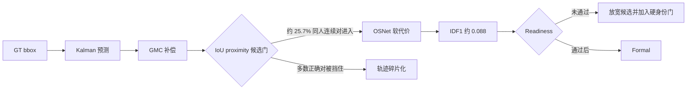

# exp_20260802_001 Pilot Analysis Report

状态：Pilot `0-199` 完成；当前配置未通过 readiness，Formal 暂缓。

## 1. 假设对照

- **测量有效：通过。** GT identity、D1 遮挡标签、world-XY association 和 future
  read 均为 `0`；标签扰动与确定性 mismatch 为 `0`；embedding coverage 为 `1.0`。
- **GMC 对移动相机必要：支持，但不充分。** 同参数 `buffer=5, match=0.8` 下，
  no-appearance IDF1 从无 GMC 的 `0.027542` 升至 `0.087727`，遮挡支撑覆盖从
  `0.648100` 升至 `0.935780`，fragmentation 从 `46499` 降至 `27671`。
- **当前 BoT-SORT 外观接入有效：不支持。** GMC 条件下加入 OSNet 后，IDF1
  `0.087727 -> 0.087635`，purity `0.744977 -> 0.749118`，变化接近零。
- **局部轨迹就绪：拒绝。** 最佳成熟配置 IDF1 仅约 `0.088`，purity 最高不足
  `0.83`；距离 `0.80/0.95` readiness 门均很远。

## 2. 基线比较

以下使用每个变体 Pilot fallback 选中的配置：

| Pipeline | Buffer/Match | IDF1 | Purity | 最差视角 IDF1 | 遮挡覆盖 | Fragmentation |
| --- | --- | ---: | ---: | ---: | ---: | ---: |
| current bbox SORT | 5/0.7 | 0.085926 | 0.210564 | 0.066420 | 0.668414 | 16948 |
| current bbox OSNet | 5/0.7 | 0.020512 | 0.904849 | 0.016832 | 1.000000 | 36861 |
| BoT-SORT no GMC/no app | 10/0.8 | 0.027851 | 0.712663 | 0.019308 | 0.639581 | 45818 |
| BoT-SORT no GMC/OSNet | 10/0.8 | 0.027921 | 0.713241 | 0.019771 | 0.634993 | 45842 |
| BoT-SORT GMC/no app | 5/0.8 | **0.087727** | 0.744977 | 0.072416 | 0.935780 | 27671 |
| BoT-SORT GMC/OSNet | 5/0.8 | 0.087635 | **0.749118** | **0.074269** | **0.946265** | 27645 |

Pilot 的 `selected_config.json` 中四个成熟变体均为
`purity_gate_pass=false`，配置通过 IDF1/purity 调和平均值 fallback 选出。它是可复现
的失败配置，不是 readiness 合格配置。

## 3. 失败模式

### 3.1 正确候选在外观比较前被排除

对同 UAV、同 GT identity 的连续帧做离线候选审计：

| 条件 | 同人连续对进入候选的比例 |
| --- | ---: |
| 原始 bbox IoU >= 0.5 | 0.034236 |
| GMC 后 bbox IoU >= 0.5 | 0.256980 |
| GMC 后 bbox IoU >= 0.3 | 0.463255 |
| GMC 后 bbox IoU >= 0.1 | 0.687754 |

OSNet 同人连续 embedding 在阈值 `0.785027` 下通过率为 `0.911471`。问题不是
OSNet 完全没有同人信号，而是 BoT-SORT 默认 `proximity_thresh=0.5` 使约四分之三
正确连续对不能进入 appearance cost。

### 3.2 标准 BoT-SORT 外观是软替代代价，不是硬拒绝门

当前 Ultralytics BoT-SORT 对相似外观降低匹配代价；外观不通过时，几何匹配仍可能
成立。因此 OSNet 既不能恢复多数被 proximity mask 排除的正确候选，也不能硬拒绝
几何上可接受但身份错误的候选。这解释了加入 OSNet 后 purity 仅增加 `0.004142`。

### 3.3 轨迹仍极短

GMC+OSNet 产生 `19739` 条 local tracks，平均每轨迹仅 `2.72` 个 detection。无 GMC
时仅 `1.62` 个。GMC 缓解了碎片化，但没有恢复可用于 global fusion 的持续 tracklet。

### 3.4 GMC 有明显作用，也存在大变换风险

八个视角的中位平移约 `55-104px/frame`，95 分位约 `148-209px/frame`，最大值达到
`410px`。这确认 2 FPS 下相机运动不可忽略，也说明仅凭单个全局仿射模型仍可能留下
较大的局部残差。

## 4. 上限与性能空间

将 GMC 候选放宽后再施加当前 OSNet 阈值的离线 pair 诊断为：

| GMC IoU 门 | 同人候选数 | 异人候选数 | OSNet 后候选精度 |
| --- | ---: | ---: | ---: |
| >= 0.5 | 13466 | 1780 | 0.973012 |
| >= 0.3 | 24275 | 7867 | 0.950308 |
| >= 0.1 | 36039 | 25690 | 0.923250 |

这只是 pair-level 离线上限，不等于 tracklet purity，但说明 `IoU>=0.3 + hard identity
gate` 值得作为下一次最小修复：它在当前数据上同时扩大正确候选覆盖，并保持约
`0.95` 的候选精度。直接放宽到 `0.1` 而不调整身份门会引入过多异人候选。

## 5. 泛化信号

- GMC+OSNet 的每视角 IDF1 全部很低，范围约 `0.074-0.096`，不是单一 UAV 拖累宏平均。
- MATRIX 为 2 FPS，一帧间隔 `500ms`；标准 BoT-SORT 常见的高帧率局部运动假设不能
  直接迁移。当前结果不能泛化为“BoT-SORT 在 UAV MOT 无效”，只能说明当前固定
  proximity/soft-appearance 配置不适配该时间尺度。
- GT bbox 已移除 detector error，因此当前主要瓶颈是 local association candidate
  recall 和生命周期连续性，而非检测召回。

## 6. 与历史对照

- `exp_20260801_002` 的两种失败继续成立：bbox-only 倾向串人，硬 OSNet 门倾向碎片化。
- 成熟生命周期加 GMC 把旧手写 SORT 的 purity 从 `0.211` 提高到约 `0.745`，并把
  遮挡覆盖提高到约 `0.94`，说明转向成熟 tracker 是合理的。
- 但绝对 IDF1 没有提高，说明“换成成熟 tracker”本身不是解决方案；必须让外观能够
  进入更宽但可控的候选集合，并明确它是软代价还是硬身份拒绝。

## 7. 下一步行动

1. **P0：暂缓当前 Formal。** calibration 数据上所有成熟配置已大幅低于 readiness，
   扩展到 `200-999` 只会正式确认已知失败，不能解决机制问题。
2. **P0：候选召回消融。** 在 GMC 固定条件下扫描 `proximity_thresh={0.1,0.3,0.5}`，
   先报告同人候选 recall 和异人候选数量，再运行 tracker。
3. **P0：区分软外观与硬身份门。** 比较 standard BoT-SORT soft ReID 与
   `geometry candidate + OSNet hard veto`；阈值必须在候选分布内校准。
4. **P1：GMC 可靠性门。** 对极端仿射位移/尺度变化增加降级策略，报告被拒绝或回退
   identity warp 的帧。
5. **P1：最小修复仍失败后**，再引入 OC-SORT 或移动相机/UAV 专用 tracker；此时才有
   证据说明 BoT-SORT 家族不足。

## 流程图

外部图：
`mermaid/exp_20260802_001_matrix_mobile_camera_local_tracklet_readiness/mobile_local_readiness_flow.mmd`。

## 证据范围

主表来自 Pilot 输出。IoU/embedding 候选统计使用 GT identity 做离线归因，只用于解释
机制，不是在线 tracker 输入；连续帧 bbox 审计是 runtime Kalman candidate 的近似诊断，
不应被写成实际 assignment precision。
