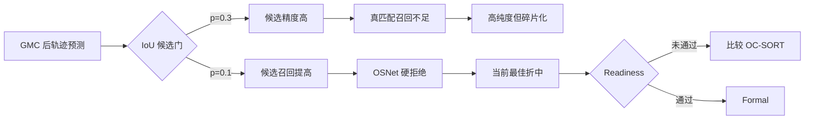

# exp_20260802_002 Pilot Analysis Report

状态：Pilot 完成；结论 `hard_veto_tradeoff_only`；Formal 未启动。

## 1. 假设对照

- **Measurement validity：通过。** embedding coverage=`1.0`，所有禁止读取和确定性
  mismatch 均为 `0`。
- **放宽候选门可改善连续性：部分支持。** soft `p=0.1` 相对 no-app 的 IDF1 从
  `0.087727` 提高到 `0.137706`，fragmentation 从 `27671` 降到 `19780`。
- **`IoU>=0.3 + hard veto` 可修复局部轨迹：拒绝。** purity 达到 `0.973078`，但
  IDF1 降到 `0.077409`，低于 no-app 参考。
- **局部轨迹就绪：拒绝。** 无管线接近 IDF1 `0.80` 与最差视角 IDF1 `0.70` 门。

## 2. 基线比较

| Pipeline | IDF1 | Purity | 最差视角 IDF1 | 覆盖 | Fragmentation |
| --- | ---: | ---: | ---: | ---: | ---: |
| soft, p=0.1 | **0.137706** | 0.802851 | **0.117463** | 0.992792 | **19780** |
| hard, p=0.1 | 0.137546 | 0.946417 | 0.116761 | **0.997379** | 19983 |
| soft, p=0.3 | 0.095139 | 0.763932 | 0.077833 | 0.965269 | 27070 |
| no appearance | 0.087727 | 0.744977 | 0.072416 | 0.935780 | 27671 |
| hard, p=0.3 | 0.077409 | 0.973078 | 0.065141 | 0.956094 | 30912 |
| hard, p=0.5 | 0.041135 | **0.989813** | 0.036636 | 0.749017 | 41070 |

hard `p=0.1` 相对 no-app 同时带来 IDF1 `+0.049819`、purity `+0.201440`、
fragmentation `-7688`，说明修复有真实信号；但 hard 相对 soft `p=0.1` 几乎不改变
IDF1，只把 purity 提高 `0.143566`，仍未形成长轨迹。

## 3. 失败模式

失败呈现明确的 precision-recall trade-off：

| Proximity | 同人候选召回 | hard gate precision | hard gate 同人总召回 |
| ---: | ---: | ---: | ---: |
| 0.1 | 0.687754 | 0.923250 | 0.634053 |
| 0.3 | 0.463255 | 0.950308 | 0.429553 |
| 0.5 | 0.256980 | 0.973013 | 0.238755 |

`p=0.3` 的 `0.9503` 是被接受候选的离线精度，不是持续成轨概率。它在拒绝异人时也
丢掉约 `57%` 同人连续对，造成 fragmentation `30912` 和 local IDSW `32265`。
`p=0.1` 扩大候选后明显改善，但仍有约 `36.6%` 同人连续对无法通过几何+身份门。

## 4. 上限分析

当前最好 IDF1 `0.1377`，距离 readiness `0.80` 仍差 `0.6623`。这不是再将
proximity 从 `0.1` 微调到邻近小数可以合理弥合的差距。GT bbox 已排除 detector
error，OSNet hard gate 也已将 purity 推近 `0.95`；剩余主要方法空间在更适合低帧率
移动相机的运动模型、轨迹观测中心和重关联机制，而非 BoT-SORT 单阈值。

## 5. 泛化信号

1. 候选 pair precision 不能替代 local IDF1；高精度门可通过拒绝真匹配获得。
2. 在 2 FPS UAV 视频上，外观门必须和高召回运动候选共同设计。
3. hard veto 能抑制 identity merge，但不能独自恢复被运动模型切断的轨迹。

## 6. 与历史对照

- 上一轮默认 `p=0.5` 的 GMC+OSNet IDF1/purity 为 `0.087635/0.749118`；本轮 soft
  `p=0.5` 精确复现，说明实验改动没有破坏参考线。
- `p=0.1` 将 IDF1 提高约 `57%`，验证上一轮“candidate recall 是瓶颈之一”的判断。
- 但绝对 IDF1 仍低，说明 candidate recall 不是唯一瓶颈；这支持按预定义条件转向
  OC-SORT 或移动相机/UAV 专用 tracker。

## 7. 下一步建议

1. **P0：OC-SORT 最小基线。** 保持同一 GT bbox、GMC/无 GMC、0-199 切片和评估门，
   只替换轨迹运动/生命周期；判断 observation-centric 更新能否提高同人候选召回和
   local IDF1。失败仍能区分“BoT-SORT 特定问题”与“数据时间尺度问题”。
2. **P0：Formal 继续冻结。** 当前没有通过的 Pilot 配置，不能扩展 200-999。
3. **P1：若 OC-SORT 仍远低于门，比较移动相机/UAV 专用 tracker。** 优先选择已发表且
   有公开实现的方法，不手写新的 tracker，并保持 GT bbox 控制。
4. **P1：保存 `p=0.1 + hard veto` 为 BoT-SORT 最强参考。** 它不是可部署方法，但可
   作为后续 tracker 对照。

## 流程图

外部图：
`mermaid/exp_20260802_002_matrix_botsort_candidate_gate_repair/candidate_gate_repair_flow.mmd`。

## 证据边界

候选 pair 统计使用 GT identity 做离线归因，不进入在线关联。Pilot 只有 `0-199`，足以
拒绝当前 Formal，但不能据此宣称 OC-SORT 或其他数据集上的性能。
