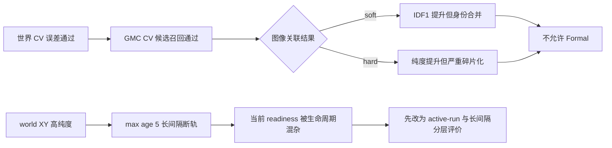

# exp_20260802_003 Pilot Analysis Report

状态：Pilot `0-199` 完成；Measurement Gate 全通过；Formal 禁止。

脚本原始决策为 `world_motion_or_annotation_bottleneck`。进一步诊断表明该标签与
`max_age=5` 的生命周期规则混杂。更准确的研究判断是：

```text
readiness_gate_lifecycle_confounded
+ association/identity trade-off remains unresolved
```

## 1. 假设对照

- **世界运动近似线性：通过。** world hold error p90=`0.683696m`，CV error
  p90=`0.269029m`，降低 `60.65%`，满足预设 `<=0.50m` 且降低至少 `30%`。
- **GMC+CV 候选可达：通过。** IoU>=0.1 的同人连续对召回从 GMC hold 的
  `0.691964` 提高到 `0.826277`，增量 `0.134313`。
- **OC-SORT 达到局部就绪：拒绝。** 最佳 image pipeline IDF1 只有 `0.337211`，
  purity 只有 `0.478666`；没有管线通过完整 readiness。
- **OC-SORT 相对 BoT-SORT 的改善稳定且兼顾纯度：拒绝。** soft appearance 的
  IDF1 提高 `0.199665`，但 purity 下降 `0.467751`；hard veto 提高 purity，却使
  IDF1 下降 `0.040580`、fragmentation 增加 `8159`。
- **行人世界运动或 world 标注是主要瓶颈：现有证据不支持。** 运动条件已通过；
  `8000/8000` 个 `(frame,person)` 的跨视角 world-XY 完全一致。world oracle 的低
  IDF1 还受到固定生命周期和局部 ID 终止规则影响，不能单独归因给运动或标注。

## 2. 基线比较

| Pipeline | IDF1 | Purity | 最差视角 IDF1 | Coverage | Fragmentation |
| --- | ---: | ---: | ---: | ---: | ---: |
| clean world-XY CV | **0.548384** | **0.995616** | **0.462030** | 1.000000 | **787** |
| Deep OC-SORT + GMC + soft OSNet | 0.337211 | 0.478666 | 0.289286 | 0.903670 | 8235 |
| BoT-SORT + GMC + hard OSNet | 0.137546 | 0.946417 | 0.116761 | **0.997379** | 19983 |
| Deep OC-SORT + GMC + hard OSNet | 0.096966 | 0.968358 | 0.082537 | 0.977720 | 28142 |
| Deep OC-SORT + GMC，无外观 | 0.094771 | 0.703539 | 0.079829 | 0.924640 | 26793 |
| OC-SORT，无 GMC/外观 | 0.028666 | 0.753279 | 0.019462 | 0.642202 | 46061 |

BoT-SORT 参考误差为 `0`，证明对照线精确复现。Deep OC-SORT soft 的连续性明显更好，
但通过合并不同身份换取 IDF1；hard veto 再次回到高纯度、严重碎片化。当前仍是
precision-continuity trade-off，不是一个可部署的解决方案。

运动参数扫描的影响很小：OC-SORT 四组 IDF1 只在 `0.028408-0.028666`；Deep OC-SORT
no-app 只在 `0.088501-0.094771`。继续细调 `delta_t/inertia` 不足以弥合到 `0.80` 的差距。

## 3. 失败模式

### 3.1 图像候选可达不等于多目标关联正确

GMC+CV 使 `82.63%` 的同人连续对进入 IoU>=0.1 候选区，但该指标只问“正确候选在不在”，
不问同一时刻有多少异人候选。Deep OC-SORT soft 因此可减少断轨，却产生大量身份合并，
purity 降到 `0.479`。

### 3.2 外观硬拒绝仍造成过度碎片化

Deep OC-SORT hard purity=`0.968358`，但 fragmentation=`28142`，比 BoT-SORT hard
还多 `8159`。冻结 OSNet 能拒绝一部分异人，却不能稳定授权所有跨帧同人匹配。

### 3.3 readiness 被可见性间隔和生命周期混杂

D1-D8 共 `320` 条 `(view,person)` 可见序列。相邻可见帧之间有 `537` 个间隔超过
`track_buffer=5`，即使关联完全正确，也至少产生 `857` 个可见 run。world oracle
实测 fragmentation=`787`，其中约 `68%` 可由这些长间隔解释。

因此当前 macro local IDF1 同时惩罚：

```text
短时 active tracklet 内的错误关联
+ 正常终止后没有长期 ReID 的新 local ID
```

后者不一定是 incremental local tracklet 基础设施的失败，可能应交给 global stitching。

## 4. 上限分析

clean world-XY 达到 purity `0.995616`、coverage `1.0`、unassigned `0`，说明几何位置对
短期局部关联很强；但 IDF1 只有 `0.548384`。这不是“world coordinate 本身无效”，而是
当前上限仍包含 `distance_threshold=1m + max_age=5 + 无长期身份恢复`。

当前 world oracle 不是身份 oracle，也不是无条件数学上限。下一轮必须把上限拆成：

```text
active-run world association quality
gap > buffer 后的新 tracklet 合理终止
可选的长期 stitching/re-identification 上限
```

否则 `IDF1>=0.80` 可能要求 local tracker 同时完成本不属于本地短轨迹模块的长期 ReID。

## 5. 泛化信号

- world CV 误差和 GMC+CV 召回在 2 FPS MATRIX 上有明确正信号，反驳“人的运动完全不近似
  线性”这一解释。
- 相机平移 `<200px` 的三个主要 bucket 中，GMC+CV IoU>=0.1 召回为
  `0.804-0.853`；`>=200px` 时降至 `0.716`，说明极端相机运动仍是局部风险。
- 结果仍使用 GT bbox，不能推广到 detector miss/false positive。
- 结果只覆盖 `0-199` Pilot，足以拒绝当前配置的 Formal，不足以评价其他公开 tracker。

## 6. 与历史对照

- BoT-SORT p0.1 hard 精确复现上一轮：IDF1 `0.137546`、purity `0.946417`。
- 上一轮认为候选召回不足；本轮证明 GMC+CV 可以把正确候选召回提高到 `0.826`，但
  多目标决策仍在“soft 合并身份”和“hard 切碎轨迹”之间摆动。
- 这收紧了失败归因：问题不只是 proximity threshold，也不能简单归因于常速度假设；
  需要区分 active-run association、生命周期终止和长期身份恢复。

## 7. 下一步建议

1. **P0：修正 local readiness 的评价单位。** 按 LoS 可见 run 或
   `gap<=track_buffer` 的 active segment 计算 IDF1、IDSW、purity；另行报告跨长 gap 的
   reacquisition/stitching。成功标准是 clean world-XY active-run IDF1 `>=0.90`，否则才
   检查 world association 或标注。
2. **P0：增加 world oracle 生命周期敏感性。** 固定关联，扫描 max age，并报告收益来自
   延长 active track 还是增加身份合并。该审计只校准测量门，不作为部署方法。
3. **P1：局部 tracker 比较使用修正后的 segment-level gate。** 若 OC-SORT/Deep
   OC-SORT 在 active-run 上仍低，按预案比较公开移动相机/UAV tracker；不再细扫
   `delta_t/inertia`。
4. **P1：把长间隔恢复留给 global tracklet stitching。** local tracklet 合理终止后，
   新 local ID 不应自动算作局部模块失败；跨片段身份连续性由后续异步全局融合评价。
5. **禁止当前 Formal。** `selected_config.json` 已正确写入 `formal_allowed=0`。

## 流程图



外部流程图：
`mermaid/exp_20260802_003_matrix_ocsort_motion_representation_audit/ocsort_motion_representation_flow.mmd`。

## 证据边界

`person_id` 仅用于离线指标、连续三帧运动诊断和可见性间隔归因；在线 tracker 输入不含
身份、遮挡标签或 world-XY。world-XY 上限单独使用几何，但不参与 image tracker readiness
授权。上述 `537` 个长间隔是后验解释量，不是在线决策输入。
