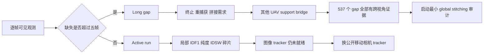

# exp_20260802_004 Analysis Report

状态：analysis-only formal 完成；结论
`readiness_metric_recalibrated_local_tracker_still_blocked`。

## 1. 假设对照

- **原 local IDF1 被长 gap 混杂：通过。** clean world-XY IDF1 从全序列
  `0.548384` 升至 active-run `0.935778`，最差视角也达到 `0.863427`。
- **clean world-XY active-run 应达到 0.90：通过。** purity=`0.995616`。
- **现有 image tracker active-run 就绪：拒绝。** 无管线同时达到 IDF1 `0.80`、
  purity `0.95`、最差视角 IDF1 `0.70`。
- **长 gap 应交给 global stitching：数据条件通过。** `537/537` gap 中，目标在每个
  gap frame 都至少被另一 UAV 看见。
- **OSNet appearance 单独足以拼接：拒绝。** true-pair threshold pass rate 只有
  `0.664804`，且尚未测负样本 precision。

## 2. 基线比较

| Pipeline | 原 IDF1 | Active-run IDF1 | Active purity | Min-view | Short fragmentation |
| --- | ---: | ---: | ---: | ---: | ---: |
| clean world-XY | 0.548384 | **0.935778** | **0.995616** | **0.863427** | **250** |
| Deep OC-SORT soft | 0.337211 | 0.373450 | 0.433254 | 0.314180 | 9093 |
| BoT-SORT hard | 0.137546 | 0.248246 | 0.948805 | 0.213243 | 19498 |
| Deep OC-SORT hard | 0.096966 | 0.175466 | 0.969608 | 0.148727 | 27648 |
| Deep OC-SORT no-app | 0.094771 | 0.167077 | 0.716002 | 0.146258 | 26311 |

分层显著修复了 clean-world 上限，但没有把任何 image tracker 推过就绪门。因此之前
“readiness gate 混杂”与“image local tracker 确实仍差”两个判断同时成立。

## 3. 失败模式

### Active run

- Deep OC-SORT soft 继续用身份合并换连续性，purity 只有 `0.433`。
- BoT-SORT/Deep OC-SORT hard 保持高 purity，但 active run 内仍频繁创建新 ID，说明
  碎片并不都来自长 gap。
- `delta_t/inertia` 对 active-run IDF1 的影响仍很小，不支持继续细扫。

### Long gap

- BoT-SORT hard、world-XY、绝大多数 OC-SORT 的 same-local-ID recovery 为 `0`；
  创建新 local tracklet 是常态。
- clean world-XY correct reacquisition=`1.0`，平均 delay=`0.048` 帧，但 ID 已变化，
  正好说明“位置能重新找到人”和“恢复旧 local ID”是两个问题。
- Deep OC-SORT soft same-ID=`0.104`，但其低 purity 表明长时间保持 ID 不一定正确。

## 4. 上限分析

clean world-XY active-run IDF1 `0.936` 证明，world state 与当前分段规则能形成可信局部
上限。剩余 `250` 个短时碎片来自 1m 距离门、近距离交叉或不超过 5 帧的短 miss，而不是
长期离场。

对 global stitching，MATRIX 提供非常强的 oracle headroom：所有长 gap 都被其他视角
完整覆盖。但 OSNet 正同人阈值召回仅 `66.5%`，后续必须联合 support tracklet history、
时空状态和外观，不能只做单 embedding 阈值。

## 5. 泛化信号

- 分段使用的是 `gap_frames=5`，在 MATRIX 2 FPS 下是 2.5 秒；迁移到其他 FPS 时必须按
  时间重新定义，不能固定为五帧。
- support bridge `1.0` 是 MATRIX 八视角重叠带来的强条件，不能直接推广到双无人机
  MDMT；第二数据集必须重新测覆盖率。
- 本轮仍是 GT bbox，未包含 detector miss/false positive。

## 6. 与历史对照

- `exp_003` 的自动 `world_motion_or_annotation_bottleneck` 被本轮否定：clean world
  active-run 已通过，问题主要不是世界运动或 world annotation。
- 候选召回 `0.826` 仍没有转化为可靠 image local tracklet，失败收紧到 active-run
  多目标关联和身份权限。
- 原全序列 local IDF1 不应再作为单独的 local readiness 硬门；它保留为 end-to-end
  local+recovery 描述指标。

## 7. 下一步建议

1. **P0：停止当前 200-999 local Formal。** image active-run 仍未就绪。
2. **P0：比较一个公开移动相机/UAV tracker，但使用新的 active-run gate。** 成功标准
   保持 IDF1 `>=0.80`、purity `>=0.95`、最差视角 `>=0.70`。
3. **P0：同时开始 global stitching 的最小可行性实验。** 不需要等 local tracker 完美；
   先用 clean-world local tracklets 和冻结 OSNet，比较 appearance-only、support-history、
   时空+appearance，验证 537 个 gap 的可拼接上限。
4. **P1：在 MDMT 小样本复算 active-run/gap/support bridge。** 判断 MATRIX 的八视角
   完整 bridge 是否过于理想。
5. **P1：下一轮 global 方法禁止读取 D1 GT 遮挡标签。** 只能使用 local tracklet
   termination、miss count、消息时间戳和 support tracklet 状态。

## 流程图

外部流程图：
`mermaid/exp_20260802_004_matrix_local_tracklet_lifecycle_stratified_readiness/lifecycle_stratified_flow.mmd`。

## 证据边界

GT identity、LoS 和 OSNet true-pair 标签仅用于离线分段、bridge 统计和评价。该实验没有
修改 tracker 输出，也没有实现 global stitching；`stitch opportunity` 不能写成拼接成功率。

