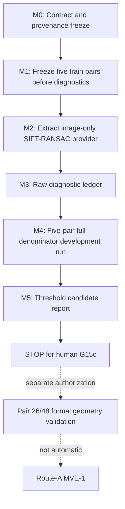

# EXPERIMENT_CONTRACT

## 1. Experiment Identity

- Experiment ID: `exp_20260823_001_mdmt_mia_independent_geometry_development`
- Title: MDMT MIA target-independent same-time SIFT-H geometry development
- Type: `GEOMETRY_INFRASTRUCTURE_DEVELOPMENT`
- Status: `PROPOSED / PLANNING_COMPLETE / IMPLEMENTATION_NOT_AUTHORIZED`
- Parent Route-A experiment:
  `exp_20260822_001_mdmt_mia_route_a_observer_mve`
- Parent result: `MVE_INCONCLUSIVE_DUE_TO_GEOMETRY`; MVE-1 remains blocked.
- Suggested branch:
  `exp/20260823-001-mdmt-mia-independent-geometry-development`
- Recommended experiment directory:
  `summary_md/experiments/2026-8-23/exp_20260823_001_mdmt_mia_independent_geometry_development/`
- Planned raw output root:
  `outputs/20260823_mdmt_mia_independent_geometry_development/`
- Flowchart:
  `mermaid/exp_20260823_001/independent_geometry_development_flow.mmd`
- Related evidence:
  - `PRE_DRAFT_AUDIT.md`
  - `learning/ROUTE_A_CROSS_VIEW_GEOMETRY_SOURCE_AUDIT.md`
  - parent `EXPERIMENT_CONTRACT.md`, `EXEC_PLAN.md`, `RESULTS.md`, and
    `DECISION.md`
  - `learning/MVE_CHANGE_EXPLAINER.md`

The suggested branch is not a FACT: the current workspace is not a Git
worktree. Implementation must establish Git provenance before M0 can pass.

## 2. Scientific Question and Evidence

### Research question — RQ-GEO-1

Can a target-association-independent, same-time, image-derived SIFT-RANSAC
Homography provide an auditable cross-view geometry context with measurable
validity diagnostics and coverage on MDMT?

### FACT

1. Route-A MVE-0 completed 7/7 observer-only runs with A1-A11 passing, exact
   core/feedback invariance, zero tracker mutation, and zero candidates because
   the cross-view geometry gate failed.
2. The active MIA code contains an image-only SIFT/FLANN/RANSAC computation in
   `matching_pure.py`.
3. Its active caller in `supp_compute_transf_matrix` is not independent: the
   invocation depends on matched-row count and the returned H is selected or
   replaced using association-derived `f_last`.
4. The downloaded MDMT package has 25 paired train sequence IDs with matched
   two-view JPEG filename sets. Pair 26 and Pair 48 are not in train.
5. The current MDMT package contains no independent calibration/pose source
   suitable for the frozen Pair-26/48 gate.

### INFERENCE

1. Extracting only the existing image-derived computation behind a provider API
   that cannot accept target state can test geometry-association decoupling
   without inventing a geometry oracle.
2. A complete raw diagnostic ledger can reveal whether same-time SIFT-H has a
   usable or severely limited operating regime before Route-A outcomes exist.
3. Low geometry availability is a possible scientific result, not grounds for
   relaxing the gate or replacing selected development pairs.

### ASSUMPTION

1. A single per-frame Homography is a deliberately limited MVE representation
   for a moving-UAV, non-planar scene. It is not assumed to be a complete scene
   model.
2. Directory-level frame-name equality denotes the synchronized frame pairing
   used by this geometry development experiment. No target annotation is needed.
3. SIFT-RANSAC can be made reproducible enough for an audited development
   ledger once estimator parameters, OpenCV RNG handling, and environment
   provenance are frozen.

### UNKNOWN

1. The SIFT ratio-test, RANSAC, minimum support, reprojection, degeneracy, and
   projection-plausibility numbers are not yet research-frozen.
2. The fraction of development frames producing a finite 3x3 H is unknown.
3. Threshold-valid geometry coverage on Pair 26 and Pair 48 is unknown and may
   not be measured in the current M0-M5 stage.
4. Whether both A-to-B and B-to-A must be independently estimated, or one
   direction plus an audited inverse is sufficient, is not frozen.
5. No pair-level coverage threshold for later Route-A readiness is frozen.

### Primary hypothesis

With target state excluded, same-time MDMT image pairs contain enough
image-level correspondence support for a deterministic SIFT-RANSAC provider to
produce a complete auditable diagnostic ledger and a nontrivial finite-H
operating regime on the frozen five-pair train development set.

### Plausible alternative hypothesis

Even with correct provenance and complete logging, same-time SIFT-RANSAC often
has insufficient correspondence support or produces numerically/projectively
degenerate H estimates, so the first geometry infrastructure has insufficient
coverage for later Route-A use.

The hypotheses are separated by full-denominator hard-availability and
geometry-only diagnostic distributions. They are not separated by any target,
candidate, identity, or tracking metric.

## 3. Motivation

This experiment is a structural extraction from MIA, not a new oracle. Original
MIA already computes global image registration, but places it inside a mixed
control path:

```text
target association state
  -> matched-row count / f_last
  -> optional global image registration
  -> returned H
  -> further association
```

The planned subsystem retains only the raw scene-level computation:

```text
same-time image A(t) + image B(t)
  -> SIFT features
  -> image-level matching
  -> RANSAC
  -> raw H_AB(t) and geometry-only diagnostics
```

This makes geometry an independently auditable context rather than a conclusion
conditioned on the very target association that later consumes it. SIFT and
Homography are implementation components; the research-relevant structural
candidate is geometry-association decoupling followed, in a later experiment,
by delayed-observation arrival-time reasoning.

## 4. Scope

### IN SCOPE

- freeze a five-pair MDMT-train Geometry Development Set before diagnostics;
- same-time synchronized raw image pairs;
- SIFT, image-level feature matching, RANSAC, and per-frame Homography;
- target-independent geometry diagnostics and a raw diagnostic ledger;
- hard numerical failure handling with fail-closed behavior;
- development-only distributions and geometry-validity threshold candidates;
- reproducibility and provenance checks;
- a later, separately authorized Pair-26/48 formal geometry validation boundary.

### OUT OF SCOPE

- Route-A candidate regeneration or MVE-1;
- observer packet execution, communication delay, or geometry delay;
- tracker execution, mutation, feedback, association commit, or ID recovery;
- target/identity correctness and GT-based H evaluation;
- IDF1, HOTA, IDSW, MOTA, MDA, or tracking improvement;
- historical H propagation, hold-last H, smoothing, or future-frame fusion;
- learned features, depth, pose, optical-flow, or calibration estimation;
- sequence replacement, parameter sweep selected by coverage, or val use;
- a claim that one Homography fully models the 3D moving-UAV scene.

## 5. Frozen Research Decisions G1-G15b

The following are `HUMAN-FROZEN`. Implementation cannot reopen, optimize, or
silently substitute them.

### G1 — Geometry Context Identity (`FROZEN`)

Cross-view geometry is scene-level state `G_AB(t)`, independent of any specific
target observation or candidate. All target observations at time `t` share the
same context. Per-candidate H estimation is forbidden.

### G2 — Geometry Context Temporal Support (`FROZEN`)

The overall Route-A design may later maintain geometry with visual information
causally available by time `t`; information after `t` is forbidden. This does
not authorize history use in the first geometry validation.

### G3 — Geometry Information Source (`FROZEN`)

`G_AB(t)` may be generated from target-independent dual-view raw images or
image-level visual information. It must not use target bboxes, tracker IDs, GT
identity, current candidate association, `S_cf`/oracle state, or downstream
tracking outcomes.

### G4 — First Geometry Validation Temporal Form (`FROZEN`)

The first validation uses only `image_A(t) + image_B(t)` for same-time,
single-frame, candidate-independent estimation. It must not use H propagation,
historical fusion, hold-last H, or temporal smoothing.

### G5 — First Geometry Representation (`FROZEN`)

The first representation is a per-frame Homography `H_AB(t)`. It is an MVE
approximation and must not be claimed to completely model moving UAVs and a
non-planar 3D scene.

### G6 — Geometry-Only Validity Gate (`FROZEN`)

`H_AB(t)` must pass a target-independent, geometry-only validity gate. A failed
frame is `geometry unavailable` and fails closed. Target outcomes, GT, candidate
outcomes, and previous-frame H cannot rescue it.

### G7 — Geometry Availability / Route-A Separation (`FROZEN`)

Geometry Availability and Route-A Candidate Regeneration are separate gates.
Geometry-valid-frame Route-A behavior cannot by itself establish Route A;
geometry coverage must be reported independently.

### G8 — Geometry Coverage Denominator (`FROZEN`)

Every synchronized A/B image frame pair in a selected pair enters the coverage
denominator. Frames cannot be removed because of target presence, shared GT
identity, tracker output, SIFT performance, or H performance. Pair 48's later
formal denominator is 700 synchronized frame pairs.

### G9 — Geometry Validity Evidence (`FROZEN`)

The validity gate may use only target-independent feature correspondence
support, robust geometric consensus, reprojection/numerical consistency, and
image-level projection plausibility. Diagnostics may include tentative matches,
RANSAC inliers, inlier ratio, feature reprojection error, finite/NaN/Inf,
degeneracy, and grid/boundary projection plausibility. Target bboxes, track IDs,
GT identity, candidate success, and tracking metrics are forbidden.

### G10 — Geometry Validity Threshold Protocol (`FROZEN`)

All thresholds must be frozen before Route-A downstream outcomes are viewed,
must depend only on geometry evidence, must be identical for Pair 26 and Pair
48, and cannot be sequence-tuned. The first gate must remain minimal.

### G11 — Threshold Derivation Protocol (`FROZEN`)

Numerical thresholds cannot be calibrated on Pair 26 or Pair 48. They must be
derived from an independently frozen Geometry Development Set using only
geometry diagnostics. Pair-26/48 formal geometry validation can occur only
after threshold freeze.

### G12 — Geometry Development Sequence Selection (`FROZEN`)

Development sequences must be selected by a fixed reproducible rule before any
SIFT/H diagnostic is viewed, remain separate from Pair 26/48, and cannot be
replaced because of poor geometry behavior.

### G13 — Geometry Development Data Pool (`FROZEN`)

Only the MDMT train split is eligible. Pair 26/48 are excluded, val remains
untouched, and no XML/GT annotation may be read. Allowed fields are raw images,
sequence identity, and frame index. XML bboxes/IDs, generated GT text, MDA GT,
tracker IDs, and candidate associations are forbidden.

### G14 — Geometry Development Set (`FROZEN`)

At sequence/pair level, use seed `7` to randomly select exactly five pairs from
the eligible MDMT train pool after excluding Pair 26/48. Sampling must precede
all SIFT/H diagnostics. The five pairs cannot be replaced after selection.

### G15a — Development-Only Threshold Calibration (`FROZEN`)

The five development pairs may be used to inspect match count, RANSAC inlier
count, inlier ratio, reprojection error, and numerical/projective degeneracy and
to propose geometry-validity thresholds. GT, target correspondence, Route-A
candidate regeneration, tracker output, and tracking/identity metrics remain
forbidden.

### G15b — Geometry Threshold Calibration Objective (`FROZEN`)

Calibration must identify clearly unreliable or degenerate geometry regimes;
it must not maximize coverage. Thresholds cannot be loosened until coverage
looks good. Low coverage is an allowed conclusion:
`same-time SIFT-H geometry infrastructure coverage insufficient`.

## 6. Inputs and Firewalls

### Allowed runtime inputs

- synchronized raw `image_A(t)` and `image_B(t)`;
- frame index derived from the matched image filename/order;
- sequence/pair identity;
- frozen estimator configuration and RNG state;
- image dimensions and image digests derived directly from the images.

### Forbidden runtime or calibration inputs

- any XML target annotation, GT text, MDA GT, or generated identity mapping;
- target bbox, detector row, tracker row, tracker state, tracker ID, matched ID,
  or association pair;
- current/prior `f`, `f_last`, held H, or target-dependent invocation trigger;
- `S_cf`, shadow/oracle membership, ReID, or appearance identity;
- target/candidate success, tracking output, or downstream metric;
- any future frame or historical H in the first version;
- Pair 26, Pair 48, or MDMT val during development/calibration.

The development runner must require `split=train`, refuse XML/GT arguments and
paths, and reject forbidden schema keys before processing any frame.

## 7. Geometry Estimator Contract

The first provider is exactly:

```text
image_A(t) + image_B(t)
  -> SIFT
  -> image-level feature matching
  -> RANSAC
  -> raw per-frame H_AB(t) + diagnostics
```

Conceptual API:

```python
estimate_geometry(
    image_src,
    image_dst,
    *,
    pair_id,
    frame_id,
    direction,
    frozen_config,
) -> GeometryEstimate
```

The image arrays and frozen estimator config are computational inputs.
`pair_id`, `frame_id`, and `direction` are provenance fields. The API and all
transitive callees must not accept tracker rows, IDs, bboxes, candidates, GT,
or previous H. One call estimates one same-time direction without fallback.

The existing `matching_pure.py` is an implementation reference only. The mixed
`supp_compute_transf_matrix`, `get_matched_ids`, and `f_last` paths are forbidden.

Estimator parameter values remain `NEEDS_RESEARCH_DECISION`; the constants in
the original source (`0.7`, `10`, `5.0`) are evidence of author implementation,
not automatically frozen values for this experiment.

## 8. Design

- Primary experimental object: one fixed target-independent same-time SIFT-
  RANSAC provider evaluated over every synchronized frame of five preselected
  train pairs.
- Controlled variables:
  - pair-selection rule and seed;
  - selected pair manifest;
  - source/destination image pairing and full frame range;
  - estimator family, parameters, implementation digest, OpenCV version, and
    RNG handling;
  - diagnostic definitions and raw schema;
  - hard-failure rules;
  - no target/tracker/GT/history/downstream inputs.
- Dataset/split: MDMT train only for M0-M5; val untouched; Pair 26/48 firewalled.
- Frame range: all synchronized JPEG filename pairs for every selected pair.
- Seeds:
  - development pair selection: `7`;
  - estimator/OpenCV RNG: fixed before M2 execution, value pending an open
    research decision if it can affect scientific output.
- Detector/tracker/checkpoint: `NOT_USED`.
- Message schema/delay: `NOT_APPLICABLE`; same-time image geometry only.
- Safety baseline: `GEOMETRY_UNAVAILABLE_FAIL_CLOSED`. A hard failure emits no
  H for consumer use and never falls back to prior/target-derived state.
- Diagnostic upper bound: `NOT_AVAILABLE_WITHOUT_FORBIDDEN_GT`. No GT/oracle
  geometry quality upper bound is introduced. Repeat consistency is a
  reproducibility check, not a quality upper bound.
- Other baselines: none in M0-M5. Learned, temporal, target-conditioned, and
  calibration-based alternatives would change the experiment.

This is an infrastructure-development observation, not a causal tracker
comparison. The sole estimator family is fixed once its open parameters receive
human approval.

## 9. Geometry Diagnostic Schema

Each raw record is keyed by `(pair_id, frame_id, direction)` and contains at
least:

```text
experiment_id
development_manifest_digest
provider_version
provider_config_digest
pair_id
frame_id
direction
source_view
destination_view
image_src_path_relative
image_dst_path_relative
image_src_digest
image_dst_digest
image_src_shape
image_dst_shape

num_keypoints_src
num_keypoints_dst
num_knn_pairs
num_tentative_matches
num_unique_matches
num_ransac_inliers
inlier_ratio

reprojection_error_mean
reprojection_error_median
reprojection_error_p95

H_available
H_shape
H_finite
H_matrix
hard_failure_code

matrix_rank
determinant
condition_number
normalization_status
degeneracy_flags

projected_grid_point_count
projected_grid_finite_fraction
projected_grid_inside_fraction
projected_corner_finite_fraction
projected_area_ratio
orientation_flip
projection_denominator_min_abs

gate_input_fields
threshold_gate_status
record_digest
```

Before the later human G15c freeze:

```text
threshold_gate_status = NOT_EVALUATED_PENDING_G15C
```

Only shape/nonexistence/nonfinite hard failures may be classified immediately.
No minimum match/inlier/ratio, reprojection, degeneracy, projection, or coverage
threshold can generate a scientific valid/invalid label in M0-M5.

## 10. Measurement

### Primary development measures

1. `diagnostic_ledger_completion_fraction`:
   recorded frame-direction units divided by the full manifest denominator.
   It must equal `1.0`; hard failures remain rows in the denominator.
2. `hard_H_available_fraction`:
   finite 3x3 H rows divided by the same full denominator. This describes raw
   infrastructure availability, not G15c-valid coverage.

These measures separate an auditable provider with measurable operating limits
from a pipeline that silently drops difficult frames.

### Secondary measures

- hard-failure counts/rates by code, pair, direction, and frame;
- keypoint, KNN, tentative/unique match, and RANSAC-inlier distributions;
- inlier-ratio and reprojection-error distributions;
- numerical and projective diagnostic distributions;
- per-pair and aggregate full-denominator summaries;
- exact-repeat/determinism mismatches;
- forbidden-read and firewall counters;
- wall-clock time per frame and total storage size as engineering diagnostics.

### Explicitly forbidden measurements

Target correctness, GT reprojection against target ties, candidate regeneration,
IDF1, HOTA, IDSW, MOTA, MDA, association precision/recall, or any Route-A
downstream result.

### Measurement gates

- frozen development manifest exists before the first geometry record;
- every synchronized frame-direction unit has exactly one diagnostic row;
- no duplicate keys and no denominator exclusions;
- image and config/code provenance digests are complete;
- all no-oracle/no-target/no-history assertions pass;
- repeat subset uses identical inputs/config and satisfies the predeclared
  reproducibility criterion;
- threshold report contains candidates only and no frozen validity label.

### Known confounders and controls

| Confounder | Control |
| --- | --- |
| Pair cherry-picking | Seed-7 pair-level manifest written before diagnostics; no replacement. |
| Difficult-frame dropping | Full synchronized denominator and one row per unit, including hard failures. |
| Target leakage | Provider type/signature/import allowlist plus runtime forbidden-read audit. |
| Temporal leakage | One same-time frame pair per call; no prior/future H or image state. |
| Sequence tuning | One config for all five development pairs and later both formal pairs. |
| Coverage-driven gate relaxation | Threshold candidates justified by failure-regime diagnostics, never a desired coverage target. |
| Nondeterministic RANSAC | Frozen RNG/environment and exact-repeat subset. |
| Direction pooling hides failure | Direction-stratified results; final direction requirement awaits human decision. |
| Homography overclaim | Report projection diagnostics and limitation; no 3D-scene claim. |

## 11. Assertions

| ID | Assertion | Required evidence |
| --- | --- | --- |
| GEO-A1 | No XML/GT read | No XML/GT paths in manifest/config; file-access audit count zero. |
| GEO-A2 | No tracker state or matched-ID read | Provider dependency/import audit and denylisted API/schema fields absent. |
| GEO-A3 | No `f_last` or previous H | Stateless frame-call test; source/import audit; previous-H field absent. |
| GEO-A4 | No `S_cf`, shadow, candidate, or downstream outcome | Denylist audit and zero forbidden-read counters. |
| GEO-A5 | No future/history input | Source/destination frame IDs equal current record frame; provider retains no frame state. |
| GEO-A6 | Same-time image-only computation | Input allowlist contains only images, provenance fields, and frozen config. |
| GEO-A7 | Development set frozen before diagnostics | Write-once manifest timestamp/digest precedes every diagnostic record. |
| GEO-A8 | Exactly five train pairs selected with seed 7 | Eligible pool, sampler code digest, runtime version, and selected list persisted. |
| GEO-A9 | Pair 26/48 not calibrated | Development manifest and file-access audit contain neither pair. |
| GEO-A10 | Val untouched | All resolved image paths remain under the train root; val read count zero. |
| GEO-A11 | Full denominator preserved | One ledger row per synchronized unit; hard failures included; no post-result filtering. |
| GEO-A12 | No hidden fallback | Any unavailable H remains unavailable; no alternative/previous/target H source exists. |
| GEO-A13 | Reproducibility checked | Frozen subset repeated with declared comparison rule and mismatch report. |
| GEO-A14 | Threshold status not prematurely frozen | Every M0-M5 row says `NOT_EVALUATED_PENDING_G15C`; report labels candidates only. |
| GEO-A15 | Provider cannot mutate MIA/tracker | Geometry development process imports/calls neither MIA main flow nor tracker runtime. |

Any failed assertion invalidates the development evidence; low raw H coverage
with assertions passing is not invalidity.

## 12. Runs and Budget

### Minimum viable implementation smoke

After implementation authorization and required pre-M2 decisions:

- synthetic or repository-test images only for unit tests of schema and hard
  failures;
- no MDMT Pair 26/48, val, XML, tracker, or Route-A execution;
- one predeclared small subset from the already frozen five-pair manifest may be
  used solely to verify I/O completeness and exact repeat behavior;
- the smoke must not be used to tune estimator or gate parameters.

### Development diagnostic run

- exactly five frozen MDMT-train pairs;
- all synchronized frames in both views;
- one fixed estimator configuration;
- direction count is pending the direction research decision;
- one exact repeat of the predeclared first-ten-frame subset of the
  lexicographically first selected pair;
- expected condition count: `5 pair-runs + 1 small repeat`; exact frame-direction
  count becomes fixed in the M1 manifest.

### Formal Pair-26/48 geometry validation

Not authorized in M0-M5. It requires completed M5, human-frozen G15c values,
resolved direction/coverage decisions, an unchanged provider/config, and a
separate execution authorization. It is still not Route-A MVE-1.

### Checkpoint/resume

- isolated output per `pair × attempt` plus an immutable manifest;
- completed frame keys may resume only when all manifest/config/code/image
  digests match;
- an interrupted partial row is discarded and recomputed;
- no records from different configs/attempts are merged;
- one infrastructure restart per pair is allowed; a second stops for review;
- parameter, pair, or gate retries after diagnostics: zero.

Runtime is `UNKNOWN`. M1 must record frame count and M4 must record measured
runtime without changing the selected pairs or scope.

## 13. Output Artifacts

Tracked documents:

```text
summary_md/experiments/2026-8-23/
  exp_20260823_001_mdmt_mia_independent_geometry_development/
    PRE_DRAFT_AUDIT.md
    EXPERIMENT_CONTRACT.md
    EXPERIMENT_IMPLEMENTATION.md
    OPEN_RESEARCH_DECISIONS.md
    RESULTS.md                 # only after an authorized run
    DECISION.md                # only after an authorized run
```

Raw/ignored artifacts:

```text
outputs/20260823_mdmt_mia_independent_geometry_development/
  geometry_development_manifest.json
  geometry_estimator_config.json
  geometry_diagnostics.jsonl
  geometry_hard_failure_summary.csv
  geometry_metric_quantiles.csv
  determinism_check.json
  implementation_audit.md
  threshold_candidate_report.md
  geometry_summary.md
  attempts/
```

No threshold-dependent `valid` ledger may be produced before G15c.

## 14. Stopping Conditions

Stop immediately if:

- any XML, GT, tracker, matched-ID, bbox, candidate, `S_cf`, or downstream
  outcome is required or read;
- provider computation or invocation depends on target state or `f_last`;
- a future image, previous H, hold-last, propagation, or smoothing is used;
- pair selection happens after any SIFT/H diagnostic;
- a selected development pair is replaced;
- Pair 26, Pair 48, or val is read in development/calibration mode;
- any synchronized frame is removed from the denominator;
- a hard failure silently falls back to another H;
- the raw image matcher cannot be isolated from the target-dependent caller;
- estimator or validity thresholds are changed after diagnostics begin;
- coverage is used as an optimization target for thresholds;
- a learned feature/model is introduced;
- MVE-1, candidate regeneration, or tracking evaluation is proposed;
- Git/config/data provenance cannot be made explicit before the run.

## 15. Allowed Claims and Verdict Space

After an authorized, assertion-valid M0-M5 run, the strongest allowed positive
claims are:

```text
GEOMETRY_DEVELOPMENT_PIPELINE_ESTABLISHED
TARGET_INDEPENDENT_GEOMETRY_DIAGNOSTICS_AVAILABLE
```

An assertion-valid but weak raw operating regime may be reported as:

```text
POSSIBLE_GEOMETRY_IMPLEMENTATION_LIMITATION
SAME_TIME_SIFT_H_RAW_AVAILABILITY_LOW
```

Invalid/incomplete outcomes are:

```text
GEOMETRY_DEVELOPMENT_INVALID_PROVENANCE
GEOMETRY_DEVELOPMENT_INVALID_FIREWALL
GEOMETRY_DEVELOPMENT_INCOMPLETE
GEOMETRY_DEVELOPMENT_NONREPRODUCIBLE
```

Forbidden claims include `ROUTE_A_WORKS`, `CANDIDATE_REGENERATION_PRESENT`,
`ASYNC_MIA_IMPROVES_TRACKING`, geometry correctness from target/GT evidence, or
authorization of Pair-26/48 validation or MVE-1.

## 16. Exact Decision Gate

```text
CURRENT:
  CONTRACT_COMPLETE
  IMPLEMENTATION_NOT_AUTHORIZED
  ESTIMATOR_PARAMETERS_NEED_RESEARCH_DECISION
  G15c_NOT_FROZEN

AFTER AUTHORIZED M0-M5:
  if any provenance/firewall assertion fails
    -> INVALID_* verdict and STOP
  else if ledger/manifest/repeat evidence is incomplete
    -> GEOMETRY_DEVELOPMENT_INCOMPLETE and STOP
  else
    -> TARGET_INDEPENDENT_GEOMETRY_DIAGNOSTICS_AVAILABLE
    -> optionally record POSSIBLE_GEOMETRY_IMPLEMENTATION_LIMITATION
    -> STOP FOR HUMAN G15c

AFTER HUMAN G15c + SEPARATE AUTHORIZATION:
  apply the unchanged provider and frozen gate to all Pair-26/48 frames
  report geometry coverage separately
  STOP for a separate Route-A geometry-readiness decision

NO AUTOMATIC TRANSITION TO ROUTE-A MVE-1
```

This is the minimum discriminating experiment because it tests the exact
missing subsystem—independent geometry provenance, hard availability, and
geometry-only diagnostics—without mixing in delayed observations, target
association, tracker behavior, or identity outcomes.

## 17. Conditions Requiring `NEEDS_RESEARCH_DECISION`

- any estimator parameter that changes correspondences or RANSAC output;
- final G15c geometry-validity thresholds;
- A-to-B/B-to-A direction requirement;
- later pair-level coverage/readiness threshold;
- any change from SIFT-RANSAC Homography to learned, temporal, pose, depth,
  calibration, or optical-flow geometry;
- any change to train-only development, five-pair seed-7 sampling, full
  denominator, Pair-26/48 firewall, or val firewall;
- any new quality oracle, metric, baseline, dataset, or paper claim.

The concrete unresolved items are enumerated in
`OPEN_RESEARCH_DECISIONS.md`; G1-G15b are not reopened.

## 18. Planning Flow



