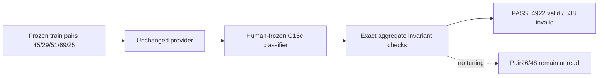

# R2 Development Semantic Equivalence

## Verdict

`DEVELOPMENT_SEMANTIC_EQUIVALENCE_ESTABLISHED`

All predeclared aggregate invariants match exactly. No threshold, pair,
direction, preprocessing operation, estimator setting, or validity rule was
selected or changed from the observed reconstruction result.

## Scope and provenance

- Provenance epoch: `FORMAL_PROVENANCE_RECOVERY_EPOCH_001`
- Scientific source commit: `434152ce78d66eaa00a717db7c031e7c144e1f9b`
- Artifact root:
  `/mnt/data/yzm/recovery_artifacts/route_a_geometry_epoch_001/development`
- Raw ledger: 5460 rows, 15 MB, retained outside Git.
- Pair26/48 read count: 0.
- GT/XML/val/tracker read count: 0.
- Determinism repeat: 20 rows, 0 mismatches, PASS.

## Exact historical aggregate match

| Scope | Valid | Denominator | Match |
| --- | ---: | ---: | --- |
| Overall | 4922 | 5460 | PASS |
| Pair45 | 800 | 800 | PASS |
| Pair29 | 1241 | 1400 | PASS |
| Pair51 | 844 | 860 | PASS |
| Pair69 | 1274 | 1400 | PASS |
| Pair25 | 763 | 1000 | PASS |
| 1_to_2 | 2508 | 2730 | PASS |
| 2_to_1 | 2414 | 2730 | PASS |

Overall invalid count: `538`. Geometry unavailable count: `0`.

## Failure-count structure

| Frozen failure | Count | Match |
| --- | ---: | --- |
| Structural rank | 0 | PASS |
| Inlier count | 3 | PASS |
| Inlier ratio | 289 | PASS |
| Condition number | 294 | PASS |
| Rows with multiple failures | 48 | PASS |

## Artifact identities

- Manifest:
  `f7a879930c46587d3a01c3f1179dd4ee24fc96f2825989803db6e0d509cab58f`
- Raw ledger:
  `21e7e838d30a339c6f445aeb73b9c49404df80bd0d27d861c5b11799f47044b9`
- Access audit:
  `a6cc586d5109c620e4ba4892b6913253f9e3c9b397fb105767e16e7631d2f193`
- Determinism check:
  `0561127a51e914252fd07db0f7ec09e122f0fe39d062401012c1af3de46e0e80`
- Semantic-equivalence report:
  `8d3e7cd9e6187229f7bb8c5816be36d8b2a3102e9e51357209249817c782d7e3`

## Interpretation boundary

Established:

`SCIENTIFIC_SEMANTIC_EQUIVALENCE`

Not established:

`BYTE_IDENTICAL_HISTORICAL_ARTIFACT_RECOVERY`

The historical row digest is not claimed or recreated. The exact aggregate
match is used only to validate reconstruction semantics, not to calibrate them.

## Scientific audit

No P0/P1 leakage or contract-drift finding. The `experiment-auditor` verdict
for proceeding to formal-contract infrastructure reconstruction is:

`SAFE_TO_RUN`

This does not authorize held-out execution.
