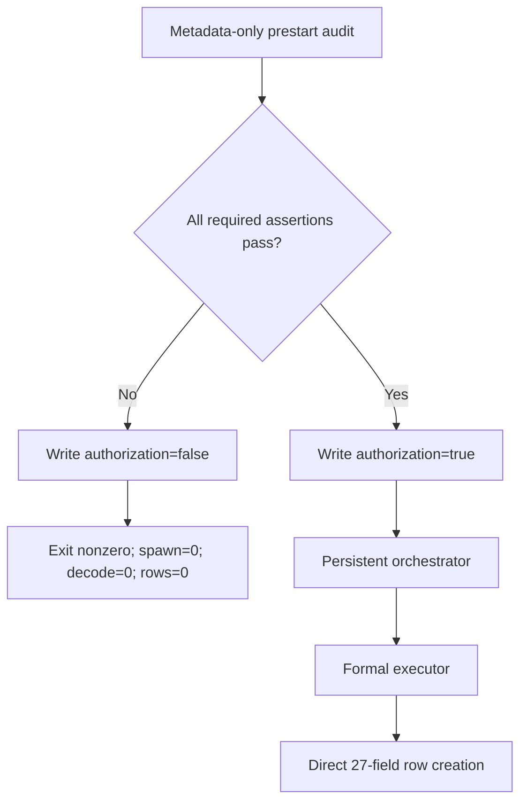

# R3 Formal Contract Reconstruction Audit

## Scope and verdict

This audit covers only reconstructed formal infrastructure under
`FORMAL_PROVENANCE_RECOVERY_EPOCH_001`. It does not inspect or execute Pair 26
or Pair 48 image content.

Verdict: `SAFE_TO_LOCK`.

Formal scientific execution remains `NOT_STARTED` and is not authorized until
the separate R4 pre-execution lock is committed and the runtime prestart guard
passes from a clean locked worktree.

## Scientific-validity audit

| Leakage / validity risk | Finding | Status |
| --- | --- | --- |
| Future leakage | Executor uses exactly one synchronized frame in one direction; no temporal state exists | PASS |
| Split leakage | Development results are not inputs to formal rows; G15c constants are fixed literals | PASS |
| Label leakage | No GT, XML, detector label, tracker row, or identity input is imported or accepted | PASS |
| Held-out result leakage | Attempt003 content remains uninspected and results reused is false | PASS |
| Baseline unfairness | Not applicable: this stage neither compares methods nor produces a scientific result | PASS |
| Threshold drift | N=5, R=0.08955223880597014, kappa=202958294.27180856 | PASS |
| Denominator drift | 2000 rows; 93/125 per unit; all four pair-direction units required | PASS |
| Provenance mutation | Provenance fields exist before serialization and before record digest | PASS |

No pair selection, threshold calibration, protocol optimization, or result-based
selection occurred in R3.

## Exact row contract

The schema contains exactly 27 ordered fields and no additions:

```text
formal_attempt_id, pair_id, frame_name, direction, H_available, H_valid,
validity_status, failure_reasons, matrix_rank, num_tentative_matches,
num_unique_matches, num_ransac_inliers, inlier_ratio, condition_number,
frozen_N_min, frozen_R_min, frozen_kappa_max, c_min_numerator,
c_min_denominator, provider_digest, estimator_config_digest,
G15c_gate_digest, input_contract_digest, execution_spec_digest,
repaired_formal_source_commit, preexecution_lock_record_commit, record_digest
```

The shared builder inserts `input_contract_digest`, `93`, and `125` before the
shared serializer computes/validates `record_digest`. Post-hoc ledger patching
is not part of the implementation.

Schema definition digest:
`071d16c3810cc8bd5a10cff136ff7b6b7438f674dc2351343339564cda82c6d8`.

Schema artifact SHA-256:
`c7176d4039ee8845760de6b8838ad5e717d498d22fc6f43ba8209b249a7c58d8`.

## Formal input contract

The recovery-epoch contract binds metadata only:

- dataset root: `/mnt/data/yzm/datasets/Multi-Drone-Multi-Object-Detection-and-Tracking`
- Pair 26: `test/1/26-1` and `test/2/26-2`, 300 equal lexical JPEG names
- Pair 48: `test/1/48-1` and `test/2/48-2`, 700 equal lexical JPEG names
- two independent directions and 2000 expected rows
- prestart access: `METADATA_ONLY_NO_IMAGE_DECODE`

Recovery-epoch canonical input-contract digest:
`c0fd435477f1286176b71a21cd949879b312c2504a5995257b81ad0cb41ec4ec`.

Artifact SHA-256:
`030eca320b370c34640d07d4625b31832fd4614ea8ca6d31c2bec32dafb7fff3`.

The historical digest
`288aec272dbddd9d73175a66add0f6d2d28cdd309e75402a80e86da8a6c99cf7`
is context only. Byte identity with the lost artifact is not claimed.

## Launch order and fail-closed boundary



The guard module does not import OpenCV or the provider. `cv2.imread` occurs
only in the formal executor, which is downstream of authorization and child
spawn. Duplicate authorization/state paths are created exclusively.

## Synthetic and process tests

Final synthetic report: `22 / 22 PASS`.

- Shared builder + serializer + validator round trip: PASS
- Exact 27 fields, zero missing fields, valid record digest: PASS
- Missing `input_contract_digest` rejected: PASS
- Intentional failed prestart: authorization false, nonzero exit, spawn 0,
  image decode 0, rows 0, never RUNNING: PASS
- Positive non-scientific dummy authorization: PASS
- 31-second persistent dummy: terminal polled, stdout/stderr/exit captured: PASS
- No orphan: PASS
- Duplicate-run guard: PASS

Persistent selftest artifact SHA-256:
`24a385a694019002f3c209635fd34426a6863efbdc314f2a40e4cb4098d01433`.

## Reconstructed infrastructure digests

| Artifact | SHA-256 |
| --- | --- |
| Formal row contract | `404b1db4a8701a9bbad95a8afa4b633d7674b33108717df91c7b5b8af85cb75c` |
| Formal executor | `aa3038bd44b38c38f7e3d5f8b660f16202adca6a285c467f7ea7a9f6f44f2418` |
| Fail-closed guard | `62affad18a8094c2b9d4d68698440ce59d1671bc32b5354f20c7fd52d9f4c28a` |
| Persistent orchestrator | `c43ce52a76e65648f5bd86f2419d489651e52241faa03ab431229bf2f03e1967` |
| Synthetic selftest source | `3723f762e7e1d46693d2ca38ef33f94c5a2c654bf9b60d8e701b43023fab2ffe` |
| Execution spec artifact | `f3798c9725abf5a988339effbf9744599a7b99cd118fa7451a7743c7aa46368c` |

Execution-spec canonical digest:
`dd968a6e4966e70b7abce7e62bb3e70ae3f0e490cc02ac7b60b889a13af3ca3b`.

## Formal-state firewall

- Attempt003 machine execution completed: YES
- Attempt003 scientific content inspected: NO
- Attempt003 result reused: NO
- Attempt004 start rows: 0
- Attempt004 expected rows: 2000
- Attempt004 status: NOT_STARTED
- Pair 26/48 scientific image execution in R3: NO
- Formal output root after tests: ABSENT
- Formal orchestration-state root after tests: ABSENT

## R3 decision

`FORMAL_CONTRACT_RECONSTRUCTION_COMPLETE`

`SAFE_TO_CREATE_SEPARATE_R4_PREEXECUTION_LOCK`

`NO_ATTEMPT004_EXECUTION_IN_R3`
