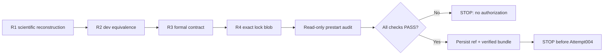

# R4 Recovery-Epoch Pre-Execution Lock Audit

## Verdict

`READY_FOR_POSTCOMMIT_MECHANICAL_PRESTART_AUDIT`

This R4 change contains only the canonical lock and this audit. It does not
modify scientific implementation, thresholds, formal schema, launch guard, or
orchestrator.

## Provenance chain

| Role | Commit |
| --- | --- |
| Last durable remote baseline | `b2c3528682ba94fd7c3cfd99873db2e14954a86f` |
| R1 reconstructed scientific source | `434152ce78d66eaa00a717db7c031e7c144e1f9b` |
| R2 development semantic equivalence | `dd573bc99a6cd171f45e0e953dee0253706f5b68` |
| R3 formal contract base | `493eddb6f96a060b6666af03e37bbdca42b2e640` |
| R3 final lock-binding infrastructure | `1fff62d0b0831bd4a079f379a5a1a1a7122974b6` |

The original Attempt003/004 commits were not recovered, recreated, or
impersonated. The original ancestry status remains
`LOST_AFTER_EPHEMERAL_WORKTREE_FAILURE`.

## Lock-binding rule

A commit cannot contain its own SHA without changing that SHA. The lock
therefore uses a non-self-referential, mechanically checkable rule:

1. the lock binds final R3 as `formal_contract_implementation_commit`;
2. the containing HEAD must have that exact R3 commit as its parent;
3. the lock file hash-object must equal the lock blob stored at the frozen path
   in the containing HEAD tree;
4. the containing HEAD becomes `preexecution_lock_record_commit` in every
   formal row.

The fail-closed guard implements all four checks before child spawn.

## Frozen formal protocol

- Attempt: `FORMAL_GEOMETRY_HELDOUT_ATTEMPT_004`
- Epoch: `FORMAL_PROVENANCE_RECOVERY_EPOCH_001`
- Status: `NOT_STARTED`
- Start / expected rows: `0 / 2000`
- Pair 26 and Pair 48; independent `1_to_2` and `2_to_1`
- Cmin: `93 / 125`, full denominator, all four units must pass
- Formal row fields: exactly 27
- Attempt003 machine execution: completed
- Attempt003 scientific inspection: no
- Attempt003 result reuse: no

## Prelock evidence

- Development semantic equivalence: exact aggregate invariants, PASS
- Development denominator: 5460
- Development valid / invalid: 4922 / 538
- Synthetic shared builder/serializer/validator: PASS
- Synthetic checks: 22 / 22 PASS
- Negative fail-closed: spawn 0, decode 0, rows 0, never RUNNING, PASS
- Positive dummy authorization: PASS
- Persistent orchestration: 31 seconds, terminal/polls/logs/no orphan, PASS
- Duplicate guard: PASS
- Formal output root before lock: ABSENT
- Formal state root before lock: ABSENT

## Scientific firewall

The reconstruction and lock stages did not inspect or reuse Attempt003 results.
Pair 26/48 image files were not decoded by the scientific provider or formal
executor. Only lexical JPEG filename metadata was enumerated to establish the
Human-frozen input contract. No GT, XML, tracker state, Route-A association, or
identity data was accessed.

## Assertions before commit

REC-EPOCH-1 through REC-EPOCH-28: `PASS`.

REC-EPOCH-32 (no held-out scientific execution this turn): `PASS`.

The following are deliberately postcommit checks and are not preclaimed:

- REC-EPOCH-29: R4 lock commit exists
- REC-EPOCH-30: final recovery bundle exists and verifies
- REC-EPOCH-31: final worktree is clean

## Postcommit audit procedure

From a clean worktree at the R4 lock commit:

1. load and canonical-digest-validate the lock;
2. invoke `audit_prestart()` only (do not invoke `launch_if_authorized()`);
3. require every prestart check to be true;
4. confirm formal output, state, and authorization paths remain absent;
5. create a persistent R4 ref and verified complete Git bundle;
6. stop before Attempt004 execution.

## Interpretation boundary

This lock establishes reconstructed source provenance and pre-execution
governance. It does not establish Pair 26/48 results, formal geometry
readiness, Route-A validity, or tracking gain.
