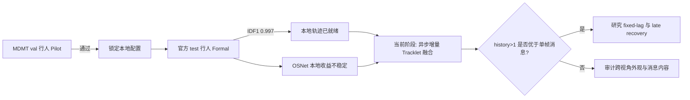

# exp_20260803_001 Analysis Report

## 总体结论

本轮正式结论为 `person_local_tracklet_ready`。在 MDMT official test 的行人
GT bbox、连续活跃可见段上，所有七条管线均通过预设就绪门；最简单的
`bbox_sort` 以 IDF1 `0.997229`、purity `0.997500`、IDSW `22` 和 fragmentation
`20` 成为最强基线。局部轨迹基础设施不再阻塞异步 global tracklet fusion。

这不是跨视角融合结果，也不是 detector-to-tracker 端到端结果。正式评价使用
`124824` 个可见行人框和 `912` 个 active runs；14 个官方序列对中有 12 个包含
有效行人评价行，序列 `56/57` 不贡献 person local metrics。

## 1. 假设对照

- **原假设**：MDMT 上的移动相机补偿和成熟生命周期能够在连续活跃可见段中
  同时控制身份合并与碎片化，OSNet 是否必要由数据决定。
- **就绪假设：强支持。** 所有管线的 macro active-run IDF1 均超过 `0.80`，
  purity 均超过 `0.95`，minimum-view IDF1 均超过 `0.70`。
- **成熟 tracker 优于简单基线：拒绝。** `bbox_sort` 比第二名
  `deepocsort_gmc_noapp` 高 `0.021326` IDF1，同时 IDSW 从 `284` 降至 `22`。
- **OSNet 对本地连续关联必需：不支持。** 最强方法不使用外观；OSNet 的作用
  随 tracker 改变，不能视为稳定本地增益。
- **置信度：高。** 配置只在 val 上选择，test 未重新调参；测量门全部通过。

## 2. 基线比较

| Pipeline | IDF1 | Purity | IDSW | Fragmentation | Packet coverage |
| --- | ---: | ---: | ---: | ---: | ---: |
| `bbox_sort` | **0.997229** | 0.997500 | **22** | **20** | **1.000000** |
| `deepocsort_gmc_noapp` | 0.975903 | **0.998069** | 284 | 268 | 0.993559 |
| `botsort_gmc_osnet_soft` | 0.972034 | 0.994608 | 315 | 230 | 0.992574 |
| `botsort_no_gmc_noapp` | 0.961360 | 0.996603 | 2911 | 2911 | 0.972658 |
| `botsort_gmc_noapp` | 0.959533 | 0.996315 | 370 | 349 | 0.992798 |
| `deepocsort_gmc_osnet_soft` | 0.957718 | 0.963164 | 537 | 288 | 0.995065 |
| `botsort_gmc_osnet_hard` | 0.910840 | 0.989121 | 4124 | 2792 | 0.971143 |

关键比较：

- BoT-SORT 加 GMC 后 IDF1 与 no-GMC 接近，但 IDSW 从 `2911` 降到 `370`，
  fragmentation 从 `2911` 降到 `349`。GMC 的主要价值是连续性，而不是总体
  IDF1 增量。
- BoT-SORT soft OSNet 相对其 no-app 版本增加 `0.012501` IDF1，并减少 `55`
  次 IDSW；但 Deep OC-SORT 加 OSNet 反而下降 `0.018185` IDF1。外观收益具有
  tracker 依赖性。
- hard veto 延续过度拒绝模式，产生 `4124` IDSW 和 `2792` fragments。

## 3. 失败模式

- 成熟 tracker 的主要困难集中在少数序列，尤其是 test `68`：
  `botsort_gmc_noapp` IDF1 `0.713855`，`deepocsort_gmc_noapp` `0.830645`，
  `botsort_gmc_osnet_soft` `0.837025`。
- 同一序列上 `bbox_sort` IDF1 约 `0.999`。因此失败不能归因于行人运动不可追踪，
  更可能来自成熟 tracker 的确认、丢失、重激活或匹配阶段相互作用。
- hard identity gate 是渐进累积的过度拒绝：912 个 active runs 中 `491` 个发生
  fragmentation，`124` 个 run 的 segment IDF1 低于 `0.8`。
- `bbox_sort` 没有低于 `0.8` 的 active run，仅 4 个 run 发生碎片。

## 4. 上限分析

本实验没有额外 sync oracle；在 GT bbox、排除 occluded 标注、按长 gap 切分
active run 的条件下，`1.0` 可视为经验上限。`bbox_sort` 距该上限仅 `0.002771`。

因此继续优化 local tracker 的可用性能空间很小。真正未解决的空间位于：

- 跨视角 local tracklet 到 global identity 的关联；
- 异步消息在 arrival time、capture time 和 fixed lag 下的处理；
- 长 gap 后的 recovery/stitching；
- 后续引入 detector error 后的鲁棒性。

## 5. 泛化信号

1. 在 GT bbox 的短时可见段内，简单运动关联已经足够；外观信息应优先服务于
   **跨视角关联和长时恢复**，而不是强制干预每一帧本地匹配。
2. GMC 可能主要降低 identity switch 和 fragmentation，单看 IDF1 会低估它的
   价值。
3. 严格外观门容易把 identity precision 转化为严重 fragmentation；跨视角融合
   应采用可校准权重或候选打分，不应直接复用 hard veto。

## 6. 与历史对照

- MATRIX 上 image-plane tracker 在修正后的 active-run gate 仍只有约 `0.373`
  IDF1；MDMT test 上 `bbox_sort` 达到 `0.997`。数据集迁移确实移除了此前的
  local-tracklet 基础设施阻塞。
- Pilot 到 Formal 的 `bbox_sort` IDF1 从 `0.988767` 升至 `0.997229`，说明简单
  基线泛化稳定。成熟方法则有不同程度下降，尤其 `botsort_gmc_noapp` 从
  `0.988285` 降至 `0.959533`。
- Pilot 中 OSNet soft 低于 BoT-SORT no-app；Formal 中它略高。该矛盾说明本地
  外观增益不稳定，不能把 OSNet 固定为 local association 的必要组件。
- 本轮只验证 per-view local identity。官方 28 个 GT 文件共 `600923` 行全部回连，
  unmatched 和 mapping conflict 均为 `0`；但 person-only global evaluation 仍需
  排除或单列跨视角类别不一致的 ID/frame 行。

## 7. 下一步建议

### P0：最小异步增量 Tracklet 融合

- 固定 `bbox_sort` 为主要 local baseline，同时保留
  `deepocsort_gmc_noapp` 作为成熟 tracker 对照。
- 比较 `primary_only`、`drop_delayed`、`arrival_time_fusion`、
  `history1_timestamped`、`incremental_tracklet_timestamped`、fixed-lag 和
  recovery-only。
- 主要检验 history>1 的 tracklet 摘要是否比 history=1 单帧消息更抗异步延迟。
- MDMT 缺少可靠 FPS 元数据，先报告 delay frames，不宣称绝对毫秒边界。

### P0：person-only 官方评价协议锁

- 构造两视角都标注为 person 的类别一致 global GT 子集。
- 单列类别冲突行的 include/exclude 敏感性，防止官方同号 ID 的类别噪声污染
  person-only global association。

### P1：外观权限消融

- local association 主条件不用 OSNet；global tracklet matching 比较 latest、
  pooled 和 gallery appearance。
- 避免 hard veto，使用 similarity score 与 tracklet history/时间重叠联合打分。

### P2：Detector robustness

- global tracklet fusion 机制通过后，再用真实 detector 替换 GT bbox。
- 若 GT bbox 条件下都无法获得异步 tracklet 增益，不应提前引入 detector error。

## 流程图

外部流程图：
`mermaid/exp_20260803_001_mdmt_local_tracklet_readiness/readiness_flow.mmd`。

## 补充说明

本轮成功标准只适用于“行人 GT bbox 连续活跃可见段”。它不证明跨视角 global
tracking 已经通过，也不证明真实 detector 条件下具有相同性能。
