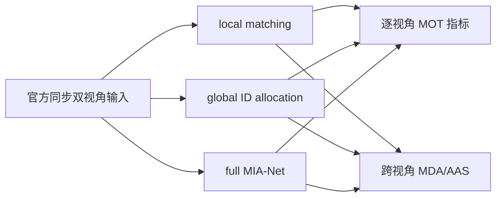

# exp_20260804_002 作者 MIA-Net 同步复现分析

## 一、问题与实验对象

本轮只验证作者同步流程在 test pair-26 上是否能运行并产生可评价结果。比较：



不包含延迟、乱序、丢包或新的 ReID 模型。

## 二、七维分析

### 1. 研究问题与假设

作者的完整 MIA-Net 是否能在同步条件下提高跨视角关联。pair-26 上，答案对
MDA/AAS 是“有局部支持”，但尚不能推广为全测试集结论。

### 2. 测量有效性

- 三条管线均生成 view-1/view-2 两个 JSON。
- 每个 JSON 均包含完整 300 帧。
- 本评估器复现官方 `mango_eval.py` 的 AAS：local/global 为
  `0.2266737855`，MIA 为 `0.2660676465`。
- 评估器使用官方 MDA GT，先在每个视角内按 `IoU>=0.5` 对齐框，再计算身份与跨视角指标。

### 3. 主要结果

| Pipeline | AAS/MDA | V1 IDF1 | V2 IDF1 | V1 IDSW | V2 IDSW | V1 MOTA | V2 MOTA |
| --- | ---: | ---: | ---: | ---: | ---: | ---: | ---: |
| local | 0.226674 | 0.460325 | 0.848359 | 174 | 211 | 0.301338 | 0.760381 |
| global | 0.226674 | 0.460325 | 0.848359 | 174 | 211 | 0.301338 | 0.760381 |
| mia | 0.266068 | 0.460586 | 0.824168 | 166 | 261 | 0.301629 | 0.758607 |

### 4. 效应解释

MIA 相对 local/global 的 AAS 提升为 `+0.039394`。但其 view-2 IDF1 下降
`0.024191`，IDSW 增加 `50`。因此 supplementation 的收益主要体现在跨视角
公共 ID 关联，而不是稳定改善每个视角的单机轨迹。

global 与 local 在本 pair 上结果完全一致，说明本例中仅做 global ID allocation
没有改变最终框轨迹或跨视角 ID 的有效结果。

### 5. 与预设门槛的关系

本轮尚未满足“同步复现通过”的全数据门槛，因为当前只有 pair-26。不能用单个
pair 的 AAS 提升替代全部 test pairs 的平均结果，也不能据此进入异步延迟实验。

### 6. 风险与替代解释

- MIA 的 AAS 提升可能来自 supplementation 的跨视角匹配，而不是局部轨迹质量提升。
- view-2 IDF1/IDSW 变差，说明补全或 ID 写回可能改变了单视角输出，需要在全测试集和逐帧结果中确认。
- 当前作者 JSON 没有置信度字段，MOT 指标使用固定 IoU 匹配阈值 `0.5`；这与作者 AAS 的框匹配协议分开报告。

### 7. 下一步行动

P0：批量评估全部 14 个官方 test pairs，生成 pipeline × pair 的 MDA/AAS、IDF1、IDSW、MOTA，并重复评估验证确定性。

P1：定位 MIA 在 view-2 上 IDSW 增加的帧和目标，区分 ID allocation 与 supplementation 的影响。

P1：加入作者 local/global/full 三条管线的官方平均结果后，才决定是否接受同步基线。

P2：同步基线通过后，再拆分 `H`、`ID state`、`supplementation` 消息并注入 delay；不得直接把 pair-26 的 AAS 增益解释为异步收益。

## 输出

```text
outputs/20260804_mdmt_author_mia_sync_reproduction_pair26/
```

- `sync_pipeline_metrics.csv`
- `sync_cross_view_metrics.csv`
- `sync_frame_mda.csv`
- `sync_measurement_gate.csv`
- `sync_evaluation_decision.md`
