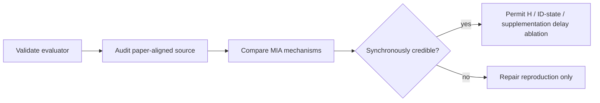

# exp_20260804_003 Analysis Report

## 1. Measurement Validity

Pilot 共评估 6 个 condition、1 个 pair、2 个视角。六个 condition 的 JSON 均完整，帧
索引、有限坐标和 MDA 输入检查均通过。released MIA 的 AAS 为 `0.2660676465`，相对
目标 `0.266068` 的误差为 `3.53e-7`，满足 `1e-6` 门槛。

本轮 `determinism_audit.csv` 仍为 `not_run`，因此只能判定测量链有效，不能宣称完整
确定性门通过。

## 2. Paper-Setting Audit

| Variant | Global `>=10` | New/old distance | Low-score supplement | Result |
| --- | --- | --- | --- | --- |
| released_mia | no | released defaults | no | baseline |
| paper_thresholds_only | yes | paper values | no | MDA rises, MOT becomes worse |
| paper_low_score_only | no | released defaults | yes | nearly no change |
| paper_aligned_mia | yes | paper values | yes | same main effect as thresholds |

机制计数验证了补丁确实进入运行：`paper_thresholds_only` 的 merge count 为 45、
`paper_aligned_mia` 为 46，而 released 为 35；低分补全在 low-score-only 和 aligned
条件中各出现 1 次。低分补全本身不是本 pair 的主要性能来源。

## 3. Pair-26 Mechanism Effects

Pair-26 aggregate：

| Pipeline | Overall MOTA | Overall IDF1 | IDSW | MDA/AAS |
| --- | ---: | ---: | ---: | ---: |
| released_mia | 0.5301 | 0.6436 | 213.5 | 0.2661 |
| paper_thresholds_only | 0.5266 | 0.6382 | 253.5 | 0.2822 |
| paper_low_score_only | 0.5302 | 0.6436 | 213.5 | 0.2663 |
| paper_aligned_mia | 0.5267 | 0.6383 | 254.5 | 0.2825 |
| local_matching | 0.5309 | 0.6556 | 192.5 | 0.2267 |
| id_allocation_no_supplement | 0.5309 | 0.6556 | 192.5 | 0.2267 |

结论不是“补丁让跟踪整体变好”。论文阈值提高了跨视角 MDA 约 `0.0164`，但同时
IDSW 增加约 `41`，IDF1 下降约 `0.0053`。这说明跨视角公共 ID 对齐与单视角轨迹
稳定性存在冲突。`local_matching` 与 `id_allocation_no_supplement` 在本 pair 完全
一致，说明本 pair 上 supplementation 没有改善 MOT，主要收益只体现在跨视角 MDA。

## 4. Full-Test Protocol

本 Pilot 只有 pair-26，尚未产生 14-pair / 28-view 宏平均，因此不能作为论文表格的
复现结论。正式评价必须使用 14 个 test pair 的 pair 宏平均和 28 个视角的 view 宏平均。

## 5. Table-III Comparison

| Scope | Paper MOTA/IDF1/MDA | Pair-26 aligned MIA | Absolute difference | Pass |
| --- | --- | --- | --- | --- |
| Overall | 51.58 / 66.97 / 0.3847 | 52.67 / 63.83 / 0.2825 | +1.09 / -3.14 pp / -0.1022 | 不判定 |

其中 pair-26 的 MOTA 接近论文值不能说明复现成功；IDF1 和 MDA 仍有明显差距，且
样本范围只有一个 pair。

## 6. Interpretation

- 当前差异首先可能来自 pair coverage，不能在单 pair 上区分论文/代码漂移与数据分布
  差异。MDA 评价链和 released 回归检查已经通过，协议错误的可能性降低，但完整宏平均
  尚未验证。
- 在 pair-26 上，paper-aligned MIA 的 MDA 高于 local/no-supplementation，但 MOT IDF1
  更低、IDSW 更高。因此 MIA 的收益是跨视角关联指标收益，不是单视角持续跟踪收益。
- 只有完成全测试集同步基线后，才能判断是否进入 `H / ID state / supplementation`
  的异步消融。

## 7. Decision And Next Action

本轮 Pilot 决策：`functional_reproduction_pending_full_test`。它不是最终五选一决策，
因为完整测试集和 determinism audit 尚未完成。

下一步优先级：

1. P0：运行 14-pair Formal，仅比较 `paper_aligned_local`、
   `paper_aligned_id_allocation` 和 `paper_aligned_mia`。
2. P0：Formal 后检查 MIA 是否在 MDA 上稳定优于两个消融，同时报告 MOT 的 IDF1、
   IDSW 是否恶化。
3. P1：若 paper-aligned 与 released 的全测试结果差异明显，再补跑 released 全测试
   集，区分代码漂移和协议/数据差异。
4. P1：在进入异步实验前，完成 pair-26 重复运行的 JSON 确定性审计。

## Formal Run Addendum

### 1. Measurement Validity

The isolated rerun completed all `3 x 14 = 42` author conditions and produced
complete JSON/TXT outputs. `json_complete`, finite coordinates and MDA
availability pass for every condition. One protocol check fails consistently
for pair `55`, view 1: the author output contains frames `0..150`, while the
official MDA ground truth covers `0..149`. The source sequence has 151 images,
so this is an evaluation-range mismatch rather than a missing prediction. It
must be explicitly handled in the evaluator before declaring every measurement
gate passed.

The determinism audit remains `not_run`.

### 2. Table-III Reproduction

| Pipeline | Overall MOTA | Overall IDF1 | Overall MDA | Paper difference |
| --- | ---: | ---: | ---: | --- |
| paper-aligned local | 0.515455 | 0.669632 | 0.367341 | MOTA -0.034 pp, IDF1 -0.007 pp, MDA -0.01736 |
| paper-aligned ID allocation | 0.515733 | 0.670738 | 0.369219 | MOTA -0.007 pp, IDF1 +0.104 pp, MDA -0.01548 |
| paper-aligned MIA | 0.513848 | 0.666922 | 0.383154 | MOTA -0.195 pp, IDF1 -0.278 pp, MDA -0.00155 |

The full MIA result satisfies the predefined paper tolerance: overall MOTA and
IDF1 differ by less than 2 percentage points, MDA differs by less than 0.02,
and both drone-specific MOTA/IDF1 differences are below 3 points. Numerically,
this is `paper_sync_reproduced`, pending the frame-range and determinism gates.

### 3. Mechanism Interpretation

Compared with `paper_aligned_id_allocation`, full MIA increases MDA from
`0.369219` to `0.383154`, but lowers IDF1 from `0.670738` to `0.666922` and
raises IDSW from `158.68` to `178.04`. Target supplementation therefore gives a
real cross-view association gain, while adding instability to view-level MOT.
The result does not support claiming that supplementation improves all tracking
metrics simultaneously.

### 4. Dataset And Protocol Risk

The pair-55 extra prediction frame is the only failed alignment row. The
metrics currently ignore that frame because no corresponding official GT row
exists. The evaluator should report `gt_frame_coverage=1` and
`extra_prediction_frames=1` separately, rather than silently treating this as
an exact alignment pass.

### 5. Research Interpretation

The synchronous author method is now a credible baseline for later delay
experiments. Its strongest reproducible effect is cross-view ID association
(MDA), not an improvement in per-view temporal identity stability. This directly
matters for asynchronous ablations: delay should be injected separately into
homography state, ID allocation state and supplementation, because they do not
have the same output effect.

### 6. Decision

Provisional decision: `paper_sync_reproduced_pending_measurement_gate`.

It becomes `paper_sync_reproduced` after:

- pair-55 extra-frame handling is made explicit and accepted in the evaluator;
- pair-26 or a representative pair is rerun twice and JSON equality is checked;
- the final decision file records the distinction between numerical tolerance
  and measurement-gate validity.

### 7. Next Actions

1. P0: fix the evaluator's frame-range report for annotation-truncated pair-55,
   without changing metric rows.
2. P0: run the determinism audit on a representative completed pair.
3. P1: freeze the paper-aligned MIA synchronous baseline and only then begin
   `H-only`, `ID-state-only` and supplementation delay ablations.
4. P1: retain local and ID-allocation pipelines as synchronous controls; do not
   use full MIA MDA improvement as evidence that view-level IDF1 improves.
