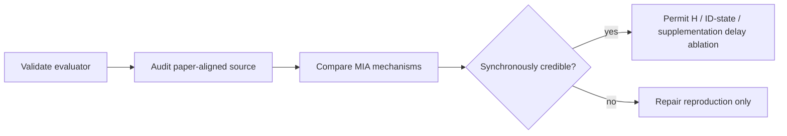

# exp_20260804_003 Analysis Template

## 1. Measurement Validity

- JSON/TXT completeness and frame indexing:
- MDA/AAS agreement with author evaluator:
- Pair-26 released AAS regression check:
- Determinism:

## 2. Paper-Setting Audit

| Variant | Global `>=10` | New/old distance | Low-score supplement | Result |
| --- | --- | --- | --- | --- |

## 3. Pair-26 Mechanism Effects

Compare released, threshold-only, low-score-only and aligned MIA. Explain each
change through match, repair, supplement and NMS counters; unavailable counters
must remain labelled unavailable.

## 4. Full-Test Protocol

Report 14-pair MDA/AAS macro average and 28-view MOT metrics macro average.
Do not compare pair-weighted or box-weighted means to Table III.

## 5. Table-III Comparison

| Scope | Paper MOTA/IDF1/MDA | Reproduced | Absolute difference | Pass |
| --- | --- | --- | --- | --- |

## 6. Interpretation

- Is the deviation explained by pair coverage, paper/code drift, or evaluator protocol?
- Does full MIA improve over local and no-supplementation under the same source?
- Which conclusions remain unavailable before a synchronous baseline passes?

## 7. Decision And Next Action

Select exactly one: `paper_sync_reproduced`, `functional_reproduction_only`,
`paper_code_divergence`, `evaluation_protocol_mismatch`, or
`sync_reproduction_failed`.

