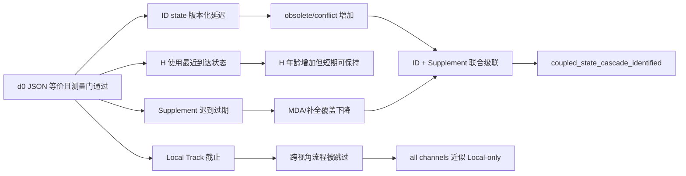

# exp_20260805_003 Formal 分析：MDMT MIA 异步状态通道审计

## 1. 结论先行

正式决策为 `coupled_state_cascade_identified`。测量门全部通过，14 个官方 test pair 的结果可用于研究判断。

但该结论需要分成三层理解：

1. `Local Track` 是最强的上游截止瓶颈：一旦远端当帧轨迹未按时到达，跨视角流程直接跳过。
2. `ID state` 是身份指标最敏感的状态通道：延迟主要表现为 IDSW 增加和 IDF1 下降。
3. 真正有统计支持的组合级级联主要是 `ID state + Supplement`，以及 5 帧延迟下的 `H + ID state + Supplement`。

`all_channels` 与 `local_only` 完全相同，因此不能解释为“四个通道损失相加”；它表示 Local Track 在当前截止语义下已经阻断了下游通道。

## 2. 测量可信度

`async_measurement_gate.csv` 中全部门通过：

| 检查 | 结果 |
| --- | ---: |
| future read | 0 |
| GT identity / 标签运行时读取 | 0 |
| source bypass | 0 |
| NumPy alias | 0 |
| feedback mismatch | 0 |
| published history rewrite | 0 |
| GT frame coverage | 0 |
| d0 cache 与 reference JSON 不一致 | 0 |

因此本轮不是接口重构、未来信息读取、引用污染或已发布结果回写造成的假信号。

`sync_active_d0` 也逐 JSON 复现同步 reference。需要注意：这只是测量有效性，不代表 d0 本身是新的研究结果。

## 3. 基线与整体退化

同步 reference：MDA `0.383154`、MOTA `0.513848`、IDF1 `0.666922`、IDSW `178.04`。

| 条件 | MDA | MOTA | IDF1 | IDSW |
| --- | ---: | ---: | ---: | ---: |
| sync reference | 0.383154 | 0.513848 | 0.666922 | 178.04 |
| local-only / all d1-d10 | 0.181407 | 0.512973 | 0.666448 | 190.71 |
| ID state d1 | 0.369804 | 0.509070 | 0.663629 | 249.43 |
| ID state d10 | 0.357158 | 0.510079 | 0.655540 | 241.46 |
| ID + Supplement d5 | 0.290771 | 0.508006 | 0.657032 | 273.29 |
| H + ID + Supplement d5 | 0.298621 | 0.508823 | 0.658447 | 262.71 |

MDA、IDF1 和 IDSW 反映不同问题：Local 主要损失跨视角关联覆盖，ID state 主要破坏身份一致性，不能用单一指标排序所有通道。

## 4. 单通道影响

以下 loss 均相对同步 reference；正的 MDA/IDF1 表示下降，正的 IDSW 表示增加。区间为 14-pair paired bootstrap 95% CI。

| 通道 | 延迟 | MDA loss | IDF1 loss | IDSW 增加 |
| --- | --- | ---: | ---: | ---: |
| Local | 1/2/5/10 | `0.201747 [0.128381,0.287841]` | `0.000474 [-0.003956,0.005666]` | `+12.68 [-4.22,30.14]` |
| H | 1 | `-0.002195 [-0.005762,0.000715]` | `-0.000124 [-0.000469,0.000221]` | `+3.61 [-0.04,7.46]` |
| H | 2 | `0.000499 [-0.003775,0.004235]` | `-0.000198 [-0.001772,0.000992]` | `+3.11 [-0.11,6.86]` |
| H | 5 | `0.003505 [0.000476,0.007105]` | `-0.000055 [-0.001015,0.000782]` | `+5.18 [0.71,10.36]` |
| H | 10 | `0.014346 [0.002266,0.030021]` | `0.001136 [0.000028,0.002314]` | `+2.89 [-5.00,10.97]` |
| ID state | 1 | `0.013350 [0.003154,0.023453]` | `0.003293 [0.001324,0.005535]` | `+71.39 [45.03,97.07]` |
| ID state | 2 | `0.024951 [0.003480,0.051188]` | `0.007374 [0.003441,0.012127]` | `+103.11 [62.64,148.29]` |
| ID state | 5 | `0.025750 [0.012466,0.039962]` | `0.007954 [0.003997,0.012325]` | `+80.11 [45.85,116.96]` |
| ID state | 10 | `0.025996 [0.013478,0.038975]` | `0.011382 [0.006860,0.015735]` | `+63.43 [37.36,91.54]` |
| Supplement | 1/2/5/10 | `0.016720 [0.004941,0.030759]` | `-0.001313 [-0.004695,0.002050]` | `-5.75 [-14.32,1.89]` |

通道排序应分开报告：

- MDA：`Local Track` 最敏感；其余为 `Supplement`、高延迟 `H`/`ID state`。
- IDF1/IDSW：`ID state` 最敏感；IDSW 在四个延迟上均为 14/14 同方向。
- 流程阻断：`Local Track` 最强，因为它使 `cross_view_skipped_local_deadline=5869`，下游 H、ID、Supplement 没有执行机会。

## 5. 机制证据

- Local d1/d5/d10：每个条件均有 `5869` 次 `skipped_local_deadline`，`all_channels` 因此与 Local-only 相同。
- H d10：`H applied=11458`，`H held=11738`，平均 H 年龄约 `9.89` 帧；但 MDA loss 仅 `0.014346`，说明当前 MIA 对陈旧 H 有一定容忍度。
- ID d5：`id_state applied=1781`、`obsolete=2494`、`conflict=694`；IDSW 增加 `80.11`，支持 ID state 延迟直接破坏身份闭环。
- ID d10：`obsolete=3581`、`conflict=492`，IDF1 loss 增至 `0.011382`。
- Supplement d5：`expired=11598`、`pending_at_end=140`，但 IDF1 没有显著下降，说明补全迟到主要损害跨视角覆盖/MDA，而不是直接破坏既有主轨迹身份。

## 6. 组合与级联

| 组合 | 延迟 | interaction loss | 95% CI | 同方向 pair |
| --- | ---: | ---: | ---: | ---: |
| H + ID | 1 | 0.002056 | `[-0.012427,0.020173]` | 8/14 |
| H + ID | 5 | 0.007305 | `[-0.007005,0.024842]` | 5/14 |
| ID + Supplement | 1 | 0.028319 | `[-0.001552,0.065411]` | 10/14 |
| ID + Supplement | 5 | 0.064116 | `[0.022113,0.120237]` | 12/14 |
| H + ID + Supplement | 1 | 0.017853 | `[-0.007341,0.051038]` | 10/14 |
| H + ID + Supplement | 5 | 0.056203 | `[0.019310,0.105383]` | 11/14 |

因此 Formal 支持 5 帧下的组合级级联：`ID + Supplement` 和 `H + ID + Supplement` 均达到 interaction loss `>=0.01`、CI 下界大于 0、至少 10/14 pair 同方向，并伴随 ID remap conflict/obsolete 与 Supplement expired 同时增加。

但 `H + ID` 没有通过级联判据，1 帧和 5 帧的 CI 都跨 0。不能声称 H 与 ID 单独已经构成稳定二通道级联。

## 7. 重要边界与替代解释

1. `all_channels == local_only` 是上游阻断，不是四通道交互证据。当前 Local 截止语义把后续通道从执行图中移除了。
2. MDA 的下降不等价于 IDF1 下降。Supplement 过期显著降低可用跨视角补全，但可能不改变主视角已有身份。
3. ID state 的损害是最直接的身份风险，但当前结果不能证明“延迟越大越单调越坏”：IDSW 在 d2 达到峰值，d5/d10 仍较高但回落，说明状态事件的时序冲突比单纯年龄更关键。
4. 所有结果基于固定延迟、首帧同步 GT 初始化、无抖动/丢包、论文作者 MIA 实现；不应直接外推到真实网络或 detector error。

## 8. 决策与下一步

正式决策保留为：`coupled_state_cascade_identified`。

下一步优先级：

1. `P0`：保持 Local Track timely，单独研究 `ID state + Supplement` 的联合状态事务，比较独立到达、版本化更新和有限窗口重放；这是当前最可信的身份级级联来源。
2. `P1`：对 ID state 做固定窗口/版本冲突审计，报告“应用、过期、冲突、被覆盖”的事件级原因，而不是继续扫延迟阈值。
3. `P1`：对 Supplement 设计 late-recovery 语义，验证迟到补全只影响未来恢复，不写回历史帧。
4. `P2`：再研究 H 预测和不确定性；本轮证据表明 H hold 在 10 帧内的直接退化弱于 ID state。

只有在上述联合状态机制明确后，才适合加入抖动、丢包或 detector error；当前不应直接把四通道一起做策略学习。

## 9. Mermaid

