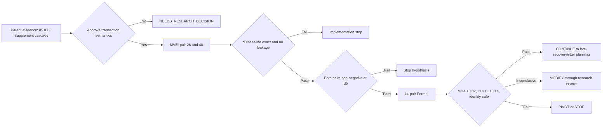

# EXPERIMENT_CONTRACT

## Experiment Metadata

- Experiment ID: `exp_20260808_001_mdmt_mia_id_supplement_joint_transaction`
- Short Name: MDMT MIA ID state 与 Supplement 联合状态事务
- Date: 2026-08-08
- Repository root: `/mnt/data/yzm/experiments/matrix_async_pose_comm_tracking`
- Current working directory: repository root
- Git Branch: `exp/20260803-002-mdmt-async-tracklet-fusion`
- Base Commit: `09281aa` (`record recent experiment updates`)
- Git status at contract creation: clean
- Status: `proposed — NEEDS_RESEARCH_DECISION`
- Related Issue: `UNKNOWN`（本地记录未发现本实验 Issue；远端查询受代理限制）
- Related PR: `UNKNOWN`（本地记录未发现本实验 PR；远端查询受代理限制）
- Parent Experiment: `exp_20260805_003_mdmt_mia_async_state_channel_audit`
- Primary evidence:
  - `summary_md/current_experiment_stage.md`
  - `summary_md/current_status.md`
  - `summary_md/experiments/2026-8-5/exp_20260805_003_mdmt_mia_async_state_channel_audit.md`
  - `summary_md/experiments/2026-8-5/exp_20260805_003_mdmt_mia_async_state_channel_audit_analysis.md`
  - `outputs/20260805_mdmt_mia_async_state_channel_audit_formal_v2/async_channel_metrics.csv`
  - `outputs/20260805_mdmt_mia_async_state_channel_audit_formal_v2/async_channel_interaction_effects.csv`
  - `outputs/20260805_mdmt_mia_async_state_channel_audit_formal_v2/async_cascade_mechanisms.csv`

### Repository Identification

| Item | Classification | Finding | Evidence |
| --- | --- | --- | --- |
| Repository metadata | FACT | Git metadata is stored in `.gitstore`; ordinary `.git` discovery is not usable without explicit `--git-dir/--work-tree`. | `.gitstore/config`; Git command used at contract creation |
| Current branch | FACT | Branch is still `exp/20260803-002-mdmt-async-tracklet-fusion`. | `git branch --show-current` using `.gitstore` |
| Branch/research alignment | INFERENCE | The branch name is stale relative to the completed 2026-08-05 experiments and should not determine the current scientific question by itself. | `summary_md/current_experiment_stage.md`; `summary_md/experiments/INDEX.md` |
| Current completed experiment | FACT | The latest completed Formal is `exp_20260805_003`; decision is `coupled_state_cascade_identified`. | Parent experiment card and analysis |
| Current proposed experiment | INFERENCE | The strongest repository-backed next experiment is an ID-state/Supplement joint-state transaction audit with Local Track kept timely. | `summary_md/current_status.md:18`; parent analysis Section 8 |

## Current Experiment Reconstruction

- `CURRENT_RESEARCH_QUESTION` — **INFERENCE**: Can a version-consistent, bounded joint commit of delayed ID-remap and supplementation evidence reduce the measured ID+Supplement cascade without replaying or rewriting published tracking results?
- `CURRENT_EXPERIMENT` — **INFERENCE**: `exp_20260808_001_mdmt_mia_id_supplement_joint_transaction`.
- `PREVIOUS_BASELINE` — **FACT**: Independent asynchronous handling in `exp_20260805_003`: ID remaps are versioned and affect future live tracks; delayed Supplement packets expire.
- `CURRENT_CHANGE` — **ASSUMPTION pending approval**: Replace independent application with one version-consistent ID+Supplement transaction policy while keeping payload, delay, detector, tracker, Local Track, H and evaluation fixed.
- `CURRENT_EVIDENCE` — **FACT**: At delay 5, ID+Supplement interaction loss is `0.064116`, 95% CI `[0.022113, 0.120237]`, with `12/14` pairs in the same direction.
- `CURRENT_UNKNOWN` — **UNKNOWN**: Whether the interaction is caused by non-atomic application, by Supplement's frame-expiry semantics, or by a dataset/evaluator coupling that no online transaction can repair.

# 1. Research Question

With Local Track and Homography delivered on time and published outputs immutable, does a bounded, version-consistent joint transaction for delayed `ID state + Supplement` improve online cross-view association over the current independent late-message semantics?

This is falsifiable: the joint transaction must improve held-out pair-level MDA under the predefined safety constraints. If it does not, the non-atomic-state explanation is rejected.

# 2. Motivation / Trigger

### FACT

- Gate B active packetization reproduced all 28 test-view JSON files exactly, so the message interface itself is not the source of the measured loss. Source: `summary_md/experiments/2026-8-5/exp_20260805_002_mdmt_mia_active_packet_runtime_equivalence_analysis.md`.
- The channel audit passed all measurement gates: future reads, source bypass, NumPy aliasing, feedback mismatch and published-history rewrites were all zero. Source: `outputs/20260805_mdmt_mia_async_state_channel_audit_formal_v2/async_measurement_gate.csv`.
- At delay 5, ID+Supplement has a statistically supported interaction loss of `0.064116`; delay 1 has CI crossing zero. Source: `async_channel_interaction_effects.csv`.
- ID state delay mainly increases IDSW/lowers IDF1, while Supplement expiry mainly lowers MDA. Source: parent analysis Sections 4–6.
- Local Track delay blocks downstream MIA execution and makes all-channel results equal Local-only. Source: `async_cascade_mechanisms.csv`.

### INFERENCE

- A substantial part of the delay-5 interaction may arise because ID remap and Supplement evidence are consumed under incompatible state versions or different validity rules.
- Keeping Local Track timely is necessary to observe downstream mechanism changes without the upstream deadline bottleneck.

### ASSUMPTION

- ID remap and Supplement events can be assigned a common transaction key derived only from runtime fields such as capture frame, source view and source state version.
- A late Supplement can validate or constrain a future-only ID-state commit without inserting its stale bounding box into a past or current frame.

# 3. Hypothesis

## H1: Version-consistent joint commit reduces the state cascade

If the delay-5 cascade is substantially caused by independent state application, then a joint transaction policy should show the following pattern relative to the current independent ID+Supplement policy:

- mean MDA increases by at least `0.02` across 14 official pairs;
- pair-cluster bootstrap 95% CI for MDA improvement has lower bound `> 0`;
- at least `10/14` pairs improve in MDA;
- IDF1 does not decrease by more than `0.005`;
- IDSW does not increase by more than `10%`;
- `id_state_conflict + id_state_obsolete` decreases by at least `10%` or the valid joint-commit rate increases by at least `10%`;
- delay 5 benefits more clearly than delay 1, matching the parent experiment's interaction pattern.

# 4. Alternative Hypotheses

## H_alt1: Supplement expiry, not non-atomic state, is the controlling mechanism

An atomic transaction does not improve MDA unless delayed Supplement is given a new late-recovery meaning. In that case this experiment fails H1 and a separate communication-semantics decision is required.

## H_alt2: The interaction is an evaluation or closed-loop side effect

The interaction is reproducible but cannot be reduced by joint commit; MDA changes while event-level conflict/obsolete counts do not improve consistently.

## H_alt3: Partial late state is safer than waiting for a complete transaction

Buffering or rejecting incomplete transactions loses useful early ID remaps, increasing IDSW or reacquisition delay even when MDA improves.

# 5. Evidence Before Experiment

## Known

| Evidence | Classification | Source |
| --- | --- | --- |
| Synchronous active packet runtime is JSON-equivalent to the frozen author baseline. | FACT | `exp_20260805_002..._analysis.md` |
| Parent Formal uses 14 official test pairs, fixed delays, no jitter/loss/replay and immutable published output. | FACT | Parent experiment card |
| Delay-5 ID+Supplement interaction passes effect, CI and direction gates. | FACT | `async_channel_interaction_effects.csv` |
| Delay-1 ID+Supplement CI crosses zero. | FACT | Same table |
| IDSW response to ID-state delay is not monotonic in delay; d2 is worse than d5/d10. | FACT | `async_channel_metrics.csv` |
| Supplement-only loss is flat for all non-zero fixed delays under frame-expiry semantics. | FACT | `async_channel_metrics.csv` |

## Unknown

- The exact online meaning of a late Supplement inside a joint transaction.
- The correct finite transaction window and fallback action when only one packet arrives.
- Whether official MDMT FPS is reliable enough to convert the window from frames to seconds.
- Whether first-frame GT initialization materially changes the transaction benefit.
- The Issue/PR identifiers and final implementation branch.

## Contradictory or limiting evidence

- The delay-1 interaction is inconclusive, so the mechanism may only exist after substantial state divergence.
- H+ID does not show a stable cascade, so the result does not support a generic “all state must be atomic” claim.
- Absolute IDF1 loss is smaller than MDA loss; a method may recover cross-view association coverage without materially improving local identity continuity.

# 6. Experimental Unit

- Primary statistical unit: one official MDMT paired sequence (`pair_id`).
- Online unit: one capture-frame transaction containing causally available ID-state and Supplement messages.
- Data version: local MDMT dataset at `/mnt/data/yzm/datasets/Multi-Drone-Multi-Object-Detection-and-Tracking` (`UNKNOWN` checksum).
- Split: 14 official test pairs: `26,31,34,48,52,55,56,57,59,61,62,68,71,73`.
- Training/validation: no model training and no test-set threshold tuning.
- MVE pairs: 26 and 48, used only for implementation falsification; they must not select a better window or threshold.
- Seen/unseen: Not applicable to model fitting; all conditions use the same frozen test data and model.
- Runtime seed: `7` where used by the existing launcher.
- Statistical repetitions: paired bootstrap `10000`, seed `7`.
- Determinism repetitions: MVE joint delay-5 condition repeated twice.

# 7. Baselines

| Baseline | Input and parameters | Budget/data/protocol | Fairness role |
| --- | --- | --- | --- |
| `sync_active_d0` | All four packet channels timely; paper-aligned CARAFE+ByteTrack MIA | No training; same pairs/evaluator | Diagnostic upper bound and d0 equivalence gate |
| `independent_id_plus_supplement` | Local/H timely; ID and Supplement delayed independently using the parent semantics | Delays 1 and 5; same payload and compute path | Safety/current-system baseline |
| `id_state_only` | Only ID state delayed | Delays 1 and 5 | Separates identity-state loss |
| `supplement_only` | Only Supplement delayed and expired | Delays 1 and 5 | Separates frame-scoped supplementation loss |
| `joint_transaction` | Same packets and arrival schedule; version-consistent bounded joint commit | Delays 1 and 5 | Proposed policy; only application semantics may differ |

No baseline may receive additional detector candidates, GT IDs, future packets, extra image features or a different CARAFE/ByteTrack checkpoint.

# 8. Independent Variable

Primary independent variable:

```text
ID state + Supplement application policy
  A. independent application (current parent semantics)
  B. bounded version-consistent joint transaction
```

The delay (`1` or `5` frames) is a predefined context/stratum, not a tuned method parameter.

Provisional minimum transaction semantics, requiring research approval before implementation:

1. Pair packets only by runtime `capture_frame`, direction and compatible `source_state_version`; no GT identity is used.
2. Commit only if referenced source/target tracks are still live and the transaction is complete within `W=5` frames.
3. A late Supplement cannot insert a stale bbox into published history. It may only validate/constrain the future ID remap associated with the same transaction.
4. Incomplete, obsolete or conflicting transactions are rejected as a unit; they cannot partially overwrite newer state.
5. Published JSON remains immutable; there is no capture-time replay in this experiment.

`W=5` is an **ASSUMPTION**, selected from the parent experiment's significant delay-5 cascade, not from a new test-set sweep. Any proposal to scan `W` requires a separate validation split and `NEEDS_RESEARCH_DECISION`.

# 9. Controlled Variables

- Dataset and split: MDMT 14 official test pairs.
- Detector: author CARAFE, `epoch_12.pth` (`exact path/checksum: TBD`).
- Tracker: author ByteTrack with the paper-aligned configuration.
- First-frame initialization: synchronized XML GT, retained and explicitly marked offline initialization.
- Local Track: timely (`delay=0`).
- Homography: timely (`delay=0`).
- ID/Supplement packet payload and serialization: unchanged from Gate B/parent experiment.
- Delay schedule: fixed bidirectional delays; no jitter, reordering or loss.
- Evaluation: author MDA/AAS plus existing MOTA/IDF1/IDSW evaluator.
- Published-output policy: immutable.
- Detector cache: same cache and cache-equivalence gate as parent Formal.
- Bootstrap policy: 10,000 paired resamples, seed 7.
- Hardware: `cuda:0` for author detector/tracker runs.
- Training steps, optimizer, learning rate: Not Applicable; no training.
- Checkpoint selection: frozen author checkpoint; no selection after results.

# 10. Information Boundary

For a message generated at capture frame `t_c`:

```text
generation time   = t_c
transmission time = t_c
arrival time      = t_c + channel_delay
observation time  = original detector/tracker state at t_c
decision time     = current online frame t_d >= arrival time
```

Allowed at decision frame `t_d`:

- packets with `arrival_frame <= t_d`;
- current and past local tracker state;
- current live-track IDs and monotonically increasing runtime state versions;
- first-frame offline initialization, separately audited.

Forbidden:

- packets whose arrival frame is in the future;
- XML/official identity or evaluation labels during runtime;
- rewriting JSON already published for frames `< t_d`;
- inserting a capture-time Supplement bbox as a current-frame bbox;
- reading source Python/NumPy objects after wire decoding;
- choosing `W`, thresholds or fallback behavior from Formal test metrics.

Transaction buffering may postpone internal application, but it must not postpone or alter the external frame publication deadline. Any design that delays published output changes the research question and requires `NEEDS_RESEARCH_DECISION`.

# 11. Metrics

## Primary Metric

Pair-level MDA improvement of `joint_transaction` over `independent_id_plus_supplement` at delay 5, aggregated as a 14-pair mean with paired bootstrap 95% CI.

Rationale: the parent cascade was identified through cross-device association loss, and Supplement's strongest measured effect is on MDA. This metric directly tests whether joint state handling recovers cross-view association rather than merely changing local track bookkeeping.

## Secondary Metrics

- IDF1 and IDSW: identity-continuity safety checks.
- MOTA: detection/tracking coverage safety check.
- Pair-direction count for MDA improvement.
- `id_state_applied`, `id_state_obsolete`, `id_state_conflict`.
- transaction complete/applied/incomplete/expired/conflict counts.
- Supplement accepted as validation evidence versus rejected.
- first divergence frame and feedback-state divergence.
- published-history rewrite count.

No checkpoint or policy is selected using the best Formal metric. MVE is implementation-only and cannot tune the method.

# 12. Minimum Viable Experiment

Scope:

- Pairs: `26`, `48`.
- Conditions: all five baselines/policies in Section 7 at delays `1` and `5`, plus `sync_active_d0`.
- Pair-runs: `18` (`9 conditions × 2 pairs`), about `14.3%` of the planned Formal pair-runs.
- Repeat: `joint_transaction_d5` twice for determinism.
- Expected runtime: `45–75 minutes` on the existing server (**INFERENCE** from prior Pilot throughput; must be updated after dry-run timing).
- Expected output: pair-level JSON, packet trace, transaction outcomes, measurement gate and MVE decision.

Sanity checks:

- d0 JSON equals frozen active packet reference.
- independent baselines equal parent outputs for pair 26/48.
- emitted/consumed packet counts conserve messages.
- no future/GT/source-bypass/alias/published-rewrite violations.
- transaction keys and version ordering are deterministic.
- no stale Supplement bbox appears in current or historical published output.

MVE stopping rule:

- Stop immediately on any measurement-gate failure.
- Do not require statistical significance from two pairs.
- Proceed only if both pairs show non-negative MDA direction at d5 and no catastrophic IDSW increase (`>25%`) or IDF1 loss (`>0.01`).

# 13. Full Experiment

- Dataset scope: all 14 official test pairs.
- Conditions: the same 9 fixed conditions used by the MVE; no post-MVE parameter changes.
- Pair-runs: `126` (`9 × 14`).
- Delays: `1` and `5` frames; no broader delay sweep in this round.
- Seed: runtime seed 7; bootstrap 10,000, seed 7.
- Required outputs:
  - per-pair and aggregate MDA/MOTA/IDF1/IDSW;
  - paired bootstrap comparisons;
  - transaction/action counts;
  - conflict/obsolete mediation table;
  - measurement gate and final decision.

# 14. Success Pattern

Evidence supports H1 only when all are true:

1. At delay 5, MDA improvement over independent handling is `>=0.02`.
2. The paired bootstrap 95% CI lower bound is `>0`.
3. At least `10/14` pairs improve in MDA.
4. IDF1 decreases by no more than `0.005` and IDSW increases by no more than `10%`.
5. Conflict/obsolete events decrease by `>=10%`, or valid joint commits increase by `>=10%`, linking metric gain to the proposed mechanism.
6. Delay-5 benefit is at least as large as delay-1 benefit, consistent with the parent cascade rather than a generic implementation change.

# 15. Failure Pattern

## Contradicts H1

- MDA improvement is `<0.02` with CI centered near/below zero; or
- the method improves MDA but violates the IDF1/IDSW safety constraints; or
- metrics change without the expected transaction/conflict mechanism changing.

## Inconclusive

- Mean MDA improvement is `>=0.02` but CI crosses zero or fewer than `10/14` pairs agree.
- Pair heterogeneity is high and linked to sequence length/target count, but no predefined stratum explains it.

## Implementation failure

- d0 or independent baseline does not reproduce reference output.
- Any future read, GT runtime read, source bypass, aliasing or published-history rewrite is non-zero.
- Packet/transaction conservation or deterministic replay fails.

# 16. Confounders

1. **Extra information**: the joint method must not receive packet fields unavailable to the independent baseline.
2. **Changed publication latency**: buffering internal transactions must not delay frame publication.
3. **Changed Supplement semantics**: using stale boxes for current detections would test late recovery/reprojection, not atomic state commit.
4. **Test-set tuning**: pair 26/48 and the 14 Formal pairs cannot select `W` or thresholds.
5. **First-frame GT initialization**: may overstate state stability; retained only for comparability and limits external validity.
6. **Detector-cache drift**: cached CARAFE results must remain JSON-equivalent to the frozen reference.
7. **Pair-size weighting**: primary inference is pair-macro, not frame-weighted, to avoid long pairs dominating.
8. **Non-monotonic ID state behavior**: delay age alone cannot be used as the mechanism explanation.
9. **Fallback-policy confounding**: reject, ID-only apply and late recovery are different policies; only one fixed fallback may be used in this experiment.

# 17. Reproducibility Contract

- Base commit: `09281aa`.
- Implementation commit: `TBD`.
- Branch: current branch is stale; implementation branch `TBD`.
- Config path: `configs/exp_20260808_001_mdmt_mia_id_supplement_joint_transaction.yaml` (`TBD`).
- Command: `TBD`; must expose `--mode`, `--pair-ids`, `--seed`, `--resume`, `--output-dir` and fixed transaction window.
- Environment: `/mnt/data/yzm/experiments/mdmt_mia_official/.conda-env` plus current research workspace.
- Detector checkpoint: CARAFE `epoch_12.pth`, exact absolute path and SHA256 `TBD`.
- Seed: `7`; bootstrap seed `7`.
- MVE output: `outputs/20260808_mdmt_mia_id_supplement_joint_transaction_mve/`.
- Formal output: `outputs/20260808_mdmt_mia_id_supplement_joint_transaction/`.
- Checkpoint/resume: one checkpoint per `condition × pair`; no model checkpoint is produced.

# 18. Compute Budget

- Smoke: unit/synthetic packet tests and CLI dry-run; target `<5 minutes`, no full detector run.
- MVE: 18 pair-runs plus one deterministic repeat; estimated `45–75 minutes` (**INFERENCE**).
- Full: 126 pair-runs; estimated `5–7 GPU-hours` (**INFERENCE**, update from measured MVE throughput before authorization).
- Maximum implementation retries before escalation: 2.
- Maximum experiment retries for infrastructure-only failure: 1 per failed condition using checkpoint/resume.
- Hyperparameter retries: 0 on official test data.

# 19. Stop Conditions

- Implementation stop: d0/independent reference equivalence cannot be restored after two scoped fixes.
- Experiment stop: MVE has measurement leakage, output rewrite, transaction non-determinism or catastrophic identity regression.
- Hypothesis stop: Formal MDA improvement `<0.02`, CI crosses zero toward harm, or identity safety gates fail.
- Scope stop: implementation requires Local Track delay, H prediction, detector retraining, new ReID, output replay, jitter/loss or a new evaluation protocol.

# 20. Decision Gate

## First Gate: MVE Measurement and Direction Gate

```text
PASS if:
  d0 JSON mismatch = 0
  independent baseline mismatch = 0
  future/GT/source-bypass/alias/published-rewrite = 0
  transaction conservation mismatch = 0
  deterministic repeat mismatch = 0
  both MVE pairs have d5 MDA delta >= 0
  IDF1 loss <= 0.01 and IDSW increase <= 25%

FAIL otherwise; do not run Formal.
```

## Final outcomes

- `CONTINUE`: all Section 14 success criteria pass. Next test late-recovery semantics under asymmetric delay/jitter.
- `MODIFY`: MDA direction is positive but CI/direction or mechanism gate is inconclusive. Return to planning; no test-set tuning.
- `PIVOT`: atomic commit fails but event analysis supports Supplement expiry as the dominant cause. Plan a separate late-recovery experiment.
- `STOP`: measurement is valid but joint transaction has no meaningful gain or violates identity safety.

# 21. Escalation Boundary

Mark `NEEDS_RESEARCH_DECISION` and stop implementation before changing any of:

- Research question or primary hypothesis.
- Dataset/split or use of official test pairs for tuning.
- Primary metric or pair-macro aggregation.
- Independent/current baseline definition.
- The meaning of late Supplement evidence.
- Transaction fallback policy or window `W=5`.
- Published-output deadline or permission to replay/rewrite history.
- Detector/tracker/model family or first-frame initialization.
- Addition of jitter, packet loss, H prediction, ReID or detector error.

Current unresolved decision: approve or revise the provisional transaction semantics in Section 8 before coding.

# 22. Expected Artifacts

Tracked artifacts required before Formal:

- Experiment card: `summary_md/experiments/2026-8-8/exp_20260808_001_mdmt_mia_id_supplement_joint_transaction.md`.
- Mermaid flowchart: `mermaid/exp_20260808_001_mdmt_mia_id_supplement_joint_transaction/joint_transaction_flow.mmd`.
- Frozen config: `configs/exp_20260808_001_mdmt_mia_id_supplement_joint_transaction.yaml`.
- Test specification and implementation tests under `tests/` (`TBD` filenames).

Generated artifacts:

- `joint_transaction_pipeline_metrics.csv`
- `joint_transaction_metrics_by_pair.csv`
- `joint_transaction_effects.csv`
- `joint_transaction_outcomes.csv`
- `joint_transaction_conflict_mediation.csv`
- `joint_transaction_measurement_gate.csv`
- `joint_transaction_results.md`
- `joint_transaction_decision.md`
- per-condition logs and resume checkpoints

Raw outputs remain under `outputs/` and are not copied into tracked research notes.

## Experiment Flow



# Contract Self-Audit

- [x] H1 is falsifiable and has a competing explanation.
- [x] One primary causal variable is changed: ID+Supplement application policy.
- [x] Dataset, detector, tracker, messages, delays and evaluator are controlled.
- [x] Safety baseline and diagnostic upper bound are separate.
- [x] Success, contradiction, inconclusive and implementation failure are predefined.
- [x] Temporal information boundaries and published-output immutability are explicit.
- [x] One primary metric is predefined.
- [x] MVE is about 14.3% of Formal pair-run count and has a stop rule.
- [x] Repository evidence is classified as FACT/INFERENCE/ASSUMPTION/UNKNOWN.
- [x] Another coding agent can identify the evidence, controls, outputs and gates without this conversation.
- [ ] Provisional transaction semantics and `W=5` have received explicit research approval.

