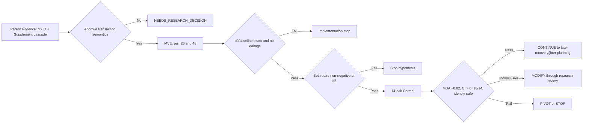

# EXPERIMENT_CONTRACT

## Experiment Metadata

- Experiment ID: `exp_20260808_001_mdmt_mia_id_supplement_joint_transaction`
- Short Name: MDMT MIA ID state 与 Supplement 联合状态事务
- Date: 2026-08-08
- Repository root: `/mnt/data/yzm/experiments/matrix_async_pose_comm_tracking`
- Current working directory: repository root
- Git Branch: `exp/20260803-002-mdmt-async-tracklet-fusion`
- Base Commit: `09281aa` (`record recent experiment updates`)
- Git status at contract creation: clean
- Status: `IMPLEMENTATION REPAIRED — v2 static re-audit passed; MVE authorization pending`
- Related Issue: `UNKNOWN`（本地记录未发现本实验 Issue；远端查询受代理限制）
- Related PR: `UNKNOWN`（本地记录未发现本实验 PR；远端查询受代理限制）
- Parent Experiment: `exp_20260805_003_mdmt_mia_async_state_channel_audit`
- Primary evidence:
  - `summary_md/current_experiment_stage.md`
  - `summary_md/current_status.md`
  - `summary_md/experiments/2026-8-5/exp_20260805_003_mdmt_mia_async_state_channel_audit.md`
  - `summary_md/experiments/2026-8-5/exp_20260805_003_mdmt_mia_async_state_channel_audit_analysis.md`
  - `outputs/20260805_mdmt_mia_async_state_channel_audit_formal_v2/async_channel_metrics.csv`
  - `outputs/20260805_mdmt_mia_async_state_channel_audit_formal_v2/async_channel_interaction_effects.csv`
  - `outputs/20260805_mdmt_mia_async_state_channel_audit_formal_v2/async_cascade_mechanisms.csv`

# Contract Amendment / Decision Record

## IR-20260811-AUDIT-FIX: Implementation Correction Record

- Classification: `IMPLEMENTATION / MEASUREMENT CORRECTION`; this is not a research-semantic amendment.
- Trigger: post-Terra implementation audit found that v1 captured the pre-branch state at the wrong control boundary, reconstructed the shadow from partially post-branch state, and accepted incomplete measurement manifests too easily.
- Disposition: v1 `packetized_id_supplement_cascade` is rejected for evidence generation and remains untouched for provenance. The replacement is `packetized_id_supplement_cascade_v2`.
- Locked semantics unchanged: R4-R6, R5a-R5d, conditions, contrasts, dataset, metrics, detector/tracker, payload, delay schedule and publication deadline are unchanged.
- v2 corrections:
  - capture/consume exactly one full pre-branch snapshot per non-initial frame;
  - freeze rows, matched/confirmed state, H inputs, geometry, images and detector candidates before the first current-frame ID mutation;
  - fail closed to `S_delay` on missing/stale/non-conserved state;
  - export only immutable membership indices from shadow;
  - compute the same read-only shadow in Y10 and Yec, while only Yec consumes `S_cf`;
  - record disagreement-candidate outcomes separately in Y10 and Yec and require actual High-score behavior propagation; pre-branch row keys are never reused to match across diverged runs;
  - make logging ON/OFF and shadow ON/OFF end-to-end invariance mandatory MVE gates;
  - require a matching passed MVE evidence directory before Formal;
  - fingerprint checkpoints/configuration so `--resume` cannot mix variants or conditions.
- Verification completed without MVE/Formal: focused unit tests, full repository tests, generated-source structural audit, Python AST/compile checks and SHA256 verification.
- Remaining boundary: MVE and Formal are not run and remain separately authorization-gated.

## ADR-20260809-R1-R3

- Effective date: `2026-08-09`
- Authority: explicit researcher approval after scientific discussion
- Scope: late Supplement authority, transaction waiting semantics and incomplete/conflicting fallback
- Precedence: this record supersedes incompatible provisional wording later in this Contract. Historical wording is retained and visibly marked rather than silently rewritten.

### Conflict Check

The three decisions are mutually compatible:

- R1 limits late Supplement to capture-time observation-support evidence for an already proposed ID-state effect.
- R2 removes `W=5` as an E023 scientific parameter; it does not remove the no-infinite-wait principle.
- R3 fixes incomplete, obsolete and conflicting transaction fallback to reject-all.

None changes the research question, H1, primary metric, dataset/split, baseline, delay schedule, publication deadline, Local/H timing, payload, detector/tracker/evaluator or first-frame initialization.

### Decision Classification

| Decision | Classification | Operative decision | Contract impact |
| --- | --- | --- | --- |
| R1 | CLARIFICATION / RESOLVED_CONDITIONAL | A late Supplement never performs delayed target supplementation. Its original capture-time content may only validate that the capture-time ID-state change had corresponding cross-view observation support. If validation passes and current version/live-track checks remain legal, the already-existing ID effect may affect future identity state after arrival. The Supplement must not create a new remap or trigger arrival-time re-association. | Dormant while joint-transaction H1 is suspended; applies only if a future amendment reactivates it. |
| R2 | CONTRACT AMENDMENT / RESOLVED_CONDITIONAL | Remove `W=5` as an E023 scientific parameter and remove any `W=5` sensitivity claim. Waiting begins when the first legal message of a transaction arrives. Under the symmetric fixed-delay E023 conditions, co-captured ID/Supplement messages are expected to arrive in the same frame, so waiting duration is recorded as `transaction_wait_frames` but is not part of the hypothesis test. Asymmetric-delay/jitter window selection is deferred. | The removal of the old claim remains recorded; runtime waiting semantics are dormant while joint-transaction H1 is suspended. |
| R3 | CLARIFICATION / RESOLVED_CONDITIONAL | The main method uses reject-all. Incomplete, obsolete or conflicting transactions cannot apply any partial future-state update, cannot fall back to ID-only, and cannot run late recovery. ID-only remains an independent mechanism ablation, not a fallback. | Dormant while joint-transaction H1 is suspended; applies only if a future amendment reactivates it. |

### Locked Invariants After Decision

```text
no old-bbox insertion
no historical/published rewrite
no future read
no runtime GT
no source bypass
same detector/tracker/payload/arrival/evaluator
no test-driven tuning
```

### Historical Implementation Decisions (Suspended by R4)

The following items belonged to the original joint-transaction proposal. R4 suspends them; they must not be specified or implemented under the current plan:

1. The exact transaction key. `capture_frame` alone is insufficient because the current author flow can emit multiple ID-state and Supplement stages in one frame.
2. An auditable Supplement-to-ID observation-support predicate that implements R1 without GT, future information, arrival-time re-association or new remap generation.
3. A runtime proof that the paired ID/Supplement packets used by the selected transaction key share the same arrival frame under E023 symmetric conditions.

Status: `SUSPENDED_BY_R4`. R4-R6 research semantics and the revised gate are resolved. The former joint-transaction requirements remain suspended. I4-I7 for the replacement oracle edge-cut audit were implemented after `START_IMPLEMENTATION`; MVE authorization is still required.

### ADR-20260809-R4: Upstream Hypothesis Pivot

Status: `RESOLVED / PIVOT APPROVED AT RESEARCH-DIRECTION LEVEL`; mechanism implementation remains blocked.

The researcher rejected an immediate choice between capture-frame bundle and per-candidate lineage. Source inspection showed that successful ID effects and high-score Supplement are generally alternate branches: after an ID mutation, candidate sets are recomputed, and only still-unmatched candidates proceed to supplementation. Low-score supplementation is a separate detector-to-detector branch. The current packet schemas preserve post-effect state but not a shared upstream candidate lineage.

Therefore the parent interaction result supports only this statement:

> ID and Supplement channels are non-additively coupled through tracking-state evolution.

It does not directly support the original joint-transaction claim that the same candidate's ID effect and Supplement evidence are naturally co-owned state that should be committed atomically.

#### Source-Backed Causal Structure

```text
capture-time ID association decision
  -> ID mutation would change identity state
  -> delayed ID channel withholds that current-frame commit
  -> get_matched_ids() recomputes matched/unmatched on pre-mutation state
  -> Supplement sees a shifted candidate set
  -> Supplement may change current tracker state
  -> fused state is fed back into the next frame
  -> future ID association changes
```

Classification:

- ID mutation is followed by candidate-set recomputation: `FACT` from author source order.
- delayed `deliver_id_state()` returns the pre-mutation state for the current frame: `FACT` from runtime source.
- Supplement consumes the recomputed unmatched set: `FACT` from author source.
- published/fused rows feed the next tracker frame: `FACT` from runtime/author feedback path.
- this path explains the measured delay-5 interaction: `INFERENCE`, not yet causally identified.

#### Operative Research Question After R4

Does the measured ID+Supplement non-additivity arise because ID-delay removes a capture-time identity-state commit, shifts the matched/unmatched candidate set consumed by Supplement, and thereby changes future association state?

#### Operative Mechanism Hypothesis H4

With the same ID delay and all frozen inputs, an auditable intervention that cuts only the edge

```text
ID commit absence -> matched/unmatched candidate-set shift -> Supplement behavior
```

should materially attenuate the previously measured extra ID+Supplement interaction, while leaving the direct ID-delay effect intact.

#### Required Alternative Explanation

The non-additivity may be compensation loss rather than destructive propagation: under ID-only delay, timely Supplement may compensate for the extra unmatched candidates; delaying Supplement removes that compensation. The parent `interaction_loss` statistic cannot distinguish this from a harmful state cascade.

The mechanism audit must report both possibilities and must not call either one proven from the parent data.

#### Contract Consequences

- The original joint-transaction H1 and its implementation plan are `SUSPENDED`, not failed by experiment.
- No transaction key, candidate lineage or observation-support record is authorized.
- R1-R3 are retained as `RESOLVED_CONDITIONAL`: they apply only if a later decision reactivates a joint-transaction method.
- The causal-edge-cut diagnostic is the active target. R5a-R5d and R6 lock its oracle intervention, contrasts and logging boundary; implementation verification remains pending authorization.
- No code implementation, MVE or Formal is authorized under the old contract.

#### Resolution Record After R4

| ID | Status | Decision needed |
| --- | --- | --- |
| R5 | `RESOLVED / CONTRACT AMENDMENT` | The primary edge cut and membership-only oracle construction are locked by R5a-R5d. ID delay, current-frame non-commit, Supplement algorithms and downstream writeback remain unchanged. |
| R6 | `RESOLVED / CONTRACT AMENDMENT` | Five conditions, predefined contrasts, mechanism patterns, oracle quarantine and the observational role of R5d logs are locked. Runtime verification remains mandatory but is no longer an open research decision. |

R4-R6 research semantics are now closed. `START_IMPLEMENTATION` was received on 2026-08-11; I4-I7 are implemented. MVE and Formal remain separately unauthorized.

### ADR-20260809-R5: Primary Causal Edge Selection

Classification: `RESEARCH DECISION / RESOLVED BY R5a-R5d`.

Approved:

```text
keep identical ID delay
keep current-frame ID effect uncommitted
intervene only on the candidate-set input seen by high-score Supplement
keep Supplement processing and tracker writeback unchanged
```

Not approved:

- blocking Supplement writeback as the primary R5 diagnostic;
- any concrete shadow-state implementation;
- any transaction key, transmitted candidate lineage or new observation-support payload;
- use of the diagnostic as a deployable online method.

Source review established four constraints that remain mandatory during implementation:

1. `get_matched_ids()` returns candidate IDs together with centers and corners, not a state-free membership set.
2. `not_matched_supplement()` writes the candidate ID into the other view and updates `matched_ids/coID_confirme`; directly substituting candidates from a synchronously committed shadow state would inject shadow identity labels into the delayed branch.
3. ID association mutates IDs in place but does not intentionally reorder rows. The approved narrow oracle is therefore a shadow-derived membership mask over pre-branch observation indices, followed by execution using delayed-branch IDs, geometry and state. Runtime conservation must still be asserted and must fail closed.
4. Low-score Supplement is a separate detector-to-detector branch and is not generated from `matched/unmatched`; it must remain controlled and be reported separately from the high-score candidate-set edge.

Resolved R5 sub-decisions:

| ID | Status | Question |
| --- | --- | --- |
| R5a | `RESOLVED / CONTRACT AMENDMENT` | Use `(view_id, pre_branch_row_index)` fixed before branching. Current frozen ID helpers preserve row count/order and only mutate IDs before Supplement. Any runtime conservation failure is `unidentifiable` and must fail closed; no post-hoc rematching is allowed. |
| R5b | `RESOLVED / CONTRACT AMENDMENT` | Shadow may compute synchronous counterfactual state internally but may export only the current-capture membership bit. All other shadow information is quarantined. |
| R5c | `RESOLVED / CLARIFICATION` | `S_cf` directly controls only high-score membership. Low-score receives no oracle input but may change naturally through real downstream track state. Supplement writeback remains enabled. |
| R5d | `RESOLVED / MEASUREMENT AMENDMENT` | Required read-only per-frame and disagreement-candidate logs are locked below. Logging must not affect runtime behavior. |

Blocking Supplement writeback is retained only as a possible second-level diagnostic for the downstream edge `Supplement behavior -> tracker feedback -> future ID`; it is not part of the primary R5 edge cut.

### ADR-20260811-R5d: Read-Only Causal Trace Instrumentation

Status: `RESOLVED / MEASUREMENT AMENDMENT`.

Scientific invariant:

```text
algorithm state -> diagnostic logger
diagnostic logger -X-> candidate selection / Supplement / ID mutation / tracker writeback
```

The minimum per-frame log is locked as:

```text
frame_id, direction/view

membership:
  n_delay_members
  n_cf_members
  membership_disagreement
  n_disagreement
  n_delay_only
  n_cf_only

high_score:
  trigger_count
  successful_bbox_writein_count

low_score:
  trigger_candidate_count
  current_track_coverage_reject_count
  successful_bbox_writein_count
```

Every disagreement candidate must additionally retain:

```text
capture_frame
view_id
pre_branch_row_index
delay_membership
cf_membership
high_score_triggered
high_score_bbox_written
```

Candidate-level records use only the R5a pre-branch observation key. They must not include or reconstruct a cross-branch ID match. Per-frame logs are mandatory because sequence aggregates cannot establish that membership, high-score and low-score changes occurred on the same frame.

R5d logs provide causal traceability only. They answer where propagation stopped; only the predefined R6 experimental contrasts may establish a performance effect. Logging ON/OFF must produce byte-identical predictions and state digests. Any diagnostic value used by runtime control invalidates the experiment.

### ADR-20260811-R6: Predefined Mechanism Contrasts and Oracle Boundary

- Effective date: `2026-08-11`
- Status: `RESOLVED / IMPLEMENTATION VERIFICATION REQUIRED`
- Scope: mechanism contrasts, interpretation rules and oracle-only information boundary
- Precedence: this record extends R4/R5 without reactivating the suspended joint-transaction H1.

#### Conflict Check

R6 is compatible with R4 and the selected R5 edge:

- it keeps ID delay and current-frame ID commit absence unchanged in `Y10/Y11/Yec`;
- `Yec` changes only the membership source presented to high-score Supplement;
- Supplement processing, low-score downstream processing, NMS, publication and tracker feedback remain enabled;
- destructive cascade and timely-Supplement compensation remain non-exclusive explanations;
- no existing baseline, dataset split, detector/tracker, delay schedule, evaluator or tracking metric is replaced.

R1-R3 remain dormant conditional decisions tied to the suspended joint-transaction proposal. R6 does not reactivate them.

#### Decision Classification

| Decision component | Classification | Contract impact |
| --- | --- | --- |
| Five conditions and predefined contrasts | `CONTRACT AMENDMENT` | Adds an oracle-only diagnostic condition and locks comparisons before results are observed. MDA remains the primary tracking metric; `R_edge` is a contrast, not a new metric. |
| Five mechanism interpretation patterns | `CONTRACT AMENDMENT` | Locks how destructive cascade, compensation, both, unsupported and unresolved outcomes may be reported. |
| R5d logs are observational evidence only | `CLARIFICATION` | Logs explain where propagation stopped; they cannot replace contrasts or control runtime behavior. |
| Current-frame shadow may export one membership bit to `Yec` | `CONTRACT AMENDMENT — ORACLE INFORMATION BOUNDARY ONLY` | Does not alter the deployable online boundary. Shadow ID, bbox, matched/tracker state, H, detector state, future data and GT remain forbidden. |
| Exact row key, mask encoding, conservation counters and quarantine assertions | `IMPLEMENTATION DECISION` | Execution may choose an encoding only after source verification, without changing the approved semantics. |

#### Locked Conditions

| Condition | ID state | Supplement state | High-score membership |
| --- | --- | --- | --- |
| `Y00` | timely | timely | synchronous membership |
| `Y10` | delayed | timely | actual delayed-state `S_delay` |
| `Y01` | timely | delayed/expired | synchronous membership |
| `Y11` | delayed | delayed/expired | actual delayed-state `S_delay` |
| `Yec` | delayed | timely | oracle counterfactual `S_cf` |

`Y00/Y10/Y01/Y11` are the locked 2x2 factorial conditions. `Yec` is an oracle causal-edge diagnostic and must never be reported as deployable asynchronous performance. `Y10` and `Yec` intentionally differ only in the membership source supplied to high-score Supplement.

#### Locked Contrasts

For higher-is-better outcomes:

```text
D_ID    = Y00 - Y10
R_edge  = Yec - Y10
M_delay = Y10 - Y11
M_sync  = Y00 - Y01
```

- `D_ID`: total ID-delay effect under timely Supplement.
- `R_edge`: candidate-set mediated/oracle edge-cut recovery; it is not a strict percentage decomposition of total ID-delay loss.
- `M_delay`: timely Supplement marginal value under delayed ID.
- `M_sync`: timely Supplement marginal value under timely ID.
- Compare `M_delay` with `M_sync` to assess extra timely-Supplement compensation.

The parent experiment defines metric loss as `reference - condition` and its reported `interaction_loss` as:

```text
combined_loss - max(single_channel_losses)
```

Positive parent interaction therefore means the combined condition is worse than its worst single-channel condition. This sign convention is compatible with R6, but it is not the same statistic as the factorial difference `M_delay - M_sync`; the two must remain separately named and reported.

#### Predefined Interpretation

| Pattern | Required contrast evidence | Allowed conclusion |
| --- | --- | --- |
| Destructive cascade | `R_edge > 0` with process logs showing membership disagreement reaches actual high-score write-in; no extra compensation signal | destructive candidate-set cascade supported |
| Compensation | `R_edge` not supported and `M_delay > M_sync` | timely-Supplement compensation supported; cascade not supported by this diagnostic, not disproved |
| Both | `R_edge > 0` and `M_delay > M_sync`, both supported by process evidence | both mechanisms supported |
| Neither dominant | neither contrast supported | candidate-set path not supported as dominant; inspect where propagation stops |
| Mixed/unstable | direction/CI/process evidence conflict | other or unresolved mechanism |

Final thresholds, confidence intervals and direction-consistency gates must come from the unchanged predefined metric/statistical protocol; they must not be selected after observing results.

#### R5d Diagnostic Boundary

R5d logs may record:

```text
membership disagreement
delay-only / counterfactual-only candidate counts
high-score trigger and bbox write-in
low-score trigger, coverage rejection and bbox write-in
future tracker / association divergence
```

They are observational process evidence only. Logging ON/OFF must be prediction-identical. Logs cannot be runtime controls and cannot independently establish a mechanism claim.

#### Source Verification Record

- Parent sign convention: `VERIFIED` from the frozen experiment runner.
- Source order: `VERIFIED`; ID mutation is followed by candidate/H recomputation before later association and high-score Supplement.
- Row conservation: `VERIFIED FOR THE FROZEN SOURCE`; active ID association helpers only mutate ID columns before Supplement and do not add/remove/reorder rows. Candidate arrays currently discard row indices, so implementation must explicitly preserve the pre-branch key.
- Shadow quarantine: `RESEARCH SEMANTICS LOCKED`; only membership bit may cross into the actual delayed branch. Runtime assertions remain mandatory implementation verification.
- Single-edge claim boundary: `CLARIFIED`; `S_cf` may include upstream effects through recomputed H, but only membership crosses the actual-branch intervention boundary. Conclusions must remain at candidate-membership mediation level.

#### Mandatory Implementation Verification After Authorization

- I4/R5a row-conservation invariant, encoding and failure behavior.
- I5/R5b shadow/oracle quarantine assertions.
- I6/R5c single-edge conservation and low-score control audit.
- I7/R5d logging invariance test design.
- revised executable Contract/decision gate and explicit `START_IMPLEMENTATION`.

These are implementation/measurement gates, not unresolved research decisions. They were implemented after `START_IMPLEMENTATION`; experiment execution remains blocked until MVE verifies their end-to-end gates.

### Deferred Optional Ablations

- content-aware validation versus presence-only gating;
- reject-all versus ID-only fallback.

They are not added to E023 by this synchronization. Activating either would change the fixed condition set and requires a separate Contract amendment.

### Repository Identification

| Item | Classification | Finding | Evidence |
| --- | --- | --- | --- |
| Repository metadata | FACT | Git metadata is stored in `.gitstore`; ordinary `.git` discovery is not usable without explicit `--git-dir/--work-tree`. | `.gitstore/config`; Git command used at contract creation |
| Current branch | FACT | Branch is still `exp/20260803-002-mdmt-async-tracklet-fusion`. | `git branch --show-current` using `.gitstore` |
| Branch/research alignment | INFERENCE | The branch name is stale relative to the completed 2026-08-05 experiments and should not determine the current scientific question by itself. | `summary_md/current_experiment_stage.md`; `summary_md/experiments/INDEX.md` |
| Current completed experiment | FACT | The latest completed Formal is `exp_20260805_003`; decision is `coupled_state_cascade_identified`. | Parent experiment card and analysis |
| Current proposed experiment | LOCKED RESEARCH DESIGN | The earlier joint-state transaction proposal is suspended by ADR-20260809-R4. The active target is the R5/R6 oracle causal-edge mechanism audit; v2 passed static re-audit and awaits separate MVE authorization. | ADR-20260809-R4/R5; ADR-20260811-R5d/R6; IR-20260811-AUDIT-FIX |

## Current Experiment Reconstruction

- `CURRENT_RESEARCH_QUESTION` — **SUPERSEDED INFERENCE**: The original joint-commit question is suspended. The operative R4 question concerns ID-delay-mediated candidate-set shift and Supplement/future-state propagation.
- `CURRENT_EXPERIMENT` — **INFERENCE**: `exp_20260808_001_mdmt_mia_id_supplement_joint_transaction`.
- `PREVIOUS_BASELINE` — **FACT**: Independent asynchronous handling in `exp_20260805_003`: ID remaps are versioned and affect future live tracks; delayed Supplement packets expire.
- `CURRENT_CHANGE` — **LOCKED RESEARCH DESIGN**: No joint-transaction implementation is authorized. The active change is an oracle-only high-score membership edge cut with R5a-R5d/R6 semantics locked; its isolated runtime, variant, CLI, and unit tests are implemented. MVE remains unauthorized.
- `CURRENT_EVIDENCE` — **FACT**: At delay 5, ID+Supplement interaction loss is `0.064116`, 95% CI `[0.022113, 0.120237]`, with `12/14` pairs in the same direction.
- `CURRENT_UNKNOWN` — **UNKNOWN**: Whether the interaction is caused by non-atomic application, by Supplement's frame-expiry semantics, or by a dataset/evaluator coupling that no online transaction can repair.

# 1. Research Question

Status: `SUSPENDED by ADR-20260809-R4`. Retained below as the original pre-pivot question for audit history. The operative question is recorded in the R4 decision above.

With Local Track and Homography delivered on time and published outputs immutable, does a bounded, version-consistent joint transaction for delayed `ID state + Supplement` improve online cross-view association over the current independent late-message semantics?

This is falsifiable: the joint transaction must improve held-out pair-level MDA under the predefined safety constraints. If it does not, the non-atomic-state explanation is rejected.

# 2. Motivation / Trigger

### FACT

- Gate B active packetization reproduced all 28 test-view JSON files exactly, so the message interface itself is not the source of the measured loss. Source: `summary_md/experiments/2026-8-5/exp_20260805_002_mdmt_mia_active_packet_runtime_equivalence_analysis.md`.
- The channel audit passed all measurement gates: future reads, source bypass, NumPy aliasing, feedback mismatch and published-history rewrites were all zero. Source: `outputs/20260805_mdmt_mia_async_state_channel_audit_formal_v2/async_measurement_gate.csv`.
- At delay 5, ID+Supplement has a statistically supported interaction loss of `0.064116`; delay 1 has CI crossing zero. Source: `async_channel_interaction_effects.csv`.
- ID state delay mainly increases IDSW/lowers IDF1, while Supplement expiry mainly lowers MDA. Source: parent analysis Sections 4–6.
- Local Track delay blocks downstream MIA execution and makes all-channel results equal Local-only. Source: `async_cascade_mechanisms.csv`.

### INFERENCE

- A substantial part of the delay-5 interaction may arise because ID remap and Supplement evidence are consumed under incompatible state versions or different validity rules.
- Keeping Local Track timely is necessary to observe downstream mechanism changes without the upstream deadline bottleneck.

### ASSUMPTION

- ID remap and Supplement events can be assigned a common transaction key derived only from runtime fields such as capture frame, source view and source state version.
- A late Supplement can validate or constrain a future-only ID-state commit without inserting its stale bounding box into a past or current frame.

# 3. Hypothesis

Status: `SUSPENDED by ADR-20260809-R4`. H1 below must not drive implementation or execution unless a future Contract amendment explicitly reactivates it.

## H1: Version-consistent joint commit reduces the state cascade

If the delay-5 cascade is substantially caused by independent state application, then a joint transaction policy should show the following pattern relative to the current independent ID+Supplement policy:

- mean MDA increases by at least `0.02` across 14 official pairs;
- pair-cluster bootstrap 95% CI for MDA improvement has lower bound `> 0`;
- at least `10/14` pairs improve in MDA;
- IDF1 does not decrease by more than `0.005`;
- IDSW does not increase by more than `10%`;
- `id_state_conflict + id_state_obsolete` decreases by at least `10%` or the valid joint-commit rate increases by at least `10%`;
- delay 5 benefits more clearly than delay 1, matching the parent experiment's interaction pattern.

# 4. Alternative Hypotheses

## H_alt1: Supplement expiry, not non-atomic state, is the controlling mechanism

An atomic transaction does not improve MDA unless delayed Supplement is given a new late-recovery meaning. In that case this experiment fails H1 and a separate communication-semantics decision is required.

## H_alt2: The interaction is an evaluation or closed-loop side effect

The interaction is reproducible but cannot be reduced by joint commit; MDA changes while event-level conflict/obsolete counts do not improve consistently.

## H_alt3: Partial late state is safer than waiting for a complete transaction

Buffering or rejecting incomplete transactions loses useful early ID remaps, increasing IDSW or reacquisition delay even when MDA improves.

# 5. Evidence Before Experiment

## Known

| Evidence | Classification | Source |
| --- | --- | --- |
| Synchronous active packet runtime is JSON-equivalent to the frozen author baseline. | FACT | `exp_20260805_002..._analysis.md` |
| Parent Formal uses 14 official test pairs, fixed delays, no jitter/loss/replay and immutable published output. | FACT | Parent experiment card |
| Delay-5 ID+Supplement interaction passes effect, CI and direction gates. | FACT | `async_channel_interaction_effects.csv` |
| Delay-1 ID+Supplement CI crosses zero. | FACT | Same table |
| IDSW response to ID-state delay is not monotonic in delay; d2 is worse than d5/d10. | FACT | `async_channel_metrics.csv` |
| Supplement-only loss is flat for all non-zero fixed delays under frame-expiry semantics. | FACT | `async_channel_metrics.csv` |

## Unknown

- The exact online meaning of a late Supplement inside a joint transaction.
- The correct finite transaction window and fallback action when only one packet arrives.
- Whether official MDMT FPS is reliable enough to convert the window from frames to seconds.
- Whether first-frame GT initialization materially changes the transaction benefit.
- The Issue/PR identifiers and final implementation branch.

## Contradictory or limiting evidence

- The delay-1 interaction is inconclusive, so the mechanism may only exist after substantial state divergence.
- H+ID does not show a stable cascade, so the result does not support a generic “all state must be atomic” claim.
- Absolute IDF1 loss is smaller than MDA loss; a method may recover cross-view association coverage without materially improving local identity continuity.

# 6. Experimental Unit

- Primary statistical unit: one official MDMT paired sequence (`pair_id`).
- Online unit: one capture-frame transaction containing causally available ID-state and Supplement messages.
- Data version: local MDMT dataset at `/mnt/data/yzm/datasets/Multi-Drone-Multi-Object-Detection-and-Tracking` (`UNKNOWN` checksum).
- Split: 14 official test pairs: `26,31,34,48,52,55,56,57,59,61,62,68,71,73`.
- Training/validation: no model training and no test-set threshold tuning.
- MVE pairs: 26 and 48, used only for implementation falsification; they must not select a better window or threshold.
- Seen/unseen: Not applicable to model fitting; all conditions use the same frozen test data and model.
- Runtime seed: `7` where used by the existing launcher.
- Statistical repetitions: paired bootstrap `10000`, seed `7`.
- Determinism repetitions: MVE joint delay-5 condition repeated twice.

# 7. Baselines

| Baseline | Input and parameters | Budget/data/protocol | Fairness role |
| --- | --- | --- | --- |
| `sync_active_d0` | All four packet channels timely; paper-aligned CARAFE+ByteTrack MIA | No training; same pairs/evaluator | Diagnostic upper bound and d0 equivalence gate |
| `independent_id_plus_supplement` | Local/H timely; ID and Supplement delayed independently using the parent semantics | Delays 1 and 5; same payload and compute path | Safety/current-system baseline |
| `id_state_only` | Only ID state delayed | Delays 1 and 5 | Separates identity-state loss |
| `supplement_only` | Only Supplement delayed and expired | Delays 1 and 5 | Separates frame-scoped supplementation loss |
| `joint_transaction` | Same packets and arrival schedule; version-consistent bounded joint commit | Delays 1 and 5 | Proposed policy; only application semantics may differ |

No baseline may receive additional detector candidates, GT IDs, future packets, extra image features or a different CARAFE/ByteTrack checkpoint.

# 8. Independent Variable

Primary independent variable:

```text
ID state + Supplement application policy
  A. independent application (current parent semantics)
  B. bounded version-consistent joint transaction
```

The delay (`1` or `5` frames) is a predefined context/stratum, not a tuned method parameter.

Original provisional transaction semantics, retained for audit history. ADR-20260809-R1-R3 controls where the text differs:

1. Pair packets only by runtime `capture_frame`, direction and compatible `source_state_version`; no GT identity is used.
2. ~~Commit only if referenced source/target tracks are still live and the transaction is complete within `W=5` frames.~~ **SUPERSEDED by R2:** no fixed `W` participates in E023; record `transaction_wait_frames` and retain the no-infinite-wait invariant.
3. A late Supplement cannot insert a stale bbox into published history. It may only validate/constrain the future ID remap associated with the same transaction.
4. Incomplete, obsolete or conflicting transactions are rejected as a unit; they cannot partially overwrite newer state. **CONFIRMED by R3:** reject-all, with no ID-only fallback and no late recovery.
5. Published JSON remains immutable; there is no capture-time replay in this experiment.

~~`W=5` is an ASSUMPTION selected from the parent delay-5 cascade.~~ **SUPERSEDED by R2.** E023 does not test or tune a transaction window. Window sensitivity belongs to a later asymmetric delay/jitter experiment.

Operative late-Supplement semantics after R1:

```text
capture-time Supplement content
  -> validate/constrain the corresponding capture-time ID-state effect
  -> if validation + current version + live-track legality pass:
       allow only that existing ID effect to influence future identity state
  -> otherwise reject the whole transaction

Forbidden:
  stale bbox insertion
  arrival-time re-association
  generation of a new remap from late Supplement
  partial ID-only fallback
  late recovery
```

# 9. Controlled Variables

- Dataset and split: MDMT 14 official test pairs.
- Detector: author CARAFE, `epoch_12.pth` (`exact path/checksum: TBD`).
- Tracker: author ByteTrack with the paper-aligned configuration.
- First-frame initialization: synchronized XML GT, retained and explicitly marked offline initialization.
- Local Track: timely (`delay=0`).
- Homography: timely (`delay=0`).
- ID/Supplement packet payload and serialization: unchanged from Gate B/parent experiment.
- Delay schedule: fixed bidirectional delays; no jitter, reordering or loss.
- Evaluation: author MDA/AAS plus existing MOTA/IDF1/IDSW evaluator.
- Published-output policy: immutable.
- Detector cache: same cache and cache-equivalence gate as parent Formal.
- Bootstrap policy: 10,000 paired resamples, seed 7.
- Hardware: `cuda:0` for author detector/tracker runs.
- Training steps, optimizer, learning rate: Not Applicable; no training.
- Checkpoint selection: frozen author checkpoint; no selection after results.

# 10. Information Boundary

For a message generated at capture frame `t_c`:

```text
generation time   = t_c
transmission time = t_c
arrival time      = t_c + channel_delay
observation time  = original detector/tracker state at t_c
decision time     = current online frame t_d >= arrival time
```

Allowed at decision frame `t_d`:

- packets with `arrival_frame <= t_d`;
- current and past local tracker state;
- current live-track IDs and monotonically increasing runtime state versions;
- first-frame offline initialization, separately audited.

Forbidden:

- packets whose arrival frame is in the future;
- XML/official identity or evaluation labels during runtime;
- rewriting JSON already published for frames `< t_d`;
- inserting a capture-time Supplement bbox as a current-frame bbox;
- reading source Python/NumPy objects after wire decoding;
- choosing thresholds, fallback behavior or any future transaction window from Formal test metrics. E023 has no tunable `W`.

Transaction buffering may postpone internal application, but it must not postpone or alter the external frame publication deadline. Any design that delays published output changes the research question and requires `NEEDS_RESEARCH_DECISION`.

# 11. Metrics

Status: `ORIGINAL JOINT-TRANSACTION METRICS SUSPENDED`. The parent MDA/IDF1/IDSW measurements remain evidence, but the primary causal-edge-cut endpoint and mediation quantities require a new research decision. No metric definition is changed by this record.

## Primary Metric

Pair-level MDA improvement of `joint_transaction` over `independent_id_plus_supplement` at delay 5, aggregated as a 14-pair mean with paired bootstrap 95% CI.

Rationale: the parent cascade was identified through cross-device association loss, and Supplement's strongest measured effect is on MDA. This metric directly tests whether joint state handling recovers cross-view association rather than merely changing local track bookkeeping.

## Secondary Metrics

- IDF1 and IDSW: identity-continuity safety checks.
- MOTA: detection/tracking coverage safety check.
- Pair-direction count for MDA improvement.
- `id_state_applied`, `id_state_obsolete`, `id_state_conflict`.
- transaction complete/applied/incomplete/expired/conflict counts.
- Supplement accepted as validation evidence versus rejected.
- first divergence frame and feedback-state divergence.
- published-history rewrite count.

No checkpoint or policy is selected using the best Formal metric. MVE is implementation-only and cannot tune the method.

# 12. Minimum Viable Experiment

Status: `BLOCKED BY ADR-20260809-R4`. The original joint-transaction MVE below is retained for audit history and must not be run.

Scope:

- Pairs: `26`, `48`.
- Conditions: all five baselines/policies in Section 7 at delays `1` and `5`, plus `sync_active_d0`.
- Pair-runs: `18` (`9 conditions × 2 pairs`), about `14.3%` of the planned Formal pair-runs.
- Repeat: `joint_transaction_d5` twice for determinism.
- Expected runtime: `45–75 minutes` on the existing server (**INFERENCE** from prior Pilot throughput; must be updated after dry-run timing).
- Expected output: pair-level JSON, packet trace, transaction outcomes, measurement gate and MVE decision.

Sanity checks:

- d0 JSON equals frozen active packet reference.
- independent baselines equal parent outputs for pair 26/48.
- emitted/consumed packet counts conserve messages.
- no future/GT/source-bypass/alias/published-rewrite violations.
- transaction keys and version ordering are deterministic.
- no stale Supplement bbox appears in current or historical published output.

MVE stopping rule:

- Stop immediately on any measurement-gate failure.
- Do not require statistical significance from two pairs.
- Proceed only if both pairs show non-negative MDA direction at d5 and no catastrophic IDSW increase (`>25%`) or IDF1 loss (`>0.01`).

# 13. Full Experiment

Status: `BLOCKED BY ADR-20260809-R4`. The original 126 pair-run Formal is not authorized.

- Dataset scope: all 14 official test pairs.
- Conditions: the same 9 fixed conditions used by the MVE; no post-MVE parameter changes.
- Pair-runs: `126` (`9 × 14`).
- Delays: `1` and `5` frames; no broader delay sweep in this round.
- Seed: runtime seed 7; bootstrap 10,000, seed 7.
- Required outputs:
  - per-pair and aggregate MDA/MOTA/IDF1/IDSW;
  - paired bootstrap comparisons;
  - transaction/action counts;
  - conflict/obsolete mediation table;
  - measurement gate and final decision.

# 14. Success Pattern

Evidence supports H1 only when all are true:

1. At delay 5, MDA improvement over independent handling is `>=0.02`.
2. The paired bootstrap 95% CI lower bound is `>0`.
3. At least `10/14` pairs improve in MDA.
4. IDF1 decreases by no more than `0.005` and IDSW increases by no more than `10%`.
5. Conflict/obsolete events decrease by `>=10%`, or valid joint commits increase by `>=10%`, linking metric gain to the proposed mechanism.
6. Delay-5 benefit is at least as large as delay-1 benefit, consistent with the parent cascade rather than a generic implementation change.

# 15. Failure Pattern

## Contradicts H1

- MDA improvement is `<0.02` with CI centered near/below zero; or
- the method improves MDA but violates the IDF1/IDSW safety constraints; or
- metrics change without the expected transaction/conflict mechanism changing.

## Inconclusive

- Mean MDA improvement is `>=0.02` but CI crosses zero or fewer than `10/14` pairs agree.
- Pair heterogeneity is high and linked to sequence length/target count, but no predefined stratum explains it.

## Implementation failure

- d0 or independent baseline does not reproduce reference output.
- Any future read, GT runtime read, source bypass, aliasing or published-history rewrite is non-zero.
- Packet/transaction conservation or deterministic replay fails.

# 16. Confounders

1. **Extra information**: the joint method must not receive packet fields unavailable to the independent baseline.
2. **Changed publication latency**: buffering internal transactions must not delay frame publication.
3. **Changed Supplement semantics**: using stale boxes for current detections would test late recovery/reprojection, not atomic state commit.
4. **Test-set tuning**: pair 26/48 and the 14 Formal pairs cannot select `W` or thresholds.
5. **First-frame GT initialization**: may overstate state stability; retained only for comparability and limits external validity.
6. **Detector-cache drift**: cached CARAFE results must remain JSON-equivalent to the frozen reference.
7. **Pair-size weighting**: primary inference is pair-macro, not frame-weighted, to avoid long pairs dominating.
8. **Non-monotonic ID state behavior**: delay age alone cannot be used as the mechanism explanation.
9. **Fallback-policy confounding**: reject, ID-only apply and late recovery are different policies; only one fixed fallback may be used in this experiment.

# 17. Reproducibility Contract

- Base commit: `09281aa`.
- Implementation commit: `TBD`.
- Branch: current branch is stale; implementation branch `TBD`.
- Config path: `configs/exp_20260808_001_mdmt_mia_id_supplement_joint_transaction.yaml` (`TBD`).
- Command: `TBD`; must expose `--mode`, `--pair-ids`, `--seed`, `--resume`, `--output-dir` and `transaction_wait_frames` audit output. A fixed transaction window is not an E023 scientific parameter.
- Environment: `/mnt/data/yzm/experiments/mdmt_mia_official/.conda-env` plus current research workspace.
- Detector checkpoint: CARAFE `epoch_12.pth`, exact absolute path and SHA256 `TBD`.
- Seed: `7`; bootstrap seed `7`.
- MVE output: `outputs/20260808_mdmt_mia_id_supplement_joint_transaction_mve/`.
- Formal output: `outputs/20260808_mdmt_mia_id_supplement_joint_transaction/`.
- Checkpoint/resume: one checkpoint per `condition × pair`; no model checkpoint is produced.

# 18. Compute Budget

- Smoke: unit/synthetic packet tests and CLI dry-run; target `<5 minutes`, no full detector run.
- MVE: 18 pair-runs plus one deterministic repeat; estimated `45–75 minutes` (**INFERENCE**).
- Full: 126 pair-runs; estimated `5–7 GPU-hours` (**INFERENCE**, update from measured MVE throughput before authorization).
- Maximum implementation retries before escalation: 2.
- Maximum experiment retries for infrastructure-only failure: 1 per failed condition using checkpoint/resume.
- Hyperparameter retries: 0 on official test data.

# 19. Stop Conditions

- Implementation stop: d0/independent reference equivalence cannot be restored after two scoped fixes.
- Experiment stop: MVE has measurement leakage, output rewrite, transaction non-determinism or catastrophic identity regression.
- Hypothesis stop: Formal MDA improvement `<0.02`, CI crosses zero toward harm, or identity safety gates fail.
- Scope stop: implementation requires Local Track delay, H prediction, detector retraining, new ReID, output replay, jitter/loss or a new evaluation protocol.

# 20. Decision Gate

Status: `SUSPENDED`. These gates apply only to the original joint-transaction H1 and cannot authorize the new mechanism audit.

## First Gate: MVE Measurement and Direction Gate

```text
PASS if:
  d0 JSON mismatch = 0
  independent baseline mismatch = 0
  future/GT/source-bypass/alias/published-rewrite = 0
  transaction conservation mismatch = 0
  deterministic repeat mismatch = 0
  both MVE pairs have d5 MDA delta >= 0
  IDF1 loss <= 0.01 and IDSW increase <= 25%

FAIL otherwise; do not run Formal.
```

## Final outcomes

- `CONTINUE`: all Section 14 success criteria pass. Next test late-recovery semantics under asymmetric delay/jitter.
- `MODIFY`: MDA direction is positive but CI/direction or mechanism gate is inconclusive. Return to planning; no test-set tuning.
- `PIVOT`: atomic commit fails but event analysis supports Supplement expiry as the dominant cause. Plan a separate late-recovery experiment.
- `STOP`: measurement is valid but joint transaction has no meaningful gain or violates identity safety.

# 21. Escalation Boundary

Mark `NEEDS_RESEARCH_DECISION` and stop implementation before changing any of:

- Research question or primary hypothesis.
- Dataset/split or use of official test pairs for tuning.
- Primary metric or pair-macro aggregation.
- Independent/current baseline definition.
- The meaning of late Supplement evidence.
- Transaction fallback policy (R3 fixes reject-all for E023) or any future asymmetric-delay waiting/window semantics.
- Published-output deadline or permission to replay/rewrite history.
- Detector/tracker/model family or first-frame initialization.
- Addition of jitter, packet loss, H prediction, ReID or detector error.

R1-R3 are conditionally resolved by ADR-20260809-R1-R3, but their joint-transaction premise is suspended by R4. R4-R6 research semantics are now resolved. I4-I7 are locked implementation/verification requirements rather than open research decisions. They were implemented after `START_IMPLEMENTATION` and unit-verified; experiment execution remains blocked until separately authorized MVE verifies their end-to-end gates. No transaction key or observation-support record is authorized.

# 22. Expected Artifacts

Tracked artifacts required before Formal:

- Experiment card: `summary_md/experiments/2026-8-8/exp_20260808_001_mdmt_mia_id_supplement_joint_transaction.md`.
- Mermaid flowchart: `mermaid/exp_20260808_001_mdmt_mia_id_supplement_joint_transaction/joint_transaction_flow.mmd`.
- Frozen config: `configs/exp_20260808_001_mdmt_mia_id_supplement_joint_transaction.yaml`.
- Test specification and implementation tests under `tests/` (`TBD` filenames).

Generated artifacts:

- `joint_transaction_pipeline_metrics.csv`
- `joint_transaction_metrics_by_pair.csv`
- `joint_transaction_effects.csv`
- `joint_transaction_outcomes.csv`
- `joint_transaction_conflict_mediation.csv`
- `joint_transaction_measurement_gate.csv`
- `joint_transaction_results.md`
- `joint_transaction_decision.md`
- per-condition logs and resume checkpoints

Raw outputs remain under `outputs/` and are not copied into tracked research notes.

## Experiment Flow



# Contract Self-Audit

Status: the checks below describe the original joint-transaction contract and are retained for audit history. They do not authorize implementation after R4.

- [x] H1 is falsifiable and has a competing explanation.
- [x] One primary causal variable is changed: ID+Supplement application policy.
- [x] Dataset, detector, tracker, messages, delays and evaluator are controlled.
- [x] Safety baseline and diagnostic upper bound are separate.
- [x] Success, contradiction, inconclusive and implementation failure are predefined.
- [x] Temporal information boundaries and published-output immutability are explicit.
- [x] One primary metric is predefined.
- [x] MVE is about 14.3% of Formal pair-run count and has a stop rule.
- [x] Repository evidence is classified as FACT/INFERENCE/ASSUMPTION/UNKNOWN.
- [x] Another coding agent can identify the evidence, controls, outputs and gates without this conversation.
- [x] R1 late-Supplement authority and R3 reject-all fallback have received explicit research approval.
- [x] R2 explicitly removes `W=5` as an E023 scientific parameter.
- [x] R4 explicitly suspends the original joint-transaction inference and implementation.
- [x] R6 conditions, contrasts, interpretation and oracle boundary are explicitly recorded.
- [x] I4-I7 source/conservation/quarantine/logging verification semantics are defined.
- [x] I4-I7 v2 are implemented and static/unit/full-regression checks pass after `START_FIX_AUDIT_FINDINGS`.
- [ ] A replacement executable Contract exists.

## ADR-20260812-FORMAL-READINESS: Confirmatory Direction Freeze

Status: `FORMAL NOT READY / IMPLEMENTATION GATES OPEN`.

Classification: `CLARIFICATION + MEASUREMENT/EXECUTION AMENDMENT`. This record
does not change the dataset, primary metric, conditions, delays, detector,
tracker, evaluator or Yec information boundary.

The historical progression is retained explicitly:

```text
Original MVE hypothesis:
candidate-set shift may be a destructive mediator

MVE observation:
Yec did not recover performance and was worse at d5

Yec semantic audit:
selected_Yec == S_cf; all disagreement candidates were delay-only;
the implementation did not globally disable High-score

Refined confirmatory question:
the candidate-set pathway may be destructive, null/heterogeneous,
or compensatory; Formal must permit every direction
```

The active primary endpoint is pair-level MDA under ADR-20260811-R6. The
confirmatory questions and contrasts are:

```text
Q1: D_ID   = Y00 - Y10
Q2: C_comp = (Y10 - Y11) - (Y00 - Y01)
Q3: R_edge = Yec - Y10, with positive, null and negative outcomes admissible
```

For IDSW, every contrast is direction-normalized so positive means fewer
switches/recovery. The parent `interaction_loss` remains a separate historical
statistic and is not redefined as `C_comp`.

Formal remains blocked until:

- the analysis implementation handles destructive, compensatory, coexisting,
  null and heterogeneous outcomes without sign bias;
- each pair-condition passes causal gates before another run is launched;
- interrupted attempts use isolated clean-restart manifests rather than shared
  partial roots;
- the approved implementation is frozen to a reproducible commit or a complete
  recorded diff/hash set;
- any diagnostic-logging change repeats the MVE logging-invariance gate.

Normative pre-Formal documents:

- `FORMAL_RUN_PLAN.md`
- `FORMAL_ANALYSIS_PLAN.md`
- `FORMAL_READINESS_REPORT.md`
