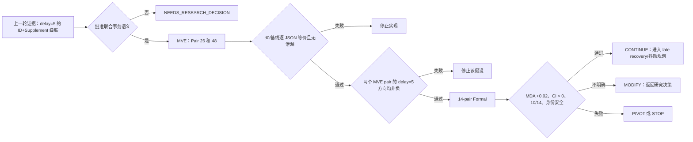

# 实验契约：MDMT MIA 身份状态与补全联合事务

本文件是
`EXPERIMENT_CONTRACT.md`
的中文阅读版。两份文件内容保持一致；英文版用于协作和自动化，本文用于科研讨论。

## 实验元数据

- 实验 ID：`exp_20260808_001_mdmt_mia_id_supplement_joint_transaction`
- 实验名称：MDMT MIA `ID state` 与 `Supplement` 联合状态事务
- 日期：2026-08-08
- 主研究仓库：`/mnt/data/yzm/experiments/matrix_async_pose_comm_tracking`
- 当前分支：`exp/20260803-002-mdmt-async-tracklet-fusion`
- 基准提交：`09281aa`，`record recent experiment updates`
- 建立契约时 Git 状态：干净
- 当前状态：`V2 IMPLEMENTATION REPAIRED — 静态复审通过；MVE 仍需单独授权`
- 上一轮实验：`exp_20260805_003_mdmt_mia_async_state_channel_audit`
- 相关 Issue：`UNKNOWN`
- 相关 PR：`UNKNOWN`

主要依据：

- `summary_md/current_experiment_stage.md`
- `summary_md/current_status.md`
- `summary_md/experiments/2026-8-5/exp_20260805_003_mdmt_mia_async_state_channel_audit.md`
- `summary_md/experiments/2026-8-5/exp_20260805_003_mdmt_mia_async_state_channel_audit_analysis.md`
- `outputs/20260805_mdmt_mia_async_state_channel_audit_formal_v2/async_channel_metrics.csv`
- `outputs/20260805_mdmt_mia_async_state_channel_audit_formal_v2/async_channel_interaction_effects.csv`
- `outputs/20260805_mdmt_mia_async_state_channel_audit_formal_v2/async_cascade_mechanisms.csv`

# 契约修订与决策记录

## IR-20260811-AUDIT-FIX：实现修正记录

本记录属于实现与测量修正，不修改 R4-R6、R5a-R5d、实验条件、指标、数据划分或研究假设。

- v1 `packetized_id_supplement_cascade` 因 pre-branch capture 边界和 shadow 隔离问题被否决，不得生成科研证据。
- v2 `packetized_id_supplement_cascade_v2` 改为每个非初始化帧恰好保存并消费一次完整分支前状态；缺失、过期或守恒失败时退回实际 delayed membership。
- Y10 与 Yec 都计算同一个只读 shadow，只有 Yec 使用 `S_cf`；High-score 是唯一直接消费 membership 的模块。
- MVE 必须验证 logging ON/OFF、shadow ON/OFF、Y10/Yec candidate pairing、packet conservation 和全部 manifest 字段。
- Formal 必须显式读取同配置且全部 gate 通过的 MVE evidence，不能直接运行。
- 当前只完成单元测试、全仓回归、v2 生成源码结构/语法/SHA 审计；没有运行 MVE 或 Formal。

## ADR-20260809-R1-R3

- 生效日期：`2026-08-09`
- 决策依据：科研讨论后的研究者明确批准
- 优先级：本记录覆盖本文后续与其不一致的“待批准”旧表述；旧表述保留并显式标记，不做静默改写。

三个决定互不冲突：R1 限定迟到 Supplement 的权限；R2 只撤销 `W=5` 作为 E023 科学参数；R3 固定不完整/过期/冲突事务的 reject-all 回退。它们不修改研究问题、H1、主指标、数据划分、baseline、delay schedule、publication deadline、Local/H 时序、payload、detector/tracker/evaluator 或首帧初始化。

| 决定 | 类型 | 生效语义 | 契约影响 |
| --- | --- | --- | --- |
| R1 | CLARIFICATION / RESOLVED_CONDITIONAL | 迟到 Supplement 不执行迟到目标补全。它的 capture-time 原始内容只能验证既有 capture-time ID state change 是否有对应跨视角观测支持。验证、版本和 live-track 检查都通过后，才允许该既有 ID effect 影响 arrival 后的 future identity state。禁止旧 bbox、arrival-time re-association 和新 remap。 | 原 joint-transaction H1 暂停期间休眠；只有未来重新启用该方法时才生效。 |
| R2 | CONTRACT AMENDMENT / RESOLVED_CONDITIONAL | 删除 `W=5` 作为 E023 科学参数。第一条同事务合法消息到达后开始计时；对称 fixed-delay 条件下，同 capture 的 ID/Supplement 预期同帧到达。只记录 `transaction_wait_frames`，不在 E023 检验窗口。 | 移除旧 claim 的记录仍有效；joint-transaction H1 暂停期间不实现 waiting policy。 |
| R3 | CLARIFICATION / RESOLVED_CONDITIONAL | incomplete/obsolete/conflicting transaction 全部 reject-all；不得自动退化为 ID-only，也不得 late recovery。ID-only 只保留为独立机制消融。 | 原 joint-transaction H1 暂停期间休眠；只有未来重新启用该方法时才生效。 |

锁定不变量：

```text
no old-bbox insertion
no historical/published rewrite
no future read
no runtime GT
no source bypass
same detector/tracker/payload/arrival/evaluator
no test-driven tuning
```

以下为原 joint-transaction 提案的历史实现项，已由 R4 暂停，当前不得定义或实现：

1. exact transaction key；当前每帧可能有多个 ID stage 和 Supplement stage，`capture_frame` 单独不足以区分。
2. 不读取 GT/未来信息、也不做 arrival-time 重关联的 Supplement-to-ID observation-support 判据。
3. 对选定 transaction key 证明 E023 对称条件下 ID/Supplement 确实同帧到达。

状态：`SUSPENDED_BY_R4`。R4-R6 科研语义与修订后的 gate 已解决。I4-I7 v2 已按 `START_FIX_AUDIT_FINDINGS` 完成静态修复验证；MVE 仍需研究者另行授权。

### ADR-20260809-R4：上游假设转向

状态：`RESOLVED / PIVOT APPROVED AT RESEARCH-DIRECTION LEVEL`；机制实现仍被阻塞。

研究者不同意立即在 frame bundle 与 per-candidate lineage 中二选一。源码显示成功 ID effect 与 high-score Supplement 通常是替代分支：ID mutation 后候选集合重新计算，只有仍未匹配的候选进入 Supplement；low-score Supplement 是独立 detector-to-detector 分支。当前 packet 只保存 effect 后状态，没有共同上游 lineage。

因此上一轮 interaction 只支持：

> ID 与 Supplement 通道通过 tracking-state evolution 存在非加性系统级耦合。

它不能直接支持“同一 candidate 的 ID effect 与 Supplement evidence 天然属于一个 joint transaction”。

源码支持的因果结构是：

```text
capture-time ID association decision
  -> ID mutation 原本会改变 identity state
  -> ID delay 使该 current-frame commit 缺席
  -> get_matched_ids() 在 mutation 前状态上重新计算 matched/unmatched
  -> Supplement 看到改变后的 candidate set
  -> Supplement 可能改变当前 tracker state
  -> fused state 反馈给下一帧
  -> future ID association 改变
```

分类：前四个代码顺序与反馈边是 FACT；它们是否解释 delay-5 interaction 仍是 INFERENCE。

R4 后的研究问题：ID+Supplement 非加性是否来自“ID commit 缺席 → candidate-set shift → Supplement state change → future association”路径？

机制假设 H4：在相同 ID delay 与冻结输入下，只切断上述 candidate-set mediation 边的可审计诊断，应显著削弱额外交互，同时保留 ID delay 的直接作用。

必须保留的竞争解释：该非加性可能是“补偿消失”而非“破坏传播”。ID-only delay 时，及时 Supplement 可能补偿新增 unmatched；同时延迟 Supplement 只是拿走了补偿。上一轮 `interaction_loss` 不能区分两者。

契约后果：

- 原 joint-transaction H1 与实现计划标记 `SUSPENDED`，不是实验否证；
- 不授权 transaction key、candidate lineage 或 observation-support record；
- R1-R3 保留为 `RESOLVED_CONDITIONAL`；
- 当前目标是 causal-edge-cut diagnostic；R5a-R5d 与 R6 已锁定其 oracle intervention、contrasts 和日志边界，后续只剩授权后的实现验证；
- 旧 MVE/Formal 均不得运行。

R4 后的决定解决记录：

| ID | 状态 | 需要决定的内容 |
| --- | --- | --- |
| R5 | `RESOLVED / CONTRACT AMENDMENT` | R5a-R5d 已锁定主 edge-cut 与 membership-only oracle 构造。ID delay、当前帧 non-commit、Supplement 算法和下游 writeback 保持不变。 |
| R6 | `RESOLVED / CONTRACT AMENDMENT` | 五个条件、预定义 contrasts、机制判定模式、oracle quarantine 与 R5d 日志职责已锁定。runtime verification 仍必须执行，但不再是开放科研决定。 |

R4-R6 科研语义已关闭。研究者明确输入 `START_IMPLEMENTATION` 前仍禁止实现。

### ADR-20260809-R5：主因果边选择

分类：`RESEARCH DECISION / RESOLVED BY R5a-R5d`。

已经批准：

```text
保持完全相同的 ID delay
保持当前帧 ID effect 不 commit
只干预 high-score Supplement 看到的 candidate-set input
保持 Supplement 后续算法和 tracker writeback 不变
```

没有批准：阻止 Supplement writeback 作为 R5 主诊断、任何具体 shadow-state 实现、transaction key、传输 candidate lineage、新 observation-support payload，以及把诊断当作可部署在线方法。

源码审查得到四项实现时必须保持的约束：

1. `get_matched_ids()` 输出的不只是 membership，还包含 candidate ID、中心点和角点。
2. `not_matched_supplement()` 会把 candidate ID 写入另一视角并更新 `matched_ids/coID_confirme`；直接替换同步 shadow candidates 会把 shadow identity label 注入 delayed branch。
3. ID association 原地修改 ID，但没有刻意重排 rows。获批的最窄 oracle 是：shadow 只生成基于 pre-branch observation index 的 membership mask，随后使用 delayed branch 自己的 ID、几何和状态执行 Supplement。runtime 仍必须验证守恒，失败即 fail closed。
4. low-score Supplement 是独立 detector-to-detector 分支，不来自 matched/unmatched，必须保持受控并单独报告。

R5 已解决的子决定：

| ID | 状态 | 问题 |
| --- | --- | --- |
| R5a | `RESOLVED / CONTRACT AMENDMENT` | 使用分叉前固定的 `(view_id, pre_branch_row_index)`。当前冻结 ID helper 在 Supplement 前保持 row 数量/顺序，只改 ID。runtime 守恒失败即 `unidentifiable` 并 fail closed；禁止 post-hoc rematching。 |
| R5b | `RESOLVED / CONTRACT AMENDMENT` | shadow 可在内部计算同步反事实状态，但只能输出 current-capture membership bit；其他 shadow 信息全部隔离。 |
| R5c | `RESOLVED / CLARIFICATION` | `S_cf` 只直接控制 high-score membership。Low-score 不读 oracle，但可因真实 downstream track state 自然改变；Supplement writeback 保持启用。 |
| R5d | `RESOLVED / MEASUREMENT AMENDMENT` | 锁定只读 per-frame 与 disagreement-candidate 日志；logging 不得影响 runtime。 |

阻止 Supplement writeback 仅保留为第二级诊断，用于研究下游边 `Supplement behavior -> tracker feedback -> future ID`，不属于 R5 主 edge-cut。

### ADR-20260811-R5d：只读因果传播日志

状态：`RESOLVED / MEASUREMENT AMENDMENT`。

科学不变量：

```text
algorithm state -> diagnostic logger
diagnostic logger -X-> candidate selection / Supplement / ID mutation / tracker writeback
```

最小 per-frame 日志锁定为：

```text
frame_id, direction/view

membership:
  n_delay_members
  n_cf_members
  membership_disagreement
  n_disagreement
  n_delay_only
  n_cf_only

high_score:
  trigger_count
  successful_bbox_writein_count

low_score:
  trigger_candidate_count
  current_track_coverage_reject_count
  successful_bbox_writein_count
```

每个 disagreement candidate 还必须记录：

```text
capture_frame
view_id
pre_branch_row_index
delay_membership
cf_membership
high_score_triggered
high_score_bbox_written
```

candidate-level record 只能使用 R5a 的 pre-branch observation key，禁止加入或重建跨分支 ID matching。必须保留 per-frame 粒度，因为 sequence aggregate 无法证明 membership、High-score 与 Low-score 变化发生在同一帧。

R5d 只提供 causal traceability，回答传播在哪里停止；只有 R6 的预定义 experimental contrasts 可以证明 performance effect。Logging ON/OFF 必须得到 byte-identical predictions 与 state digests。任何 diagnostic value 参与 runtime control 都使实验无效。

### ADR-20260811-R6：预定义机制对照与 Oracle 边界

- 生效日期：`2026-08-11`
- 状态：`RESOLVED / IMPLEMENTATION VERIFICATION REQUIRED`
- 范围：机制对照、解释规则和 oracle-only 信息边界
- 优先级：扩展 R4/R5，但不重新启用已暂停的 joint-transaction H1。

#### 冲突检查

R6 与 R4/R5 一致：`Y10/Y11/Yec` 保持相同 ID delay 和当前帧 ID commit 缺席；`Yec` 只改变 high-score Supplement 的 membership source；Supplement、low-score、NMS、发布和 tracker feedback 均保留。破坏性级联与及时 Supplement 补偿仍可同时存在。数据集、split、detector/tracker、delay schedule、evaluator、tracking metric 和既有 baseline 均不替换。

R1-R3 继续作为 joint-transaction 假设下的休眠条件决定，R6 不重新启用它们。

#### 决定分类

| 决定组成 | 分类 | 契约影响 |
| --- | --- | --- |
| 五个条件与预定义 contrasts | `CONTRACT AMENDMENT` | 新增 oracle-only diagnostic，并在看结果前锁定比较；MDA 仍是主要 tracking metric，`R_edge` 是 contrast，不是新 metric。 |
| 五种机制解释模式 | `CONTRACT AMENDMENT` | 锁定 destructive、compensation、both、unsupported、unresolved 的报告边界。 |
| R5d logs 只作 observational evidence | `CLARIFICATION` | 日志解释传播停在哪个节点，不替代 contrast，也不能控制 runtime。 |
| current-frame shadow 只向 `Yec` 输出 membership bit | `CONTRACT AMENDMENT — ORACLE INFORMATION BOUNDARY ONLY` | 不改变 deployable online boundary；shadow ID/bbox/matched/tracker state/H/detector、未来数据和 GT 仍禁止。 |
| row key、mask encoding、守恒计数和 quarantine assertion | `IMPLEMENTATION DECISION` | 源码验证后才可选编码，且不得改变批准语义。 |

#### 锁定条件与对照

| Condition | ID state | Supplement state | High-score membership |
| --- | --- | --- | --- |
| `Y00` | timely | timely | synchronous membership |
| `Y10` | delayed | timely | actual `S_delay` |
| `Y01` | timely | delayed/expired | synchronous membership |
| `Y11` | delayed | delayed/expired | actual `S_delay` |
| `Yec` | delayed | timely | oracle `S_cf` |

`Y00/Y10/Y01/Y11` 构成锁定的 2x2 factorial；`Yec` 只能作为 oracle edge-cut diagnostic，禁止表述为可部署性能。`Y10` 与 `Yec` 唯一有意差异是 high-score membership source。

对于 higher-is-better outcome：

```text
D_ID    = Y00 - Y10
R_edge  = Yec - Y10
M_delay = Y10 - Y11
M_sync  = Y00 - Y01
```

`R_edge` 是 candidate-set mediated/oracle recovery，不是 total ID-delay loss 的严格百分比分解。比较 `M_delay` 与 `M_sync` 用于判断额外 compensation。

parent experiment 的 loss 定义为 `reference - condition`，`interaction_loss` 定义为 `combined_loss - max(single_channel_losses)`；正值表示组合条件比最差单通道更差。该符号方向与 R6 兼容，但它不等于 factorial difference `M_delay - M_sync`，必须分开命名和报告。

#### 预定义解释

| Pattern | 必需证据 | 允许结论 |
| --- | --- | --- |
| Destructive cascade | `R_edge > 0`，且 process logs 证明 membership disagreement 传到 actual high-score write-in；无额外 compensation 信号 | destructive candidate-set cascade supported |
| Compensation | `R_edge` 不获支持，且 `M_delay > M_sync` | timely-Supplement compensation supported；cascade 只是 not supported，不是 disproved |
| Both | `R_edge > 0` 且 `M_delay > M_sync`，并有 process evidence | 两种机制均 supported |
| Neither dominant | 两个 contrast 均不获支持 | candidate-set path 不支持为 dominant；检查传播停止点 |
| Mixed/unstable | direction、CI、process evidence 冲突 | other/unresolved mechanism |

最终 threshold、CI 与 direction-consistency gate 必须沿用未修改的预定义统计协议，不得在结果后选择。

#### R5d 日志边界

R5d 可记录 membership disagreement、delay-only/cf-only candidate count、high-score trigger/write-in、low-score trigger/coverage rejection/write-in、future tracker/association divergence。它们只作 observational process evidence。Logging ON/OFF 必须 prediction-identical；日志不能控制 runtime，也不能单独证明机制。

#### 源码验证记录

- Parent sign convention：`VERIFIED`。
- Source order：`VERIFIED`；ID mutation 后会重算 candidates/H，再进入后续 association 与 high-score Supplement。
- Row conservation：`VERIFIED FOR THE FROZEN SOURCE`；active ID association helper 在 Supplement 前只修改 ID 列，不增删/重排行。candidate arrays 当前丢弃 row index，因此实现必须显式保留 pre-branch key。
- Shadow quarantine：`RESEARCH SEMANTICS LOCKED`；只有 membership bit 可进入 actual delayed branch。runtime assertion 仍是强制实现验证。
- Single-edge 边界：`CLARIFIED`；`S_cf` 可能包含重算 H 的上游作用，但 actual branch 只接收 membership。结论只能停留在 candidate-membership mediation。

#### 授权实现后的强制验证

- I4/R5a row-conservation invariant、编码与失败行为；
- I5/R5b shadow/oracle quarantine assertion；
- I6/R5c single-edge conservation 与 low-score control audit；
- I7/R5d logging invariance test design；
- 修订后的可执行 Contract/decision gate 与明确 `START_IMPLEMENTATION`。

这些属于 implementation/measurement gate，不是开放科研决定。只有收到 `START_IMPLEMENTATION` 后才能实现；测试通过前仍禁止运行实验。

可选的 content-aware vs presence-only、reject-all vs ID-only 消融不自动加入 E023；若未来启用，需要另行修订契约。

## 当前实验识别

| 内容 | 类型 | 判断 | 来源 |
| --- | --- | --- | --- |
| 仓库元数据 | FACT | Git 元数据位于 `.gitstore`；普通 `.git` 自动发现不可用。 | `.gitstore/config` |
| 当前分支 | FACT | 当前分支仍为 `exp/20260803-002-mdmt-async-tracklet-fusion`。 | Git 显式 worktree 查询 |
| 分支与研究进度 | INFERENCE | 分支名称落后于已经完成的 2026-08-05 实验，不能单独用来判断当前研究问题。 | `current_experiment_stage.md`、`INDEX.md` |
| 最近完成的实验 | FACT | 最近正式实验是 `exp_20260805_003`，决策为 `coupled_state_cascade_identified`。 | 上一轮实验卡和分析报告 |
| 当前拟推进实验 | LOCKED RESEARCH DESIGN | joint transaction 提案已由 R4 暂停；当前目标是 R5/R6 oracle causal-edge mechanism audit，实现等待 `START_IMPLEMENTATION`。 | ADR-20260809-R4/R5；ADR-20260811-R5d/R6 |

当前研究变量的分类如下：

- 研究问题：**INFERENCE**
- 当前实验 ID：**INFERENCE**
- 上一轮基线行为：**FACT**
- 联合事务具体语义：**SUSPENDED**；当前不得实现
- causal-edge oracle 语义：**LOCKED RESEARCH DESIGN**；等待实现授权
- 级联究竟来自非原子更新、补全过期还是评价耦合：**UNKNOWN**

# 1. 研究问题

状态：`SUSPENDED by ADR-20260809-R4`。以下内容仅保留为转向前的历史问题；当前有效问题见 R4。

在 Local Track 和 Homography 都准时到达、已发布结果不可修改的条件下，将延迟的
`ID state` 与 `Supplement` 作为一个版本一致的有限窗口事务处理，是否比当前的独立迟到处理方式更能保持跨视角关联性能？

该问题可以被证伪：如果联合事务不能在预先规定的安全约束下改善 MDA，则“非原子状态处理是主要原因”的解释不成立。

# 2. 为什么现在做这个实验

## 已知事实 FACT

- 主动消息接口已经在 14 个官方测试 pair、28 个视角上逐 JSON 复现同步 MIA 结果，因此消息接口本身不是延迟损失的来源。
- 上一轮所有测量门通过：未来读取、运行时 GT 读取、源对象绕过、NumPy 别名、反馈不一致和已发布历史回写均为 0。
- delay=5 时，`ID state + Supplement` 的交互损失为 `0.064116`，bootstrap 95% CI 为 `[0.022113, 0.120237]`，同方向 pair 为 `12/14`。
- `ID state` 延迟主要增加 IDSW、降低 IDF1；`Supplement` 迟到主要降低 MDA。
- Local Track 迟到会直接阻断后续跨视角流程，因此所有通道一起延迟时，结果接近 Local-only。

## 当前推断 INFERENCE

- delay=5 的部分损失可能来自 ID 重映射和 Supplement 证据在不同状态版本下被独立消费。
- 必须保持 Local Track 准时，否则 Local 的上游截止效应会掩盖下游事务机制。

## 当前假设 ASSUMPTION

- 可以只使用运行时字段，例如 capture frame、视角和状态版本，为 ID 与 Supplement 建立共同事务键。
- 迟到 Supplement 可以作为未来 ID 状态提交的验证或约束，而不把陈旧框写回历史帧或当前帧。

# 3. 主假设 H1

状态：`SUSPENDED by ADR-20260809-R4`。除非未来契约修订明确恢复，否则不得据此实现或运行实验。

## 版本一致的联合提交能够降低状态级联

如果 delay=5 的级联主要由 ID 与 Supplement 的独立处理造成，那么相对于当前独立处理方式，联合事务应出现以下结果模式：

- 14 个官方 pair 的平均 MDA 提升至少 `0.02`；
- MDA 提升的 paired bootstrap 95% CI 下界大于 `0`；
- 至少 `10/14` 个 pair 的 MDA 提升；
- IDF1 下降不超过 `0.005`；
- IDSW 增加不超过 `10%`；
- `id_state_conflict + id_state_obsolete` 减少至少 `10%`，或者有效联合提交率提高至少 `10%`；
- delay=5 的收益应比 delay=1 更清晰，符合上一轮观察到的交互模式。

# 4. 竞争假设

## H_alt1：真正原因是 Supplement 过期，而不是非原子更新

如果不赋予迟到 Supplement 新的未来恢复语义，原子事务不会改善 MDA。此时应停止把问题解释为“联合提交不足”，转向单独研究 late recovery。

## H_alt2：交互效应来自评价或闭环副作用

交互损失可以重复出现，但联合事务不能稳定减少冲突/过期事件；这说明指标变化不是由预期机制引起。

## H_alt3：部分状态更新比等待完整事务更安全

等待 ID 和 Supplement 一起到达，可能丢失本来有用的 ID 更新，导致 IDSW 增加或重捕获变慢，即使 MDA 有所改善。

# 5. 实验前已有证据

## 已知内容

| 证据 | 类型 | 来源 |
| --- | --- | --- |
| 主动消息同步运行与冻结作者结果逐 JSON 相同。 | FACT | `exp_20260805_002..._analysis.md` |
| 上一轮使用 14 个官方测试 pair，无抖动、丢包、回放和历史回写。 | FACT | 上一轮实验卡 |
| delay=5 的 ID+Supplement 交互损失通过效应、CI 和方向门。 | FACT | `async_channel_interaction_effects.csv` |
| delay=1 的 ID+Supplement CI 跨越 0。 | FACT | 同上 |
| IDSW 对 ID state 延迟不是单调变化，delay=2 反而比 delay=5 更差。 | FACT | `async_channel_metrics.csv` |
| 在当前“迟到即过期”语义下，Supplement-only 的非零延迟损失基本平坦。 | FACT | `async_channel_metrics.csv` |

## 未知内容

- 迟到 Supplement 在联合事务中的精确定义。
- 有限事务窗口的长度，以及只有一个消息到达时的回退行为。
- MDMT 是否有足够可靠的 FPS，可以把帧窗口换算成秒。
- 首帧 GT 初始化是否夸大了事务收益。
- 本实验对应的 Issue、PR 和最终实施分支。

## 限制性或矛盾证据

- delay=1 的交互结果不明确，级联可能只在状态已经明显偏离后出现。
- H+ID 没有显示稳定级联，因此不能声称所有状态都必须原子化。
- MDA 损失明显大于 IDF1 损失；恢复跨视角覆盖不一定等于恢复主轨迹身份连续性。

# 6. 实验单位

- 主要统计单位：一个官方 MDMT 配对序列 `pair_id`。
- 在线处理单位：一个 capture frame 上产生的 ID state 与 Supplement 事务。
- 数据集：`/mnt/data/yzm/datasets/Multi-Drone-Multi-Object-Detection-and-Tracking`，校验和为 `UNKNOWN`。
- 测试 pair：`26,31,34,48,52,55,56,57,59,61,62,68,71,73`。
- 不训练模型，不在测试集上调阈值或选择窗口。
- MVE 使用 pair 26、48，只做实现和方向检查，不能据此选择更优窗口。
- 运行种子：`7`。
- 统计 bootstrap：`10000` 次，种子 `7`。
- 确定性复跑：MVE 的 delay=5 联合事务重复两次。

# 7. 基线和对照

| 管线 | 输入与设置 | 作用 |
| --- | --- | --- |
| `sync_active_d0` | 四个消息通道都准时到达 | 同步上界和 d0 等价门 |
| `independent_id_plus_supplement` | Local/H 准时，ID 与 Supplement 按上一轮方式独立处理 | 当前安全基线 |
| `id_state_only` | 只延迟 ID state | 分离身份状态损失 |
| `supplement_only` | 只延迟 Supplement，迟到即过期 | 分离帧级补全损失 |
| `joint_transaction` | 相同消息和到达时间，采用版本一致的有限窗口联合提交 | 待验证方法 |

所有管线必须使用相同的 detector candidates、CARAFE、ByteTrack、消息字段、数据、评价器和首帧初始化。任何管线都不能读取 GT 身份、未来消息或额外图像特征。

# 8. 核心自变量

本轮唯一主要自变量是：

```text
ID state + Supplement 的应用策略
  A. 独立应用：上一轮已有语义
  B. 版本一致的有限窗口联合事务
```

delay=1 和 delay=5 是预先规定的条件分层，不是调参变量。

## 原待批准事务语义（保留用于审计）

ADR-20260809-R1-R3 已解决 R1-R3；以下旧文本与 ADR 冲突时以 ADR 为准：

1. 只根据 capture frame、方向和 source state version 配对消息，不使用 GT 身份。
2. ~~只有当相关轨迹仍存活、且事务在 `W=5` 帧内完整到达时，才提交联合状态。~~ **已被 R2 覆盖：** E023 不使用固定 W，只记录 `transaction_wait_frames`。
3. 迟到 Supplement 不能写入历史或当前发布框，只能验证或约束同一事务的未来 ID 重映射。
4. 不完整、过期或冲突事务整体拒绝，不能部分覆盖更新版本。**R3 已确认：** reject-all，不允许 ID-only fallback 或 late recovery。
5. 已发布 JSON 不可修改；本轮不进行 capture-time replay。

~~`W=5` 是本轮事务窗口假设。~~ **已被 R2 覆盖。** E023 不检验或调节窗口；窗口敏感性属于后续 asymmetric delay/jitter 实验。

R1 生效后的迟到 Supplement 语义：

```text
capture-time Supplement 原始内容
  -> 验证对应 capture-time ID effect 是否有观测支持
  -> 验证 + 当前版本 + live-track 合法：仅允许该既有 ID effect 影响 future state
  -> 其他情况：整笔 reject-all

禁止旧 bbox、arrival-time re-association、新 remap、partial ID-only 和 late recovery
```

# 9. 必须控制的变量

- 数据集和划分：MDMT 14 个官方测试 pair。
- 检测器：作者 CARAFE，`epoch_12.pth`，精确路径和 SHA256 为 TBD。
- 跟踪器：作者 ByteTrack，论文对齐参数。
- 首帧初始化：同步 XML GT，单独标记为离线初始化。
- Local Track：准时到达，delay=0。
- Homography：准时到达，delay=0。
- ID/Supplement 消息内容和序列化：与 Gate B/上一轮一致。
- 通信：固定双向延迟，无抖动、乱序和丢包。
- 评价：作者 MDA/AAS，以及现有 MOTA/IDF1/IDSW 评价器。
- 已发布结果：不可回写。
- 检测缓存：必须通过与上一轮相同的缓存等价门。
- Bootstrap：10000 次，seed=7。
- 设备：作者运行使用 `cuda:0`。
- 训练：不训练，因此 optimizer、learning rate 和训练步数不适用。
- Checkpoint：冻结作者 checkpoint，不根据 Formal 结果选择。

# 10. 信息边界

一条消息的时间定义为：

```text
生成时刻       = capture frame t_c
发送时刻       = t_c
到达时刻       = t_c + channel_delay
观测时刻       = t_c 时的检测/跟踪状态
决策时刻       = 当前在线帧 t_d，且 t_d >= arrival frame
```

决策时刻允许访问：

- `arrival_frame <= t_d` 的消息；
- 当前和历史本地跟踪状态；
- 当前仍存活的轨迹及单调递增的状态版本；
- 首帧离线初始化信息，但必须单独审计。

禁止访问：

- 到达时刻尚未到达的消息；
- XML/官方身份和评价标签；
- 对已经发布的历史 JSON 进行修改；
- 把 capture-time 的 Supplement 框当作当前帧框插入；
- 线缆/对象反序列化后继续读取发送端对象或 NumPy 共享引用；
- 使用 Formal 结果选择阈值、回退策略或未来 transaction window；E023 不包含可调 W。

事务可以延迟内部状态提交，但不能延迟外部帧发布，也不能改变已经发布的结果。否则研究问题就变成了新的在线延迟定义，必须重新进行研究决策。

# 11. 指标

状态：`原 JOINT-TRANSACTION 指标已暂停`。上一轮 MDA/IDF1/IDSW 仍是有效证据，但 causal-edge-cut 的主终点和 mediation 量需要新的科研决策；本记录不擅自修改指标定义。

## 主要指标

delay=5 下，`joint_transaction` 相对于 `independent_id_plus_supplement` 的 pair-level MDA 提升，使用 14 个 pair 的平均值和 paired bootstrap 95% CI。

原因：上一轮级联主要通过跨设备关联损失被识别，而 Supplement 对 MDA 的影响最明显。MDA 能直接判断联合状态处理是否恢复了跨视角关联，而不是只改变本地轨迹 bookkeeping。

## 次要指标

- IDF1、IDSW：身份连续性安全检查；
- MOTA：检测/跟踪覆盖检查；
- MDA 提升的 pair 方向数；
- `id_state_applied`、`id_state_obsolete`、`id_state_conflict`；
- 事务完整、提交、不完整、过期和冲突计数；
- Supplement 被接受为验证证据的次数；
- 首个分歧帧和反馈状态分歧；
- 已发布历史被修改的次数。

不能根据 Formal 中某个最好看的指标选择参数或策略。MVE 只用于实现验证。

# 12. 最小可行实验 MVE

状态：`BLOCKED BY ADR-20260809-R4`。以下旧 joint-transaction MVE 仅保留用于审计，不得运行。

- Pair：26、48。
- 条件：Section 7 的 5 类管线，delay=1 和 delay=5，加同步 `d0`。
- Pair-runs：18 个，即 `9 条件 × 2 pair`，约为 Formal 的 `14.3%`。
- `joint_transaction_d5` 重复运行两次检查确定性。
- 预计时间：现有服务器约 `45–75 分钟`，这是基于上一轮运行速度的推断，需用实际 MVE 时间更新。
- 输出：逐 pair JSON、消息轨迹、事务结果、测量门和 MVE 决策。

## MVE 必查项

- d0 JSON 与冻结主动消息结果完全相同；
- 独立基线与上一轮 pair 26/48 结果一致；
- 消息发送与消费数量守恒；
- future read、GT read、source bypass、alias 和 published rewrite 全为 0；
- 事务键和版本顺序可复现；
- 迟到 Supplement 不出现在当前或历史发布框中。

## MVE 停止规则

- 任一测量门失败，立即停止；
- 两个 pair 不用于统计显著性判断；
- 只有两个 pair 在 delay=5 的 MDA 方向都不为负，且 IDSW 增加不超过 `25%`、IDF1 损失不超过 `0.01`，才允许进入 Formal。

# 13. Formal 实验

状态：`BLOCKED BY ADR-20260809-R4`。原 126 pair-run Formal 未获授权。

- 数据：全部 14 个官方测试 pair。
- 条件：与 MVE 完全相同，MVE 后禁止修改 observation-support 判据、reject-all fallback、阈值或消息定义。
- Pair-runs：`126` 个，即 `9 条件 × 14 pair`。
- 延迟：只做 delay=1 和 delay=5，本轮不扩展更大延迟矩阵。
- Runtime seed：7；bootstrap：10000 次，seed=7。
- 必须输出：逐 pair 指标、宏平均指标、bootstrap 比较、事务事件计数、冲突/过期中介量、测量门和最终决策。

# 14. 成功模式

只有以下条件全部满足，才支持 H1：

1. delay=5 的 MDA 提升至少 `0.02`；
2. paired bootstrap CI 下界大于 `0`；
3. 至少 `10/14` 个 pair 的 MDA 提升；
4. IDF1 下降不超过 `0.005`，IDSW 增加不超过 `10%`；
5. 冲突/过期事件减少至少 `10%`，或有效联合提交率提高至少 `10%`；
6. delay=5 的收益不小于 delay=1，且与上一轮级联现象一致。

# 15. 失败模式

## 反驳主假设

- MDA 提升小于 `0.02` 且 CI 接近 0 或偏向负值；
- MDA 提升但违反 IDF1/IDSW 安全约束；
- 指标变化但事务冲突/过期机制没有同步改善。

## 结果不明确

- 平均 MDA 提升达到 `0.02`，但 CI 跨 0；
- 少于 `10/14` 个 pair 同方向；
- pair 之间差异很大，但无法由预先定义的序列因素解释。

## 实现失败

- d0 或独立基线无法复现冻结结果；
- future read、GT read、source bypass、alias、历史回写非零；
- 消息/事务数量不守恒，或确定性复跑失败。

# 16. 最大混杂因素

1. 联合事务获得了独立基线没有的额外信息；
2. 联合等待改变了在线发布时刻；
3. 把陈旧 Supplement 框当作当前框使用，实际上变成了另一个 late-recovery/重投影实验；
4. 使用 Pair 26/48 或测试集选择 observation-support 判据、阈值、回退策略或未来 transaction window；
5. 首帧 GT 初始化造成过高的状态稳定性；
6. CARAFE 检测缓存和冻结结果发生漂移；
7. 采用 frame-weighted 指标让长序列主导结果，而没有使用 pair-macro；
8. 把非单调的 ID state 结果简单解释为“延迟越大越差”；
9. reject、仅应用 ID 和 late recovery 是不同策略，本轮只能固定一种回退方案。

# 17. 可复现性契约

- 基准提交：`09281aa`。
- 实施提交：TBD。
- 实施分支：TBD；当前分支名称落后于研究主线。
- 配置文件：`configs/exp_20260808_001_mdmt_mia_id_supplement_joint_transaction.yaml`，TBD。
- 运行命令：TBD；必须支持 `--mode`、`--pair-ids`、`--seed`、`--resume`、`--output-dir` 和 `transaction_wait_frames` 审计输出；E023 不暴露可调事务窗口。
- 环境：`/mnt/data/yzm/experiments/mdmt_mia_official/.conda-env` 加当前研究仓库。
- 检测器：CARAFE `epoch_12.pth`，绝对路径和 SHA256 为 TBD。
- 种子：runtime 7，bootstrap 7。
- MVE 输出：`outputs/20260808_mdmt_mia_id_supplement_joint_transaction_mve/`。
- Formal 输出：`outputs/20260808_mdmt_mia_id_supplement_joint_transaction/`。
- Checkpoint：每个 `condition × pair` 一个，不产生模型 checkpoint。

# 18. 计算预算

- Smoke：单元测试、合成 packet 测试和 CLI dry-run，目标小于 5 分钟，不运行完整检测。
- MVE：18 个 pair-runs 加一次确定性重复，预计 45–75 分钟。
- Formal：126 个 pair-runs，预计 5–7 GPU 小时；正式授权前必须用 MVE 实测速度更新。
- 实现阶段最多进行 2 次有限修复。
- 纯基础设施失败时，每个失败条件最多使用 checkpoint/resume 重试 1 次。
- 不允许在官方测试集上无限调参。

# 19. 停止条件

- 实现停止：两次有限修复后仍无法恢复 d0/独立基线等价；
- 实验停止：MVE 出现测量泄漏、历史回写、非确定性或严重身份退化；
- 假设停止：Formal MDA 提升小于 `0.02`、CI 跨 0 且偏向无收益/伤害，或身份安全门失败；
- 范围停止：需要 Local Track 延迟、H 预测、检测器重训、新 ReID、历史回放、抖动、丢包或新评价协议。

# 20. 决策门

状态：`SUSPENDED`。以下 gate 只适用于原 joint-transaction H1，不能授权新的 mechanism audit。

## 第一关：MVE 测量与方向门

```text
通过条件：
  d0 JSON mismatch = 0
  independent baseline mismatch = 0
  future/GT/source-bypass/alias/published-rewrite = 0
  transaction conservation mismatch = 0
  deterministic repeat mismatch = 0
  两个 MVE pair 的 delay=5 MDA 增量均 >= 0
  IDF1 loss <= 0.01 且 IDSW increase <= 25%

否则失败，不运行 Formal。
```

## 最终决策

- `CONTINUE`：Section 14 全部通过，下一步研究非对称延迟/抖动下的 late recovery。
- `MODIFY`：MDA 方向为正，但 CI、方向一致性或机制门不明确，返回研究规划阶段。
- `PIVOT`：原子事务失败，但事件分析支持“Supplement 过期”是主因，转向单独的 late recovery 实验。
- `STOP`：测量有效，但联合事务无实质收益或损害身份安全。

# 21. 需要研究决策的边界

以下任一变化都必须停止实现并标记 `NEEDS_RESEARCH_DECISION`：

- 修改研究问题或主假设；
- 修改数据集、划分或用测试集调参；
- 修改主要指标或 pair-macro 聚合方式；
- 修改独立基线定义；
- 改变迟到 Supplement 的含义；
- 改变 R3 固定的 reject-all 回退，或引入任何 E023 waiting/window 参数；
- 允许延迟在线发布或回写历史；
- 更换 detector、tracker、模型或首帧初始化方式；
- 加入抖动、丢包、H 预测、ReID 或 detector error。

当前必须先确认的事项：是否批准 Section 8 中的联合事务语义。

# 22. 预期产物

## Formal 前必须建立的跟踪文件

- 实验卡：`summary_md/experiments/2026-8-8/exp_20260808_001_mdmt_mia_id_supplement_joint_transaction.md`
- Mermaid 流程图：`mermaid/exp_20260808_001_mdmt_mia_id_supplement_joint_transaction/joint_transaction_flow.mmd`
- 固定配置：`configs/exp_20260808_001_mdmt_mia_id_supplement_joint_transaction.yaml`
- 测试说明和实现测试：`tests/` 下的具体文件名待定。

## 运行后产物

- `joint_transaction_pipeline_metrics.csv`
- `joint_transaction_metrics_by_pair.csv`
- `joint_transaction_effects.csv`
- `joint_transaction_outcomes.csv`
- `joint_transaction_conflict_mediation.csv`
- `joint_transaction_measurement_gate.csv`
- `joint_transaction_results.md`
- `joint_transaction_decision.md`
- 每个条件的日志和 resume checkpoint

原始输出保存在 `outputs/`，不复制到受 Git 跟踪的研究笔记中。

## 实验流程图



# 契约自审

状态：以下检查描述原 joint-transaction 契约，仅用于审计历史；R4 后不能据此授权实现。

- [x] 主假设可证伪，并列出了竞争解释。
- [x] 本轮只改变一个主要因果变量：ID+Supplement 应用策略。
- [x] 数据集、检测器、跟踪器、消息、延迟和评价器均已锁定。
- [x] 安全基线与诊断上界分开。
- [x] 成功、反驳、不明确和实现失败均已预先定义。
- [x] 时间信息边界和已发布结果不可修改已明确。
- [x] 只有一个主要决策指标：MDA。
- [x] MVE 约占 Formal pair-runs 的 14.3%，并有停止规则。
- [x] 事实、推断、假设和未知项已区分。
- [x] 其他编码 Agent 可以仅根据本契约理解实验边界和决策门。
- [x] R1 的迟到 Supplement 权限和 R3 的 reject-all fallback 已获明确批准。
- [x] R2 已明确移除 `W=5` scientific claim。
- [x] R4 已显式暂停原 joint-transaction 推断与实现。
- [x] R6 条件、contrasts、解释规则和 oracle 边界已显式记录。
- [x] I4-I7 源码/守恒/quarantine/logging 验证语义已定义。
- [ ] 授权后实现 I4-I7 并通过测试。
- [ ] 尚未建立替代性的可执行 Contract。
